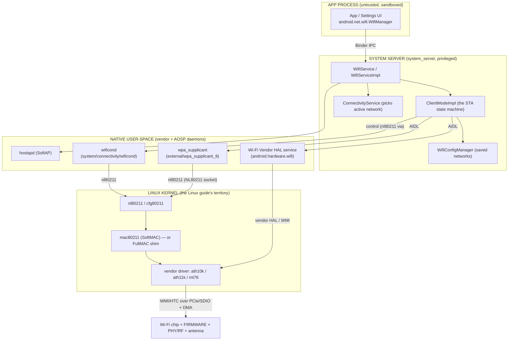
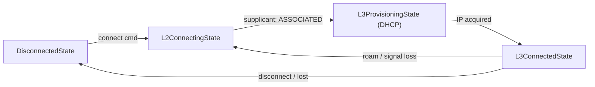
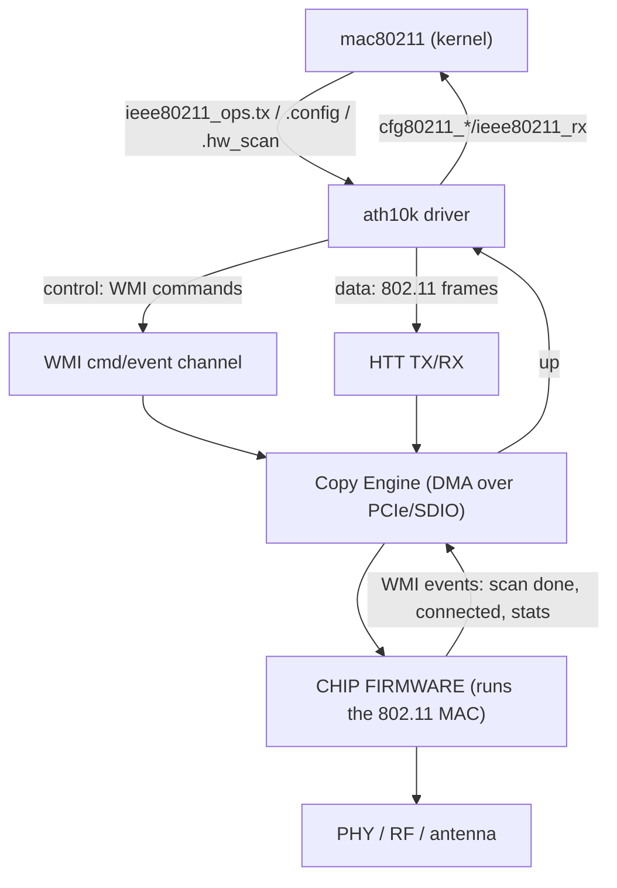
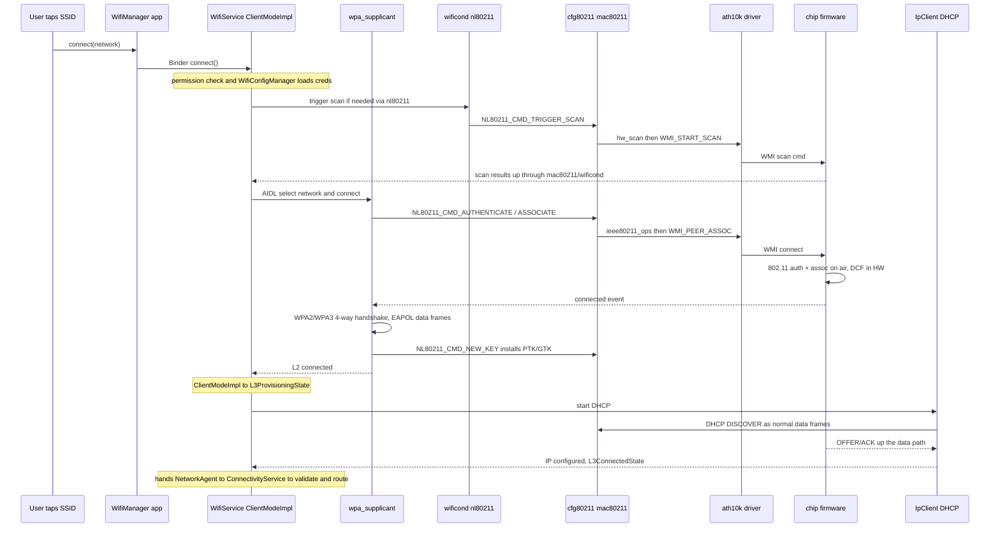
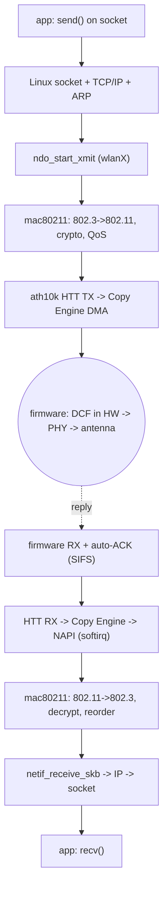

# 🤖 Android Wi-Fi — App → Framework → Kernel → Firmware Interview Deep Dive

### The full vertical journey: `WifiManager` (Java app) → System Server → AIDL HALs → `wpa_supplicant`/`wificond` → `cfg80211`/`mac80211` → vendor driver → chip firmware → radio

> **What this guide is.** The ESP32 reference guide stops at one chip; the Linux guide stops at the kernel driver. **This guide stacks the entire Android tower on top of that** — from a Java app tapping "connect" down to the silicon putting bits on the air — naming the real AOSP components (`packages/modules/Wifi`, `wificond`, the three Wi-Fi HALs, `external/wpa_supplicant_8`) and the real kernel/firmware layer (`cfg80211`/`mac80211` + a Qualcomm `ath10k`/`ath11k`-class driver and firmware).
>
> **Why Qualcomm `ath10k`/`ath11k` for the firmware layer?** Of the candidate vendors, Qualcomm Atheros has by far the **most openly documented, AOSP-compatible** Wi-Fi stack: upstream **mainline `mac80211` drivers** (`drivers/net/wireless/ath/ath10k`, `ath11k`), **publicly mirrored firmware blobs** (the `ath10k-firmware`/`ath11k-firmware` trees), and it is what real Android phones actually ship (the WCN3990 in many Pixels/Qualcomm SoCs is an `ath10k` target). MediaTek (`mt76`) is the other strongly-upstreamed option. Realtek and Espressif exist but are weaker fits for a *phone* SoC story (Espressif's ESP32 is an SDIO/host-MCU companion chip, not a phone's main Wi-Fi — we use it only as the contrast point from your reference doc).
>
> **The recurring theme, carried over:** *microseconds are silicon, milliseconds are software* — and Android adds two more boundaries above that: *the framework/Java layer is **policy**, the native daemons + HAL are **mechanism**, and Binder/AIDL is the wall between an app's process and the privileged Wi-Fi process.*

---

## 📑 Contents

> **Reading order is top-down here** (the opposite of the Linux guide), because Android's defining feature is the *vertical layering* — so we descend one floor at a time from the app to the antenna.

**Part 1 — The Android Wi-Fi Tower (the map)**
- 1.1  The whole stack on one page (app → firmware)
- 1.2  The four "languages" you cross: Java API, Binder/AIDL, netlink, firmware commands
- 1.3  Where each AOSP component lives in the source tree
- 1.4  Why so many layers? (the Project Treble / vendor-split answer)

**Part 2 — App & Framework: `WifiManager` → `WifiService`**
- 2.1  The app side: `android.net.wifi` APIs over Binder
- 2.2  The system-server side: `WifiService`, `ClientModeImpl`, `WifiConfigManager`
- 2.3  `ConnectivityService` and why Wi-Fi is "just one network"

**Part 3 — The HAL & Native Daemons: the vendor wall**
- 3.1  The three Wi-Fi HAL surfaces: Vendor, Supplicant, Hostapd
- 3.2  HIDL → AIDL: what changed and why it matters
- 3.3  `wificond` — the framework's own nl80211 client
- 3.4  `wpa_supplicant` on Android — same daemon, AIDL-wrapped

**Part 4 — Kernel & Firmware: `cfg80211`/`mac80211` → `ath10k`/`ath11k` → chip**
- 4.1  The kernel boundary (this is where the Linux guide begins)
- 4.2  The Qualcomm `ath10k`/`ath11k` driver: WMI, CE, HTC/HTT
- 4.3  Where the MAC actually runs: FullMAC firmware vs the ESP32 SoftMAC
- 4.4  Firmware loading, the host↔firmware command channel, and DMA

**Part 5 — Two End-to-End Walkthroughs**
- 5.1  CONTROL: "tap a network → connected" (full top-to-bottom trace)
- 5.2  DATA: an app's TCP packet to the air (and the RX back up)

**Part 6 — Turning Wi-Fi On, Scanning, and Concurrency**
- 6.1  "Toggle Wi-Fi on" — every layer it touches
- 6.2  Scanning: `WifiScanner`, PNO, and where the work happens
- 6.3  STA/AP and STA/STA concurrency (the multi-iface story)

**Part 7 — Mapping Back & Rapid-Fire Recall**
- 7.1  ESP32 ↔ Linux ↔ Android — the three-column Rosetta table
- 7.2  Rapid-fire interview answers
- 7.3  The five boundaries to never confuse

---

# Part 1 — The Android Wi-Fi Tower (the map)

## 1.1  The whole stack on one page

Android Wi-Fi is best understood as a **tower of layers**, each talking to the next through a *different* IPC/ABI mechanism. From an app tapping "connect" to a photon leaving the antenna:



The five floors, each with its own crossing mechanism:

| Floor | Component | Talks down via | Lives in |
|---|---|---|---|
| **App** | `WifiManager` | **Binder** | the app's sandboxed process |
| **Framework** | `WifiService` / `ClientModeImpl` | **AIDL** (to HALs), Binder (to apps) | `system_server` (`packages/modules/Wifi`) |
| **Native daemons** | `wpa_supplicant`, `wificond`, Vendor HAL | **nl80211 netlink** + vendor **WMI** | dedicated native processes |
| **Kernel** | `cfg80211`/`mac80211` + driver | **WMI/HTC** over PCIe/SDIO + **DMA** | the Linux kernel |
| **Firmware** | chip firmware + PHY | register/DMA, then RF | the silicon |

> 🔑 **The single most important Android-specific insight:** the app does **not** talk to the driver, ever. It talks to `WifiManager`, which is a thin **Binder proxy** to `WifiService` running in the privileged `system_server`. *All* policy (which network, when to roam, MAC randomisation, scoring) lives in that Java service; the native daemons and HAL are pure **mechanism**. This app↔service split is enforced by the Android **permission model** and process sandbox — an app literally cannot open a netlink socket to `nl80211`.

## 1.2  The four "languages" you cross going down the tower

Each boundary speaks a different ABI. Naming them is a fast way to prove you understand the architecture:

1. **Java API → framework: Binder IPC.** `WifiManager` methods marshal arguments and make a **Binder** transaction into `system_server`. This is the app-sandbox boundary; it's where permissions (`ACCESS_WIFI_STATE`, `CHANGE_WIFI_STATE`, location perms for scan results) are enforced.
2. **Framework → HAL: AIDL (was HIDL).** `ClientModeImpl` and friends call **stable AIDL** interfaces (`android.hardware.wifi`, `...wifi.supplicant`, `...wifi.hostapd`). This is the **Treble vendor boundary** — the line between Google's framework and the OEM/SoC vendor's implementation.
3. **Daemons → kernel: nl80211 netlink.** `wpa_supplicant` and `wificond` open **`AF_NETLINK`/`NETLINK_GENERIC`** sockets and send `nl80211` commands — *exactly the same control plane the Linux guide's `iw` uses*. Android adds no new kernel mechanism here; it reuses upstream `cfg80211`.
4. **Driver → firmware: vendor command protocol.** For a FullMAC Qualcomm part this is **WMI** (Wireless Module Interface) messages carried over **HTC/HTT** transport on **PCIe or SDIO**, with frame payloads moved by **DMA** — the firmware then runs the actual 802.11 MAC.

> 🔑 **Interview framing:** "Going down the Android Wi-Fi stack you cross four ABIs in order — **Binder, AIDL, netlink, WMI** — and each marks a trust/ownership boundary: app↔system, framework↔vendor, user-space↔kernel, host↔firmware. Name those four and you've described the whole architecture."

## 1.3  Where each component lives in the AOSP source tree

Being able to point at the actual paths (browsable at `cs.android.com`) is what separates "I read a blog" from "I've worked in this":

| Component | Source path | Notes |
|---|---|---|
| App-facing API | `frameworks/base/wifi/` → now `packages/modules/Wifi/framework/` | `WifiManager`, the `android.net.wifi` package (a **Mainline module**) |
| Wi-Fi service | `packages/modules/Wifi/service/` | `WifiServiceImpl`, `ClientModeImpl`, `WifiConfigManager`, `WifiConnectivityManager` |
| wificond | `system/connectivity/wificond/` | standalone native daemon; nl80211 client |
| wpa_supplicant | `external/wpa_supplicant_8/` | the upstream daemon + an `aidl/` shim dir |
| Vendor HAL AIDL | `hardware/interfaces/wifi/aidl/` | the Android-specific command surface |
| Supplicant HAL AIDL | `hardware/interfaces/wifi/supplicant/aidl/` | wraps `wpa_supplicant` |
| Hostapd HAL AIDL | `hardware/interfaces/wifi/hostapd/aidl/` | wraps `hostapd` (SoftAP) |
| Kernel driver | `drivers/net/wireless/ath/ath10k/` (or `ath11k/`) | upstream `mac80211` driver |
| Firmware blobs | `ath10k-firmware` / vendor `firmware_mnt` partition | loaded onto the chip at probe |

> The two superproject links you were given — `cs.android.com/android/platform/superproject/main` (the framework/HAL/daemons) and `cs.android.com/android/kernel/superproject` (the kernel + drivers) — split exactly along the **kernel boundary** of §4.1: everything in Parts 2–3 is in the *platform* superproject; everything in Part 4 is in the *kernel* superproject.

## 1.4  Why so many layers? The Treble / vendor-split answer

The honest "why is this so complicated" answer is **Project Treble** (Android 8+): Google wanted to update the framework **without** re-touching each SoC vendor's Wi-Fi code. So they drew a hard, **versioned ABI** (HIDL, later AIDL) between the framework and the vendor implementation. That single decision explains nearly every layer:

- The **HAL exists** so the framework can call vendor code through a stable contract instead of linking it.
- **`wificond` exists** so the framework has a *vendor-independent* nl80211 client for the common operations (scan, signal polling), reducing what each vendor HAL must implement.
- **`wpa_supplicant` is wrapped in a HAL** rather than called directly, so its presence/version is a vendor detail.
- The Wi-Fi stack became a **Mainline module** (`packages/modules/Wifi`) so Google can ship Wi-Fi fixes via Play system updates without a full OTA.

> 🔑 The layers are not accidental complexity — they are the **update/ownership seams**. Each boundary is "who is allowed to change this independently of that." That is the answer an interviewer wants when they ask "why doesn't the app just talk to the driver?"

---

# Part 2 — App & Framework: `WifiManager` → `WifiService`

This part covers everything *above* the kernel that has no equivalent in the ESP32 or Linux guides — the Java/Binder tower that is uniquely Android.

## 2.1  The app side — `android.net.wifi` over Binder

An app never touches hardware. It calls into `WifiManager`, a client-side proxy:

```java
// app process
WifiManager wifi = context.getSystemService(WifiManager.class);
// Modern API (Android 10+): suggest a network, let the platform decide
WifiNetworkSuggestion s = new WifiNetworkSuggestion.Builder()
        .setSsid("HomeWiFi").setWpa2Passphrase("....").build();
wifi.addNetworkSuggestions(List.of(s));
// Or request a specific network via ConnectivityManager + NetworkRequest
```

What actually happens on that call:

```text
app: wifi.addNetworkSuggestions(...)
  -> WifiManager packs args into a Parcel
  -> Binder transaction (one-way or two-way) across the process boundary
  -> lands in WifiServiceImpl.addNetworkSuggestions() in system_server
  -> permission check (the caller's UID/permissions are on the Binder identity)
  -> stored/acted on by the framework
```

> 🔑 Two things to say: (1) the **Binder identity** of the caller (UID, granted permissions) rides with every transaction, so the service enforces `CHANGE_WIFI_STATE`, location permission for scan results, etc. — the app can't forge it. (2) modern Android pushes apps toward **declarative** APIs (`WifiNetworkSuggestion`, `NetworkRequest` with a `WifiNetworkSpecifier`) where the app *requests* and the **platform decides**, rather than the old imperative `enableNetwork()/reconnect()`. Policy stays in the framework.

## 2.2  The system-server side — the real brain

Inside `system_server`, the Wi-Fi module (`packages/modules/Wifi/service/`) is where all the intelligence lives:

| Class | Responsibility | ESP32/Linux analogue |
|---|---|---|
| `WifiServiceImpl` | the Binder endpoint; entry for every app/Settings call; permission enforcement | (none — Android-only) |
| `ClientModeImpl` / `ClientModeManager` | the **STA state machine** (disconnected → scanning → authenticating → connected → roaming) | the mac80211 MLME / the ESP32 `c_mac_task` STA machine |
| `WifiConfigManager` | the database of saved networks, credentials, priorities | (config persistence — Android-only) |
| `WifiConnectivityManager` + `WifiNetworkSelector` | decides **when to scan, when to roam, which BSS to pick** (scoring) | roaming policy (802.11k/v/r decision side) |
| `WifiNative` | the thin Java→HAL/`wificond`/supplicant adapter | the syscall/ioctl shim |
| `SupplicantStaIfaceHal`, `WifiVendorHal`, `HostapdHal` | typed Java wrappers over the AIDL HAL surfaces | (the Treble boundary) |

The `ClientModeImpl` state machine is the Android counterpart to the connection state machine in your other guides — it's a classic Android `StateMachine` (hierarchical states) that drives `wpa_supplicant` (via the Supplicant HAL) to do the actual 802.11 auth/assoc, and listens for events coming back up.



> 🔑 Notice the state names encode the **L2-then-L3** split your Linux guide hammered: `L2ConnectingState` (auth/assoc) is distinct from `L3ProvisioningState` (DHCP). Android makes that boundary an explicit state. When association completes, `ClientModeImpl` kicks off **`IpClient`** (in the network stack module) to run DHCP — the same "L2 done, L3 begins" moment, but as a formal state transition.

## 2.3  `ConnectivityService` — Wi-Fi is just one network

A subtlety that scores points: `WifiService` does **not** decide whether traffic actually uses Wi-Fi. It hands a `NetworkAgent` to **`ConnectivityService`**, which compares all networks (Wi-Fi, cellular, ethernet) by their **`NetworkCapabilities`** and a score, and routes traffic to the best one. This is why your phone keeps cellular up briefly after Wi-Fi connects, and why "Wi-Fi connected but no internet" can route you back to cellular — `ConnectivityService` validated the Wi-Fi network (via a captive-portal/connectivity check) and scored it.

> 🔑 The clean division: **`WifiService` manages the Wi-Fi link; `ConnectivityService` manages which link the OS uses.** Two different services, two different jobs. Conflating them is a common interview slip.

---

# Part 3 — The HAL & Native Daemons: the vendor wall

This is the layer that is *distinctly Android* (Linux has `wpa_supplicant` but no HAL/Treble split). It's where the framework hands off to vendor code.

## 3.1  The three Wi-Fi HAL surfaces

AOSP defines **three** separate HAL interfaces, each a stable AIDL contract a vendor must implement:

| HAL surface | Wraps | AIDL location | Mandatory? |
|---|---|---|---|
| **Vendor HAL** (`android.hardware.wifi`) | Android-specific chip commands (chip/iface lifecycle, capabilities, RTT, NAN, link-layer stats, MAC randomisation control) | `hardware/interfaces/wifi/aidl/` | **Optional** for basic STA/SoftAP; **required** for Wi-Fi Aware & RTT |
| **Supplicant HAL** (`...wifi.supplicant`) | `wpa_supplicant` (STA auth/assoc, 4-way handshake, roaming) | `hardware/interfaces/wifi/supplicant/aidl/` | required for STA |
| **Hostapd HAL** (`...wifi.hostapd`) | `hostapd` (SoftAP beaconing, client auth) | `hardware/interfaces/wifi/hostapd/aidl/` | required for SoftAP |

> 🔑 The split mirrors the **roles**: Vendor HAL = "the chip and Android-specific features," Supplicant HAL = "be a station," Hostapd HAL = "be an AP." The Vendor HAL being *optional for plain STA* is a great detail — basic connectivity can work through `wificond` + supplicant alone; the Vendor HAL is needed for the fancy stuff (Aware, RTT, link stats, advanced concurrency).

## 3.2  HIDL → AIDL — what changed and why

Your interviewer may probe the version history because it dates your knowledge:

- **Pre-Android 8 (Treble):** "legacy HAL" — a C header/shared-library mechanism (`hardware/libhardware_legacy`).
- **Android 8–13:** **HIDL** (HAL Interface Definition Language) — versioned `.hal` interfaces, Binderized.
- **Android 13+ (Supplicant), 14+ (Vendor HAL):** migrated to **AIDL** (the same IDL apps use), which Google standardised on for all HALs.
- The default AOSP HAL implementation is a **shim that runs on top of the old "legacy HAL"** library, so a vendor can implement either the modern AIDL directly or provide a legacy-HAL backend.

> 🔑 One-liner: "HALs went legacy → HIDL (Android 8) → AIDL (supplicant in 13, vendor in 14). AIDL unified the app IPC and the HAL IPC under one IDL." Knowing *which* surface moved in *which* release is the tell of someone who's actually shipped on AOSP.

## 3.3  `wificond` — the framework's own nl80211 client

`wificond` (at `system/connectivity/wificond`) is an AOSP-owned native daemon that talks **straight to the kernel driver over `nl80211`** — no vendor code involved. The framework (`WifiNative`) uses it for the common, vendor-neutral operations:

- triggering **scans** and retrieving scan results,
- **signal-strength / link** polling,
- sending some 802.11 mgmt frames, and the SoftAP "is a station connected" signalling.

It exists so Google doesn't have to route *every* simple operation through a vendor HAL. It is the Android equivalent of the Linux guide's "`iw`/`nl80211` control path," but as a long-lived system daemon the framework drives over Binder.

```text
ClientModeImpl -> WifiNative -> wificond (Binder)
   wificond -> nl80211 (NL80211 generic-netlink socket) -> cfg80211 -> driver
```

## 3.4  `wpa_supplicant` on Android — same daemon, AIDL-wrapped

The actual 802.11 **authentication and association** (open/WPA2/WPA3-SAE/Enterprise EAP, the 4-way handshake, roaming decisions on the supplicant side) is done by the **same `wpa_supplicant`** you know from desktop Linux — AOSP carries it at `external/wpa_supplicant_8/`. The only Android-specific part is the **`aidl/` shim** that exposes it as the Supplicant HAL so `WifiNative`/`SupplicantStaIfaceHal` can drive it over AIDL instead of the desktop control socket.

```text
ClientModeImpl -> SupplicantStaIfaceHal (AIDL) -> wpa_supplicant
   wpa_supplicant builds Auth/Assoc mgmt frames, runs 4-way handshake
   wpa_supplicant -> nl80211 -> cfg80211 -> mac80211/driver -> firmware -> air
   keys installed via NL80211_CMD_NEW_KEY (same as the Linux guide)
```

> 🔑 The crisp mapping: **`wpa_supplicant` on Android == `wpa_supplicant` on Linux**, doing the exact MLME job your Linux guide's Part 6 described. Android only changes *who drives it* (the AIDL HAL instead of a CLI/socket) — the 802.11 protocol work and the nl80211 path to the kernel are identical.

---

# Part 4 — Kernel & Firmware: `cfg80211`/`mac80211` → `ath10k`/`ath11k` → chip

This is where the Android tower lands on the **Linux kernel** — i.e. where your Linux guide *begins*. From here down, Android is just Linux.

## 4.1  The kernel boundary

When `wpa_supplicant` or `wificond` send `nl80211` commands, they enter **exactly the kernel stack from the Linux guide**: `nl80211` → `cfg80211` (policy/regulatory) → `mac80211` (SoftMAC MLME) → the vendor driver. Android changes **nothing** here — it uses upstream `cfg80211`/`mac80211`. The data path is identical too: an app's packet goes `socket` → IP stack → `ndo_start_xmit` → `mac80211` → driver, with RX via NAPI.

> 🔑 "Above the kernel, Android is its own world of Binder/AIDL/HALs. **At and below `nl80211`, Android *is* Linux** — same `cfg80211`, same `mac80211`, same `ndo_start_xmit`, same NAPI. The Android-specific stack is entirely user-space." That sentence ties this whole guide to your Linux one.

The Android kernel itself is the **GKI (Generic Kernel Image)**: a Google-built core kernel with a stable **KMI** (Kernel Module Interface), and the Wi-Fi driver shipped as a **vendor kernel module** (`.ko`) loaded on top. So the driver is decoupled from the core kernel the same way the HAL is decoupled from the framework — the vendor-module seam mirrors the Treble seam one floor down.

## 4.2  The Qualcomm `ath10k`/`ath11k` driver — WMI, CE, HTC/HTT

Take a Qualcomm WCN-class chip (e.g. WCN3990, an `ath10k` target found in many phones). The driver (`drivers/net/wireless/ath/ath10k/`) is a **mac80211 driver**, but unlike the simple `ath9k`, it talks to an **on-chip firmware** over a structured command/transport stack:

| Layer in `ath10k` | What it is | ESP32 analogue |
|---|---|---|
| **mac80211 ops** (`mac.c`) | registers with `cfg80211`/`mac80211`; `ieee80211_ops` (`.tx`, `.config`, `.hw_scan`, …) | the `80211_mac.c` interface to the stack |
| **WMI** (`wmi.c`) | **Wireless Module Interface** — the command/event protocol to firmware ("start scan," "connect," "set channel," "key install") | the register writes / smart-frame commands |
| **HTC/HTT** (`htc.c`, `htt_tx.c`, `htt_rx.c`) | Host-Target Control / Host-Target Transport — the message framing and the **data** path (TX/RX of 802.11 frames) | the TX/RX descriptor pipe |
| **CE — Copy Engine** (`ce.c`) | the **DMA** engine abstraction that moves messages/frames host↔chip over PCIe/SDIO | the WMAC DMA / descriptor ring |
| **BMI** (`bmi.c`) | Board Message Interface — used at boot to **load firmware** | the boot/`hwinit` bring-up |



> 🔑 The thing to say: "`ath10k` is a `mac80211` driver, but it's **thin** — most of the MAC intelligence is in firmware, reached over **WMI** commands and **HTT** for data, with the **Copy Engine** doing DMA across PCIe/SDIO. Control goes WMI, data goes HTT, both ride the Copy Engine." That's the vocabulary an interviewer for a phone-Wi-Fi role is listening for.

## 4.3  Where the MAC actually runs — FullMAC firmware vs the ESP32 SoftMAC

This is the crucial contrast with your reference doc, and it's the heart of the "firmware" question:

| | **ESP32 (your reference doc)** | **Phone (Qualcomm `ath10k`/`ath11k`)** |
|---|---|---|
| MAC location | **SoftMAC** — 802.11 MLME runs as C on the chip's CPU (the `c_mac_task`) | mostly **FullMAC** — the **firmware** runs auth/assoc, power-save, aggregation, much of the MLME |
| Host driver job | the host *is* the MAC (open-mac builds frames) | host driver mostly **forwards WMI commands**; firmware does the work |
| `mac80211` involvement | n/a (bare-metal FreeRTOS) | present, but offloads heavily to firmware (`ath10k` leans toward FullMAC behaviour) |
| Why | a tiny MCU exposing the MAC for learning | offload saves host power & hits 802.11 timing reliably on a phone |

But the **deepest boundary is identical on both**: the **microsecond-timed DCF** — CCA, SIFS, the backoff countdown, the SIFS-bounded ACK — is **always in silicon/firmware**, never on an application CPU. The ESP32 proved it (GO bit → hardware runs DCF); the phone simply pushes *more* of the millisecond MAC into firmware too, but the microsecond line is in the same place.

> 🔑 "Both are 'the MAC isn't on the app CPU.' The ESP32 draws the line low (SoftMAC: MLME on its own MCU, DCF in silicon). A phone draws it high (FullMAC: MLME *and* much management in firmware, DCF in silicon). **Microseconds are silicon in both** — FullMAC just moves the *milliseconds* into firmware too, to save the host CPU and power."

## 4.4  Firmware loading and the host↔firmware channel

How the firmware gets there and how host and firmware then talk — the literal "app→…→firmware" terminus:

```text
BOOT/PROBE:
  driver .probe() -> map PCIe/SDIO -> BMI (Board Message Interface)
  request_firmware("ath10k/.../firmware-N.bin") from /vendor (firmware_mnt)
  also load board-2.bin (per-board calibration: antenna, power tables)
  push firmware to chip RAM over the Copy Engine, release the target CPU
  firmware boots, WMI 'ready' event comes back up -> driver registers wiphy

RUNTIME CONTROL (e.g. connect):
  wpa_supplicant -> nl80211 -> mac80211 -> ath10k -> WMI_PEER_* / WMI_VDEV_*
     commands -> firmware programs the hardware MAC, runs auth/assoc timing
  firmware -> WMI events (connected, signal, roam) -> up to mac80211/cfg80211

RUNTIME DATA (e.g. a TCP segment):
  ndo_start_xmit -> mac80211 -> ath10k HTT TX -> Copy Engine DMA -> firmware
     firmware: DCF (CCA/backoff/ACK in hardware) -> PHY -> RF -> antenna
  RX: firmware DMAs frame up via HTT RX -> Copy Engine -> NAPI -> mac80211
     -> netif_receive_skb -> IP stack -> socket
```

The firmware blob is **closed source** (Qualcomm-proprietary), but — and this is *why* we chose Qualcomm for this guide — the **driver is upstream open source** and the **firmware images are publicly redistributable** (the `ath10k-firmware`/`ath11k-firmware` trees, also shipped in `/vendor/firmware_mnt` on devices). That's the most open, inspectable phone-Wi-Fi stack you can study end-to-end.

> 🔑 `request_firmware()` + `board-2.bin` is a great concrete detail: the **firmware** is the MAC brain; **`board-2.bin`** is the per-board calibration (the phone-scale equivalent of the ESP32's PHY calibration in `hwinit()`). Both must load before the radio is usable — the same ordering constraint as the ESP32 boot sequence, one abstraction level up.

---

# Part 5 — Two End-to-End Walkthroughs

The payoff: trace one **control** action and one **data** action through *every* floor of the tower.

## 5.1  CONTROL — "tap a network → connected"



The named hand-offs, floor by floor:

```text
1 App:        WifiManager.connect()  --Binder-->  WifiServiceImpl
2 Framework:  permission check; WifiConfigManager fetches credentials;
              ClientModeImpl state machine drives the connect
3 Scan:       (if needed) WifiNative -> wificond -> nl80211 TRIGGER_SCAN
                 -> ath10k hw_scan -> WMI_START_SCAN -> firmware -> results up
4 Associate:  ClientModeImpl -> SupplicantStaIfaceHal (AIDL) -> wpa_supplicant
                 -> nl80211 AUTHENTICATE/ASSOCIATE -> mac80211 -> ath10k
                 -> WMI connect -> firmware runs auth/assoc on air (DCF in HW)
5 Keys:       wpa_supplicant runs the 4-way handshake (EAPOL = data frames),
                 installs PTK/GTK via NL80211_CMD_NEW_KEY -> driver -> firmware
6 L3:         ClientModeImpl -> IpClient runs DHCP (ordinary data path)
7 Route:      WifiService gives a NetworkAgent to ConnectivityService, which
                 validates internet and scores Wi-Fi vs cellular -> picks route
```

> 🔑 Every one of your other guides' pieces appears here in its Android slot: the **MLME/4-way handshake** is `wpa_supplicant` (steps 4–5, same as Linux), the **L2→L3 boundary** is the `ClientModeImpl` state transition into `IpClient` (step 6), the **DCF** is in firmware (step 4), and a *new* top floor — **Binder + permission check + ConnectivityService scoring** (steps 1, 2, 7) — is the Android addition.

## 5.2  DATA — an app's TCP packet to the air and back

Once connected, the control tower steps aside and the **data path is pure Linux** — the Android framework is **not** in the packet path at all.

```text
TX (app sends data):
  app: write()/send() on a socket
   -> Linux socket layer -> TCP/IP -> neighbour/ARP (Linux guide Part 3)
   -> dev_hard_header (802.3) -> ndo_start_xmit on wlanX
   -> mac80211: 802.3 -> 802.11 + LLC/SNAP, seq, QoS, crypto offload flags
   -> ath10k HTT TX -> Copy Engine DMA -> firmware
   -> firmware: DCF (CCA, backoff, ACK wait) in hardware -> PHY -> antenna

RX (reply arrives):
  firmware: PHY demod, hardware addr-filter + auto-ACK (SIFS) -> HTT RX
   -> Copy Engine DMA up -> ath10k -> NAPI poll (softirq)
   -> mac80211: decrypt, reorder, 802.11 -> 802.3, set skb->protocol
   -> netif_receive_skb -> IP -> socket -> app recv()
```



> 🔑 **The headline for the whole guide:** "Once the link is up, **the Android framework is not in the data path** — packets go app → Linux socket/IP → `mac80211` → `ath10k` HTT/Copy-Engine → firmware → air, exactly as in the Linux guide. The Java tower (`WifiService`, HALs) is **control plane only**. App data never traverses Binder or the HAL." That separation — Java/Binder for control, raw Linux kernel for data — is the most important thing to land.

> 🔑 **Data-plane offloads worth a sentence:** on a phone, the framework can install **APF (Android Packet Filter)** bytecode into the firmware so it drops junk (e.g. unwanted multicast) **without waking the application processor** — a power optimisation, and the spiritual cousin of the ESP32 hardware address filter: push the "should I care about this frame?" decision as low as possible.

---

# Part 6 — Turning Wi-Fi On, Scanning, and Concurrency

## 6.1  "Toggle Wi-Fi on" — every layer it touches

The Android version of the Linux guide's "turn on Wi-Fi" question — but now it crosses the whole tower:

```text
1 User flips the Wi-Fi toggle (Settings / Quick Settings)
2 -> WifiManager.setWifiEnabled(true)  --Binder-->  WifiServiceImpl
3 WifiService: permission + policy checks; updates WifiSettingsStore
4 starts the STA stack: ClientModeManager comes up
5 WifiNative asks the Vendor HAL to create a STA iface (chip/iface lifecycle)
     -> Vendor HAL -> driver -> firmware brings up a vdev (virtual device)
6 the kernel netdev wlanX is created/!UP -> mac80211 -> driver start
     (this is the Linux guide's ndo_open, one floor down)
7 wificond + wpa_supplicant are started/attached for that iface
8 framework begins auto-connect: WifiConnectivityManager triggers a scan,
     WifiNetworkSelector scores results, ClientModeImpl connects to the best
```

> 🔑 Contrast with the other guides: on the ESP32 "turn on Wi-Fi" was a function call into `hwinit()`; on Linux it was `ip link set wlan0 up` → `ndo_open`. On Android it's **`setWifiEnabled()` → Binder → WifiService → Vendor HAL creates the iface → and *only at the bottom* does it become the Linux `ndo_open`.** Same final mechanism, four floors of policy on top. And like the Linux **rfkill** path, the **hardware/airplane-mode kill switch** is a separate lower path the framework also coordinates.

## 6.2  Scanning — `WifiScanner`, PNO, and where the work happens

Scanning shows the layering nicely because Android has **two** scan paths:

- **Foreground / framework scan:** `WifiScanner` → `WifiNative` → **`wificond`** → `nl80211 TRIGGER_SCAN` → driver → firmware sweeps channels → results back up. Used when the screen's on / app requested.
- **PNO (Preferred Network Offload):** the framework hands a **list of saved SSIDs to the firmware**, which scans **autonomously while the AP (host CPU) sleeps**, waking it only on a match. This is a firmware offload for battery — the same philosophy as APF and the ESP32's "let hardware decide."

> 🔑 "Two scan modes: an explicit framework scan via `wificond`/nl80211, and **PNO**, where the firmware scans for known networks while the application processor is asleep and only wakes it on a hit. PNO is *why* your phone reconnects to home Wi-Fi without draining the battery."  Note also that scan **results are permission-gated** — delivering BSSIDs to an app requires location permission, enforced up in `WifiServiceImpl`.

## 6.3  Concurrency — STA/AP and STA/STA

Modern phones run **multiple virtual interfaces on one radio** (or two radios), coordinated by the framework and realised by the Vendor HAL + firmware:

- **STA + SoftAP** — connected to Wi-Fi *and* hot-spotting. The Vendor HAL exposes the chip's concurrency combos; `hostapd` (via the Hostapd HAL) runs the AP iface while `wpa_supplicant` runs the STA iface.
- **STA + STA** (Android 12+) — e.g. connect to a better network while keeping the old one, or a "make-before-break" roam, or a local + internet network at once.

The framework's `WifiNative`/Vendor HAL negotiates which **interface combinations** the chip's firmware supports; the actual time/space sharing of the single radio happens in **firmware** (the way the ESP32 reference doc's *coexistence* happens at the chip level).

> 🔑 Tie-back: the ESP32 doc's hardest section was **coexistence on one radio** (Wi-Fi vs BLE via PTA, or the software-TDM fallback). Phone Wi-Fi concurrency is the same class of problem — *N logical interfaces, one or two physical radios* — but solved **in firmware** with the framework only declaring intent through the Vendor HAL. Microseconds (who's on the antenna right now) = firmware; milliseconds (which combos to allow) = framework.

---

# Part 7 — Mapping Back & Rapid-Fire Recall

## 7.1  The three-column Rosetta table — ESP32 ↔ Linux ↔ Android

This is the table to internalise; it lets you answer any "how does X map" question across all three of your guides:

| Concept | ESP32 / FreeRTOS | Linux (PC/server) | Android |
|---|---|---|---|
| App requests Wi-Fi | app calls driver API directly | `socket()` / `iw` / NetworkManager | `WifiManager` → **Binder** → `WifiService` |
| Policy / "brain" | `c_mac_task` logic | `wpa_supplicant` + NetworkManager | `ClientModeImpl` + `WifiConnectivityManager` (Java) |
| Config store | compiled-in | `wpa_supplicant.conf` | `WifiConfigManager` |
| Vendor boundary | none | none | **HAL: AIDL** (Vendor/Supplicant/Hostapd) — Treble |
| 802.11 MLME (auth/assoc) | `build_*_frame()` in MAC task | `wpa_supplicant` + `mac80211` MLME | `wpa_supplicant` (Supplicant HAL) + `mac80211` |
| Control transport to kernel | direct register writes | **nl80211** netlink | **nl80211** (via `wificond`/supplicant) |
| Kernel Wi-Fi stack | n/a (bare metal) | `cfg80211` + `mac80211` | **same** `cfg80211` + `mac80211` (GKI) |
| Driver | the open-mac code itself | `ath9k` / `iwlwifi` / `mt76` | `ath10k` / `ath11k` / `mt76` (**vendor `.ko`**) |
| Driver↔chip protocol | MMIO + smart frames | descriptor rings / firmware cmds | **WMI** (control) + **HTT** (data) over **Copy Engine** DMA |
| Where MLME runs | SoftMAC (on-chip MCU) | SoftMAC (`mac80211`) or FullMAC fw | mostly **FullMAC firmware** |
| Where DCF runs | **silicon** (GO bit → HW) | **silicon** | **silicon/firmware** |
| Scan-while-asleep | n/a | (driver/fw dependent) | **PNO** firmware offload |
| Drop junk without waking CPU | HW addr filter | HW filter | **APF** bytecode in firmware + HW filter |
| RX deferral | tiny ISR + hardware task | IRQ → **NAPI** softirq | IRQ → **NAPI** (same kernel) |
| Packet buffer | smart frame pool | `sk_buff` | `sk_buff` |
| Coexistence / concurrency | PTA / software-TDM (Wi-Fi vs BLE) | (driver/fw) | firmware concurrency combos via Vendor HAL |
| "Turn on Wi-Fi" | call `hwinit()` | `ip link up` → `ndo_open` | `setWifiEnabled()` → Binder → HAL → `ndo_open` |

> The whole point: **the bottom three rows never change** across platforms — DCF is always silicon, NAPI is the kernel's RX model, the skb is the buffer. Everything Android *adds* is **above** the kernel: the Binder/Java tower and the AIDL/HAL vendor wall.

## 7.2  Rapid-fire interview answers

Spoken 20–30 second answers, mapped to likely questions.

**Q. "Walk me through what happens when an Android app connects to Wi-Fi."**
> The app calls `WifiManager.connect()`, which is a **Binder** call into `WifiService` in `system_server`. `WifiService` checks permissions, pulls credentials from `WifiConfigManager`, and its `ClientModeImpl` state machine drives the connection: it scans via `wificond`/nl80211, then tells **`wpa_supplicant`** (over the AIDL **Supplicant HAL**) to authenticate and associate — which goes nl80211 → `mac80211` → the `ath10k` driver → **WMI** to firmware, and the firmware runs the 802.11 auth/assoc and 4-way handshake with DCF in hardware. On L2 success, `ClientModeImpl` starts **`IpClient`** for DHCP, then hands a `NetworkAgent` to **`ConnectivityService`** to validate and route. Four IPC boundaries: Binder, AIDL, netlink, WMI.

**Q. "Where does the app's data actually flow — through all those layers?"**
> No. The Java/HAL tower is **control plane only**. Once connected, data goes **app → Linux socket/TCP/IP → `mac80211` → `ath10k` HTT/Copy-Engine → firmware → air**, with RX via NAPI back up. The framework isn't in the packet path; below `nl80211`, Android is just Linux.

**Q. "What's the HAL and why does it exist?"**
> Three AIDL HAL surfaces — **Vendor, Supplicant, Hostapd** — that wrap the chip commands, `wpa_supplicant`, and `hostapd`. They exist because of **Project Treble**: a stable, versioned ABI lets Google update the framework without touching each SoC vendor's Wi-Fi code. HALs went legacy → HIDL (Android 8) → **AIDL** (supplicant 13, vendor 14).

**Q. "Which firmware/driver and why?"**
> Qualcomm **`ath10k`/`ath11k`** — it has the most open AOSP-compatible stack: an upstream `mac80211` driver, publicly redistributable firmware blobs, and it ships in real phones (WCN3990-class). The driver is **FullMAC-leaning**: control via **WMI** commands, data via **HTT**, DMA via the **Copy Engine**; the firmware runs most of the MAC. MediaTek `mt76` is the other well-upstreamed option. (Espressif's ESP32 is a host-MCU companion chip, not a phone's main Wi-Fi — it's our SoftMAC contrast.)

**Q. "FullMAC vs SoftMAC on a phone?"**
> Phones lean **FullMAC**: the firmware runs auth/assoc, power-save, aggregation — most of the millisecond MAC — to save host power and meet timing. The ESP32 was **SoftMAC**: MLME on its own MCU. But the microsecond DCF (CCA/SIFS/backoff/ACK) is in silicon **in both** — FullMAC just moves the milliseconds into firmware too.

**Q. "How is 'turn on Wi-Fi' different from Linux?"**
> Same bottom, four floors taller: `setWifiEnabled()` → Binder → `WifiService` → Vendor HAL creates the STA iface → and only at the very bottom does it become the Linux `ndo_open` bringing `wlanX` up.

## 7.3  The five boundaries to never confuse

If you remember nothing else, remember these five walls and what crosses each:

1. **App ↔ system_server** — crossed by **Binder**; the permission/sandbox wall.
2. **Framework ↔ vendor** — crossed by **AIDL HALs**; the Treble wall.
3. **User-space ↔ kernel** — crossed by **nl80211** (control) and **`socket`/`ndo_start_xmit`** (data); the syscall wall.
4. **Host ↔ firmware** — crossed by **WMI** (control) and **HTT/Copy-Engine DMA** (data); the silicon wall.
5. **Milliseconds ↔ microseconds** — the timing wall: software/firmware above, **DCF in hardware** below. *This is the same wall from all three guides.*

> Control descends **all five**; data descends only walls 1-skipped, 3, 4, 5 (it never crosses Binder or the HAL). Name the five walls and assign any operation to its path, and you can answer essentially any Android-Wi-Fi architecture question.

---

*Companion documents: the ESP32/FreeRTOS SoftMAC guide (one chip, bare metal) and the Linux Wi-Fi guide (kernel driver internals). This Android guide stacks on top of the Linux one — they share the entire `cfg80211`/`mac80211`/driver/firmware base; Android adds the Binder/Java framework and the AIDL/HAL vendor wall above it.*
