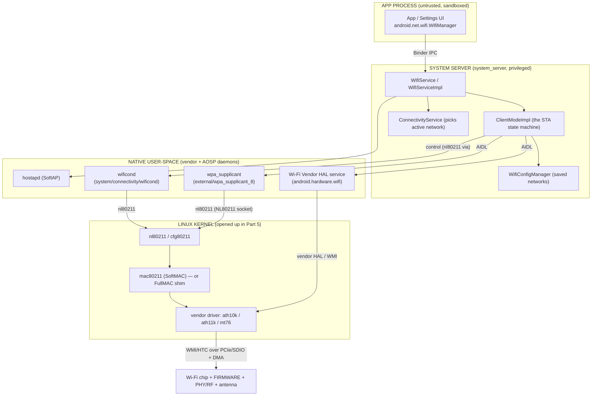
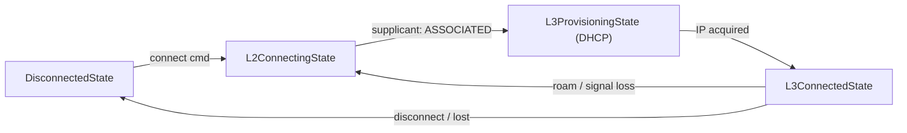
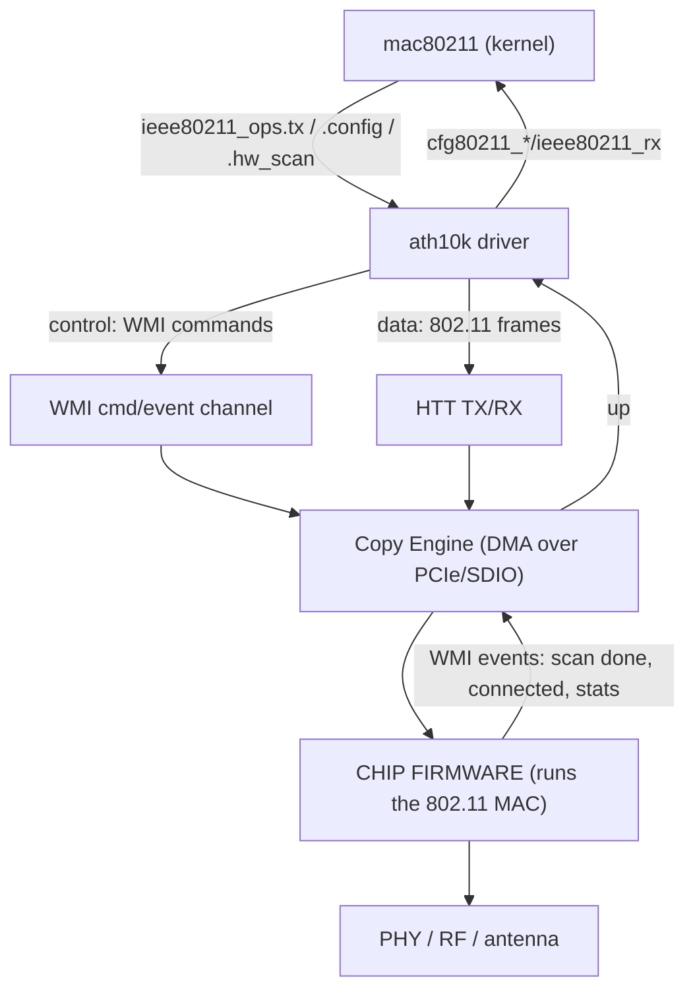
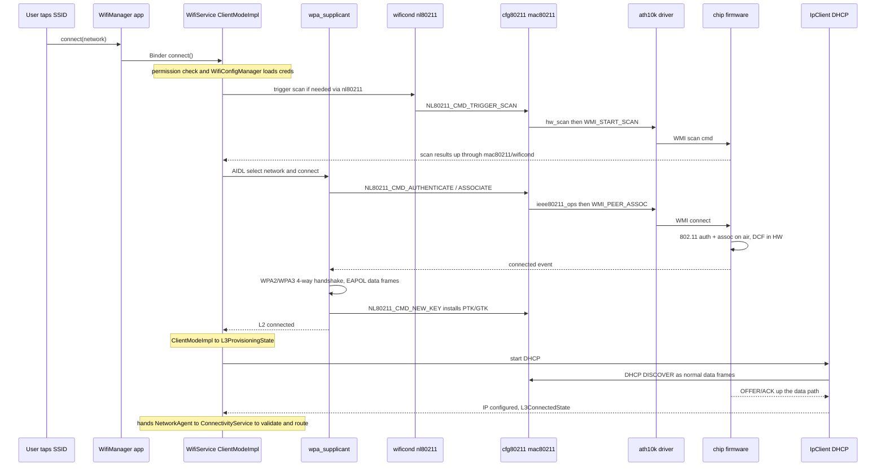
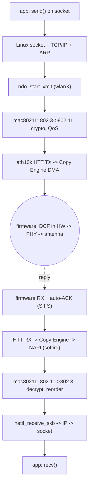

# 🤖 Android Wi-Fi — App → Framework → Kernel → Firmware Interview Deep Dive

### The full vertical journey: `WifiManager` (Java app) → System Server → AIDL HALs → `wpa_supplicant`/`wificond` → `cfg80211`/`mac80211` → vendor driver → chip firmware → radio

> **What this guide is.** The ESP32 reference guide stops at one chip. **This guide stacks the entire Android tower from the app down to the silicon** — from a Java app tapping "connect" down to the antenna putting bits on the air — naming the real AOSP components (`packages/modules/Wifi`, `wificond`, the three Wi-Fi HALs, `external/wpa_supplicant_8`) and the real kernel/firmware layer (`cfg80211`/`mac80211` + a Qualcomm `ath10k`/`ath11k`-class driver and firmware). **It is self-contained:** the Linux-kernel mechanics that sit under the Wi-Fi driver — the `net_device` model, the syscall boundary, interrupts, NAPI, DMA, preemption — are all explained inline in **Part 5**, so you never need a separate Linux reference open while reading.
>
> **Why Qualcomm `ath10k`/`ath11k` for the firmware layer?** Of the candidate vendors, Qualcomm Atheros has by far the **most openly documented, AOSP-compatible** Wi-Fi stack: upstream **mainline `mac80211` drivers** (`drivers/net/wireless/ath/ath10k`, `ath11k`), **publicly mirrored firmware blobs** (the `ath10k-firmware`/`ath11k-firmware` trees), and it is what real Android phones actually ship (the WCN3990 in many Pixels/Qualcomm SoCs is an `ath10k` target). MediaTek (`mt76`) is the other strongly-upstreamed option. Realtek and Espressif exist but are weaker fits for a *phone* SoC story (Espressif's ESP32 is an SDIO/host-MCU companion chip, not a phone's main Wi-Fi — we use it only as the contrast point from your reference doc).
>
> **The recurring theme, carried over:** *microseconds are silicon, milliseconds are software* — and Android adds two more boundaries above that: *the framework/Java layer is **policy**, the native daemons + HAL are **mechanism**, and Binder/AIDL is the wall between an app's process and the privileged Wi-Fi process.*

---

## 📑 Contents

> **Reading order is top-down here**, because Android's defining feature is the *vertical layering* — so we descend one floor at a time from the app to the antenna. Parts 1–4 descend the Android stack to the driver; **Part 5 then opens up the Linux kernel itself** (the OS mechanics under the driver); Parts 6–8 trace end-to-end flows and consolidate.

**Part 1 — The Android Wi-Fi Tower (the map)**
- 1.1  The whole stack on one page (app → firmware)
- 1.2  The four "languages" you cross: Java API, Binder/AIDL, netlink, firmware commands
- 1.3  Where each AOSP component lives in the source tree
- 1.4  Why so many layers? (the Project Treble / vendor-split answer)

**Part 2 — App & Framework: `WifiManager` → `WifiService`**
- 2.1  The app side: `android.net.wifi` APIs over Binder
- 2.2  The system-server side: `WifiService`, `ClientModeImpl`, `WifiConfigManager`
- 2.3  `ConnectivityService` and why Wi-Fi is "just one network"

**Part 3 — The HAL & Native Daemons: the vendor wall**
- 3.1  The three Wi-Fi HAL surfaces: Vendor, Supplicant, Hostapd
- 3.2  HIDL → AIDL: what changed and why it matters
- 3.3  `wificond` — the framework's own nl80211 client
- 3.4  `wpa_supplicant` on Android — same daemon, AIDL-wrapped

**Part 4 — Kernel & Firmware: `cfg80211`/`mac80211` → `ath10k`/`ath11k` → chip**
- 4.1  The kernel boundary (where Android becomes plain Linux)
- 4.2  The Qualcomm `ath10k`/`ath11k` driver: WMI, CE, HTC/HTT
- 4.3  Where the MAC actually runs: FullMAC firmware vs the ESP32 SoftMAC
- 4.4  Firmware loading, the host↔firmware command channel, and DMA

**Part 5 — Inside the Linux Kernel: the OS mechanics under the driver**
- 5.1  The `net_device` driver model — how `wlanX` is born
- 5.2  Crossing the syscall wall — how a user-space read/write reaches the kernel
- 5.3  Interrupts: hardirq, softirq, and the top-half / bottom-half split
- 5.4  NAPI — the kernel's RX engine, and why it exists
- 5.5  DMA — how the copy actually happens (addresses, mapping, ownership)
- 5.6  A burst of packets, end to end — preemption, softirq, ksoftirqd, backpressure
- 5.7  Nested interrupts — when, whether, and how they stack

**Part 6 — Two End-to-End Walkthroughs**
- 6.1  CONTROL: "tap a network → connected" (full top-to-bottom trace)
- 6.2  DATA: an app's TCP packet to the air (and the RX back up)

**Part 7 — Turning Wi-Fi On, Scanning, and Concurrency**
- 7.1  "Toggle Wi-Fi on" — every layer it touches
- 7.2  Scanning: `WifiScanner`, PNO, and where the work happens
- 7.3  STA/AP and STA/STA concurrency (the multi-iface story)

**Part 8 — Mapping Back & Rapid-Fire Recall**
- 8.1  ESP32 ↔ Linux ↔ Android — the three-column Rosetta table
- 8.2  Rapid-fire interview answers
- 8.3  The five boundaries to never confuse

---

# Part 1 — The Android Wi-Fi Tower (the map)

## 1.1  The whole stack on one page

Android Wi-Fi looks complicated because it *is* a stack of separate programs, not one program. The reason is worth stating up front, because it explains everything that follows: **a phone runs untrusted third-party code, and Wi-Fi is dangerous to hand to untrusted code.** An app that could reconfigure the radio could deauth your other connections, sniff nearby traffic, spoof a MAC address, or silently drain the battery scanning. So Android's design rule is: the app may *ask*, but a single trusted process *decides*, and the actual radio work happens in code the app can't reach at all. Each layer below exists to enforce one more step of that separation.

From an app tapping "connect" to a photon leaving the antenna:



The five floors, each with its own crossing mechanism:

| Floor | Component | Talks down via | Lives in |
|---|---|---|---|
| **App** | `WifiManager` | **Binder** | the app's sandboxed process |
| **Framework** | `WifiService` / `ClientModeImpl` | **AIDL** (to HALs), Binder (to apps) | `system_server` (`packages/modules/Wifi`) |
| **Native daemons** | `wpa_supplicant`, `wificond`, Vendor HAL | **nl80211 netlink** + vendor **WMI** | dedicated native processes |
| **Kernel** | `cfg80211`/`mac80211` + driver | **WMI/HTC** over PCIe/SDIO + **DMA** | the Linux kernel |
| **Firmware** | chip firmware + PHY | register/DMA, then RF | the silicon |

**Why the app genuinely cannot reach the driver — the mechanism, not the slogan.** It's tempting to say "the app talks to `WifiManager` by convention." It's stronger than that, and the *how* is the interesting part. Every Android app runs as its own **Linux UID** in its own process, inside an **SELinux** domain (`untrusted_app`). The control path into the kernel Wi-Fi stack is an `AF_NETLINK`/`NETLINK_GENERIC` socket — and SELinux policy simply **does not grant `untrusted_app` permission to open one**, nor does the app hold the `CAP_NET_ADMIN` capability that reconfiguring an interface requires. So if a malicious app *tried* to open that socket and skip the whole tower, the **kernel returns `EACCES` before a single byte moves**. The separation isn't politeness the app could ignore; it's a refusal enforced two layers down, by the kernel, on every attempt.

That is *why* `WifiManager` is only a thin **Binder proxy** to `WifiService` in the privileged `system_server`: the app has no other door. And it's why all *policy* — which network to join, when to roam, whether to randomise the MAC, how to score networks — lives in that one trusted Java service, while everything below it (daemons, HAL, driver, firmware) is pure *mechanism* that just executes orders. Centralising the decisions in one auditable process is the whole point; the layering is how that centralisation is made unforgeable.

> 🔑 **Say this:** "The app can't touch the driver because the **kernel won't let it** — `untrusted_app` has no SELinux permission to open the `nl80211` netlink socket and no `CAP_NET_ADMIN`. So its only door is a **Binder** call to `WifiService`, where all the policy lives. The lower layers are mechanism; the trusted framework is the brain. The layering exists because a phone runs code it doesn't trust near a radio that can do damage."

## 1.2  The four "languages" you cross going down the tower

Here's the question that makes this section convincing: *why four different IPC mechanisms?* If they were interchangeable you'd use one. They aren't — **each boundary has a different problem to solve, and the mechanism is chosen to solve exactly that problem.** Going down:

1. **Java app → framework: Binder IPC.** The problem at this boundary is *trust*: the receiver must know, with certainty, **who is calling**, because it's about to make a permission decision. Binder is a kernel-mediated IPC where the **kernel itself stamps the caller's real UID/PID onto the transaction** (see §2.1) — the caller can't lie about its identity because it never gets to assert it. That's why this boundary uses Binder and not, say, a pipe or a shared file: only a kernel-mediated channel can deliver an unforgeable identity. Permissions (`ACCESS_WIFI_STATE`, `CHANGE_WIFI_STATE`, location for scan results) are checked here, against that stamped identity.
2. **Framework → HAL: AIDL (was HIDL).** The problem here is *independent updates*: Google's framework and the SoC vendor's Wi-Fi code are written by different organisations and shipped on different schedules, often in different partitions. You can't link them together — you need a **contract** that either side can be rebuilt against without breaking the other. AIDL is that contract: a **stable, versioned, serialised interface** (`android.hardware.wifi`, `…supplicant`, `…hostapd`). The call still rides Binder underneath, but the *significance* of this boundary is the versioned ABI — the **Treble vendor line** (§1.4).
3. **Daemons → kernel: nl80211 netlink.** The problem here is the *address-space wall*: user-space code cannot call kernel functions directly. netlink is the kernel's structured, socket-based configuration channel — `wpa_supplicant` and `wificond` `sendmsg()` `nl80211` commands on an `AF_NETLINK` socket and the kernel parses them. This is the **exact same control plane `iw` uses on desktop Linux**; Android invents nothing here, it reuses upstream `cfg80211`. (The data plane crosses the same wall differently — via the socket/TCP path — see §5.2.)
4. **Driver → firmware: a vendor command protocol.** The problem here is that the firmware runs on a *different processor with its own memory*, across a bus (PCIe/SDIO). You can't make a function call across silicon — you have to **send a message and DMA the bytes over**. For a Qualcomm part that protocol is **WMI** (Wireless Module Interface) commands, carried over an **HTC/HTT** transport, with payloads moved by **DMA** (§4.2, §5.5). The firmware then runs the actual 802.11 MAC.

Notice the through-line: identity → versioning → address space → separate silicon. The mechanism changes because the *kind of boundary* changes.

> 🔑 **Interview framing:** "You cross four ABIs going down — **Binder, AIDL, netlink, WMI** — and each is chosen for the boundary it crosses: Binder where you need an **unforgeable caller identity**, AIDL where you need a **versioned vendor contract**, netlink where you cross the **user/kernel wall**, WMI where you cross to a **separate processor**. Name the four and *why each one*, and you've explained the architecture, not just labelled it."

## 1.3  Where each component lives in the AOSP source tree

Being able to point at the actual paths (browsable at `cs.android.com`) is what separates "I read a blog" from "I've worked in this" — and the layout itself encodes the ownership boundaries from §1.2:

| Component | Source path | Notes |
|---|---|---|
| App-facing API | `frameworks/base/wifi/` → now `packages/modules/Wifi/framework/` | `WifiManager`, the `android.net.wifi` package (a **Mainline module**) |
| Wi-Fi service | `packages/modules/Wifi/service/` | `WifiServiceImpl`, `ClientModeImpl`, `WifiConfigManager`, `WifiConnectivityManager` |
| wificond | `system/connectivity/wificond/` | standalone native daemon; nl80211 client |
| wpa_supplicant | `external/wpa_supplicant_8/` | the upstream daemon + an `aidl/` shim dir |
| Vendor HAL AIDL | `hardware/interfaces/wifi/aidl/` | the Android-specific command surface |
| Supplicant HAL AIDL | `hardware/interfaces/wifi/supplicant/aidl/` | wraps `wpa_supplicant` |
| Hostapd HAL AIDL | `hardware/interfaces/wifi/hostapd/aidl/` | wraps `hostapd` (SoftAP) |
| Kernel driver | `drivers/net/wireless/ath/ath10k/` (or `ath11k/`) | upstream `mac80211` driver |
| Firmware blobs | `ath10k-firmware` / vendor `firmware_mnt` partition | loaded onto the chip at probe |

The split into two superprojects mirrors the kernel boundary: `cs.android.com/android/platform/superproject/main` (framework/HAL/daemons) and `cs.android.com/android/kernel/superproject` (kernel + drivers). Everything in Parts 2–3 lives in the *platform* superproject; everything in Parts 4–5 lives in the *kernel* superproject — they're built and versioned separately, which is the source-tree shadow of the Treble seam.

## 1.4  Why so many layers? The Treble / vendor-split answer

This is the "why is it so complicated" question, and there's a precise, convincing answer with a clear "what breaks otherwise."

**Before Android 8, the framework and the vendor's Wi-Fi code were compiled together into one image.** That meant a single consequence with huge cost: *any* framework change — even a one-line security fix — required **every SoC vendor to recompile and re-ship their entire Wi-Fi stack**, and then every OEM to integrate and re-test. That dependency chain is the main reason pre-Treble Android phones took a year (or never) to get updates. The architecture made timely updates structurally impossible.

**Project Treble (Android 8+) broke that chain** by inserting a hard, **versioned ABI** between Google's framework and the vendor implementation — first HIDL, now AIDL — and putting the vendor code on a separate `/vendor` partition. Compatibility is checked by **VINTF manifests** and a compatibility matrix at build and boot, so the framework can be replaced as long as it still speaks a version the vendor implementation declares. Now Google can update the framework partition without the vendor recompiling anything, because the contract between them is stable and checked, not a compile-time link.

Every layer in the tower is a consequence of that one decision:

- The **HAL exists** so the framework calls vendor code through the stable contract instead of linking it.
- **`wificond` exists** so the common, vendor-neutral operations (scan, signal polling) have an AOSP-owned nl80211 client — shrinking how much each vendor HAL must implement, so there's less vendor code to go stale.
- **`wpa_supplicant` is wrapped in a HAL** rather than called directly, so its exact version/presence is a vendor detail behind the contract.
- The Wi-Fi stack became a **Mainline module** (`packages/modules/Wifi`), so Google can push Wi-Fi fixes through Play system updates with no OTA at all — the same "decouple the update" logic taken one step further.

> 🔑 The layers are not accidental complexity — they are **update/ownership seams**. Each boundary answers "who can change this independently of that?" The convincing version: "Pre-Treble, a framework patch forced every vendor to rebuild Wi-Fi, which is why updates took forever. Treble's **versioned HAL ABI** cut that dependency, and every layer — HAL, `wificond`, the supplicant wrapper, the Mainline module — is a piece of that decoupling."

---

# Part 2 — App & Framework: `WifiManager` → `WifiService`

*The descent starts at the top.* Part 1 closed on the rule that an app never talks to the driver — this is the floor where that rule lives and is enforced. It's the **Java/Binder tower**: the app plus the framework in `system_server`, everything *above* the kernel, and the one stretch of the whole stack with no equivalent on the ESP32 or on desktop Linux.

## 2.1  The app side — `android.net.wifi` over Binder

An app never touches hardware. It holds a `WifiManager`, which is a **client-side proxy object** — it has no Wi-Fi logic in it at all; every method just packages the arguments and ships them to `system_server`:

```java
// app process
WifiManager wifi = context.getSystemService(WifiManager.class);
// Modern API (Android 10+): suggest a network, let the platform decide
WifiNetworkSuggestion s = new WifiNetworkSuggestion.Builder()
        .setSsid("HomeWiFi").setWpa2Passphrase("....").build();
wifi.addNetworkSuggestions(List.of(s));
// Or request a specific network via ConnectivityManager + NetworkRequest
```

```text
app: wifi.addNetworkSuggestions(...)
  -> WifiManager packs args into a Parcel
  -> Binder transaction (one-way or two-way) across the process boundary
  -> lands in WifiServiceImpl.addNetworkSuggestions() in system_server
  -> permission check against the caller's KERNEL-STAMPED identity
  -> stored/acted on by the framework
```

**Here's the mechanism that makes the whole trust model work** — and it's the thing most people assert without explaining. We say "the app can't forge its identity." *Why not?* Because the app never gets to **state** who it is. Walk the actual transaction:

1. The app's `WifiManager` flattens the arguments into a **Parcel** and calls `transact()`, which becomes an `ioctl(BINDER_WRITE_READ)` on `/dev/binder`.
2. Control enters the **kernel's Binder driver**. The driver knows, from the file descriptor and the calling thread, the app's **real UID and PID** — kernel-owned facts. As it copies the transaction into the target process, it **records that caller identity onto the transaction itself**. The app's own bytes never carry an identity field it could set.
3. On the far side, `WifiServiceImpl` calls **`Binder.getCallingUid()` / `getCallingPid()`**, which read back exactly what the kernel stamped. The service then checks that UID's granted permissions (`CHANGE_WIFI_STATE`, location for scan results, etc.).

So the permission check isn't a courtesy the app could skip or spoof — it tests a value the **kernel** attached and the **service** reads, with the app cut out of the loop entirely. *That* is why Wi-Fi control rides Binder instead of, say, a world-writable file or a plain socket the app could feed a fake UID into: only a kernel-mediated channel can deliver an identity the caller cannot author.

The same trust logic explains the **shift to declarative APIs**. Old Android let an app imperatively command the radio (`enableNetwork()`, `reconnect()`). Modern Android pushes `WifiNetworkSuggestion` / `NetworkRequest` instead, where the app *describes* a network it would like and the **platform decides** whether and when to use it. The reason is the Part 1 rule again: the app isn't trusted to make the decision, so the API is reshaped so it can only ever *ask*. Policy is kept structurally out of the app's hands, not just discouraged.

> 🔑 **Say this:** "An app can't fake its permissions because it never asserts its identity — when it makes the Binder call, the **kernel's Binder driver stamps the caller's real UID/PID onto the transaction**, and `WifiServiceImpl` reads it with `Binder.getCallingUid()`. The check tests a kernel fact, not an app claim. That's also why modern APIs are **declarative** — the app *suggests*, the trusted framework *decides*."

## 2.2  The system-server side — the real brain

Everything intelligent happens in one privileged process. Inside `system_server`, the Wi-Fi module (`packages/modules/Wifi/service/`) holds the decisions, the credentials, and the connection state:

| Class | Responsibility | ESP32/Linux analogue |
|---|---|---|
| `WifiServiceImpl` | the Binder endpoint; entry for every app/Settings call; permission enforcement | (none — Android-only) |
| `ClientModeImpl` / `ClientModeManager` | the **STA state machine** (disconnected → scanning → authenticating → connected → roaming) | the mac80211 MLME / the ESP32 `c_mac_task` STA machine |
| `WifiConfigManager` | the database of saved networks, credentials, priorities | (config persistence — Android-only) |
| `WifiConnectivityManager` + `WifiNetworkSelector` | decides **when to scan, when to roam, which BSS to pick** (scoring) | roaming policy (802.11k/v/r decision side) |
| `WifiNative` | the thin Java→HAL/`wificond`/supplicant adapter | the syscall/ioctl shim |
| `SupplicantStaIfaceHal`, `WifiVendorHal`, `HostapdHal` | typed Java wrappers over the AIDL HAL surfaces | (the Treble boundary) |

Two of these deserve the *why*, because they're where the design choices live:

**Why `ClientModeImpl` is a state machine, not just a function that connects.** A connection isn't a single linear operation — it's a long-lived thing being pushed on from many directions *at once*: the user taps connect, the supplicant reports "associated," the DHCP client reports a lease, the signal drops and triggers a roam, the driver reports the link is gone. If you handled those with ad-hoc callbacks and flags, two events arriving close together would race and corrupt the connection state (e.g. a disconnect landing mid-association). A `StateMachine` solves this by **serialising every event onto one queue and processing them one at a time against an explicit current state** — so "associated" is only meaningful in `L2ConnectingState`, and a stray event in the wrong state is cleanly ignored. The state machine is how the framework stays correct under asynchronous, multi-source events. It drives `wpa_supplicant` (via the Supplicant HAL) to do the actual 802.11 work and reacts to events coming back up.



The state names encode a boundary that recurs through the whole stack: **L2 (the radio link) is finished before L3 (an IP address) begins.** `L2ConnectingState` is authentication + association — you now have a *link* but no addressing. Only when association completes does `ClientModeImpl` start **`IpClient`** to run DHCP, entering `L3ProvisioningState`. Making that an explicit state transition isn't decoration: it's why "connected to Wi-Fi but no internet" is a real, distinct condition the system can detect and act on — you reached L2 but L3 (or validation) failed.

**Why `WifiConfigManager` lives here and not in the app.** It holds saved SSIDs, passphrases, and enterprise keys. Those are exactly the secrets an untrusted app must never read, so they sit in the trusted process, and the app only ever references a network by an opaque ID. **`WifiNative`** is the adapter that turns the framework's Java intentions into concrete calls down the next boundary — into the HAL, `wificond`, or supplicant — i.e. it's where the framework stops deciding and starts commanding.

## 2.3  `ConnectivityService` — Wi-Fi is just one network

The point that scores: **`WifiService` does not decide whether your traffic actually uses Wi-Fi.** It only manages the Wi-Fi *link*. The decision of which link the whole OS routes through belongs to a different service, and the mechanism is worth knowing.

When Wi-Fi reaches a usable state, `ClientModeImpl` registers a **`NetworkAgent`** with **`ConnectivityService`**. That agent advertises the network's **`NetworkCapabilities`** (it's Wi-Fi, it's not metered, it's validated, …) and a **score**. `ConnectivityService` holds one such agent for *every* available transport — Wi-Fi, cellular, ethernet — and routes the default traffic to the **highest-scoring validated network**, reprogramming the kernel routing rules when the winner changes.

This is why the behaviour you observe makes sense:
- **Cellular stays up for a moment after Wi-Fi connects** because `ConnectivityService` won't tear down a working network until the new one is *validated*. It runs a **connectivity probe** (a small HTTP/HTTPS reach-out) and only switches the default route once Wi-Fi proves it actually reaches the internet.
- **"Wi-Fi connected, no internet" bounces you back to cellular** because that probe failed or hit a captive portal: the Wi-Fi link (L2/L3) is fine, but the *network* didn't validate, so its score drops and `ConnectivityService` keeps routing over cellular.

The split is deliberate separation of concerns: managing one radio's link is a different job from arbitrating among all transports, and only the latter has the global view needed to choose. Putting both in one service would entangle Wi-Fi-specific logic with cross-transport routing.

> 🔑 **Say this:** "`WifiService` manages the Wi-Fi *link*; `ConnectivityService` decides *which* link the OS uses. Wi-Fi registers a **`NetworkAgent`** with capabilities and a score; `ConnectivityService` ranks all transports, runs a **validation probe**, and only moves the default route to Wi-Fi once it proves it reaches the internet — which is exactly why 'connected but no internet' falls back to cellular."

---

# Part 3 — The HAL & Native Daemons: the vendor wall

*One floor down.* Everything in Part 2 was Google's framework deciding *what* should happen. But the framework can't reach the chip itself — the instant it needs to, it meets the **vendor wall**, and that wall is this floor. It's the layer that's *distinctly Android*: desktop Linux runs `wpa_supplicant` too, but with no HAL/Treble split. Here is where Google's framework hands off to the SoC vendor's code.

**First, what a "HAL call" physically is**, because the word "HAL" hides the mechanism. A HAL is not a library the framework links — that's the whole point of Treble (§1.4). It's a **separate process**, shipped by the vendor on the `/vendor` partition, that registers itself with `servicemanager` and implements an AIDL interface. So when the framework "calls the HAL," it's making **another Binder transaction** — the same machinery as an app calling `WifiService`, just one floor lower and into a vendor process instead of `system_server`. Two consequences fall out of that for free: the boundary is **versioned** (the AIDL contract, checked at boot via VINTF), and it's **fault-isolated** (if the vendor HAL process crashes, it restarts without taking down `system_server`). Running vendor code in its own process is what makes "update the framework without the vendor" actually safe.

## 3.1  The three Wi-Fi HAL surfaces

AOSP defines **three** separate HAL interfaces, each a stable AIDL contract a vendor must implement:

| HAL surface | Wraps | AIDL location | Mandatory? |
|---|---|---|---|
| **Vendor HAL** (`android.hardware.wifi`) | Android-specific chip commands (chip/iface lifecycle, capabilities, RTT, NAN, link-layer stats, MAC randomisation control) | `hardware/interfaces/wifi/aidl/` | **Optional** for basic STA/SoftAP; **required** for Wi-Fi Aware & RTT |
| **Supplicant HAL** (`...wifi.supplicant`) | `wpa_supplicant` (STA auth/assoc, 4-way handshake, roaming) | `hardware/interfaces/wifi/supplicant/aidl/` | required for STA |
| **Hostapd HAL** (`...wifi.hostapd`) | `hostapd` (SoftAP beaconing, client auth) | `hardware/interfaces/wifi/hostapd/aidl/` | required for SoftAP |

**Why three, and not one big Wi-Fi HAL?** Because they wrap three things with *different owners and lifecycles*. The Supplicant HAL and Hostapd HAL each wrap an **existing, independent daemon** (`wpa_supplicant`, `hostapd`) that already does a self-contained job — be a station, be an access point — and that you start and stop independently (you run the AP daemon only when hot-spotting). The Vendor HAL wraps something different in kind: **the chip itself and the Android-specific features layered on it** (creating/destroying interfaces, reporting capabilities, RTT/NAN, link stats, MAC randomisation). Forcing those into one interface would couple three independently-versioned, independently-running pieces into a single contract — exactly the coupling Treble exists to avoid. Splitting by role keeps each contract small and separately implementable.

**Why the Vendor HAL is *optional* for plain STA** — the detail that proves you understand the layering. Basic "connect to a network" needs only two things: the common nl80211 operations (scan, link status), which **`wificond`** provides (§3.3), and the 802.11 association + handshake, which the **supplicant** provides (§3.4). Neither of those needs the vendor's Android-specific command surface. So a minimal vendor can ship a working STA with no Vendor HAL at all; you only *need* it for the features that have no nl80211 equivalent — Wi-Fi Aware (NAN), RTT ranging, detailed link-layer stats, advanced concurrency. That's the cleanest evidence that the Vendor HAL is the "Android extras" surface, not the basic data path.

## 3.2  HIDL → AIDL — what changed and why

The version history isn't trivia — it tells the *why* of the whole HAL mechanism, and it dates your knowledge:

- **Pre-Android 8 (Treble):** "legacy HAL" — a C header + shared library the framework essentially **linked**. No process boundary, no version contract: the coupling Part 1.4 described.
- **Android 8–13:** **HIDL** — the first real Treble ABI. Versioned `.hal` interfaces, Binderized into separate processes. This is what created the process-isolated, versioned vendor boundary in the first place.
- **Android 13+ (Supplicant), 14+ (Vendor HAL):** migrated to **AIDL** — *the same IDL apps already use* for ordinary Binder.

**Why migrate HIDL → AIDL at all, if HIDL already gave the Treble boundary?** Because HIDL was a **second, parallel IPC system** — its own IDL, its own code generators, its own runtime — that existed *only* for HALs, while the rest of Android already had AIDL. Maintaining two IPC stacks is pure cost. Once AIDL gained **stable versioning** (the one feature it lacked versus HIDL), Google could delete the duplication: unify everything on AIDL, one toolchain, one runtime, less code to carry. For compatibility, the default AOSP implementation is a **shim that sits on top of the old legacy-HAL library**, so a vendor can either implement modern AIDL directly or keep a legacy-HAL backend behind it.

> 🔑 One-liner: "HALs went legacy (linked) → HIDL (Android 8, the first versioned process boundary) → AIDL (supplicant 13, vendor 14). The move to AIDL wasn't cosmetic — it **deleted a whole parallel IPC system** by folding HALs onto the same AIDL the app layer already used, once AIDL got stable versioning."

## 3.3  `wificond` — the framework's own nl80211 client

`wificond` (at `system/connectivity/wificond`) is an AOSP-owned native daemon that talks **straight to the kernel driver over `nl80211`** — no vendor code involved — handling the common, vendor-neutral operations: triggering **scans** and collecting results, **signal/link** polling, sending some 802.11 management frames, and SoftAP station-connected signalling.

```text
ClientModeImpl -> WifiNative -> wificond (Binder)
   wificond -> nl80211 (NL80211 generic-netlink socket) -> cfg80211 -> driver
```

Two *why*s make this layer make sense:

**Why have `wificond` at all, instead of routing everything through a vendor HAL?** Because scanning and signal polling are *standard nl80211 operations that the kernel already implements identically for every driver*. Pushing them through a vendor HAL would force every vendor to re-implement (and potentially mis-implement) plumbing the kernel already does. Giving the common operations an **AOSP-owned** nl80211 client means there's one correct implementation Google maintains, and the vendor HAL only has to cover what's genuinely vendor-specific. It directly shrinks the vendor surface — the same decoupling goal as §1.4.

**Why a separate native daemon, rather than `system_server` opening the netlink socket itself?** `system_server` is a big managed-runtime (Java) process; you don't want it holding raw native netlink sockets and parsing kernel message structs in-process. Isolating that native socket work in a small dedicated daemon keeps it out of the framework's address space and lets the framework drive it cleanly over Binder. It's the Android equivalent of the desktop `iw`/`nl80211` control path, repackaged as a long-lived service.

## 3.4  `wpa_supplicant` on Android — same daemon, AIDL-wrapped

The real 802.11 **authentication and association** — open/WPA2/WPA3-SAE/Enterprise EAP, the 4-way handshake, the supplicant-side roaming decisions — is done by the **exact same `wpa_supplicant`** that runs on desktop Linux. AOSP carries it at `external/wpa_supplicant_8/`. This is the key realisation: Android did **not** rewrite the supplicant; the protocol-heavy, security-critical MLME code is upstream code, reused.

```text
ClientModeImpl -> SupplicantStaIfaceHal (AIDL) -> wpa_supplicant
   wpa_supplicant builds Auth/Assoc mgmt frames, runs 4-way handshake
   wpa_supplicant -> nl80211 -> cfg80211 -> mac80211/driver -> firmware -> air
   keys installed via NL80211_CMD_NEW_KEY (same nl80211 command as on desktop Linux)
```

So what did Android actually add? **Only the control transport.** On desktop, you drive `wpa_supplicant` through its `wpa_ctrl` socket (that's what `wpa_cli` uses). On Android, the **`aidl/` shim** inside the supplicant exposes it as the **Supplicant HAL**, so `WifiNative`/`SupplicantStaIfaceHal` command it over **AIDL/Binder** instead. *Why bother wrapping it rather than calling it directly?* Because that puts the supplicant **behind the Treble contract** like any other vendor component: its exact version and even its presence become a detail hidden behind the AIDL interface, so the framework targets the stable HAL and doesn't care which supplicant build sits underneath. The downward path to the kernel — building Auth/Assoc frames, the 4-way handshake, `NL80211_CMD_NEW_KEY` to install the PTK/GTK — is **byte-for-byte the desktop path**.

> 🔑 **Say this:** "Android reuses the **upstream `wpa_supplicant`** unchanged — same MLME, same 4-way handshake, same `nl80211` path to the kernel. The only Android-specific piece is an **AIDL shim** that re-exposes it as the Supplicant HAL, so the framework drives it over Binder instead of the desktop `wpa_ctrl` socket and the supplicant sits behind the Treble contract like any other vendor component. Android changed *who drives it*, not *what it does*."

---

# Part 4 — Kernel & Firmware: `cfg80211`/`mac80211` → `ath10k`/`ath11k` → chip

*Through the last Android-specific door.* Part 3 left off with `wpa_supplicant` sending an `nl80211` command — and that command is the doorway into the kernel. Follow it through and the Android tower lands on plain **Linux**: from here down nothing is Android-specific (same `cfg80211`, same `mac80211`, same driver model). This part is the Wi-Fi-specific kernel layer — `cfg80211`/`mac80211` and the vendor driver. **Part 5 then opens up the general kernel machinery the driver sits on** (the `net_device` model, syscalls, interrupts, NAPI, DMA).

## 4.1  The kernel boundary

An `nl80211` command from the supplicant doesn't hit the driver directly — it passes through two kernel layers that exist for a reason worth knowing, because interviewers ask "what's the difference between cfg80211 and mac80211?"

- **`cfg80211`** is the **configuration and policy layer**. It's the kernel side of the `nl80211` socket: it parses the netlink command, enforces **regulatory rules** (which channels/powers are legal in your country), and holds the `wiphy` (the radio object, §5.1). It is driver-agnostic — every Wi-Fi driver goes through it.
- **`mac80211`** is the **SoftMAC implementation**: the actual 802.11 upper-MAC code (MLME state, queueing, aggregation, crypto plumbing) that *SoftMAC* drivers build on. A driver registers a set of `ieee80211_ops` callbacks with it and lets `mac80211` do the protocol work.

```text
wpa_supplicant --nl80211--> cfg80211 (parse + regulatory + wiphy)
                               -> mac80211 (802.11 MLME, queues)   [SoftMAC drivers]
                               -> vendor driver -> firmware -> air
```

**Why two layers instead of one?** Because they answer two different questions: *"is this operation allowed and which radio?"* (`cfg80211`) versus *"how do I actually perform 802.11?"* (`mac80211`). Splitting them means a **FullMAC** driver — where the *firmware* runs the 802.11 MAC — can register with `cfg80211` directly and **skip `mac80211` entirely**, because it doesn't need the kernel's SoftMAC implementation. That's not hypothetical: it's exactly the spectrum §4.3 is about. The two-layer design is what lets one kernel serve both SoftMAC and FullMAC chips. Android changes none of this — it's upstream `cfg80211`/`mac80211`. The data path is equally vanilla: `socket` → IP stack → `ndo_start_xmit` → `mac80211` → driver, with RX returning via **NAPI** (§5.4).

> 🔑 "`cfg80211` is the policy/regulatory front-end of `nl80211` and owns the radio; `mac80211` is the optional SoftMAC engine a driver builds on. A FullMAC driver talks to `cfg80211` and **bypasses `mac80211`** because the firmware is the MAC. **At and below `nl80211`, Android is just Linux** — same layers, same `ndo_start_xmit`, same NAPI."

**Why the driver is a separate module (GKI/KMI).** The Android kernel is the **GKI (Generic Kernel Image)** — one Google-built core kernel — with the Wi-Fi driver shipped as a **vendor kernel module** (`.ko`) loaded on top, against a stable **KMI (Kernel Module Interface)**. The motivation is the same as Treble one floor up: if the driver were compiled *into* the kernel, Google couldn't ship a core-kernel security update without every vendor rebuilding their driver. A stable module ABI breaks that dependency — Google updates the GKI, the vendor's existing `.ko` still loads. The vendor-module seam is the Treble seam, repeated in the kernel.

## 4.2  The Qualcomm `ath10k`/`ath11k` driver — WMI, CE, HTC/HTT

Take a Qualcomm WCN-class chip (e.g. WCN3990, an `ath10k` target found in many phones). The driver (`drivers/net/wireless/ath/ath10k/`) registers with `mac80211`, but unlike a simple chip like `ath9k`, it does **not** run the MAC itself — it talks to an **on-chip firmware** that does, over a structured command/transport stack:

| Layer in `ath10k` | What it is | ESP32 analogue |
|---|---|---|
| **mac80211 ops** (`mac.c`) | registers with `cfg80211`/`mac80211`; `ieee80211_ops` (`.tx`, `.config`, `.hw_scan`, …) | the `80211_mac.c` interface to the stack |
| **WMI** (`wmi.c`) | **Wireless Module Interface** — the command/event protocol to firmware ("start scan," "connect," "set channel," "key install") | the register writes / smart-frame commands |
| **HTC/HTT** (`htc.c`, `htt_tx.c`, `htt_rx.c`) | Host-Target Control / Host-Target Transport — message framing and the **data** path (TX/RX of 802.11 frames) | the TX/RX descriptor pipe |
| **CE — Copy Engine** (`ce.c`) | the **DMA** engine abstraction that moves messages/frames host↔chip over PCIe/SDIO | the WMAC DMA / descriptor ring |
| **BMI** (`bmi.c`) | Board Message Interface — used at boot to **load firmware** | the boot/`hwinit` bring-up |



**Why two channels — WMI for control, HTT for data — and not one?** Because control and data have opposite shapes. **Control (WMI)** is *low-volume, structured, request/reply*: "start scan," "connect to this peer," "install this key," and firmware events coming back ("scan done," "connected"). You want it reliable and easy to parse, and you don't care that each message has overhead because there are few of them. **Data (HTT)** is *high-volume, latency- and throughput-sensitive*: every packet you send and receive. You want it lean and pipelined, with per-packet overhead minimised and batching/aggregation built in. Putting bulk data through the command channel would bottleneck throughput; putting commands through the data channel would make them hard to track. So they're separate logical channels — but they ride the **same physical DMA substrate, the Copy Engine** (§5.5), because at the bus level both are just "move these bytes host↔chip."

**Why the driver is "thin."** Because the firmware is the MAC (§4.3), the driver's job for most operations is to **marshal a WMI command and DMA it across**, then handle the event that comes back — not to implement 802.11 logic. That's the mental model to carry: `ath10k` is a *messenger* to a smart chip, where `ath9k` was a *driver* of a dumb one.

> 🔑 "`ath10k` is a `mac80211` driver but **thin** — the MAC lives in firmware, reached over **WMI** for control and **HTT** for data, both DMA'd by the **Copy Engine**. Two channels because control is low-volume request/reply and data is high-volume throughput — different shapes, same DMA pipe underneath."

## 4.3  Where the MAC actually runs — FullMAC firmware vs the ESP32 SoftMAC

This is the heart of the "firmware" question, and the answer is a single idea applied at two different heights: **push work off the CPU that can't afford to do it.**

| | **ESP32 (your reference doc)** | **Phone (Qualcomm `ath10k`/`ath11k`)** |
|---|---|---|
| MAC location | **SoftMAC** — 802.11 MLME runs as C on the chip's CPU (the `c_mac_task`) | mostly **FullMAC** — the **firmware** runs auth/assoc, power-save, aggregation, much of the MLME |
| Host driver job | the host *is* the MAC (open-mac builds frames) | host driver mostly **forwards WMI commands**; firmware does the work |
| `mac80211` involvement | n/a (bare-metal FreeRTOS) | present, but offloads heavily to firmware (`ath10k` leans FullMAC) |
| Why | a tiny MCU exposing the MAC for learning | offload lets the host CPU **sleep** and reliably hits 802.11 timing |

**Why a phone chooses FullMAC — the real mechanism, which is mostly about power.** The dominant cost on a phone isn't CPU cycles, it's *keeping the application processor awake*. If the host had to run power-save polling, beacon tracking, retransmission, and aggregation, the big CPU could never enter deep sleep while connected — it'd have to wake every few milliseconds to service the MAC. By pushing that **millisecond-scale MAC into firmware on a tiny always-on coprocessor**, the firmware can hold the link, buffer traffic, and track beacons while the **host CPU sleeps for long stretches**, waking only when there's real work. FullMAC is a battery decision first, a timing decision second.

**Why the deepest line is in silicon on *both* — the part that never moves.** The **DCF timing** — clear-channel assessment, the SIFS gap, the backoff slot countdown, the SIFS-bounded ACK — runs on **microsecond deadlines** (SIFS ≈ 10 µs). *No* CPU, not the host and not even the chip's firmware CPU, can reliably hit a 10 µs turnaround through an interrupt and a code path. So that timing is implemented as a **hardware state machine** on every Wi-Fi device. The ESP32 proved it directly (software sets a GO bit, then hardware runs DCF and ACKs); a phone is the same at that layer. FullMAC vs SoftMAC only decides where the *milliseconds* live; the *microseconds* are silicon either way.

> 🔑 "Same principle, two heights: get the MAC off the CPU that can't afford it. The ESP32 draws the line low (MLME on its own MCU); a phone draws it high (MLME *and* power-save/aggregation in firmware) **so the host CPU can sleep** — a battery win. But the **microsecond DCF is a hardware state machine on both**, because nothing software can hit a 10 µs SIFS. FullMAC moves the milliseconds; it can't move the microseconds."

## 4.4  Firmware loading and the host↔firmware channel

A Wi-Fi chip ships from the factory with **no MAC brain in it** — the firmware that runs the MAC lives as a file on the phone and must be **pushed into the chip's RAM at boot**. That's why "firmware loading" is a real, ordered step and not a detail:

```text
BOOT/PROBE:
  driver .probe() -> map PCIe/SDIO -> BMI (Board Message Interface)
  request_firmware("ath10k/.../firmware-N.bin") from /vendor (firmware_mnt)
  also load board-2.bin (per-board calibration: antenna, power tables)
  push firmware to chip RAM over the Copy Engine, release the target CPU
  firmware boots, WMI 'ready' event comes back up -> driver registers wiphy

RUNTIME CONTROL (e.g. connect):
  wpa_supplicant -> nl80211 -> mac80211 -> ath10k -> WMI_PEER_* / WMI_VDEV_*
     commands -> firmware programs the hardware MAC, runs auth/assoc timing
  firmware -> WMI events (connected, signal, roam) -> up to mac80211/cfg80211

RUNTIME DATA (e.g. a TCP segment):
  ndo_start_xmit -> mac80211 -> ath10k HTT TX -> Copy Engine DMA -> firmware
     firmware: DCF (CCA/backoff/ACK in hardware) -> PHY -> RF -> antenna
  RX: firmware DMAs frame up via HTT RX -> Copy Engine -> NAPI -> mac80211
     -> netif_receive_skb -> IP stack -> socket
```

**Why two separate blobs — firmware *and* `board-2.bin`?** Because they vary along different axes. The **firmware** (`firmware-N.bin`) is the MAC brain, the same for every phone using that chip revision — it's per-*chip-model*. **`board-2.bin`** is **calibration**: antenna layout, per-channel TX power limits, RF trim — and that's per-*physical-board design*, because two phones with the same chip but different antennas need different RF tuning. Separating them lets one firmware image serve many devices while each device supplies its own calibration. **Both must load before the radio is usable**, and in order: push firmware → release the target CPU → firmware boots → it reads calibration → only then does the `WMI 'ready'` event come back and the driver register the `wiphy`. Skip or corrupt the calibration and the radio either won't come up or transmits out of spec.

We chose Qualcomm for this guide precisely because this whole terminus is **inspectable**: the firmware blob is closed (Qualcomm-proprietary), but the **driver is upstream open source** and the **firmware/calibration images are publicly redistributable** (`ath10k-firmware`/`ath11k-firmware`, also shipped in `/vendor/firmware_mnt`). It's the most open phone-Wi-Fi stack you can trace end to end.

> 🔑 "The chip boots brainless — the driver `request_firmware()`s the MAC firmware **and** a separate `board-2.bin` calibration blob and DMAs them in over the Copy Engine before the radio works. Two blobs because firmware is per-chip-model and calibration is per-board (antennas/power differ). It's the phone-scale version of the ESP32's `hwinit()` PHY calibration — same ordering rule, one level up."

---

# Part 5 — Inside the Linux Kernel: the OS mechanics under the driver

*Pause the descent — open the kernel box.* By the end of Part 4 we'd traced the whole vertical path, app to antenna. But Part 4 treated the kernel as a thin pass-through (`nl80211` → `cfg80211` → `mac80211` → driver) and skipped the OS machinery the driver actually plugs into. That machinery is identical on any Linux system, and it's exactly what a kernel-focused interviewer drills — so before the end-to-end walkthroughs we stop descending and open the box itself: how `wlanX` gets created, how a packet crosses the syscall wall, and what the OS does with **interrupts, NAPI, and DMA** when traffic flows. (Your ESP32 reference doc does these same jobs as "the FreeRTOS tasks, the WMAC ISR, and the DMA descriptor rings"; Linux just gives them richer, named subsystems.)

> **The one theme that survives from the ESP32 doc:** *microseconds are silicon, milliseconds are software* — and a second one is added here: *the kernel never does heavy work in interrupt context.* It does the bare minimum with interrupts off (the **top half**), then defers everything else to a preemptible, interrupts-on context (the **bottom half** — softirq/NAPI). Memorise that split; every answer below is a variation on it.

## 5.1  The `net_device` driver model — how `wlanX` is born

Every network interface in Linux — `eth0`, `wlan0`, `lo`, a virtio NIC — is a **`struct net_device`**. The IP stack never calls a driver directly; it calls *through a table of function pointers* hanging off the netdev. That table, **`struct net_device_ops`**, **is** the driver model:

```c
struct net_device_ops {
    int  (*ndo_open)(struct net_device *dev);          // bring up: alloc rings, request_irq, enable NAPI
    int  (*ndo_stop)(struct net_device *dev);          // tear down
    netdev_tx_t (*ndo_start_xmit)(struct sk_buff *skb, // transmit ONE packet — the data-path entry point
                                  struct net_device *dev);
    void (*ndo_set_rx_mode)(struct net_device *dev);   // multicast/promisc
    int  (*ndo_set_mac_address)(struct net_device *dev, void *addr);
    void (*ndo_get_stats64)(struct net_device *dev, struct rtnl_link_stats64 *s);
    /* ... ~60 optional ops ... */
};
```

This is **polymorphism in C**: the stack above is driver-agnostic because it only ever calls `dev->netdev_ops->ndo_*`. An Ethernet driver, a Wi-Fi driver, and a tunnel all implement the same interface. (`sk_buff`, or **skb**, is the kernel's universal packet buffer — the Linux equivalent of the ESP32's "smart frame" — carrying the bytes plus headroom, metadata, and the protocol/length fields.)

**For Wi-Fi there are two stacked objects, not one:**

| Object | Represents | Registered with | Created by |
|---|---|---|---|
| `struct wiphy` (wrapped in `ieee80211_hw`) | the **physical radio** (the "wireless PHY") | `cfg80211` via `wiphy_register()` / `ieee80211_register_hw()` | the driver at probe |
| `struct net_device` (`wlanX`) | the **L2/L3 interface** the IP stack and apps see | the core net stack via `register_netdevice()` | when an *interface* is added on the wiphy |

A single radio (`wiphy`) can host several netdevs (`wlan0` STA + `ap0` SoftAP) — that's the concurrency story of §7.3.

**The birth sequence of `wlan0`, end to end:**

```text
1 BUS PROBE
    PCIe/SDIO/AHB bus enumerates the chip -> driver .probe() runs
    (e.g. ath10k_pci_probe): map BARs/registers, set up the Copy Engine
2 FIRMWARE
    BMI loads firmware + board-2.bin over the Copy Engine (see §4.4),
    target CPU released, WMI 'ready' event returns
3 RADIO REGISTERED
    driver calls ieee80211_alloc_hw() then ieee80211_register_hw()
    -> the wiphy now exists in cfg80211 (you'd see it as 'phy0')
    -> but there is no usable wlanX netdev yet
4 INTERFACE ADDED  (this is the step that creates wlanX)
    userspace asks for an interface:
      desktop:  iw phy phy0 interface add wlan0 type managed
      Android:  the Wi-Fi Vendor HAL requests a STA iface (via WifiNative)
    -> nl80211 NL80211_CMD_NEW_INTERFACE -> cfg80211
    -> mac80211 ieee80211_if_add(): alloc_netdev() builds the struct,
       sets dev->netdev_ops = mac80211's handlers, dev->ieee80211_ptr = wdev
    -> register_netdevice(): assigns ifindex, creates /sys/class/net/wlan0,
       sends an RTM_NEWLINK uevent, interface appears DOWN
5 BROUGHT UP
    'ip link set wlan0 up'  (or the framework's equivalent)
    -> dev_open() -> dev->netdev_ops->ndo_open()
    -> for mac80211 that's ieee80211_open -> driver .start / .add_interface
    -> firmware brings up a 'vdev' (virtual device), queues enabled,
       NAPI enabled, IRQ requested, netif_start_queue(): now it can carry traffic
```

So the precise answer to **"how does the wlan net device get created?"** is: the driver registers a *radio* (`wiphy`) at probe; the *netdev* (`wlanX`) is created later, when an interface is added via `nl80211 NEW_INTERFACE`, which routes through `cfg80211` → `mac80211`'s `add_interface` → `alloc_netdev` + `register_netdevice`. The `net_device_ops` table wired up there is what the whole stack calls into from then on.

> 🔑 **Interview framing:** "A Wi-Fi driver registers two things: a **`wiphy`** (the radio, with `cfg80211`) and one or more **`net_device`s** (`wlanX`, with the core stack). The netdev is born from an `nl80211 NEW_INTERFACE` — on a phone that's driven by the **Vendor HAL**, on a laptop by `iw`. Its **`net_device_ops`** function-pointer table is the driver model: the IP stack only ever calls `ndo_start_xmit`/`ndo_open`/… and never knows or cares it's Wi-Fi. `ndo_open` is exactly the bottom of the Android 'turn on Wi-Fi' chain in §7.1."

> 🔑 **ESP32 contrast:** on the ESP32 there's no `net_device` — there's `openmac_netif_start()` attaching an `esp_netif` to lwIP, and a hand-written `transmit_80211_frame()`. Linux generalises that single hard-wired path into the `net_device_ops` indirection so one IP stack can drive any NIC. The *job* (give the stack a "send this frame" entry point) is the same; Linux just makes it a registered vtable instead of a direct call.

## 5.2  Crossing the syscall wall — how a user-space read/write reaches the kernel

An app lives in **user space** with its own virtual address space; the kernel lives in a protected space the app cannot touch directly. The only legal doorways between them are **system calls** (the "syscall wall," boundary #3 of §8.3). Two completely different things cross it for Wi-Fi: **data** (your packets) and **control** (nl80211). Both are syscalls; they land in different subsystems.

**The data crossing — `send()` / `write()` on a socket:**

```text
USER SPACE
  app: send(fd, buf, len)         // buf is a USER virtual address
   -> bionic/glibc wrapper executes the syscall instruction:
        AArch64:  svc #0      x86-64: syscall
   -> CPU traps EL0 (user) -> EL1 (kernel): a synchronous exception.
      Hardware switches privilege, saves user registers, jumps to the
      kernel's fixed syscall entry (el0_svc -> invoke_syscall)
KERNEL SPACE
   -> syscall table dispatch -> __sys_sendto / ksys_write
   -> fd -> struct file -> f_op is socket ops -> sock_sendmsg
   -> struct socket -> struct sock -> protocol op (tcp_sendmsg)
   -> tcp_sendmsg COPIES the user bytes into kernel skbs:
        copy_from_user(skb_data, buf, len)
        ^ the kernel may NOT just dereference the user pointer; it must
          use copy_from_user, which checks the address is really user
          memory and faults safely if not. This is THE address-space wall.
   -> TCP segmentation + headers -> ip_queue_xmit -> routing
   -> dev_queue_xmit(skb) -> qdisc -> ndo_start_xmit(skb, wlanX)
   -> mac80211 -> ath10k -> firmware -> air      (continues in Part 6)
   -> syscall returns the byte count; trap returns to EL0
```

**The data crossing — `recv()` / `read()` (the wake-up side):**

```text
  a frame already arrived and was pushed up by NAPI (§5.4) into the
  socket's receive queue while the app was blocked in recv().
  -> the app's task was sleeping in sk_wait_data() on the socket
  -> tcp_recvmsg wakes it, then COPIES out: copy_to_user(buf, skb_data, n)
  -> syscall returns n; the bytes are now in the app's buffer
```

`copy_from_user` / `copy_to_user` are the crux: they are the *only* sanctioned way to move bytes across the user/kernel boundary, precisely because user and kernel virtual addresses are not interchangeable and a raw dereference of a user pointer would be a security hole and a crash risk.

**The control crossing — nl80211 (how `wpa_supplicant`/`wificond` talk to `cfg80211`):**

```text
  wpa_supplicant: socket(AF_NETLINK, SOCK_RAW, NETLINK_GENERIC)
   -> sendmsg() a Generic Netlink message (e.g. NL80211_CMD_TRIGGER_SCAN)
   -> same EL0->EL1 syscall trap, but lands in the netlink subsystem
   -> genetlink dispatch -> cfg80211's nl80211 command handler
   -> cfg80211 -> mac80211 / driver op (e.g. .hw_scan)
   -> events come back UP as netlink multicast -> recvmsg() in the daemon
```

> 🔑 **Interview framing:** "There are **two** user→kernel crossings for Wi-Fi, both syscalls but to different subsystems. **Data** goes `send()/recv()` → socket → TCP/IP → `ndo_start_xmit` (and back up via NAPI). **Control** goes `sendmsg()` on an **`AF_NETLINK`** socket → genetlink → `cfg80211`'s nl80211 handlers. The byte-level reality of the wall is **`copy_from_user`/`copy_to_user`** — the kernel can't dereference a user pointer, so it copies in/out with a checked primitive. That's the syscall wall made concrete."

> 🔑 **ESP32 contrast:** the ESP32 has *no* user/kernel split — `c_mac_task` and your app share one address space, so a "send" is a function call and a queue post, with no trap and no `copy_from_user`. Linux's protection (separate address spaces, a privilege trap, checked copies) is the cost of being a multi-process OS. The work is the same (move bytes from app to driver); Linux adds a guarded doorway in the middle.

## 5.3  Interrupts: hardirq, softirq, and the top-half / bottom-half split

When the chip has work for the host — an RX frame DMA'd into memory, or a TX slot finished — it raises an **interrupt** on its IRQ line (on a phone, a **PCIe MSI/MSI-X** message or an SDIO IRQ; routed by the ARM **GIC** interrupt controller). The kernel splits the response into two halves, for the same reason the ESP32's WMAC ISR is "intentionally tiny":

**Top half = the hardirq handler** (registered with `request_irq`, e.g. `ath10k_pci_interrupt`):
- Runs in **interrupt context with local IRQs disabled** and the line masked at the GIC. Nothing may sleep here; it must be as short as possible because it's blocking the CPU.
- Does the bare minimum: read & **ack/clear** the device interrupt-status register, then **schedule the bottom half**. For a NIC that means `napi_schedule()`, which **masks the device's RX interrupt** and raises the `NET_RX_SOFTIRQ`. Then it returns (IRET).

**Bottom half = the softirq** (here `NET_RX_SOFTIRQ`, serviced by `net_rx_action`):
- Runs with **interrupts re-enabled**, so it can do the long work (drain the ring, build skbs, run the IP stack) without blocking new interrupts.
- It is **preemptible** and bounded by a budget (§5.4, §5.6).

```text
device IRQ ──► [TOP HALF: hardirq]            interrupts OFF, must be tiny
                 ack device, mask RX IRQ,
                 napi_schedule(), raise NET_RX_SOFTIRQ
                 return (IRET)
            ──► [BOTTOM HALF: softirq]         interrupts ON, preemptible
                 net_rx_action -> driver napi->poll(budget)
                 drain ring, build skbs, push up the stack
```

Why split at all? In interrupt context you're holding up the whole CPU and can't safely sleep or run long. So you note "there is work" and leave, then do the actual work in a context that can be scheduled and preempted. **This is exactly the ESP32's design:** the WMAC ISR reads/clears the cause register and posts a queue event (`RX_ENTRY`); the *hardware task* later walks the descriptor ring and does the real work. Linux's hardirq→softirq is the same top-half/bottom-half pattern, formalised as kernel infrastructure.

> 🔑 **Interview one-liner:** "Linux never processes packets in the interrupt handler. The **hardirq top half** just acks the device and schedules work with interrupts off; the **softirq bottom half** (NAPI) does the real RX with interrupts on and is preemptible. It's the textbook top-half/bottom-half split — the same shape as the ESP32's tiny WMAC ISR posting to a hardware task."

## 5.4  NAPI — the kernel's RX engine, and why it exists

**The problem NAPI solves:** at high packet rates, taking *one interrupt per packet* is catastrophic. Interrupt entry/exit cost dominates, the CPU thrashes in and out of the handler, and the system can **livelock** — 100% busy taking interrupts, 0% forward progress. **NAPI (New API)** fixes this by switching from *interrupt-driven* to *polling* under load.

**Each NAPI-capable queue** registers a `struct napi_struct` with a `poll()` callback and a **budget** (commonly 64). The state machine:

```text
IDLE / LOW RATE  — interrupt-driven (low latency):
  RX IRQ -> hardirq -> napi_schedule():
     * MASK this queue's RX interrupt
     * add napi to this CPU's poll list, raise NET_RX_SOFTIRQ

SOFTIRQ runs net_rx_action -> driver poll(napi, budget):
  drain up to 'budget' frames from the RX ring (for ath10k: HTT RX
  over the Copy Engine), wrap each in an skb, push up via
  napi_gro_receive() / netif_receive_skb()

  if processed < budget   -> all caught up:
     napi_complete_done() -> RE-ENABLE the RX interrupt -> back to IDLE
  if processed == budget  -> more work pending:
     return budget; stay scheduled; IRQ STAYS MASKED;
     net_rx_action will poll again (round-robin across queues),
     bounded by netdev_budget (~300) and a ~2-jiffy time limit
```

The genius is **adaptivity**: under light load you get interrupts (cheap, low-latency); under a flood you get **polling with the interrupt masked** (no storm, high throughput). The **budget** is the fairness knob — it bounds how many packets one `poll()` handles before yielding so other softirqs and tasks get the CPU.

Worth naming because interviewers fish for them:
- **GRO (Generic Receive Offload):** `napi_gro_receive` merges consecutive same-flow segments into one large skb before it climbs the stack, amortising per-packet overhead. The RX-side cousin of TSO/GSO.
- **`netdev_budget` / time limit:** the overall cap on a single `net_rx_action` pass; exceeding it defers the rest to `ksoftirqd` (§5.6).
- **Threaded NAPI:** poll can run in a dedicated kernel thread (`napi/…`) instead of softirq context — useful on Android for scheduling/latency/power control.
- **RPS/RFS:** spread RX processing across CPUs (and steer flows to the CPU running the consuming app).

On Android/`ath10k` this is unchanged: the Copy Engine's RX-completion IRQ schedules NAPI, and `poll()` drains the CE/HTT RX ring. Same machinery as an Intel or Realtek Ethernet NIC.

> 🔑 **Interview framing:** "NAPI is interrupt mitigation. First packet: take an interrupt, **mask it**, schedule a softirq. The softirq **polls** the ring up to a **budget** of ~64; if it empties the ring it re-enables the interrupt, if it hits the budget it stays in polling mode. So light load = interrupt-driven and low-latency, heavy load = polled with the IRQ off and no interrupt storm. **This is the kernel's answer to the same backpressure problem the ESP32 solved with depth-10 counting semaphores** — bound the in-flight RX work so a flood can't run away."

> 🔑 **ESP32 contrast:** the ESP32 WMAC ISR posts an `RX_ENTRY` and the hardware task drains the descriptor ring with `rx_queue_resources` (a counting semaphore, depth 10) as the cap — that *is* a hand-rolled NAPI: defer to a task, bound the in-flight work. Linux's NAPI generalises it with a budget, IRQ masking, and round-robin polling across queues.

## 5.5  DMA — how the copy actually happens (addresses, mapping, ownership)

**DMA (Direct Memory Access)** means the device moves packet bytes to/from RAM **without the CPU executing the copy**. The CPU's only job is to tell the device *where* — by writing addresses into **descriptors** — and to be told *when it's done* — by an interrupt. This directly answers "how does DMA copy happen, where does it get the address, and where does it put the data."

**Three address spaces that are NOT the same thing** (the detail that separates real understanding from hand-waving):
- the **CPU virtual address** the driver code uses (MMU-translated),
- the **physical address** in RAM,
- the **bus / DMA address** the *device* uses — which on a modern phone goes through an **IOMMU (the ARM SMMU)** that translates device addresses to physical RAM. The SMMU exists for protection (a device can only reach memory explicitly mapped to it) and to give the device a contiguous window over scattered physical pages.

A driver therefore can't just hand the device a pointer. It must get a **`dma_addr_t`** from the **DMA mapping API**:

| API | Use | Returns |
|---|---|---|
| `dma_alloc_coherent()` | long-lived buffers both sides touch continuously — **the descriptor rings** | a CPU virtual pointer **and** a `dma_addr_t`; CPU/device stay coherent (no manual cache ops) |
| `dma_map_single()` / `dma_map_page()` | transient, one-direction **streaming** buffers — e.g. an skb being handed out for TX, or a fresh RX buffer | a `dma_addr_t`; the API flushes/invalidates caches for the direction and bounce-buffers if the device can't reach that RAM |
| `dma_unmap_*()` | call when the transfer completes | (releases the mapping; does the cache sync) |

**The descriptor ring is the contract.** The driver allocates a ring of descriptors in *coherent* DMA memory. Each descriptor holds **{ buffer DMA address, length, flags, an ownership/done bit }**. The device reads descriptors to learn *where in RAM* to put (RX) or fetch (TX) the bytes.

```text
RX — where it gets the address, where it puts the data
  1 driver pre-allocates RX buffers (skb/page), dma_map_*() each ->
    writes each buffer's dma_addr_t + length into an RX descriptor,
    hands the descriptor's OWNERSHIP bit to the device
  2 a frame arrives: the device's DMA engine reads the next descriptor,
    learns the destination address from it, and WRITES the frame bytes
    straight into that buffer in host RAM. Sets the descriptor's
    done/has_data bit. Raises the IRQ.
  3 driver (in NAPI poll): reads the descriptor, dma_unmap_*()
    (which CACHE-INVALIDATES so the CPU sees the fresh DMA'd bytes),
    wraps the buffer in an skb, pushes it up, and REFILLS the slot
    with a new mapped buffer so the ring never starves.

TX — symmetric
  1 driver dma_map_*() the skb data (CACHE-CLEANS so the device sees the
    latest bytes), writes its dma_addr_t + length into a TX descriptor,
    sets the GO/own bit
  2 device DMA-reads from that address out to the FIFO/PHY, then sets a
    TX-complete bit and raises the IRQ
  3 driver dma_unmap_*() and frees the skb
```

So, crisply: **the device gets the address from the descriptor**, which the driver filled with a `dma_addr_t` obtained from the DMA API (SMMU-translated). On **RX it puts the bytes into the pre-posted buffer that descriptor points at**; on **TX it reads from the skb buffer that descriptor points at**. The CPU touches only the descriptors and the doorbell — never the payload copy itself.

**Cache coherency** is the subtle correctness issue on a non-coherent bus: after the device DMAs RX data in, the CPU's cache may hold stale lines for that buffer, so `dma_unmap`/`dma_sync` does a **cache invalidate**; before a TX, the API does a **cache clean/flush** so the device sees the freshest bytes. `dma_alloc_coherent` memory sidesteps this by being uncached/snooped — which is why rings (touched constantly by both sides) use it and one-shot payload buffers use the streaming maps.

For `ath10k` specifically, the **Copy Engine (CE)** *is* this DMA machinery: a set of copy engines with **source and destination ring descriptors** shuttling WMI/HTT messages and frame payloads between host RAM and chip memory over PCIe/SDIO. CE source ring = host→chip, dest ring = chip→host. Same descriptor-ring DMA model, vendor-named (§4.2).

> 🔑 **Interview framing:** "DMA = the NIC copies the payload to/from RAM itself; the CPU only programs **descriptors**. Each descriptor holds a **`dma_addr_t`** — a bus address the **SMMU/IOMMU** translates to physical RAM — plus length and an ownership bit. On RX the device reads the next descriptor, writes the frame into the buffer it points at, and interrupts; the driver `dma_unmap`s (cache-invalidate) and refills. The driver gets that address from the **DMA mapping API** (`dma_alloc_coherent` for rings, `dma_map_single` for streaming payloads), never from a raw pointer, because of the IOMMU and cache coherency. On a phone, `ath10k`'s **Copy Engine** is exactly these DMA rings."

> 🔑 **ESP32 contrast:** the ESP32 has the *same ring concept* — the 10-entry `dma_list_item` RX ring and the per-slot TX descriptors carrying a buffer pointer + length — but **no IOMMU and a small CPU-coherent SRAM**, so the "address" is just a physical SRAM address and there's no `dma_map`/bounce/cache dance. Linux on a phone adds the SMMU translation and the DMA-API mapping/cache layer on top of the identical ring idea.

## 5.6  A burst of packets, end to end — preemption, softirq, ksoftirqd, backpressure

This is the "what does the OS actually *do* when packets flood in?" answer — it stitches §5.3–§5.5 together. Walk a burst arriving on `wlan0`:

```text
1 FIRST PACKET
    chip DMAs frame into the next RX descriptor (§5.5), raises the IRQ.
    TOP HALF (hardirq): ack chip, MASK the RX IRQ, napi_schedule(),
    raise NET_RX_SOFTIRQ, IRET.                       [interrupts off, tiny]

2 SOFTIRQ DRAINS
    on irq_exit, NET_RX_SOFTIRQ runs net_rx_action -> driver poll(budget=64).
    It drains up to 64 frames: dma_unmap each, build skb, GRO-coalesce,
    netif_receive_skb -> IP -> TCP -> socket receive queue.   [interrupts ON]

3 MORE KEEP ARRIVING DURING THE POLL
    because the RX IRQ is MASKED, no new interrupts fire — the chip just
    keeps DMAing into the ring and poll keeps finding work. If poll uses
    the full 64, it returns 64; NAPI stays scheduled; net_rx_action loops
    (round-robin across queues), bounded by netdev_budget (~300) and a
    ~2-jiffy time limit. STILL POLLING, IRQ still off — no storm.

4 SUSTAINED FLOOD OVERRUNS THE BUDGET
    if net_rx_action blows its packet/time budget, it stops and WAKES
    ksoftirqd/N — the per-CPU softirq KERNEL THREAD. From here the polling
    runs inside ksoftirqd as a NORMAL, SCHEDULABLE, PREEMPTIBLE task.
    The scheduler now time-slices between ksoftirqd and user space, so a
    flood can no longer starve apps completely.

5 PREEMPTION throughout
    * a hardirq can still preempt the softirq/ksoftirqd at any moment
      (a higher-priority device IRQ, the timer tick) — it runs its tiny
      top half and returns, then the poll resumes.
    * on a PREEMPT kernel (Android ships voluntary/full-preempt variants),
      even kernel code in the softirq can be preempted by a higher-priority
      RT task. The whole hardirq->softirq split EXISTS so the long RX work
      lives in a preemptible context instead of with interrupts disabled.

6 BACKPRESSURE / CONTROLLED DROP (nothing grows without bound)
    * RX ring full faster than poll drains it -> the CHIP drops and bumps a
      hardware counter (no host memory blow-up).
    * socket receive buffer full (sk_rcvbuf) -> TCP drops / shrinks its
      window -> the sender slows. UDP just drops.
    * TX side: if the qdisc/driver ring is full, ndo_start_xmit returns
      NETDEV_TX_BUSY and netif_stop_queue() pushes back up to the socket,
      so send() blocks or returns EAGAIN. Queue reopens via netif_wake_queue.
```

**Headline:** a burst flips the kernel **from interrupt-driven to polling (NAPI)**, defers all heavy work to **softirq**, and — if the burst is sustained — into the **preemptible `ksoftirqd` thread**, with the **budget** bounding CPU monopolisation and **backpressure points** (RX ring, `sk_rcvbuf`, the TX queue stop/wake) bounding memory. Preemption is possible the whole time *because* the work was deferred out of interrupt context.

> 🔑 **Interview framing:** "Under a burst: the first packet takes an interrupt, NAPI **masks** it and the CPU switches to **polling** the ring in softirq, draining up to a budget per pass. If the flood is sustained the polling moves into **`ksoftirqd`**, a schedulable thread, so it can't starve user space, and hardirqs (and RT tasks on a preempt kernel) can still **preempt** it. Nothing grows without bound because of three **backpressure** points: the RX ring (chip drops + counter), the socket buffer (`sk_rcvbuf`, TCP backs off), and the TX queue (`netif_stop_queue`/`TX_BUSY`). It's the ESP32's bounded-queue story scaled up with budgets and a kernel thread."

> 🔑 **ESP32 contrast:** the ESP32 handles a burst with the *same shape* — tiny ISR, defer to the hardware task, depth-10 counting semaphores as the cap, drop when the tokens are gone — but with **no preemptible softirq thread and no SMMU/cache layer**, and FreeRTOS task priorities (hardware task prio 23, MAC task 22) standing in for the kernel's softirq/ksoftirqd/scheduler. The *principle* is identical: bound the in-flight work, never do the heavy lifting in the ISR.

## 5.7  Nested interrupts — when, whether, and how they stack

A common interview probe: *"do interrupts nest?"* The honest, current-kernel answer is **mostly no for hardirqs, yes for hardirq-over-softirq** — and the nuance is what scores points.

**Hardirqs do not nest by default.** Since the modern interrupt model, a hardirq handler runs with **local IRQs disabled**, so on that CPU it is **not** interrupted by another device's hardirq. Concretely:
- While a top-half runs on CPU 0, another device IRQ targeted at CPU 0 is held **pending** at the GIC until the handler returns, then taken. On an SMP phone, that other IRQ is usually delivered to a **different CPU** instead — interrupts are *distributed across cores*, not nested on one.
- The specific source being serviced is **masked at the GIC** until handled, so the same line can't re-trigger mid-handler. (NAPI adds a second mask at the *device* level on top of this.)

**What does stack: a hardirq over a softirq.** Softirqs run with **interrupts enabled**, so a hardirq can fire while NAPI poll is running. It preempts the softirq, runs its tiny top half (ack + `napi_schedule`), returns, and the softirq resumes. *That* is the "nesting" you actually observe in the RX path — hardirq over softirq, **never** (by default) hardirq over hardirq.

**The exceptions, for the careful answer:**
- **Interrupt priority / preemption (ARM GICv3):** the controller supports priorities, and with **pseudo-NMI** configured a higher-priority IRQ *can* preempt a lower one — but ordinary device IRQs share a priority and don't preempt each other.
- **True NMIs** (non-maskable — e.g. the hardlockup/watchdog or a pseudo-NMI) can interrupt even IRQ-disabled regions. This is the one thing that "nests over everything," which is exactly why NMI handlers are extremely restricted in what they may touch.

**What this means for Wi-Fi RX under load:** while NAPI poll (softirq) is draining the CE/HTT ring, a **TX-complete** or another device's hardirq can briefly preempt it (top half: ack + schedule), then return and let the poll continue. The **RX IRQ for the queue being polled is masked** (NAPI masked it), so it specifically will *not* re-fire or nest — which is the whole point of NAPI masking: keep the flood out of interrupt context entirely.

> 🔑 **Interview framing:** "On modern Linux, **hardirqs don't nest** — a top half runs with local IRQs off, so same-CPU device interrupts queue at the GIC (or land on another core), and the serviced line is masked. What *does* stack is a **hardirq preempting a softirq**, because softirqs run with interrupts on; the hardirq does its tiny ack-and-schedule and the softirq resumes. The only thing that interrupts an IRQ-disabled region is an **NMI**. And the RX line being polled is **masked by NAPI**, so it can't re-fire during the poll."

> 🔑 **ESP32 contrast:** the Xtensa core *does* support **interrupt levels**, where a higher-level interrupt can genuinely preempt a lower-level handler (true priority nesting) — but ESP-IDF/this build keeps the WMAC ISR tiny precisely so that latency and nesting never become a problem. Linux reaches the same goal differently: don't let hardirqs nest at all, and push all real work into the preemptible softirq/`ksoftirqd` layer.

---

# Part 6 — Two End-to-End Walkthroughs

The payoff: trace one **control** action and one **data** action through *every* floor of the tower.

## 6.1  CONTROL — "tap a network → connected"



The named hand-offs, floor by floor:

```text
1 App:        WifiManager.connect()  --Binder-->  WifiServiceImpl
2 Framework:  permission check; WifiConfigManager fetches credentials;
              ClientModeImpl state machine drives the connect
3 Scan:       (if needed) WifiNative -> wificond -> nl80211 TRIGGER_SCAN
                 -> ath10k hw_scan -> WMI_START_SCAN -> firmware -> results up
4 Associate:  ClientModeImpl -> SupplicantStaIfaceHal (AIDL) -> wpa_supplicant
                 -> nl80211 AUTHENTICATE/ASSOCIATE -> mac80211 -> ath10k
                 -> WMI connect -> firmware runs auth/assoc on air (DCF in HW)
5 Keys:       wpa_supplicant runs the 4-way handshake (EAPOL = data frames),
                 installs PTK/GTK via NL80211_CMD_NEW_KEY -> driver -> firmware
6 L3:         ClientModeImpl -> IpClient runs DHCP (ordinary data path)
7 Route:      WifiService gives a NetworkAgent to ConnectivityService, which
                 validates internet and scores Wi-Fi vs cellular -> picks route
```

> 🔑 Every lower-layer piece appears here in its Android slot: the **MLME/4-way handshake** is `wpa_supplicant` (steps 4–5, the same role it plays on desktop Linux), the **L2→L3 boundary** is the `ClientModeImpl` state transition into `IpClient` (step 6), the **DCF** is in firmware (step 4), and a *new* top floor — **Binder + permission check + ConnectivityService scoring** (steps 1, 2, 7) — is the Android addition.

## 6.2  DATA — an app's TCP packet to the air and back

Once connected, the control tower steps aside and the **data path is pure Linux** — the Android framework is **not** in the packet path at all.

```text
TX (app sends data):
  app: write()/send() on a socket
   -> syscall trap EL0->EL1, copy_from_user into skbs (§5.2)
   -> Linux socket layer -> TCP/IP -> neighbour/ARP
   -> dev_hard_header (802.3) -> ndo_start_xmit on wlanX (the net_device op, §5.1)
   -> mac80211: 802.3 -> 802.11 + LLC/SNAP, seq, QoS, crypto offload flags
   -> ath10k HTT TX -> Copy Engine DMA (descriptor + dma_addr_t, §5.5) -> firmware
   -> firmware: DCF (CCA, backoff, ACK wait) in hardware -> PHY -> antenna

RX (reply arrives):
  firmware: PHY demod, hardware addr-filter + auto-ACK (SIFS) -> HTT RX
   -> Copy Engine DMA up into a posted RX buffer (§5.5) -> RX IRQ
   -> hardirq masks IRQ + napi_schedule (§5.3) -> NAPI poll in softirq (§5.4)
   -> mac80211: decrypt, reorder, 802.11 -> 802.3, set skb->protocol
   -> netif_receive_skb -> IP -> socket -> recv() wakes, copy_to_user (§5.2)
```



> 🔑 **The headline for the whole guide:** "Once the link is up, **the Android framework is not in the data path** — packets go app → Linux socket/IP → `mac80211` → `ath10k` HTT/Copy-Engine → firmware → air, exactly as on plain Linux (the kernel mechanics are Part 5). The Java tower (`WifiService`, HALs) is **control plane only**. App data never traverses Binder or the HAL." That separation — Java/Binder for control, raw Linux kernel for data — is the most important thing to land.

> 🔑 **Data-plane offloads worth a sentence:** on a phone, the framework can install **APF (Android Packet Filter)** bytecode into the firmware so it drops junk (e.g. unwanted multicast) **without waking the application processor** — a power optimisation, and the spiritual cousin of the ESP32 hardware address filter: push the "should I care about this frame?" decision as low as possible.

---

# Part 7 — Turning Wi-Fi On, Scanning, and Concurrency

## 7.1  "Toggle Wi-Fi on" — every layer it touches

The plain-Linux "turn on Wi-Fi" question (`ip link set wlan0 up` → `ndo_open`) — but now it crosses the whole Android tower:

```text
1 User flips the Wi-Fi toggle (Settings / Quick Settings)
2 -> WifiManager.setWifiEnabled(true)  --Binder-->  WifiServiceImpl
3 WifiService: permission + policy checks; updates WifiSettingsStore
4 starts the STA stack: ClientModeManager comes up
5 WifiNative asks the Vendor HAL to create a STA iface (chip/iface lifecycle)
     -> Vendor HAL -> driver -> firmware brings up a vdev (virtual device)
6 the kernel netdev wlanX is created/!UP -> mac80211 -> driver start
     (this is the kernel's ndo_open — see §5.1 — one floor down)
7 wificond + wpa_supplicant are started/attached for that iface
8 framework begins auto-connect: WifiConnectivityManager triggers a scan,
     WifiNetworkSelector scores results, ClientModeImpl connects to the best
```

> 🔑 Contrast across the three platforms: on the ESP32 "turn on Wi-Fi" was a function call into `hwinit()`; on plain Linux it was `ip link set wlan0 up` → `ndo_open` (§5.1); on Android it's **`setWifiEnabled()` → Binder → WifiService → Vendor HAL creates the iface → and *only at the bottom* does it become the same Linux `ndo_open`.** Same final mechanism, four floors of policy on top. And like the kernel's **rfkill** path, the **hardware/airplane-mode kill switch** is a separate lower path the framework also coordinates.

## 7.2  Scanning — `WifiScanner`, PNO, and where the work happens

Scanning shows the layering nicely because Android has **two** scan paths:

- **Foreground / framework scan:** `WifiScanner` → `WifiNative` → **`wificond`** → `nl80211 TRIGGER_SCAN` → driver → firmware sweeps channels → results back up. Used when the screen's on / app requested.
- **PNO (Preferred Network Offload):** the framework hands a **list of saved SSIDs to the firmware**, which scans **autonomously while the AP (host CPU) sleeps**, waking it only on a match. This is a firmware offload for battery — the same philosophy as APF and the ESP32's "let hardware decide."

> 🔑 "Two scan modes: an explicit framework scan via `wificond`/nl80211, and **PNO**, where the firmware scans for known networks while the application processor is asleep and only wakes it on a hit. PNO is *why* your phone reconnects to home Wi-Fi without draining the battery."  Note also that scan **results are permission-gated** — delivering BSSIDs to an app requires location permission, enforced up in `WifiServiceImpl`.

## 7.3  Concurrency — STA/AP and STA/STA

Modern phones run **multiple virtual interfaces on one radio** (or two radios), coordinated by the framework and realised by the Vendor HAL + firmware:

- **STA + SoftAP** — connected to Wi-Fi *and* hot-spotting. The Vendor HAL exposes the chip's concurrency combos; `hostapd` (via the Hostapd HAL) runs the AP iface while `wpa_supplicant` runs the STA iface.
- **STA + STA** (Android 12+) — e.g. connect to a better network while keeping the old one, or a "make-before-break" roam, or a local + internet network at once.

The framework's `WifiNative`/Vendor HAL negotiates which **interface combinations** the chip's firmware supports; the actual time/space sharing of the single radio happens in **firmware** (the way the ESP32 reference doc's *coexistence* happens at the chip level).

> 🔑 Tie-back: the ESP32 doc's hardest section was **coexistence on one radio** (Wi-Fi vs BLE via PTA, or the software-TDM fallback). Phone Wi-Fi concurrency is the same class of problem — *N logical interfaces, one or two physical radios* — but solved **in firmware** with the framework only declaring intent through the Vendor HAL. Microseconds (who's on the antenna right now) = firmware; milliseconds (which combos to allow) = framework.

---

# Part 8 — Mapping Back & Rapid-Fire Recall

## 8.1  The three-column Rosetta table — ESP32 ↔ Linux ↔ Android

This is the table to internalise; it lets you answer any "how does X map" question across all three platforms:

| Concept | ESP32 / FreeRTOS | Linux (PC/server) | Android |
|---|---|---|---|
| App requests Wi-Fi | app calls driver API directly | `socket()` / `iw` / NetworkManager | `WifiManager` → **Binder** → `WifiService` |
| Policy / "brain" | `c_mac_task` logic | `wpa_supplicant` + NetworkManager | `ClientModeImpl` + `WifiConnectivityManager` (Java) |
| Config store | compiled-in | `wpa_supplicant.conf` | `WifiConfigManager` |
| Vendor boundary | none | none | **HAL: AIDL** (Vendor/Supplicant/Hostapd) — Treble |
| 802.11 MLME (auth/assoc) | `build_*_frame()` in MAC task | `wpa_supplicant` + `mac80211` MLME | `wpa_supplicant` (Supplicant HAL) + `mac80211` |
| Control transport to kernel | direct register writes | **nl80211** netlink | **nl80211** (via `wificond`/supplicant) |
| Kernel Wi-Fi stack | n/a (bare metal) | `cfg80211` + `mac80211` | **same** `cfg80211` + `mac80211` (GKI) |
| Driver | the open-mac code itself | `ath9k` / `iwlwifi` / `mt76` | `ath10k` / `ath11k` / `mt76` (**vendor `.ko`**) |
| Driver↔chip protocol | MMIO + smart frames | descriptor rings / firmware cmds | **WMI** (control) + **HTT** (data) over **Copy Engine** DMA |
| Where MLME runs | SoftMAC (on-chip MCU) | SoftMAC (`mac80211`) or FullMAC fw | mostly **FullMAC firmware** |
| Where DCF runs | **silicon** (GO bit → HW) | **silicon** | **silicon/firmware** |
| Scan-while-asleep | n/a | (driver/fw dependent) | **PNO** firmware offload |
| Drop junk without waking CPU | HW addr filter | HW filter | **APF** bytecode in firmware + HW filter |
| RX deferral | tiny ISR + hardware task | IRQ → **NAPI** softirq | IRQ → **NAPI** (same kernel) |
| Interface object | `esp_netif` attached to lwIP | **`net_device`** + `net_device_ops` | **same** `net_device` (`wlanX`) |
| Interface creation | `openmac_netif_start()` | `nl80211 NEW_INTERFACE` (e.g. `iw`) → `register_netdevice` | `nl80211 NEW_INTERFACE` driven by **Vendor HAL** |
| App→driver crossing | function call (one address space) | **syscall** (`send`/`recv`) + `copy_to/from_user` | **same** syscall wall (apps are sandboxed) |
| Top half / bottom half | tiny WMAC ISR → hardware task | **hardirq** → **softirq/NAPI** | **same** hardirq → softirq/NAPI |
| DMA address source | physical SRAM addr in descriptor | `dma_addr_t` via DMA API, **IOMMU/SMMU**-translated | **same** DMA API + SMMU; CE rings |
| Burst handling | bounded queue (depth-10 sems), drop | NAPI budget → **ksoftirqd**, backpressure (`sk_rcvbuf`, qdisc) | **same** kernel mechanism |
| Interrupt nesting | Xtensa interrupt **levels** can nest | hardirqs **don't** nest; hardirq-over-softirq does | **same** kernel behaviour |
| Packet buffer | smart frame pool | `sk_buff` | `sk_buff` |
| Coexistence / concurrency | PTA / software-TDM (Wi-Fi vs BLE) | (driver/fw) | firmware concurrency combos via Vendor HAL |
| "Turn on Wi-Fi" | call `hwinit()` | `ip link up` → `ndo_open` | `setWifiEnabled()` → Binder → HAL → `ndo_open` |

> The whole point: **the bottom three rows never change** across platforms — DCF is always silicon, NAPI is the kernel's RX model, the skb is the buffer. Everything Android *adds* is **above** the kernel: the Binder/Java tower and the AIDL/HAL vendor wall.

## 8.2  Rapid-fire interview answers

Spoken 20–30 second answers, mapped to likely questions.

**Q. "Walk me through what happens when an Android app connects to Wi-Fi."**
> The app calls `WifiManager.connect()`, which is a **Binder** call into `WifiService` in `system_server`. `WifiService` checks permissions, pulls credentials from `WifiConfigManager`, and its `ClientModeImpl` state machine drives the connection: it scans via `wificond`/nl80211, then tells **`wpa_supplicant`** (over the AIDL **Supplicant HAL**) to authenticate and associate — which goes nl80211 → `mac80211` → the `ath10k` driver → **WMI** to firmware, and the firmware runs the 802.11 auth/assoc and 4-way handshake with DCF in hardware. On L2 success, `ClientModeImpl` starts **`IpClient`** for DHCP, then hands a `NetworkAgent` to **`ConnectivityService`** to validate and route. Four IPC boundaries: Binder, AIDL, netlink, WMI.

**Q. "Where does the app's data actually flow — through all those layers?"**
> No. The Java/HAL tower is **control plane only**. Once connected, data goes **app → Linux socket/TCP/IP → `mac80211` → `ath10k` HTT/Copy-Engine → firmware → air**, with RX via NAPI back up. The framework isn't in the packet path; below `nl80211`, Android is just Linux.

**Q. "What's the HAL and why does it exist?"**
> Three AIDL HAL surfaces — **Vendor, Supplicant, Hostapd** — that wrap the chip commands, `wpa_supplicant`, and `hostapd`. They exist because of **Project Treble**: a stable, versioned ABI lets Google update the framework without touching each SoC vendor's Wi-Fi code. HALs went legacy → HIDL (Android 8) → **AIDL** (supplicant 13, vendor 14).

**Q. "Which firmware/driver and why?"**
> Qualcomm **`ath10k`/`ath11k`** — it has the most open AOSP-compatible stack: an upstream `mac80211` driver, publicly redistributable firmware blobs, and it ships in real phones (WCN3990-class). The driver is **FullMAC-leaning**: control via **WMI** commands, data via **HTT**, DMA via the **Copy Engine**; the firmware runs most of the MAC. MediaTek `mt76` is the other well-upstreamed option. (Espressif's ESP32 is a host-MCU companion chip, not a phone's main Wi-Fi — it's our SoftMAC contrast.)

**Q. "FullMAC vs SoftMAC on a phone?"**
> Phones lean **FullMAC**: the firmware runs auth/assoc, power-save, aggregation — most of the millisecond MAC — to save host power and meet timing. The ESP32 was **SoftMAC**: MLME on its own MCU. But the microsecond DCF (CCA/SIFS/backoff/ACK) is in silicon **in both** — FullMAC just moves the milliseconds into firmware too.

**Q. "How is 'turn on Wi-Fi' different from Linux?"**
> Same bottom, four floors taller: `setWifiEnabled()` → Binder → `WifiService` → Vendor HAL creates the STA iface → and only at the very bottom does it become the Linux `ndo_open` bringing `wlanX` up.

**Q. "How does the `wlan0` net device get created?"**
> The driver registers a **radio** (`wiphy`) with `cfg80211` at probe; the **netdev** is created separately when an interface is added via **`nl80211 NEW_INTERFACE`** — on a phone the **Vendor HAL** triggers it. That routes `cfg80211` → `mac80211`'s `add_interface` → `alloc_netdev` + `register_netdevice`, which wires up the **`net_device_ops`** table (`ndo_open`, `ndo_start_xmit`, …). The IP stack only ever calls through that vtable, so it's NIC-agnostic. `ip link set wlan0 up` then calls `ndo_open`.

**Q. "What happens when a burst of packets arrives — what does the OS do?"**
> The first packet's IRQ fires a tiny **hardirq** that acks the chip, **masks the RX interrupt**, and schedules **NAPI**. The kernel then **polls** the RX ring in **softirq**, draining up to a **budget** (~64) per pass, building skbs, GRO-coalescing, pushing up the stack. While polling, the masked IRQ means no interrupt storm. If the flood is sustained past `netdev_budget`, polling moves into the **`ksoftirqd`** kernel thread — schedulable and preemptible, so it can't starve apps. Backpressure bounds memory: RX ring drops at the chip, `sk_rcvbuf` makes TCP back off, and `netif_stop_queue` pushes back on TX. It's interrupt mitigation plus bounded queues.

**Q. "How does DMA copy actually work — where does the address come from?"**
> The NIC copies the payload to/from RAM itself; the CPU only programs **descriptors**. Each descriptor holds a **`dma_addr_t`** — a bus address the **IOMMU/SMMU** translates to physical RAM — plus length and an ownership bit. On RX the device reads the next descriptor, **writes the frame into the buffer it points at**, and interrupts; the driver `dma_unmap`s (cache-invalidate), wraps it in an skb, and refills the slot. The driver gets that address from the **DMA mapping API** — `dma_alloc_coherent` for the rings, `dma_map_single` for streaming payloads — never a raw pointer, because of the IOMMU and cache coherency. On `ath10k` the **Copy Engine** is exactly these DMA rings.

**Q. "Do interrupts nest?"**
> On modern Linux, **hardirqs don't nest** — a top half runs with local IRQs off, so a same-CPU device IRQ queues at the GIC (or is delivered to another core), and the line is masked. What *does* stack is a **hardirq preempting a softirq**, since softirqs run with interrupts on — the hardirq does its tiny ack-and-schedule and the softirq resumes. The only thing that interrupts an IRQ-disabled region is an **NMI**. And the RX line being polled is **masked by NAPI**, so it can't re-fire mid-poll.

**Q. "How does a user-space `send()` reach the kernel?"**
> Through the **syscall wall**: the `send()` wrapper runs the syscall instruction, trapping **EL0→EL1**; the kernel can't dereference the user pointer, so `tcp_sendmsg` does **`copy_from_user`** into kernel skbs, then TCP/IP → `dev_queue_xmit` → **`ndo_start_xmit`** on `wlanX`. RX is the mirror: NAPI puts data on the socket queue, `recv()` wakes and **`copy_to_user`**s it out. Control (nl80211) crosses the same wall but via an **`AF_NETLINK`** socket into `cfg80211`. Two crossings — data and control — both syscalls, different subsystems.

## 8.3  The five boundaries to never confuse

If you remember nothing else, remember these five walls and what crosses each:

1. **App ↔ system_server** — crossed by **Binder**; the permission/sandbox wall.
2. **Framework ↔ vendor** — crossed by **AIDL HALs**; the Treble wall.
3. **User-space ↔ kernel** — crossed by **nl80211** (control) and **`socket`/`ndo_start_xmit`** (data); the syscall wall.
4. **Host ↔ firmware** — crossed by **WMI** (control) and **HTT/Copy-Engine DMA** (data); the silicon wall.
5. **Milliseconds ↔ microseconds** — the timing wall: software/firmware above, **DCF in hardware** below. *This is the same wall from all three guides.*

> Control descends **all five**; data descends only walls 1-skipped, 3, 4, 5 (it never crosses Binder or the HAL). Name the five walls and assign any operation to its path, and you can answer essentially any Android-Wi-Fi architecture question.

---

*Companion document: the ESP32/FreeRTOS SoftMAC reference guide (one chip, bare metal), used throughout as the contrast point. This Android guide is **self-contained** — it includes the full Linux-kernel layer it stands on (Part 4 for `cfg80211`/`mac80211`/driver/firmware, Part 5 for the OS mechanics: `net_device`, syscalls, interrupts, NAPI, DMA, preemption). Android adds the Binder/Java framework and the AIDL/HAL vendor wall above that shared kernel base; below `nl80211`, it is exactly Linux.*
