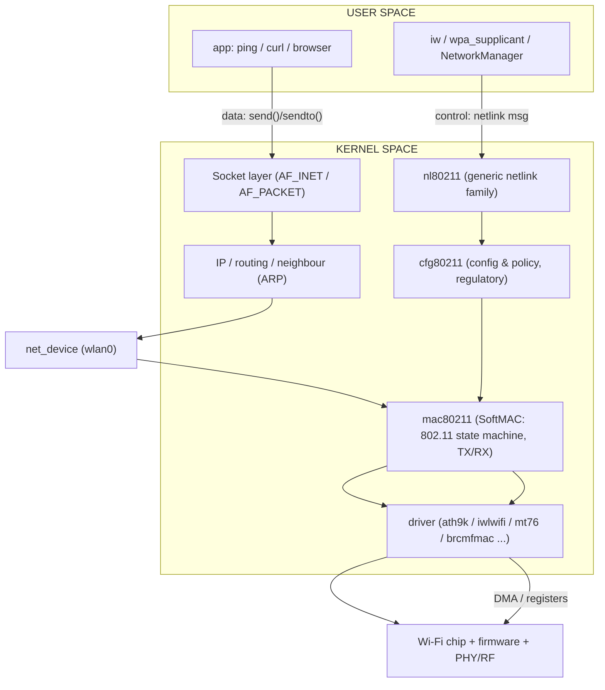
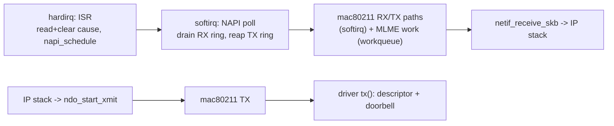
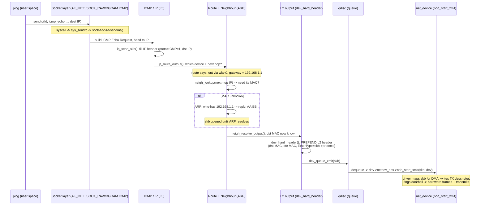
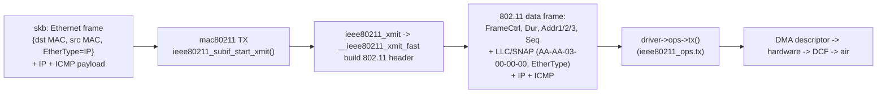
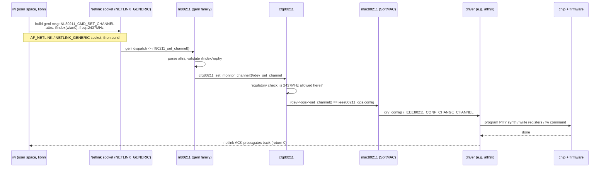
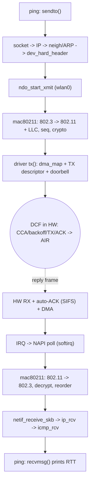
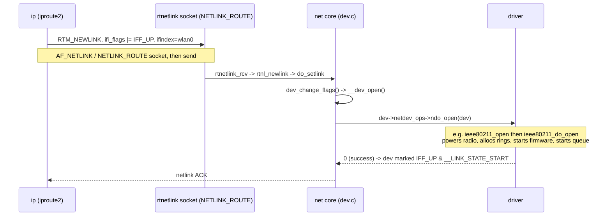
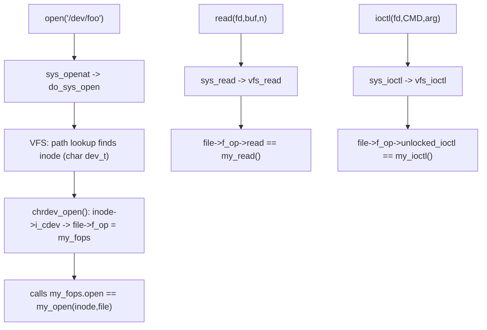
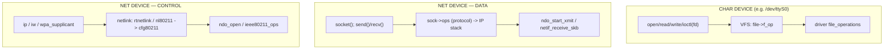
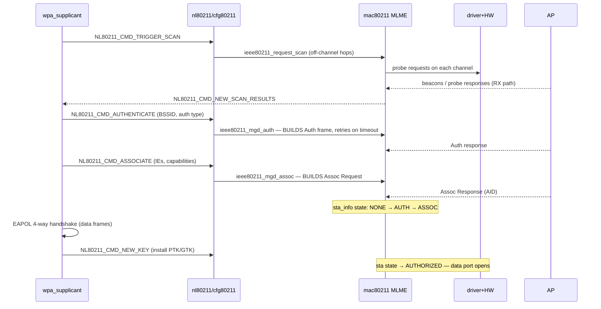

# 🐧 Linux Wi-Fi Networking — Interview Deep Dive

### Data-Path Hand-over (L3 → L2), Control vs Data Command Flows, and User-Space → Kernel-Driver Plumbing

> **Why this document exists.** It targets three specific gaps raised in a Cisco interview:
> 1. **L3 → L2 hand-over** — what *actually* happens to a `ping` (ICMP) packet as it crosses from the IP layer to the link layer, and how L2 decides what frame to build.
> 2. **Linux platform flows** — a complete, end-to-end trace for **one control command** and **one data command**, named function by named function.
> 3. **User-space → kernel driver** — how a user-space request ("turn on Wi-Fi") reaches the driver, and exactly how `open`/`close`/`read`/`write`/`ioctl`/`socket` are wired to driver entry points.
>
> It is the **Linux counterpart** to the FreeRTOS/ESP32 SoftMAC reference guide — and as of this revision it mirrors that document **part by part**: driver internals & execution flow (Part 2 ↔ ref Part 1), connection/DHCP/AP-beaconing state machines (Part 6 ↔ ref Part 2), and MAC timing & coexistence (Part 7 ↔ ref §1.5 + Part 3) — expressed in the **Linux kernel** networking and driver model (`socket` → `net_device` → `cfg80211`/`mac80211` → driver → firmware).

---

## 📑 Contents

> **Reading order is bottom-up:** the stack map first, then how a driver is built and runs, then the packet paths that use it, then the user-space plumbing, then the higher-level state machines, then timing/coexistence. The three Cisco interview gaps are Parts 3, 4, and 5.

**Part 1 — The Linux Network & Wi-Fi Stack (the map)**
- 1.1  Two completely different driver models: char-device vs network-device
- 1.2  The Linux Wi-Fi layering: nl80211 → cfg80211 → mac80211 → driver → firmware
- 1.3  SoftMAC vs FullMAC on Linux (where mac80211 fits)
- 1.4  The two key objects: `struct net_device` and `sk_buff` (skb)

**Part 2 — Linux Wi-Fi Driver Internals** *(mirrors the ESP32 reference doc's Part 1)*
- 2.1  Execution flow: module load → probe → live RX/TX rings
- 2.2  The "two-task split" on Linux: hardirq / NAPI softirq / process context
- 2.3  TX internals: descriptor rings, doorbell, reaping (vs the 5-slot pool)
- 2.4  RX internals: descriptor ring, refill, NAPI (vs the 10-buffer chain)
- 2.5  Hardware filtering & auto-ACK: `configure_filter` (vs register slots)
- 2.6  Block-by-block: every Linux layer's job on TX and RX

**Part 3 — The Data Path: L3 → L2 Hand-over, traced with `ping`** *(🎯 Cisco Gap #1)*
- 3.1  The misconception, stated and corrected
- 3.2  Step-by-step: from `ping` syscall to bytes on the wire
- 3.3  How L2 decides *what* frame to build (EtherType + neighbour/ARP)
- 3.4  Where 802.3 (Ethernet) becomes 802.11 (mac80211 encapsulation)
- 3.5  The skb as the universal carrier

**Part 4 — Control & Data Command Flows, end to end** *(🎯 Cisco Gap #2)*
- 4.1  Control plane vs data plane (why they are separate)
- 4.2  CONTROL command walkthrough: `iw dev wlan0 set channel 6`
- 4.3  CONTROL command (richer): `wpa_supplicant` connect/associate
- 4.4  DATA command walkthrough: a `ping` packet to the air and back

**Part 5 — User-Space → Kernel-Space Driver Plumbing** *(🎯 Cisco Gap #3)*
- 5.1  "Turn on Wi-Fi": the three real paths (`ip link up`, `rfkill`, nl80211)
- 5.2  The VFS model: how `open/read/write/ioctl` reach a *char* driver
- 5.3  The network model: how `socket()` and `ip link` reach a *net* driver
- 5.4  Side-by-side: file-ops vs net-device-ops vs netlink

**Part 6 — Connection State Machine, DHCP & AP Beaconing** *(mirrors reference Part 2)*
- 6.1  Station connection: the mac80211 MLME state machine
- 6.2  DHCP hand-over: "L2 done, L3 begins" on Linux
- 6.3  AP mode: hostapd, beacon offload + TSF stamping, intra-BSS fast path

**Part 7 — MAC Timing & Coexistence** *(mirrors reference §1.5 + Part 3)*
- 7.1  DCF/SIFS/CW/backoff/CCA/TSF: what Linux configures vs what silicon runs
- 7.2  Bluetooth–Wi-Fi coexistence: PTA on Linux vs the ESP32 software TDM

**Appendix A — Rapid-fire answers to the exact questions asked** *(+ ESP32↔Linux mapping table)*

---

# Part 1 — The Linux Network & Wi-Fi Stack (the map)

Before tracing any packet, you need the map. The single most important thing to internalise — and the thing that makes interviewers nod — is that **Linux has two different driver models**, and Wi-Fi touches **both**.

## 1.1  Two completely different driver models

| | **Character / block device** | **Network device** |
|---|---|---|
| Appears as | a file in `/dev` (e.g. `/dev/ttyS0`) | **not** a file — an interface like `wlan0` |
| User opens it via | `open("/dev/...")` → fd | `socket()` → fd (and `ip`/`iw` via netlink) |
| Entry points | `struct file_operations`: `.open .read .write .unlocked_ioctl .release` | `struct net_device_ops`: `.ndo_open .ndo_stop .ndo_start_xmit` |
| Data movement | `read()`/`write()` copy bytes to/from the fd | packets flow as **`sk_buff`s**, not via `read/write` on the iface |
| Examples | UART, GPIO, a custom char driver | `eth0`, `wlan0`, `lo` |

> 🔑 **This distinction is the answer to half of Gap #3.** People assume "a driver has `open/read/write`". That is true for a **char driver** (VFS `file_operations`). A **Wi-Fi interface is a network device** — you never `read()`/`write()` `wlan0`. Instead you `socket()`, and the kernel routes your packet to the device's `ndo_start_xmit()`. Control (turning it on, setting channel) goes over a **netlink socket** to `cfg80211`, not through `ioctl` on a `/dev` node. Both models are covered in Part 5.

## 1.2  The Linux Wi-Fi control layering



The split to remember:
- **Control plane (left-to-right top):** user tool → **netlink** → `nl80211` → `cfg80211` → `mac80211` (or a FullMAC driver) → driver → firmware. This configures the device (scan, connect, set channel, key install, turn radio on/off).
- **Data plane (the packet path):** `socket()` → IP stack → `net_device` (`wlan0`) → `mac80211` TX → driver `xmit` → DMA → air. This carries your actual `ping`/TCP/UDP bytes.

These planes are **deliberately separate** (Part 4.1 explains why). Mixing them up is the classic interview stumble.

## 1.3  SoftMAC vs FullMAC on Linux

Same dichotomy as the ESP32 guide, expressed in Linux components:

| | **SoftMAC** | **FullMAC** |
|---|---|---|
| Who runs the 802.11 MAC state machine (auth/assoc, sequencing, retries policy) | **`mac80211`** (kernel software) | the **chip firmware** |
| Linux module in the middle | `cfg80211` + **`mac80211`** + thin driver | `cfg80211` + a driver that talks to firmware (no `mac80211`) |
| Driver examples | `ath9k`, `ath5k`, `mt76`, `rtl8xxxu`, `b43` | `brcmfmac` (Broadcom), most mobile/SDIO combos, `mwifiex` |
| Where DCF/SIFS/backoff/ACK live | **always hardware** (too fast for software) | hardware |
| What the host CPU does | builds/parses management frames, runs the MAC SM, manages queues | sends high-level commands ("connect to SSID X"); firmware does the rest |

> 🔑 **Interview framing:** "Linux Wi-Fi is `cfg80211` for everyone, plus **`mac80211` only for SoftMAC** parts. FullMAC drivers register with `cfg80211` directly and push the MAC into firmware. Either way the **microsecond-timed DCF (CCA, SIFS, backoff, ACK) is in silicon** — the SoftMAC/FullMAC line is only about where the *millisecond* MAC management lives." This is the exact same "microseconds = silicon, milliseconds = software" boundary from the ESP32 guide.

## 1.4  The two objects you must be able to name

Almost every answer below pivots on these two structures:

**`struct net_device`** — the kernel's representation of an interface (`wlan0`). It holds the MAC address, MTU, state flags, and crucially a pointer to **`netdev_ops`** (`struct net_device_ops`), whose function pointers are the driver's entry points:

```c
struct net_device_ops {
    int  (*ndo_open)(struct net_device *dev);          // 'ip link set wlan0 up'
    int  (*ndo_stop)(struct net_device *dev);          // 'ip link set wlan0 down'
    netdev_tx_t (*ndo_start_xmit)(struct sk_buff *skb, // TX a packet
                                  struct net_device *dev);
    void (*ndo_set_rx_mode)(struct net_device *dev);   // multicast/promisc
    int  (*ndo_set_mac_address)(struct net_device *dev, void *addr);
    /* ... */
};
```

**`struct sk_buff` (the "skb")** — the universal packet buffer. One skb travels the *entire* stack; each layer adjusts pointers rather than copying. Key fields:

```c
struct sk_buff {
    /* layout: [ headroom ][ data ........... ][ tailroom ] */
    unsigned char *head, *data, *tail, *end;  // buffer + current cursor
    __be16  protocol;        // L3 type as seen by L2  (e.g. ETH_P_IP, ETH_P_ARP)
    struct net_device *dev;  // which interface
    /* header offsets, set as the packet is built/parsed */
    __u16 transport_header;  // -> TCP/UDP/ICMP
    __u16 network_header;    // -> IP
    __u16 mac_header;        // -> Ethernet/802.11
    /* helpers: skb_push() grows toward head (prepend header),
                skb_pull() shrinks from data (strip header)   */
};
```

> 🔑 The whole TX story is *"prepend headers with `skb_push()` as you go down; strip them with `skb_pull()` as you go up."* No payload copy between layers — only pointer math. This is the Linux analogue of the ESP32 "smart frame".

---

# Part 2 — Linux Wi-Fi Driver Internals

> *Mirrors the ESP32 reference doc's Part 1. Read this before the packet traces — Parts 3–5 lean on the rings, NAPI, and `ndo_*` callbacks introduced here.*

The ESP32 reference covered boot order, the two-task split, the register-level TX/RX pipe, and the smart-frame pool. This part gives the **Linux counterpart of each**, using a SoftMAC PCI driver (`ath9k`-style) as the concrete example.

## 2.1  Execution flow — module load to live RX/TX rings

The Linux equivalent of the ESP32 `app_main()` boot order is the **driver probe sequence**. Same idea: a strict ordering where each step depends on the previous one.

```text
DRIVER LOAD / PROBE (mirror of ESP32 boot order)            rationale
──────────────────────────────────────────────────────────  ────────────────────────────
1  module_init -> pci_register_driver(&ath9k_pci_driver)    register with the bus
2  .probe() called when device matches (vendor/device id)   bus found our chip
3  pci_enable_device / request mem region / ioremap BAR     map chip registers (the
                                                            Linux 'MMIO @ 0x3ff73000')
4  hw = ieee80211_alloc_hw(sizeof(priv), &ath9k_ops)        allocate mac80211 context +
                                                            driver private area
5  init hardware: reset chip, load EEPROM/calibration,      = ESP32 hwinit(): PHY cal,
   read MAC address, init PHY                               channel/RF bring-up
6  set wiphy capabilities: bands, channels, HT/VHT caps,    what cfg80211 will allow
   interface modes (STA/AP/monitor)
7  allocate TX queues + RX descriptor ring, DMA-coherent    = setup_rx_chain() 10×1600B
   memory (dma_alloc_coherent)
8  request_irq(ath9k_isr)                                   = setup_interrupt() WMAC ISR
9  ieee80211_register_hw(hw)                                creates wiphy + wlan0 netdev;
                                                            nl80211/cfg80211 now reachable
10 user: 'ip link set wlan0 up' -> ndo_open ->              radio on, queues started,
   ieee80211_do_open -> drv_start()                         interrupts enabled — LIVE
```

> 🔑 **Interview parallel:** the ESP32 boot had a fragile order (NVS → event loop → BLE → Wi-Fi `hwinit`) because of shared-PHY last-writer-wins. Linux probe has the same flavour of ordering constraints: registers must be mapped before the chip is touched, calibration before `register_hw`, IRQ before the rings are armed — get it wrong and you get the same class of "works sometimes" bugs.

## 2.2  The "two-task split" on Linux — IRQ, softirq, and process context

The ESP32 build split work between a **hardware task (prio 23)** owning registers and a **MAC task (prio 22)** owning policy, decoupled by queues. Linux has the *same decomposition*, but expressed in **execution contexts** rather than FreeRTOS tasks:

| ESP32 (reference doc) | Linux equivalent | What runs there |
|---|---|---|
| WMAC ISR (IRAM, tiny) | **hardirq** — driver ISR (`ath9k_isr`) | read+clear INT_STATUS, `napi_schedule()` / tasklet; nothing else |
| hardware task (prio 23) | **softirq** — NAPI `poll()`, TX tasklet | walk RX ring, reap TX descriptors, refill buffers |
| MAC task (prio 22, "802.11 brain") | **mac80211** code (softirq for data; **workqueues/process context** for MLME) | parse frames, run state machine, build mgmt frames |
| `hardware_event_queue` / `rust_mac_event_queue` | skb queues, `local->workqueue`, NAPI budget | decoupling so ISR-rate events never stall policy |
| counting semaphores (10 RX / 10 TX) as backpressure | NAPI **budget** (64/poll), `netif_stop_queue`/`netif_wake_queue` | bound in-flight work; stop upper layers when rings are full |



> 🔑 **The invariant is identical on both platforms:** the interrupt context does the minimum (acknowledge + schedule); a deferred context does the heavy lifting; queues/budgets provide backpressure so a packet flood can't starve the system. On ESP32 that was FreeRTOS queues + counting semaphores; on Linux it is NAPI + queue stop/wake.

## 2.3  TX internals — descriptor rings instead of five slots

The ESP32 had **5 hardware TX slots**; you wrote PLCP0/1/2 + TX_CONFIG per slot and set a GO bit. A Linux PCI driver does the same dance with a **TX descriptor ring** per hardware queue:

```text
TX choreography (ath9k-style)                ESP32 equivalent
───────────────────────────────────────────  ─────────────────────────────
1 mac80211 calls ops->tx(hw, control, skb)   rs_tx_smart_frame()
2 driver picks the hardware txq (by AC/TID)  find free slot in tx_slots[5]
3 dma_map_single(skb->data, len, TO_DEVICE)  (frame already in DMA-able RAM)
4 fill TX descriptor: buffer addr, length,   write MAC_TX_PLCP1 (len/rate),
  rate table / retry series, flags,           MAC_TX_PLCP2, TX_CONFIG
  encryption key index
5 link descriptor into the ring; write the   PLCP0 = descriptor | 0xC0000000
  ring tail pointer / doorbell register       (the GO bit)
  (e.g. TXDP)                                
6 HARDWARE OWNS IT: DCF (CCA, DIFS, random   identical — silicon runs the
  backoff), transmit, SIFS-bounded ACK wait,  microsecond MAC
  hardware retries with rate fallback
7 TX-done IRQ -> reap descriptor ->          TXQ_COMPLETE bit -> processTxComplete
  ieee80211_tx_status(skb)  (reports          -> c_recycle_tx_smart_frame()
  success/retries to mac80211 rate control)
8 dma_unmap + dev_kfree_skb (buffer freed)   smart frame returned to pool of 5
```

**Buffer management — the philosophical difference worth stating:**
- **ESP32:** a **fixed pool of 5 smart frames**, allocated once, recycled forever → zero allocation on the hot path, but a hard ceiling of 5 in-flight frames and a 50 ms stale-slot sweep as the safety net.
- **Linux:** an **skb per packet** from the slab allocator (plus page pools on modern drivers), with rings of 512+ descriptors → effectively unbounded in-flight frames, no sweep needed; backpressure is `netif_stop_queue()` when the ring fills, `netif_wake_queue()` on reap.

> 🔑 **Interview hook:** "Both designs avoid allocation *stalls* on the TX path — ESP32 by pre-allocating a pool, Linux by making allocation O(1) via slab/per-CPU caches and bounding the ring. The ESP32's 50 ms stale sweep exists *because* the pool is tiny; Linux's equivalent pathology is a stuck queue, surfaced by the **netdev watchdog** (`NETDEV WATCHDOG: wlan0 transmit queue timed out`) — same failure class, same 'did TX-complete ever fire?' debugging."

## 2.4  RX internals — the descriptor ring and NAPI hand-off

Mirror of the ESP32's 10-buffer RX chain (`setup_rx_chain`, `has_data`, reload bit):

```text
RX flow (ath9k-style)                        ESP32 equivalent
───────────────────────────────────────────  ─────────────────────────────
SETUP: alloc N skbs (e.g. 512), dma_map      setup_rx_chain(): 10 × 1600B
  each, write into RX descriptors linked      dma_list_item descriptors,
  in a ring; write ring head to RXDP reg      WIFI_BASE_RX_DSCR register
RX:   hardware filter accepts frame,         filter slot match -> auto-ACK
      AUTO-ACKs within SIFS (silicon),        (SIFS) in silicon
      DMAs frame into next free buffer,      PHY fills buffer, sets has_data
      marks descriptor done, raises IRQ      raises WMAC interrupt
IRQ:  ISR -> napi_schedule()                 ISR -> post RX_ENTRY
POLL: NAPI poll(): for each done desc:       hardware task handle_rx_messages:
        dma_unmap, detach skb                  unlink filled descriptor
        read RX STATUS into                    parse wifi_pkt_rx_ctrl_openmac_t
          ieee80211_rx_status (RSSI, rate,     (rssi, rate, sig_len,
          channel, flags)                       filter_match)
        ieee80211_rx_napi(hw, skb)             c_hand_rx_to_mac_stack()
        REFILL: alloc fresh skb, dma_map,      rs_recycle_dma_item(): relink
          relink descriptor at tail            at tail, MAC_BITMASK_084 |= 1
                                               (hardware reload handshake)
```

> 🔑 The **RX metadata** parallel is exact: the ESP32's reverse-engineered `wifi_pkt_rx_ctrl_openmac_t` header (RSSI, PHY rate, length, `filter_match`) is the Linux **`struct ieee80211_rx_status`** the driver fills before `ieee80211_rx()` — same information, needed for the same reasons (rate control feedback, signal reporting, demultiplexing).

## 2.5  Hardware filtering & auto-ACK — `configure_filter` instead of register slots

The ESP32 section 1.3.4 is one of the best interview stories — and it maps 1:1 onto Linux:

- **Why hardware filtering exists (identical answer):** auto-ACK has a **SIFS deadline (~10 µs)**. Software can classify frames but can never ACK in time; only the hardware address filter can decide "this is mine" and emit the ACK within SIFS. This is why promiscuous-and-filter-in-software is not a real design.
- **Linux mechanism:** the driver implements `ieee80211_ops.configure_filter()` and (for STA/AP roles) programs the chip's **station/BSSID match registers** when mac80211 calls `bss_info_changed` / `sta_state`. Multicast lists arrive via `prepare_multicast`/`configure_filter` — the Linux version of the ESP32's **mask register** trick for accepting broadcast/multicast without burning an exact-match slot.
- **Monitor mode** is the deliberate exception: `iw dev mon0 set type monitor` asks the driver to open the filter (`FIF_OTHER_BSS`, etc.) — the Linux equivalent of the ESP32's early "promiscuous + software filter" phase, useful for sniffing precisely because it does **not** ACK anything.
- **Role presets:** the ESP32 had `scanning / client / ap_mode` filter presets. mac80211 does the same implicitly: scan temporarily widens the filter; association pins the BSSID; AP mode programs the chip's beacon/TSF machinery (next part).

## 2.6  Block-by-block — every Linux layer's job on TX and on RX

The Linux version of the reference doc's §1.6 table:

| Block | Role during TRANSMIT | Role during RECEIVE |
|---|---|---|
| **app / socket layer** | `sendto()` → builds L4 payload into an skb | `recvmsg()` returns payload queued on the socket |
| **IP + neighbour** | routing lookup → next-hop; ARP resolves next-hop MAC; IP header prepended | `ip_rcv` validates, routes to local delivery → `icmp_rcv`/TCP/UDP |
| **qdisc** | queues/schedules/shapes the skb (fq_codel etc.) | — |
| **`net_device` (wlan0)** | `ndo_start_xmit` entry into mac80211 | `netif_receive_skb` exit from mac80211 |
| **mac80211 TX/RX** | 802.3→802.11 + LLC/SNAP, sequence number, QoS TID, encryption; `drv_tx()` | decrypt, BA reorder, de-aggregate, 802.11→802.3, fill `skb->protocol` |
| **mac80211 MLME** | builds Auth/Assoc/Deauth mgmt frames (SoftMAC) | parses beacons/probe/assoc responses; drives state machine |
| **driver** | dma_map, TX descriptor, doorbell; reap on TX-done IRQ; report status to rate control | ISR → NAPI poll; dma_unmap; fill `ieee80211_rx_status`; refill ring |
| **DMA rings** | hold in-flight TX descriptors | hold pre-mapped RX buffers the hardware fills |
| **hardware MAC** | **DCF: CCA, DIFS, backoff, transmit, SIFS ACK wait, retries** | address filter match, **auto-ACK within SIFS**, DMA to ring |
| **PHY/RF** | modulate at descriptor's rate, set TX power | AGC, demodulate, report RSSI/rate |

> 🔑 Sweep it like the ESP32 guide: *left-to-right on TX, right-to-left on RX, and the boundary never moves — microseconds are silicon, milliseconds are software.*

---

# Part 3 — The Data Path: L3 → L2 Hand-over, traced with `ping`

> 🎯 **Cisco interview Gap #1.** What happens to a `ping`, what crosses to L2, and how L2 decides the frame type and address.

> **The exact interview question:** *"You run `ping`. What happens? What goes to L2 and how? How does L2 know what type of frame to create and what address to use, from the ICMP packet?"*

## 3.1  The misconception, stated and corrected

The trap in the question is the phrase **"from the ICMP packet."** It tempts you to say *"L2 looks inside the ICMP packet to decide what to build."* **That is wrong, and stating the correction is what scores the point:**

> ❌ **Myth:** L2 inspects ICMP/IP contents to choose the frame type and destination MAC.
>
> ✅ **Reality:** **L2 never looks at ICMP at all.** By the time the packet reaches L2 it is an opaque payload. Two pieces of metadata — decided *above* L2 — tell L2 everything it needs:
> 1. **`skb->protocol`** (the EtherType, e.g. `ETH_P_IP = 0x0800`) — set by the IP layer. This becomes the Type field of the L2 header. L2 copies it; it does not derive it.
> 2. **The next-hop L2 (MAC) address** — resolved by the **neighbour subsystem (ARP for IPv4 / ND for IPv6)**, *driven by the routing decision*, **not** by anything inside ICMP.

So the honest, precise answer is: *"L2 doesn't parse ICMP. The IP layer tags the skb with an EtherType and asks the neighbour layer to resolve the next-hop MAC; L2 just frames the bytes using those two values."*

## 3.2  Step-by-step: from `ping` to bytes on the wire



**Named-function call path (IPv4 ICMP, the version to recite):**

```text
USER:   ping  ->  sendto(2)
SYSCALL: __sys_sendto -> sock_sendmsg -> inet_sendmsg
L4/ICMP: raw_sendmsg (or ping_v4_sendmsg for unprivileged ping)
L3 IP:   ip_send_skb -> ip_local_out -> __ip_local_out -> ip_output
         ip_finish_output -> ip_finish_output2
NEIGH:   ip_finish_output2 calls neigh_output()
            -> if resolved: neigh_hh_output()/dev_queue_xmit
            -> if NOT resolved: neigh_resolve_output()
                 -> arp_solicit() sends ARP, skb queued on neigh->arp_queue
                 -> on ARP reply (arp_process -> neigh_update) the queued
                    skb is released and continues
L2 HDR:  dev_hard_header() -> dev->header_ops->create()
            (for Ethernet: eth_header() writes {dst,src,EtherType})
QDISC:   __dev_queue_xmit -> q->enqueue ... qdisc_run -> sch_direct_xmit
DEVICE:  netdev_start_xmit -> dev->netdev_ops->ndo_start_xmit(skb, dev)
```

> 📌 Everything from `ip_route_output` to `dev_hard_header` is the **L3→L2 hand-over**. The packet stops being "an IP datagram" and becomes "a framed link-layer unit" at `dev_hard_header()`.

## 3.3  How L2 decides *what* frame to build (the two inputs)

At `dev_hard_header()` the link layer needs exactly **three** things, and all three come from above L2 — never from ICMP:

| What L2 needs | Where it comes from | Set by |
|---|---|---|
| **EtherType** (frame's Type field) | `skb->protocol` | the socket/IP layer (`ETH_P_IP` for IPv4, `ETH_P_ARP` for ARP, `ETH_P_IPV6` for v6) |
| **Source MAC** | `dev->dev_addr` | the `net_device` (the interface's own address) |
| **Destination MAC** | the **neighbour entry** for the next hop | ARP/ND resolution, triggered by the **routing** decision |

The crucial causal chain for the destination MAC:

```text
dst IP (in ICMP/IP header)
   -> routing table picks NEXT-HOP IP (the host itself if on-link,
        otherwise the gateway) and the egress device (wlan0)
   -> neighbour table maps NEXT-HOP IP  ->  next-hop MAC  (via ARP)
   -> that MAC becomes the L2 destination address
```

> 🔑 **Answer to "how does L2 know the address from the ICMP packet?":** *It doesn't read the ICMP packet. The destination IP (from L3) drives a **routing lookup** to find the next hop, then the **neighbour/ARP** subsystem turns that next-hop IP into a MAC. L2 is handed the finished MAC. If the next hop is off-subnet, the MAC is the **gateway's**, not the ping target's — proof that L2 addressing is a routing/ARP outcome, not an ICMP field.*

> 🔑 **Answer to "what type of packet does L2 create?":** *L2 creates whatever `skb->protocol` says — `ETH_P_IP` here. The same L2 code would stamp `ETH_P_ARP` for an ARP frame or `ETH_P_IPV6` for v6. L2 is payload-agnostic; the EtherType is a label it copies, not a decision it makes.*

## 3.4  Where Ethernet becomes 802.11 (the Wi-Fi-specific twist)

On **wired** Ethernet, `dev_hard_header()` writes a 14-byte Ethernet header and you are done. On **Wi-Fi**, the device presents an **Ethernet-looking** `net_device` to the IP stack (so the whole path above is identical), but `mac80211` then **converts the 802.3 frame into an 802.11 frame** on the way down. This is the Linux equivalent of the ESP32 `encapsulate_and_send()`:



The conversion specifics (worth stating):
- The **802.3 header is replaced** by an **802.11 MAC header** (24–30 bytes): Frame Control, Duration, **Address 1/2/3** (BSSID/SA/DA depending on To-DS/From-DS), Sequence Control.
- The original EtherType is preserved inside an **LLC/SNAP** shim (`AA AA 03 00 00 00` + EtherType) that sits between the 802.11 header and the IP payload.
- The destination MAC resolved by ARP becomes one of **Addr1/Addr3** depending on direction (STA→AP uses To-DS: Addr1=BSSID, Addr3=real DA).
- From the IP stack's point of view none of this happened — it still thinks it handed an Ethernet frame to an Ethernet-like device. **mac80211 hides 802.11 behind an Ethernet façade.**

> 🔑 **Tie-back to ESP32:** in the open-MAC build, `encapsulate_and_send()` did exactly this (Eth → 802.11 + LLC/SNAP, set FromDS, fill Addr1/2/3). On Linux the same job is `mac80211`'s `ieee80211_xmit()` path. Same transformation, different layer owner.

## 3.5  The skb as the universal carrier

Throughout the entire path **one `sk_buff` is reused**; each layer prepends its header into the pre-reserved headroom:

```text
TX (going down — each layer skb_push()es its header):

  ping payload
  + ICMP header        <- L4 (icmp_push_reply / raw)
  + IP header          <- L3 (ip_build_and_send / ip_finish_output)
  + 802.11 + LLC/SNAP  <- mac80211 (replaces the Ethernet header)
  ---------------------------------------------
  = the bytes DMA'd to the chip

RX (going up — each layer skb_pull()s its header):

  hardware DMAs frame into an skb
  - strip 802.11 + LLC/SNAP   -> mac80211 hands an 802.3 skb up (netif_rx/NAPI)
  - strip Ethernet, set skb->protocol -> __netif_receive_skb -> ip_rcv
  - strip IP                  -> icmp_rcv
  - ICMP Echo Reply matched   -> delivered to ping's socket
```

> 🔑 The reason the stack is fast is that this is **all pointer arithmetic on one buffer** — `skb_reserve()` makes headroom up front, `skb_push()`/`skb_pull()` move the `data` pointer. No per-layer `memcpy` of the payload. (Contrast: the ESP32 prototype *did* copy the Ethernet frame into a fresh malloc buffer in `c_transmit_data_frame()` — a deliberate prototype simplification; production Linux is zero-copy here.)

---

# Part 4 — Control & Data Command Flows, end to end

> 🎯 **Cisco interview Gap #2.** A complete Linux-platform trace for one control command and one data command.

> **The exact interview ask:** *"Give me a complete flow for one control command and one data command — Linux platform-wise."*

## 4.1  Control plane vs data plane — and why they are separate

| | **Control plane** | **Data plane** |
|---|---|---|
| Purpose | configure the device: scan, connect, set channel, install keys, up/down | move packets: your `ping`, TCP, UDP traffic |
| User entry | `iw`, `wpa_supplicant`, `NetworkManager` | `socket()` + `send()/recv()` (any app) |
| Kernel transport | **netlink** socket → `nl80211` (generic netlink family) | the **IP stack** → `net_device` |
| Kernel path | `nl80211` → `cfg80211` → `mac80211`/driver `ops` | socket → IP → `mac80211` TX → driver `tx()` |
| Frequency | rare, human/daemon-driven (per second/minute) | hot path, millions of packets/sec |
| Latency budget | milliseconds is fine | per-packet, must not stall |

> 🔑 They are separate so the **hot data path never blocks on slow configuration**, and so policy/regulatory checks (`cfg80211` enforces the regulatory domain, valid channels, etc.) live in one place. Same principle as the ESP32 guide's two-task split — config and packet-pumping are decoupled.

---

## 4.2  CONTROL command walkthrough — `iw dev wlan0 set channel 6`

A small, self-contained control command makes the whole chain visible.



**Named-function call path:**

```text
USER:    iw dev wlan0 set channel 6
LIB:     libnl builds a Generic Netlink message:
            family=nl80211, cmd=NL80211_CMD_SET_CHANNEL,
            NL80211_ATTR_IFINDEX, NL80211_ATTR_WIPHY_FREQ=2437
SYSCALL: sendmsg() on an AF_NETLINK / NETLINK_GENERIC socket
KERNEL:  netlink_rcv -> genl_rcv -> genl_family_rcv_msg
            -> nl80211 doit handler: nl80211_set_channel()
CFG80211: cfg80211_set_monitor_channel() / nl80211_parse_chandef()
            -> regulatory_check (channel legal in current reg domain?)
            -> rdev_set_channel() -> rdev->ops->set_channel()
MAC80211: for SoftMAC, ops map into mac80211:
            ieee80211_set_channel -> ieee80211_hw_config()
            -> drv_config(local, IEEE80211_CONF_CHANGE_CHANNEL)
DRIVER:  local->ops->config()  e.g. ath9k_config()
            -> ath9k_set_channel() -> ath9k_hw_reset() programs PHY/synth
HARDWARE: PLL/synth retuned to 2437 MHz (channel 6)
RETURN:  0 propagates up; netlink ACK to iw
```

> 🔑 The shape to memorise: **`iw`/`wpa_supplicant` → netlink → `nl80211` → `cfg80211` (policy/regulatory) → `mac80211` (`ieee80211_ops`) → driver `ops` → firmware/registers.** Every control command (scan, connect, set-key, set-power, set-channel) follows this spine; only the `NL80211_CMD_*` and the `ops` callback change.

---

## 4.3  CONTROL command (richer) — associating to an AP via `wpa_supplicant`

`set channel` is one hop; **connect** exercises the whole control plane and shows where the 802.11 management frames are built.

```text
USER:     wpa_supplicant (or 'iw dev wlan0 connect SSID')
NL80211:  NL80211_CMD_TRIGGER_SCAN  -> driver scans, results via
          NL80211_CMD_NEW_SCAN_RESULTS (cfg80211_scan_done)
          NL80211_CMD_AUTHENTICATE   -> nl80211_authenticate()
          NL80211_CMD_ASSOCIATE      -> nl80211_associate()
CFG80211: cfg80211 sanity + regulatory; calls rdev->ops->{auth,assoc}
MAC80211: ieee80211_mgd_auth() / ieee80211_mgd_assoc()
            -> BUILDS the 802.11 Authentication / Association Request
               MANAGEMENT frames in software (this is the SoftMAC job)
            -> ieee80211_tx_skb() -> driver tx() to put mgmt frame on air
DRIVER:   ieee80211_ops.tx() -> DMA the mgmt frame; HW does DCF/ACK
HW:       auth/assoc exchange on air; AP replies
UP:       responses RX'd -> mac80211 parses -> cfg80211_rx_assoc_resp()
            -> NL80211_CMD_CONNECT result back to wpa_supplicant
THEN:     EAPOL 4-way handshake (wpa_supplicant in user space) over the
          DATA path as normal data frames; keys installed via
          NL80211_CMD_NEW_KEY -> rdev->ops->add_key -> drv set_key()
```

> 🔑 Two facts that impress here: (1) for **SoftMAC**, the **management frames (Auth/Assoc) are constructed by `mac80211` in the kernel**, not the firmware — exactly like the ESP32 `build_authentication_frame()`/`build_association_request()`. (2) The **EAPOL 4-way handshake runs in user space (`wpa_supplicant`)** and travels as ordinary **data frames** — control plane sets up the link, then a data-plane exchange establishes keys, which are pushed back down via `NL80211_CMD_NEW_KEY`.

---

## 4.4  DATA command walkthrough — a `ping` packet to the air and back

This is the data-plane counterpart and it stitches the L3→L2 hand-over (Part 3) to the driver/hardware internals (Part 2).

### TX (down the stack)

```text
USER:    ping -> sendto()                              [user space]
SOCKET:  __sys_sendto -> sock_sendmsg -> inet_sendmsg
L4/ICMP: raw_sendmsg / ping_v4_sendmsg  (build ICMP echo)
L3 IP:   ip_send_skb -> ip_output -> ip_finish_output2
NEIGH:   neigh_output -> (ARP if needed) -> dst MAC resolved
L2:      dev_hard_header() writes Ethernet-style header
QDISC:   __dev_queue_xmit -> qdisc enqueue -> qdisc_run
NETDEV:  netdev_start_xmit -> ndo_start_xmit
            For a Wi-Fi netif this enters mac80211:
MAC80211: ieee80211_subif_start_xmit()
            -> ieee80211_xmit() : 802.3 -> 802.11 + LLC/SNAP (see 2.4)
            -> sequence number, QoS TID, encryption (if keyed)
            -> ieee80211_tx_frags() -> drv_tx()
DRIVER:  ieee80211_ops.tx(hw, control, skb)  e.g. ath9k_tx()
            -> dma_map_single(skb->data)  (get bus address)
            -> build TX descriptor: buf addr, len, rate, flags
            -> push to TX DMA ring; write 'TX DP'/doorbell register
HW/PHY:  DMA reads the frame; MAC does DCF (CCA, DIFS, backoff),
         transmits at chosen rate, awaits 802.11 ACK (all in silicon)
IRQ:     TX-done interrupt -> driver reaps descriptor ->
         ieee80211_tx_status() -> dev_kfree_skb() (skb freed)
```

### RX (up the stack)

```text
HW:      frame arrives; PHY demod; MAC checks addr filter, AUTO-ACKs
         (SIFS, hardware); DMAs frame into an RX buffer/descriptor
IRQ:     RX interrupt -> driver ISR (top half) just schedules NAPI
NAPI:    driver->poll() (e.g. ath9k_rx_tasklet/napi) runs in softirq:
            for each RX descriptor with data:
              build/refill skb, dma_unmap, set skb->dev = wlan0
              ieee80211_rx() / ieee80211_rx_napi()
MAC80211: parse 802.11 header, decrypt, reorder (BA), de-aggregate,
          strip 802.11 + LLC/SNAP -> 802.3 skb, set skb->protocol
            -> netif_receive_skb() / napi_gro_receive()
L3 IP:   __netif_receive_skb_core -> ip_rcv -> ip_local_deliver
L4/ICMP: icmp_rcv : Echo Reply matched to the ping socket
USER:    recvmsg() in ping returns; round-trip time printed
```



> 🔑 **NAPI is the Linux answer to "don't drown in interrupts."** The hardware RX interrupt does almost nothing — it **schedules NAPI** and the actual receive processing runs in a **softirq poll loop**, draining many frames per interrupt. This is precisely the ESP32 guide's **top-half / bottom-half** split (tiny ISR posts an event; a deferred context does the real work), implemented with NAPI instead of a FreeRTOS queue.

> 🔑 **Where DCF lives (unchanged from the ESP32 story):** the driver's job ends at "build descriptor + ring doorbell." **CCA, DIFS, random backoff, the transmit, and the SIFS-bounded ACK are all in the chip.** Linux never runs the microsecond MAC timing — same boundary, different OS.

---

# Part 5 — User-Space → Kernel-Space Driver Plumbing

> 🎯 **Cisco interview Gap #3.** How a user-space request reaches the driver, and how `open/read/write/ioctl/socket` map to driver entry points.

> **The exact question that caught you off guard:** *"How does a user-space request to turn on Wi-Fi get passed to the kernel-space driver? How does the kernel do this? How are the driver's `open`/`close`/`read`/`write` linked to the user-space system call / file / socket?"*

The honest expert answer has **two halves**, because Linux has **two driver entry models** (recall Part 1.1). The interviewer's mention of `open/read/write` is the **char-device (VFS) model**; "Wi-Fi" and "socket" is the **network-device model**. You score by explaining both and saying which one Wi-Fi actually uses.

## 5.1  "Turn on Wi-Fi" — the three real paths

"Turn on Wi-Fi" is ambiguous; name the three things it can mean and the path each takes:

| User action | Mechanism | Reaches driver via |
|---|---|---|
| `ip link set wlan0 up` | netlink **RTM_NEWLINK** (rtnetlink) → `net_device` | **`ndo_open()`** |
| Toggle the radio kill-switch (airplane mode) | **rfkill** subsystem (`/dev/rfkill`, sysfs) | driver `rfkill` ops / `wiphy` |
| NetworkManager "enable Wi-Fi" / connect | **nl80211** netlink → `cfg80211` | `cfg80211`/`mac80211` → driver `ops` |

The cleanest one to trace is `ip link set wlan0 up`:



```text
USER:   ip link set wlan0 up
LIB:    iproute2 builds RTM_NEWLINK with IFF_UP over NETLINK_ROUTE
KERNEL: rtnetlink_rcv_msg -> rtnl_newlink/rtnl_setlink -> do_setlink
        -> dev_change_flags(dev, flags|IFF_UP)
        -> __dev_open(dev):
              if (netdev_ops->ndo_validate_addr) ...
              netdev_ops->ndo_open(dev);   <=== DRIVER ENTRY POINT
              set bit __LINK_STATE_START; netif_start_queue()
WIFI:   for mac80211 ifaces ndo_open == ieee80211_open
            -> ieee80211_do_open(): add interface, drv_start() if first,
               power up radio, start RX, begin allowing TX
RESULT: wlan0 is administratively UP; data path can now run
```

## 5.2  The VFS model — how `open/read/write/ioctl` reach a *char* driver

This is the model the interviewer's wording (`open/read/write`) refers to. It is how **character devices** (UART, GPIO, a custom driver exposing `/dev/foo`) work — and it's the right thing to explain to show you understand the file abstraction, *before* clarifying that Wi-Fi differs.

**Registration:** a char driver fills a `struct file_operations` and binds it to a device number:

```c
static const struct file_operations my_fops = {
    .owner          = THIS_MODULE,
    .open           = my_open,     // <- userspace open("/dev/foo")
    .release        = my_release,  // <- userspace close(fd)
    .read           = my_read,     // <- userspace read(fd, ...)
    .write          = my_write,    // <- userspace write(fd, ...)
    .unlocked_ioctl = my_ioctl,    // <- userspace ioctl(fd, CMD, arg)
};
/* register: register_chrdev() or cdev_add() ties a dev_t -> my_fops */
```

**The linkage, syscall by syscall:**



```text
open("/dev/foo")  -> sys_openat -> do_sys_openat2 -> do_filp_open
                  -> VFS resolves the inode; sees S_ISCHR (char device)
                  -> chrdev_open(): looks up the cdev by major/minor,
                     sets file->f_op = driver's file_operations,
                     then calls f_op->open()  ===> my_open()
read(fd,...)      -> sys_read -> ksys_read -> vfs_read -> f_op->read  ===> my_read()
write(fd,...)     -> sys_write -> vfs_write -> f_op->write           ===> my_write()
ioctl(fd,CMD,..)  -> sys_ioctl -> vfs_ioctl -> f_op->unlocked_ioctl  ===> my_ioctl()
close(fd)         -> __close_fd -> filp_close -> f_op->release        ===> my_release()
```

> 🔑 **The one-sentence mechanism:** *the kernel `struct file` for an open fd has an `f_op` pointer; every `read/write/ioctl/close` syscall is a thin VFS wrapper that dereferences `file->f_op->{read,write,...}` and calls the driver's function.* That pointer was installed at `open()` time from the device's registered `file_operations`. **This is the universal "syscall → driver function" bridge for char/block devices.**

## 5.3  The network model — how `socket()` and `ip link` reach a *net* driver

**Wi-Fi does not use the file model above.** `wlan0` has no `/dev/wlan0`; you never `read()`/`write()` it. Instead there are **two distinct user→kernel→driver bridges**:

**(a) Data: `socket()` → protocol ops → `net_device` ndo_***

```text
socket(AF_INET, SOCK_DGRAM, 0)
   -> sys_socket -> sock_create -> inet_create
   -> file->f_op = &socket_file_ops   (a socket IS an fd, but its f_op
        routes to the protocol, not to a device)
send()/sendto()
   -> sys_sendto -> sock_sendmsg -> sock->ops->sendmsg (inet_sendmsg)
   -> ... IP stack ... -> dev_queue_xmit
   -> dev->netdev_ops->ndo_start_xmit(skb, dev)   <=== DRIVER TX ENTRY
recv()/recvfrom()
   -> data arrives via NAPI -> netif_receive_skb -> IP -> socket queue
   -> sock->ops->recvmsg returns it to userspace
```

So a socket fd's `read/write` (yes, you *can* `read()`/`write()` a socket) are routed by `socket_file_ops` to `sock_read_iter`/`sock_write_iter` → `sock->ops` (the **protocol**), **never** to a device's `read`. The device is reached only through the **IP stack → `ndo_start_xmit`**, and inbound through **NAPI → `netif_receive_skb`**. There is no `ndo_read`/`ndo_write` — packets are pushed/pulled as skbs, not byte streams.

**(b) Control: `ip`/`iw`/`wpa_supplicant` → netlink socket → subsystem → driver ops**

```text
socket(AF_NETLINK, SOCK_RAW, NETLINK_ROUTE|NETLINK_GENERIC)
   -> a netlink socket; send() a structured message
RTM_NEWLINK (IFF_UP)  -> rtnetlink -> __dev_open -> ndo_open()   (4.1)
NL80211_CMD_*         -> genl -> nl80211 -> cfg80211 -> mac80211/driver ops (3.2)
```

> 🔑 **The crisp answer to the interviewer's question:** *"Turning on/controlling Wi-Fi does **not** go through a `/dev` file's `open/read/write`. A Wi-Fi interface is a **network device**, not a char device. Configuration (up, channel, connect, keys) travels over a **netlink socket** to rtnetlink/`nl80211` → `cfg80211` → `mac80211` → the driver's **`ndo_open`** and **`ieee80211_ops`** callbacks. Data travels via **`socket()` → IP stack → `ndo_start_xmit`**, with RX coming back through **NAPI → `netif_receive_skb`**. The classic `file->f_op->{open,read,write,ioctl}` bridge is the **char-device** model — correct for a UART or a custom `/dev` driver, but not how `wlan0` works."*

## 5.4  Side-by-side — the three bridges



| Aspect | Char driver | Net device (data) | Net device (control) |
|---|---|---|---|
| User fd from | `open("/dev/x")` | `socket()` | `socket(AF_NETLINK,..)` |
| Kernel dispatch table | `struct file_operations` | `struct proto_ops` + `struct net_device_ops` | `genl_ops`/rtnetlink + `cfg80211_ops`/`ieee80211_ops` |
| "open" maps to | `f_op->open` | `ndo_open` (via `ip link up`) | `ndo_open` / `cfg80211` start |
| "write/tx" maps to | `f_op->write` | `ndo_start_xmit` | n/a (config messages) |
| "read/rx" maps to | `f_op->read` | NAPI → `netif_receive_skb` | netlink reply/event |
| Used by Wi-Fi? | ❌ no `/dev/wlan0` | ✅ data path | ✅ control path |

> 🔑 If you remember one diagram from this whole document, make it this one. The interviewer's question conflated three bridges; naming all three and assigning Wi-Fi to the right two is the complete answer.

---


# Part 6 — Connection State Machine, DHCP & AP Beaconing

> *Mirrors the ESP32 reference doc's Part 2 — the higher-level flows built on Parts 2–5.*

## 6.1  Station connection — the MLME state machine

The ESP32 STA machine was `SCANNING → AUTHENTICATE → ASSOCIATE → ASSOCIATED` with 500 ms retries. On Linux the same machine lives in **mac80211's MLME** (`net/mac80211/mlme.c`), driven from user space by `wpa_supplicant`:



Parallels worth naming:
- **Who builds the management frames:** on ESP32, `build_authentication_frame()` / `build_association_request()` in the MAC task; on Linux, `ieee80211_mgd_auth()` / `ieee80211_mgd_assoc()` in mac80211. Same SoftMAC responsibility, same retry-on-timeout structure (mac80211 retries auth/assoc with timeouts just like the 500 ms ESP32 loop).
- **The gate:** ESP32 marked the netif up after assoc; Linux holds the **802.1X port closed** until the 4-way handshake completes — `sta_info` enters `AUTHORIZED` only after key install, and only then does mac80211 forward general data.

## 6.2  DHCP hand-over — the same "L2 done, L3 begins" moment

The reference doc's §2.1 swimlane (DHCP over the new link, lwIP advancing DISCOVER→ACK) maps to Linux as:

```text
link up + AUTHORIZED
   -> mac80211 sets netif_carrier_on(wlan0)
   -> udev/NetworkManager notice carrier; start DHCP client (udhcpc/dhclient)
DHCP DISCOVER:  client sends UDP 68->67 broadcast
   -> EXACTLY the data path of Part 4.4: socket -> IP (dst 255.255.255.255)
      -> dev_hard_header(dst MAC = ff:ff:ff:ff:ff:ff — no ARP needed for bcast)
      -> mac80211 -> driver -> air
DHCP OFFER/ACK: RX path up through mac80211 -> UDP socket of the client
CONFIGURE:      dhcp client installs the lease via rtnetlink:
                  RTM_NEWADDR  (IP address on wlan0)
                  RTM_NEWROUTE (default gateway)
                resolv.conf updated (DNS)
```

> 🔑 The interview phrasing: *"Association gives me an authorized L2 port and `netif_carrier_on`; DHCP is then just ordinary data-plane traffic — broadcast at L2, so no ARP — and the lease is installed back through **rtnetlink**, the same netlink family that turned the interface on. Control plane brings the link up; data plane fetches the address; control plane installs it."*

## 6.3  AP mode on Linux — hostapd, beacon offload, and the intra-BSS fast path

The ESP32 AP built its own beacon every 102.4 ms in the MAC task and let hardware stamp the TSF. Linux splits the same job three ways:

```text
hostapd (user space)        builds the BEACON TEMPLATE (SSID, rates, DS param,
                            TIM placeholder, RSN IEs) and runs ALL AP MLME:
                            it receives probe/auth/assoc requests as raw mgmt
                            frames over nl80211 and answers them — for AP mode,
                            even on SoftMAC, the MLME brain is hostapd, not the kernel
NL80211_CMD_START_AP   ->   cfg80211 -> mac80211: install template, beacon interval
                            (100 TU = 102.4 ms — the same canonical number)
mac80211 + driver           program the hardware beacon engine:
                            - drv sets up a TBTT timer / beacon queue
                            - hardware (or firmware) transmits the template every
                              TBTT and STAMPS THE LIVE TSF into the Timestamp field
                            - mac80211 updates the TIM bitmap per-beacon for
                              power-save clients (set when unicast is buffered)
```

> 🔑 **The TBTT jitter question, answered better than the prototype:** the ESP32 guide admits its beacon timer is a soft FreeRTOS sleep — interval jitters, only the TSF stamp is exact. Production Linux drivers fix exactly that: the **hardware TBTT timer** fires the pre-staged beacon with no CPU in the loop ("beacon offload"), and the TSF stamp is hardware in both designs. If asked "how would you productise the ESP32 beacon path?", the answer *is* the Linux design: pre-stage the template, arm a hardware TBTT timer, let software only update the TIM.

**Station-to-station forwarding** — the reference §2.2.2 contrast lands here:
- **ESP32 prototype:** every intra-BSS frame makes the **L2→L3→L2 round trip** through lwIP (one code path, double airtime + CPU).
- **Linux/mac80211:** implements the **L2 fast path** the reference calls "the production answer": in AP mode, mac80211's RX path checks whether the destination (Addr3) is an associated STA of the same BSS and, if so, **re-queues the frame down the TX path directly** (ToDS→FromDS rewrite) without entering the IP stack — including the two hard parts the reference names: **power-save buffering with TIM advertising** for dozing clients, and duplicating broadcast/multicast both to the air and up the local stack. (`ap_isolate` exists to deliberately disable this for guest networks.)

---

# Part 7 — MAC Timing & Coexistence

> *Mirrors the ESP32 reference doc's §1.5 and Part 3.*

## 7.1  DCF, SIFS/DIFS, CW, backoff, CCA, TSF — unchanged physics, same boundary

The protocol content of the reference §1.5 applies verbatim (it's 802.11, not platform-specific): CCA gates everything; SIFS (~10 µs) lets ACKs pre-empt; DIFS = SIFS + 2 slots for new contention; backoff drawn from CW which doubles per failure; the counter **freezes, never resets**, when the medium goes busy; TSF is the 64-bit µs clock the AP stamps into beacons.

What to add for Linux specifically:

- **Linux never executes any of it.** The kernel's role ends at "descriptor + doorbell." There is no code path in mac80211 or any driver that counts backoff slots or emits ACKs — by the time Linux schedules anything, microseconds have passed. (Same sentence as the ESP32 guide; it is the single most reusable line in the interview.)
- Where Linux *touches* the timing machinery: `ieee80211_ops.get_tsf/set_tsf` (read/adjust the hardware TSF), `conf_tx()` (program per-AC **EDCA parameters** — CWmin/CWmax/AIFS/TXOP into hardware registers — this is WMM/QoS), and beacon interval/DTIM via the AP template. Software *configures* the contention parameters; silicon *runs* them.
- **Retries and rate fallback** are hardware/firmware too: the TX descriptor carries a **rate series** (try rate A ×2, fall back to B ×2 ...); the TX-status the driver reaps tells mac80211's rate-control (minstrel) what actually happened. The ESP32 equivalent was the hardware retry with CW doubling reported via TXQ_COMPLETE.

## 7.2  Bluetooth–Wi-Fi coexistence — PTA on Linux, and the contrast that scores

The reference Part 3 story: ESP32 shares one 2.4 GHz radio between Wi-Fi and BLE; hardware **PTA** (REQUEST/PRIORITY/GRANT/STATUS arbitration) exists but the build disables it because the BLE blob starved Wi-Fi TX, substituting a **reactive software TDM** (3 × 50 ms TX timeouts → "BLE owns the radio" → stop advertising, rebuild PHY, 5 s Wi-Fi window).

The Linux landscape, for the same question:

| Aspect | ESP32 (reference) | Linux reality |
|---|---|---|
| Where PTA lives | on-die arbiter via `libcoexist.a` (disabled in the build) | **in the chip/firmware**, always — e.g. Intel `iwlwifi` BT-coex profiles, Broadcom/Cypress SECI, Realtek `btcoex` engines |
| Host involvement | the build's *software TDM watchdog* in the hardware task | **hints only**: drivers send coex *policies* to firmware (`ath9k` has 3-wire PTA GPIO support; `iwlwifi` sends BT-activity grading); the host never arbitrates per-event |
| Signals | REQUEST / PRIORITY / GRANT / STATUS wires | identical signals, between the WLAN MAC and BT controller inside the combo chip (or 3-wire between chips) |
| Failure mode you debug | all 5 TX slots timing out (BLE seized radio) | Wi-Fi throughput collapse while BT audio streams; debugged via firmware coex statistics, `iw dev wlan0 station dump` retry counts |
| The "turn" granularity | crude 5 s Wi-Fi / short BLE windows | per-packet arbitration (PTA grants at µs scale) or TDM slots aligned to BT slots (625 µs) inside firmware |

> 🔑 **The honest comparison to give:** *"The ESP32 build proved the failure mode — enable naive PTA and the higher-priority radio starves the other — and patched it with a coarse software TDM. Production silicon solves it where it must be solved: per-event arbitration inside the chip, at microsecond granularity, with the host only supplying policy hints. It's the same 'microseconds = silicon' boundary again: coexistence arbitration has SIFS-scale deadlines, so it can't live on the host CPU — Linux or FreeRTOS."*

---

# Appendix A — Rapid-fire answers to the exact questions asked

Use these as 20–30-second spoken answers. Each maps to a specific piece of the Cisco feedback.

### Q1. "You run `ping` — what happens, what goes to L2 and how?"
> `ping` does `sendto()` on an ICMP socket. The kernel builds the ICMP Echo and IP header, then does a **route lookup** to pick the egress device (`wlan0`) and the **next-hop IP**. The **neighbour/ARP** subsystem turns that next-hop IP into a **MAC address**. At `dev_hard_header()` the link layer prepends an L2 header `{dst MAC, src MAC, EtherType}` and the skb is queued to the device's `ndo_start_xmit()`. **What "goes to L2" is the skb** — IP+ICMP as an opaque payload, plus two pieces of metadata: the EtherType and the resolved destination MAC.

### Q2. "How does L2 know the frame type and address *from the ICMP packet*?"
> It doesn't read the ICMP packet at all. **The frame type comes from `skb->protocol`** (`ETH_P_IP`), set by the IP layer — L2 just copies it into the Type field. **The destination MAC comes from routing + ARP**, not from ICMP: the destination IP drives a routing lookup to a next hop, and ARP resolves that next hop's MAC. If the target is off-subnet, the L2 destination is the **gateway's** MAC — which proves L2 addressing is a routing/ARP result, not an ICMP field.

### Q3. "Where does Ethernet become 802.11?"
> In **`mac80211`** on the way down (`ieee80211_subif_start_xmit` → `ieee80211_xmit`). The IP stack thinks `wlan0` is Ethernet; `mac80211` replaces the 802.3 header with an **802.11 MAC header (Addr1/2/3, FrameCtrl, Seq)** and inserts an **LLC/SNAP** shim carrying the original EtherType. This is the Linux version of the ESP32 `encapsulate_and_send()`.

### Q4. "Give a complete flow for one CONTROL command."
> `iw dev wlan0 set channel 6`: `iw` sends a **Generic Netlink** message (`NL80211_CMD_SET_CHANNEL`) over an `AF_NETLINK` socket → `nl80211_set_channel()` → **`cfg80211`** does the **regulatory check** → `rdev->ops->set_channel` maps into **`mac80211`** `ieee80211_hw_config()` → `drv_config()` → the **driver** (`ath9k_set_channel`) reprograms the PHY synthesiser. Spine for *every* control command: **netlink → nl80211 → cfg80211 → mac80211/driver ops → firmware.**

### Q5. "Give a complete flow for one DATA command."
> A `ping` packet: `sendto()` → IP → ARP/neigh → `dev_hard_header` → `ndo_start_xmit` → **`mac80211`** (802.3→802.11, sequence, crypto) → **driver `tx()`** (`dma_map`, build TX descriptor, ring doorbell) → **hardware DCF** (CCA/backoff/TX/ACK) → air. RX comes back via **IRQ → NAPI poll (softirq)** → `mac80211` (802.11→802.3) → `netif_receive_skb` → `ip_rcv` → `icmp_rcv` → the socket.

### Q6. "How does a user-space request to turn on Wi-Fi reach the kernel driver?"
> `ip link set wlan0 up` sends **rtnetlink `RTM_NEWLINK`** with `IFF_UP` → `__dev_open()` → **`dev->netdev_ops->ndo_open()`** (for mac80211, `ieee80211_open`), which powers the radio and starts queues. It is **not** a `/dev` file open — a Wi-Fi interface is a **network device**, reached via netlink, not via `open("/dev/...")`.

### Q7. "How are the driver's open/close/read/write linked to syscall / file / socket?"
> Two different models. For a **char device**, the kernel's `struct file` for an fd has an **`f_op`** pointer; `read/write/ioctl/close` syscalls are VFS wrappers that call `file->f_op->{read,write,...}`, installed from the driver's `file_operations` at `open()`. **Wi-Fi uses the network model instead**: there's no `/dev/wlan0`. **Data** goes `socket()` → IP stack → **`ndo_start_xmit`** (TX) and **NAPI → `netif_receive_skb`** (RX); **control** goes over **netlink** to `ndo_open` / `ieee80211_ops`. So the `open/read/write/ioctl→file_operations` bridge is the **char-device** answer; for Wi-Fi the bridges are **`socket`→`ndo_*`** and **netlink→`cfg80211/mac80211 ops`**.

### Q8. "SoftMAC vs FullMAC on Linux?"
> **SoftMAC** = the 802.11 MAC state machine (auth/assoc, sequencing, queue mgmt) runs in **`mac80211`** in the kernel; drivers like `ath9k`/`mt76`. **FullMAC** = that MAC lives in **firmware**; the driver (e.g. `brcmfmac`) talks to `cfg80211` directly with no `mac80211`. Either way the **microsecond DCF (CCA/SIFS/backoff/ACK) is in silicon** — the dividing line is only about where the millisecond MAC management runs.

### Q9. "Why are control and data planes separate?"
> So the **hot data path never blocks on slow configuration**, and so **policy/regulatory enforcement** lives in one place (`cfg80211`). Control is rare and netlink-driven; data is per-packet and must not stall. Same rationale as the ESP32 two-task (MAC-task vs hardware-task) split.

### Q10. "Walk me through a Linux Wi-Fi driver coming up."
> Bus probe → map registers (`ioremap` of the BAR) → `ieee80211_alloc_hw()` with the driver's `ieee80211_ops` → chip reset + calibration from EEPROM → declare wiphy bands/capabilities → allocate TX/RX **DMA descriptor rings** (`dma_alloc_coherent`) → `request_irq()` → `ieee80211_register_hw()` (wlan0 exists) → `ip link up` calls `ndo_open` → `drv_start()` arms interrupts and rings. Strictly ordered, like any embedded bring-up.

### Q11. "How does Linux avoid drowning in RX interrupts?"
> **NAPI**: the hardirq only acknowledges the cause and calls `napi_schedule()`; a softirq `poll()` then drains up to a **budget** (e.g. 64) of frames per pass, switching the system from interrupt-per-frame to polling under load. It's the top-half/bottom-half split — the ESP32's tiny-ISR-plus-hardware-task, expressed as kernel contexts instead of RTOS tasks.

### Q12. "Who builds beacons on a Linux AP, and how is TBTT kept accurate?"
> **hostapd** builds the beacon *template* and runs all AP MLME in user space; `NL80211_CMD_START_AP` installs the template through cfg80211/mac80211; the **hardware beacon engine** transmits it every TBTT (100 TU) and **stamps the live TSF** in silicon — software only updates the TIM. That hardware TBTT timer is exactly the productisation of the ESP32 prototype's jittery soft-timer beacon.

### Q13. "Why does the hardware filter RX frames instead of software?"
> Because **auto-ACK has a ~10 µs SIFS deadline** — software can classify but can never ACK in time. The driver programs address/BSSID match via `ieee80211_ops.configure_filter`; monitor mode is the deliberate open-the-filter exception (and it ACKs nothing). Identical reasoning to the ESP32's reverse-engineered filter slots.

### Q14. "Where does Bluetooth–Wi-Fi coexistence run on Linux?"
> **In the chip/firmware**, not the host: PTA arbitration (REQUEST/PRIORITY/GRANT) happens at microsecond granularity per radio event; Linux drivers only send **policy hints** (e.g. iwlwifi BT-coex profiles, ath9k 3-wire PTA support). Contrast: the ESP32 build disabled PTA and used a coarse 5-second software TDM — fine for a prototype, impossible to do well on a host CPU, which is why production silicon owns it.

---

## 🔗 Mapping back to the ESP32/FreeRTOS reference guide

| Concept | ESP32 / FreeRTOS (reference doc) | Linux (this doc) |
|---|---|---|
| MAC state machine (SoftMAC) | `c_mac_task` / `80211_mac.c` | **`mac80211`** (MLME in `mlme.c`) |
| Config/policy layer | (implicit in app) | **`cfg80211`** + **`nl80211`** |
| Eth → 802.11 encapsulation | `encapsulate_and_send()` | `ieee80211_xmit()` (LLC/SNAP) |
| TX entry point | `rs_tx_smart_frame()` → `transmit_80211_frame()` | `ndo_start_xmit` → driver `tx()` |
| RX deferral (top/bottom half) | tiny ISR posts `RX_ENTRY`; hardware task drains | tiny IRQ schedules **NAPI**; softirq poll drains |
| Packet buffer | smart frame (`rs_smart_frame_t`), fixed pool of 5 | **`sk_buff`** per packet (slab), rings of 100s |
| TX slot arming | PLCP0/1/2 + GO bit per slot | TX descriptor + ring tail/doorbell (e.g. TXDP) |
| TX-complete reap | `WIFI_TXQ_GET_STATE_COMPLETE` → `processTxComplete()` | TX-done IRQ → reap → `ieee80211_tx_status()` |
| Stuck-TX safety net | 50 ms stale-slot sweep | netdev **watchdog** ("transmit queue timed out") |
| RX ring | 10 × 1600 B `dma_list_item`, reload bit handshake | N skbs pre-mapped in descriptor ring, refill on drain |
| RX metadata | `wifi_pkt_rx_ctrl_openmac_t` (RSSI/rate/filter_match) | `struct ieee80211_rx_status` |
| HW address filter + auto-ACK | reverse-engineered filter slots + masks | `ieee80211_ops.configure_filter`, BSSID/STA match |
| Boot/bring-up order | `app_main()`: NVS → event loop → BLE → `hwinit()` | probe: ioremap → alloc_hw → cal → rings → IRQ → register_hw |
| Beacon building (AP) | `build_beacon_frame()` in MAC task, soft timer | **hostapd** template + `START_AP`; hardware TBTT engine |
| TSF beacon stamp | `MAC_BITMASK_084` bit 31 arms HW stamping | hardware/firmware beacon engine stamps TSF |
| Intra-BSS forwarding | L2→L3→L2 round trip through lwIP | mac80211 **L2 fast path** (ToDS→FromDS, TIM-aware) |
| DHCP after connect | lwIP DHCP server, `IP_EVENT_AP_STAIPASSIGNED` | udhcpc/dhclient over data path; lease via **rtnetlink** |
| EDCA/contention config | (defaults in silicon) | `ieee80211_ops.conf_tx` programs CWmin/CWmax/AIFS/TXOP |
| BT coexistence | PTA disabled; reactive software TDM watchdog | PTA **in chip/firmware**; driver sends policy hints only |
| DCF timing | in silicon (GO bit → hardware) | in silicon (driver builds descriptor → hardware) |
| Control vs data split | MAC-task vs hardware-task | control plane (netlink/cfg80211) vs data plane (IP/ndo) |

> The mental model transfers cleanly: **microseconds are silicon, milliseconds are software** — on Linux the "software" is split into the netlink/`cfg80211`/`mac80211` control spine and the `socket`/IP/`ndo_start_xmit` data spine.
