# System Programming — Interview Study Guide

> Threads · Processes · IPC · Synchronization · Scheduling · Atomics · Signals · Debugging
>
> A teachable, diagram-rich companion to `sysprog_all.c`. Every topic follows the same shape:
> **The Problem → The Idea (+ analogy) → The Mechanics → The Code → Say This → Gotchas.**

---

## How to Use This Guide

Each concept is written so you can **explain it out loud** to an interviewer. The fastest way to study:

1. Read **The Problem** and **The Idea** for a topic.
2. Cover the code and try to re-derive it.
3. Practice the **Say This** line aloud — that is literally the sentence you give in the room.

**Compile & run the companion code:**

```bash
gcc -Wall -Wextra -pthread -o sysprog sysprog_all.c -lrt
./sysprog            # run everything
./sysprog <name>     # one section: fund threads ipc sync sched atomic
                     #               ring proc signal hazard debug
```

---

## Real Interview Questions This Guide Answers

Driver / systems-design questions asked in recent WiFi/MAC interviews (Cisco, AMD, Qualcomm style), with where each is covered:

| # | Question | Section |
|---|----------|---------|
| 1 | How does a mutex work internally? | [12.1](#121-how-a-mutex-works-internally) |
| 2 | How does sync work in FreeRTOS? (+ startup/sysinit) | [12.2](#122-how-synchronization-works-in-freertos), [12.3](#123-freertos-system-initialization--startup-how-the-system-comes-up) |
| 3 | What is a char driver? | [11.2](#112-what-is-a-character-driver) |
| 4 | How does the kernel know which driver to load? | [11.4](#114-how-does-the-kernel-know-which-driver-to-load-for-a-device) |
| 5 | How does a driver get loaded? | [11.5](#115-how-does-a-driver-actually-get-loaded) |
| 6 | What exactly happens during probe? | [11.6](#116-what-exactly-happens-during-probe) |
| 7 | When a crash occurs, where is the info stored? | [11.8](#118-crash-info-where-its-stored-and-how-to-get-a-function-trace) |
| 8 | How do you get a function trace from crash info? | [11.8](#118-crash-info-where-its-stored-and-how-to-get-a-function-trace) |
| 9 | What is top half and bottom half? | [11.7](#117-top-half-vs-bottom-half-interrupt-handling) |
| 10 | Is a MAC/WiFi driver a char driver? | [11.3](#113-is-a-wifimac-driver-a-char-driver) |
| 11 | What is dtsi / dts / dtb? | [11.9](#119-device-tree-dts-dtsi-dtb-questions-1112) |
| 12 | How is the DT used when you plug in a device? | [11.9](#119-device-tree-dts-dtsi-dtb-questions-1112) |
| 13 | What happens when you plug in a WiFi USB/PCIe/UART device? | [11.10](#1110-what-happens-when-you-plug-in-a-wifi-device--usb--pcie--uart-question-13) |

---

## Table of Contents

| # | Section | Core topics |
|---|---------|-------------|
| 0 | [OS Fundamentals](#0-os-fundamentals) | user/kernel mode, interrupts, context switch, preemption |
| 1 | [Threads](#1-threads) | create, join, detach, arguments, return values |
| 2 | [IPC](#2-inter-process-communication-ipc) | pipe, FIFO, message queue, shared memory, socket |
| 3 | [Synchronization](#3-thread-synchronization) | mutex, semaphore, condition variable, rwlock, barrier |
| 4 | [Scheduling](#4-scheduling--thread-behavior) | policies, priority, affinity, yield |
| 5 | [Atomics & Spinlock](#5-atomics--spinlock) | atomic ops, memory order, spinlock, CAS |
| 6 | [Ring Buffer & Mailbox](#6-ring-buffer--mailbox) | SPSC lock-free ring, bounded mailbox |
| 7 | [Processes](#7-processes) | fork, exec, wait, zombie, orphan |
| 8 | [Interrupts & Signals](#8-interrupts--signals) | handlers, masking, the userspace interrupt |
| 9 | [Concurrency Hazards](#9-concurrency-hazards) | deadlock, race, livelock, priority inversion, starvation |
| 10 | [Memory Bugs & Debugging](#10-memory-bugs--debugging) | overflow, segfault, ELF, gdb, sanitizers |
| 11 | [Device Drivers & Device Model](#11-linux-device-drivers--the-device-model) | char/net drivers, probe, top/bottom half, DTS, crash analysis |
| 12 | [Mutex Internals & RTOS](#12-mutex-internals--rtos-freertos) | how a mutex works, FreeRTOS sync + startup |
| 13 | [WiFi System Design](#13-wifi-system-design--putting-it-together) | the WiFi stack, RX/TX path, synthesis |

---

## The Big Picture — How Everything Connects

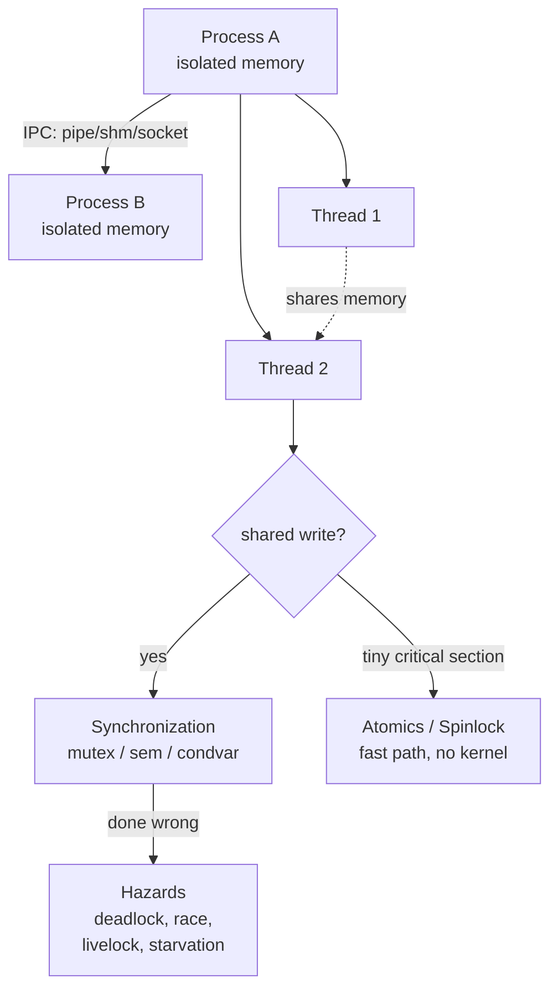

**The narrative:**

1. A **process** is an isolated program with its own memory. Isolation is safe but means processes can't share data directly → they need **IPC** (§2).
2. A **thread** lives *inside* a process and **shares its memory** with sibling threads (§1). Sharing is fast but dangerous — unsynchronized sharing causes **race conditions**.
3. To share safely, threads need **synchronization** (§3): mutex, semaphore, condition variable.
4. Getting synchronization wrong creates **concurrency hazards** (§9) — the #1 interview area.
5. For tiny critical sections, a full mutex is overkill → **atomics & spinlocks** (§5) are the fast path.
6. The OS **scheduler** (§4) decides who runs when; priorities explain *why* hazards like priority inversion happen.
7. **Signals** (§8) are async notifications — the userspace analogue of hardware interrupts.
8. **Ring buffers & mailboxes** (§6) connect producers and consumers (the embedded ISR↔task pattern).
9. When it breaks, you **debug** it (§10).

### Process vs Thread — the table to memorize

| Aspect | Process | Thread |
|--------|---------|--------|
| Memory | Private (isolated) | Shared with siblings |
| Creation cost | High (copy page tables) | Low (just a new stack) |
| Crash impact | Contained to one process | Can corrupt whole process |
| Communication | IPC (pipe/shm/socket) | Shared variables |
| Sharing danger | Low (isolated) | High (needs locks) |
| Owns | PID, FD table, memory | Stack, registers, TID |

---

## 0. OS Fundamentals

> Read this first. Threads, scheduling, signals, and hazards all rest on four ideas:
> **user/kernel mode, interrupts, context switching, and preemption.**

### 0.1 User Mode vs Kernel Mode

**The idea.** The CPU runs at one of (at least) two privilege levels:

- **User mode** — restricted. Your application runs here. It *cannot* touch hardware, other processes' memory, or privileged instructions. If it tries, the CPU faults.
- **Kernel mode** — full privilege. The OS kernel runs here. It can touch hardware and run any instruction.

On x86 these are "rings" (ring 3 = user, ring 0 = kernel). The boundary is enforced by **hardware** — that's why a buggy app can't crash the whole machine.

```
        USER SPACE (ring 3, restricted)
   +------------------------------------------+
   |  your app: printf(), malloc(), loops     |
   +------------------------------------------+
                     |   ^
       trap/syscall  |   |  return to user mode
       interrupt     v   |
   +------------------------------------------+
   |  KERNEL SPACE (ring 0, full privilege)   |
   |  scheduler, drivers, memory manager, fs  |
   +------------------------------------------+
                     |   ^
                     v   |
              +-------------------+
              |     HARDWARE      |
              +-------------------+
```

**The three ways into the kernel** (the only ways):

1. **System call (trap)** — your code deliberately asks the kernel for a service (`read`, `write`, `fork`, `mmap`). A special instruction (`syscall` on x86-64) switches to kernel mode at a fixed entry point.
2. **Interrupt** — hardware (timer, disk, NIC, keyboard) signals the CPU asynchronously; the CPU jumps into the kernel.
3. **Exception / fault** — your code does something illegal (divide by zero, page fault, invalid access); the CPU traps into the kernel.

> **Say this** — *"What happens when you call `read()`?"*
> "`read()` is a wrapper around a system call. It puts the syscall number and arguments in registers, then executes a trap instruction that switches the CPU from user mode to kernel mode at a fixed entry point. The kernel does the I/O, puts the result in a register, and returns to user mode."

### 0.2 How Interrupts Work

**The problem.** Hardware events happen at unpredictable times — a key is pressed, a packet arrives, a timer expires. The CPU can't waste time polling. It needs to be *notified* and react instantly.

**The idea.** An **interrupt** is a hardware signal that says "drop what you're doing and handle me now."

```
   normal code running...
        |
        |  <-- IRQ fires (device or timer)
        v
   +-----------------------------------------------+
   | 1. CPU finishes the current instruction       |
   | 2. saves PC + flags, switches to kernel mode   |
   | 3. reads interrupt number                      |
   | 4. indexes the Interrupt Vector Table (IDT)    |
   | 5. jumps to the ISR (handler)                  |
   | 6. ISR does minimal work, then IRET            |
   | 7. CPU restores saved state                    |
   +-----------------------------------------------+
        |
        v
   ...interrupted code resumes (never knew it paused)
```

**ISR rules** (why ISRs must be *short* — a classic embedded question):

- An ISR runs with interrupts (often) disabled, stealing time from everything else. Long ISRs increase latency for other interrupts.
- An ISR **cannot block, sleep, or call non-reentrant functions** (no `malloc`, no `printf`). Only ISR-safe code.
- Pattern: the ISR does the bare minimum and **defers** heavy work to a thread/task (the "top half / bottom half" split).
- Shared variables touched by an ISR must be `volatile` (the compiler must not cache them).

**IRQ types to name:**

| Type | Source | Example |
|------|--------|---------|
| Hardware interrupt | a device, async to your code | NIC packet arrived |
| Software interrupt / trap | deliberately raised | a system call |
| Exception / fault | the current instruction | page fault, divide-by-zero |
| Maskable vs NMI | can/can't be temporarily disabled | NMI = hardware failure |

> **Hardware interrupt ↔ POSIX signal:** a signal (§8) is the *userspace* analogue of a hardware interrupt — async notification, jump to a handler, run it, resume. Same shape, different layer.

### 0.3 Context Switch

**The idea.** A **context switch** saves the state of the running thread and restores another's, so the CPU can run something else. The "context" is everything that makes a thread's execution unique:

- CPU registers (general purpose, stack pointer, program counter)
- the flags/status register
- for a **process** switch: also the memory map (page tables) and the TLB — which is why process switches cost *more* than thread switches.

The kernel stores this in a per-thread control block (the **PCB**, or `task_struct` in Linux).

```
   Thread A running                  Thread B running
   ----------------                  ----------------
        |
        |  trigger (timer / block / yield)
        v
   [save A's registers -> A's PCB]
   [scheduler picks B]
   [restore B's registers <- B's PCB]
   [process switch only: swap page tables, flush/tag TLB]
        |
        +------------------------------------> resumes B
```

**Why it's not free** (interviewers probe this):

- **Direct cost:** saving/restoring registers, running the scheduler (~1–5 µs).
- **Indirect cost (usually bigger):** cache and TLB pollution. The new thread's data isn't in cache, so it suffers misses until the cache "warms up."
- **Thread switch < process switch** — a process switch must swap the address space (TLB flush). This is a key reason threads beat processes for fine-grained parallelism.

> **Say this** — *"What is a context switch and why is it expensive?"*
> "It's saving one thread's CPU state and restoring another's so the CPU can switch tasks. The direct cost is saving/restoring registers and running the scheduler, but the hidden cost is cache and TLB misses afterward — the new thread runs slowly until its working set is back in cache. Switching between threads of one process is cheaper than switching processes, because processes also require swapping the address space."

### 0.4 Preemption

**The idea.** **Preemption** is the kernel *forcibly* pausing a running thread to run another, without the thread's cooperation. The opposite is **cooperative** scheduling, where a thread keeps the CPU until it voluntarily yields or blocks.

**How preemption actually works** — this is the "aha" that ties the section together:


| | Preemptive (Linux, Windows, RTOS) | Cooperative (old systems, some embedded) |
|---|---|---|
| Who decides | OS can interrupt any thread | thread runs until it yields |
| Pro | one runaway thread can't freeze the system | simpler, no surprise mid-section preempt |
| Con | can preempt mid-critical-section (→ need locks) | one stuck thread hangs everything |

**Where preemption connects:**

- It is **why race conditions happen** (§3): a thread can be preempted mid load-modify-store.
- It is **why priority inversion happens** (§9).
- `SCHED_FIFO`/`RR` (§4) change *when* preemption occurs.

> **Say this** — *"What is preemption?"*
> "Preemption is the kernel forcibly switching out a running thread, usually driven by a periodic timer interrupt. On each timer tick the scheduler runs and may context-switch to another thread. It guarantees fairness and responsiveness, but because a thread can be paused anywhere — even mid-update — it's the underlying reason we need synchronization."

### 0.5 Thread/Process Lifecycle

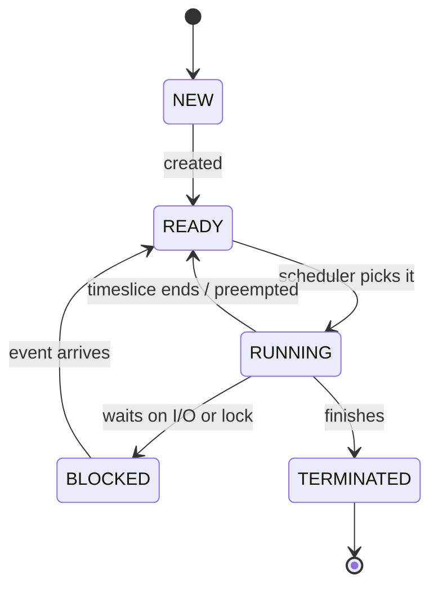

A context switch happens on every `RUNNING → {READY, BLOCKED}` transition. A terminated process becomes a **zombie** until reaped (§7).

### Demo — measuring context-switch cost

```c
static void demo_context_switch_cost(void) {
    const int N = 100000;
    struct timespec t0, t1;
    clock_gettime(CLOCK_MONOTONIC, &t0);
    for (int i = 0; i < N; i++)
        sched_yield();                 /* ask scheduler to run someone else */
    clock_gettime(CLOCK_MONOTONIC, &t1);

    double total_ns = (double)(t1.tv_sec - t0.tv_sec) * 1e9
                    + (double)(t1.tv_nsec - t0.tv_nsec);
    printf("  %d sched_yield() calls took %.2f ms (%.0f ns each)\n",
           N, total_ns / 1e6, total_ns / N);
}
```

Each `sched_yield()` enters the kernel and runs the scheduler (possibly a context switch). The measured per-call time (~100–200 ns on a typical box) makes the cost **tangible** — that's the point.

---

## 1. Threads

**The problem.** You have work that can happen in parallel — serving many clients, computing while keeping a UI responsive, reading sensors while logging. Running it sequentially wastes multicore CPUs and makes the program unresponsive while it waits.

**The idea.** A **thread** is an independent flow of execution *inside* a process. One process can have many threads, running truly in parallel on multiple cores (or interleaved on one).

> **Analogy:** a process is a kitchen; threads are cooks sharing it. They share the counters, fridge, and ingredients (process memory) but each has their own hands and workspace (stack + registers). Sharing the fridge is efficient — but if two cooks grab the same egg at once, you get a mess (a **race condition**).

### What threads share vs own

```
   PROCESS
   +--------------------------------------------------+
   |  SHARED:  code(.text)  globals(.data/.bss)        |
   |           heap         file descriptors   PID     |
   |                                                    |
   |   +----------------+        +----------------+    |
   |   | Thread 1       |        | Thread 2       |    |
   |   | PRIVATE:       |        | PRIVATE:       |    |
   |   |  stack         |        |  stack         |    |
   |   |  registers     |        |  registers     |    |
   |   |  TID, errno    |        |  TID, errno    |    |
   |   +----------------+        +----------------+    |
   +--------------------------------------------------+
```

### The mechanics — the 5 calls you must know

| Call | Purpose |
|------|---------|
| `pthread_create(&tid, attr, fn, arg)` | spawn; runs `fn(arg)` |
| `pthread_join(tid, &retval)` | block until it finishes; collect result |
| `pthread_detach(tid)` | "fire and forget"; auto-cleanup |
| `pthread_self()` | my own thread id |
| `pthread_exit(retval)` | end this thread, return a value |

The thread function **must** be `void *func(void *arg);` — takes one `void*`, returns a `void*`.

### Joinable vs detached

| | Joinable (default) | Detached |
|---|---|---|
| Cleanup | someone **must** `join` it, else resources leak | cleans itself up on exit |
| Result | `join` gives you its return value | return value is discarded |
| Use for | tasks whose result you need | fire-and-forget work |

> A joinable thread you never join is the thread equivalent of a **zombie process**.

### The lifecycle

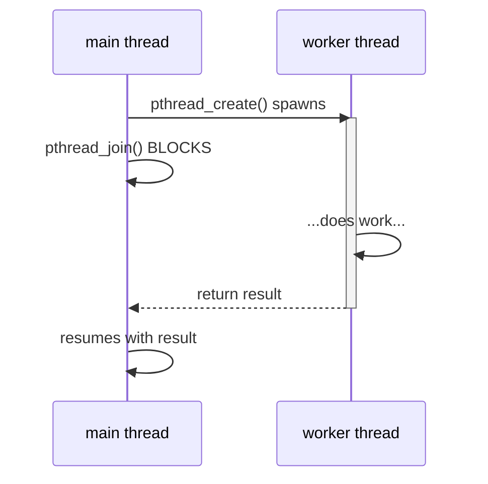

### The code

```c
static void *worker_basic(void *arg) {
    int id = *(int *)arg;                /* recover our argument */
    int *result = malloc(sizeof(int));   /* heap: must outlive this thread */
    if (result) *result = id * 100;
    return result;                        /* handed to whoever joins us */
}

/* main side */
pthread_t tid;  int arg = 7;  int *ret;
pthread_create(&tid, NULL, worker_basic, &arg);
pthread_join(tid, (void **)&ret);        /* wait + collect */
free(ret);
```

**Why return via the heap:** the worker's stack is destroyed when it exits. Returning the address of a *local* would be a use-after-free. So we `malloc` the result and the joiner takes ownership.

### Gotchas

- **The classic loop bug:**
  ```c
  for (int i = 0; i < N; i++)
      pthread_create(&t[i], NULL, worker, &i);  // BUG: every thread sees the SAME i
  ```
  Fix: give each thread its own storage — `pthread_create(&t[i], NULL, worker, &args[i]);`
- A detached thread's return value is discarded, so it must not hand back anything that needs freeing.

> **Say this** — *"Thread vs process?"*
> "A process has its own isolated memory; a thread shares memory with other threads in the same process. Threads are cheaper to create and communicate through shared variables — but that sharing is exactly why they need synchronization, otherwise you get race conditions."

---

## 2. Inter-Process Communication (IPC)

**The problem.** Processes are **isolated** — each has private memory (a feature: one crash can't corrupt another). But isolation means they can't share a variable. They need an OS-provided channel.

**The idea.** The kernel offers several channels trading off speed, direction, scope, and whether they carry a byte **stream** or discrete **messages**.

| Mechanism | Direction | Scope | Speed | Carries |
|-----------|-----------|-------|-------|---------|
| pipe | one-way | related procs | fast | byte stream |
| FIFO (named) | one-way | any procs | fast | byte stream |
| message queue | one-way | any procs | medium | discrete msgs |
| shared memory | two-way | any procs | **fastest** | raw memory |
| socket | two-way | any (+ network!) | medium | byte stream |

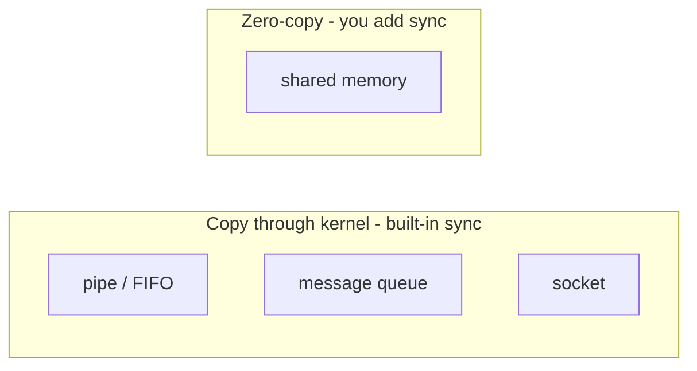

> **The key trade-off (say this):** "Pipes, queues, and sockets *copy* data through the kernel, so they're slightly slower but come with built-in synchronization — a read blocks until data arrives. Shared memory is the *fastest* because both processes map the same physical pages, so there's no copy — but it has no built-in synchronization, so I add my own mutex or semaphore."

**How to choose:**

- parent/child, simple stream → **pipe**
- unrelated processes, simple stream → **FIFO**
- discrete, prioritized messages → **message queue**
- bulk/high-throughput data → **shared memory** (+ a semaphore)
- bidirectional, or over a network → **socket**

### 2.1 Anonymous Pipe

A one-way tube with two file descriptors: `fd[0]` = **read** end, `fd[1]` = **write** end. Created *before* `fork()` so the child inherits both — that shared inheritance connects the two processes.

> **Analogy:** a ship's speaking tube — one person talks in one end, another listens at the other. One way only.

```
   parent (writer)                child (reader)
   --------------                 --------------
   close(fd[0])  read end          close(fd[1])  write end
   write(fd[1], "Hello")  ----->   read(fd[0]) -> "Hello"
   close(fd[1])  (signals EOF)     sees EOF when all writers closed
```

```c
int fd[2];
pipe(fd);                       /* fd[0]=read, fd[1]=write */
pid_t pid = fork();
if (pid == 0) {                 /* CHILD: reader */
    close(fd[1]);               /* close unused write end */
    char buf[64] = {0};
    read(fd[0], buf, sizeof(buf) - 1);
    close(fd[0]);
    _exit(0);
} else {                        /* PARENT: writer */
    close(fd[0]);               /* close unused read end */
    write(fd[1], "Hello", 5);
    close(fd[1]);               /* signal EOF */
    waitpid(pid, NULL, 0);
}
```

> **Why close the unused end:** the reader sees EOF only when *all* write ends are closed. Forget to close one and the reader can **block forever** waiting for an EOF that never comes.

### 2.2 Named Pipe (FIFO)

A pipe with a **name** in the filesystem (`mkfifo`). *Any* two processes can open it by path — they need not be related by `fork`.

```c
mkfifo("/tmp/myfifo", 0600);
/* process A */ int fd = open("/tmp/myfifo", O_WRONLY); write(fd, ...);
/* process B */ int fd = open("/tmp/myfifo", O_RDONLY); read(fd, ...);
/* open() blocks until BOTH ends are open */
```

### 2.3 POSIX Message Queue

Holds **discrete messages** (not a byte stream); the kernel preserves message boundaries and can order by **priority**. Persists in the kernel until `mq_unlink`.

```c
struct mq_attr attr = { .mq_maxmsg = 10, .mq_msgsize = 64 };
mqd_t mq = mq_open("/myq", O_CREAT | O_RDWR, 0600, &attr);
mq_send(mq, "low",  3, 1);      /* priority 1 */
mq_send(mq, "high", 4, 9);      /* priority 9 -> dequeued FIRST */
unsigned int prio; char buf[64];
mq_receive(mq, buf, sizeof(buf), &prio);   /* returns highest priority first */
mq_close(mq); mq_unlink("/myq");
```

### 2.4 Shared Memory (zero-copy, fastest)

Both processes map the **same physical pages** into their address spaces. Reads/writes are direct memory accesses — no kernel copy. **But** you must add your own synchronization.

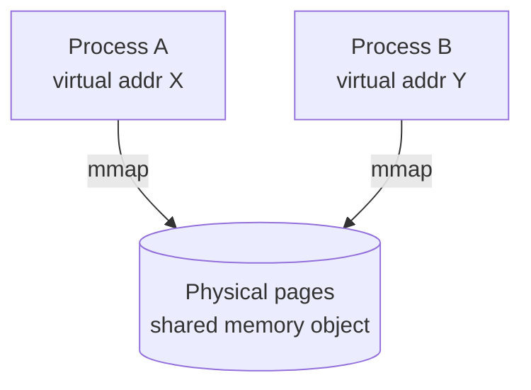

```c
int fd = shm_open("/myshm", O_CREAT | O_RDWR, 0600);
ftruncate(fd, sizeof(SharedData));
SharedData *shm = mmap(NULL, sizeof(SharedData),
                       PROT_READ | PROT_WRITE, MAP_SHARED, fd, 0);
/* child writes shm->value; parent reads it - SAME memory */
munmap(shm, sizeof(SharedData));
close(fd); shm_unlink("/myshm");
```

### 2.5 Unix Domain Socket

A **bidirectional** endpoint. `AF_UNIX` works locally; switch to `AF_INET` for the network. Full-duplex with a connection model.

```
   SERVER: socket -> bind -> listen -> accept -> recv/send
   CLIENT: socket -> connect -> send/recv
```

```c
/* server */ int s = socket(AF_UNIX, SOCK_STREAM, 0);
bind(s, ...); listen(s, 1); int c = accept(s, NULL, NULL);
recv(c, buf, n, 0); send(c, reply, len, 0);
/* client */ int c = socket(AF_UNIX, SOCK_STREAM, 0);
connect(c, ...); send(c, msg, len, 0); recv(c, buf, n, 0);
```

---

## 3. Thread Synchronization

**The problem — the data race.** The moment two threads touch the same variable and at least one writes, the outcome depends on the *unpredictable order* in which their instructions interleave.

Why `counter++` is dangerous — it is **three** machine steps, not one:

```
   (1) LOAD  counter -> register
   (2) ADD   1 to register
   (3) STORE register -> counter

   Thread A          Thread B
   LOAD 5
                     LOAD 5         <- both saw 5
   ADD -> 6
                     ADD -> 6
   STORE 6
                     STORE 6        <- one increment LOST
```

**The idea.** Serialize access to shared data so only one thread touches it at a time. The region that must be exclusive is the **critical section**.

### The toolbox — pick the right tool

| Primitive | Use it when… |
|-----------|--------------|
| **mutex** | exactly ONE thread may be in the critical section |
| **semaphore** | up to N threads may share a resource (counting) |
| **condition var** | a thread must WAIT for a condition to become true |
| **rwlock** | many readers OR one writer (read-heavy data) |
| **barrier** | all threads must reach a point before any continues |

**Golden rules:** keep critical sections short · always unlock on every exit path · lock the *data* not the *code* · don't call blocking/unknown code while holding a lock.

### 3.1 Mutex (mutual exclusion)

> **Analogy:** a single-occupancy restroom with one key. One person inside; others wait. The lock makes "check if free, then enter" a single atomic act.

```c
pthread_mutex_t m = PTHREAD_MUTEX_INITIALIZER;

pthread_mutex_lock(&m);     /* take the key (others wait) */
shared_counter++;           /* critical section: race-free */
pthread_mutex_unlock(&m);   /* return the key (wake a waiter) */
```

**Gotchas:** forgetting to unlock on an early return → everyone blocks forever · holding the lock during slow I/O kills concurrency · inconsistent lock order across threads → **deadlock** (§9) · a normal mutex is *not* recursive (locking twice in one thread deadlocks).

> **Say this** — *"How does a mutex prevent a race?"*
> "It serializes the critical section. The read-modify-write happens while we hold the lock, so no other thread can interleave between our load and our store — the update can't be lost."

### 3.2 Semaphore (counting permit)

A counter of available **permits**. `sem_wait` takes one (blocking if none); `sem_post` returns one. Generalizes the mutex: count 1 = a lock; count N = up to N threads proceed.

> **Analogy:** a parking lot with N spaces and a counting gate. A car takes a space (`sem_wait`); if full it waits. Leaving frees a space (`sem_post`). Never exceeds N.

**Mutex vs semaphore (classic question):**

- A **mutex has ownership** — the thread that locked it must unlock it.
- A **semaphore has no ownership** — thread A can `wait` and thread B can `post`. This makes semaphores ideal for **signaling** between threads, not just mutual exclusion.

```c
sem_t s;
sem_init(&s, 0, 2);     /* 2 permits -> at most 2 threads inside */
sem_wait(&s);           /* P: take a permit (blocks if 0) */
/* ... at most 2 threads here ... */
sem_post(&s);           /* V: return a permit */
sem_destroy(&s);
```

### 3.3 Condition Variable

**The problem.** A consumer needs data the producer hasn't made yet. Busy-waiting (`while(!ready){}`) pins a CPU at 100% doing nothing. We want the consumer to **sleep** and wake the instant data is ready.

> **Analogy:** a waiting room with a bell. A thread sleeps in it (`cond_wait`); another rings the bell (`cond_signal`) when the condition changes.

**The subtle part — why `cond_wait` takes the mutex.** `pthread_cond_wait(&cv, &m)` does three things **atomically**: (1) unlocks the mutex, (2) sleeps, (3) re-locks on wake. The atomic "unlock + sleep" closes the gap where a signal could be missed between checking the condition and sleeping.

```c
/* WAITER */
pthread_mutex_lock(&m);
while (!ready)                       /* WHILE, not if! */
    pthread_cond_wait(&cv, &m);      /* atomically unlock + sleep */
consume();
pthread_mutex_unlock(&m);

/* SIGNALER */
pthread_mutex_lock(&m);
ready = 1;
pthread_cond_signal(&cv);            /* wake one waiter */
pthread_mutex_unlock(&m);
```

> **Why `while` not `if`** (the #1 condvar trap): **spurious wakeups** (`cond_wait` may return with no signal) and **multiple waiters** (a broadcast wakes all, but only one finds work) both require re-checking the predicate. `signal` wakes one; `broadcast` wakes all.

### 3.4 Read-Write Lock

Optimizes read-heavy data: **many readers OR one writer**. Multiple readers hold the read lock at once; the write lock is exclusive.

```c
pthread_rwlock_rdlock(&rw);   /* shared - many readers */
pthread_rwlock_wrlock(&rw);   /* exclusive - blocks all readers */
pthread_rwlock_unlock(&rw);
```

### 3.5 Barrier

Every participating thread **waits** until a fixed number have all arrived; then all proceed together. Used in phased parallel computation.

```c
pthread_barrier_init(&b, NULL, 3);   /* 3 must arrive */
pthread_barrier_wait(&b);            /* block until all 3 reach here */
```

```
   T1 --reach--> [ barrier (waits for 3) ] --release--> T1
   T2 --reach-->                                        T2
   T3 --reach-->                                        T3
            (all three released together)
```

---

## 4. Scheduling & Thread Behavior

**The problem.** There are always more runnable threads than CPU cores. Someone must decide **who** runs, **where** (which core), and **for how long**. Get it wrong → missed deadlines, jittery latency, starvation.

**The idea.** The kernel **scheduler** multiplexes threads onto cores. Each thread carries a **policy** (the rule set) and a **priority** (its rank). The scheduler always runs the highest-priority runnable thread.

### Policies — two families

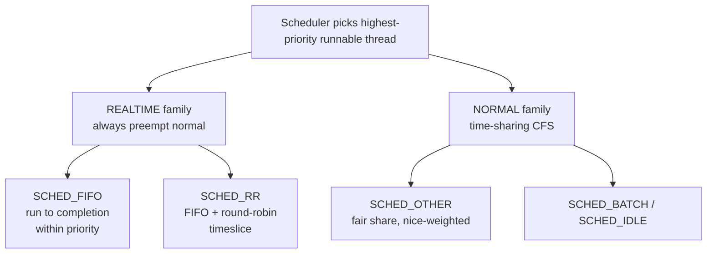

| Policy | Family | Behavior |
|--------|--------|----------|
| `SCHED_OTHER` | normal | CFS fair share, biased by **nice** (−20 greedy … +19 generous) |
| `SCHED_BATCH` | normal | like OTHER, for non-interactive CPU-bound work |
| `SCHED_IDLE` | normal | runs only when nothing else wants the CPU |
| `SCHED_FIFO` | realtime | run-to-completion within a priority; no timeslice |
| `SCHED_RR` | realtime | like FIFO but equal-priority threads round-robin |

**Key concepts:** **priority** (higher realtime preempts lower — *this is why priority inversion happens*) · **affinity** (pin a thread to core(s) for cache locality) · **yield** (give up the rest of your timeslice) · **preemption** (the scheduler forcibly pausing a thread — see §0.4).

```c
/* query */ int pol = sched_getscheduler(0);
/* realtime (needs root/CAP_SYS_NICE) */
struct sched_param p = { .sched_priority = sched_get_priority_max(SCHED_FIFO) };
pthread_setschedparam(pthread_self(), SCHED_FIFO, &p);
/* affinity: pin to CPU 0 */
cpu_set_t set; CPU_ZERO(&set); CPU_SET(0, &set);
pthread_setaffinity_np(pthread_self(), sizeof(set), &set);
/* cooperative yield */
sched_yield();
```

> **Say this** — *"How does Linux schedule threads?"*
> "Normal threads use CFS, which fairly shares CPU weighted by nice value. Realtime threads (`SCHED_FIFO`/`RR`) have fixed priorities and always preempt normal threads — FIFO runs to completion, RR adds round-robin timeslices. The scheduler always picks the highest-priority runnable thread."

---

## 5. Atomics & Spinlock

**The problem.** A mutex is correct but can be **heavy**. When contended it puts the thread to *sleep* and wakes it later — a kernel round-trip costing hundreds to thousands of ns. For "increment a counter," the locking overhead dwarfs the work.

**The idea.** Modern CPUs offer instructions that are **atomic by hardware** — they complete as one indivisible step no other core can interrupt or observe half-done. Built on these: **atomic variables** (update with no lock) and **spinlocks** (busy-wait instead of sleeping). Both stay in user space — the fast path.

### Mutex vs Spinlock vs Atomic — the decision table

| Tool | Waiter does | Kernel? | Best when… |
|------|-------------|---------|------------|
| **atomic** | nothing | no | single variable (counter, flag, pointer) |
| **spinlock** | spins (busy) | no | critical section is *very* short, multicore, low contention |
| **mutex** | sleeps | yes | section is long, may block, or high contention |

> **Why not always spin?** Spinning burns 100% CPU while waiting. If the lock holder is descheduled (or you're on one core), the spinner wastes its whole timeslice — it can even prevent the holder from running. Spinlocks only win when the wait is shorter than a sleep/wake (~µs).

### Atomic counter (lock-free)

Remember the §3 race: `counter++` lost updates. `atomic_fetch_add` does load+add+store as **one** hardware step — no update can be lost, with no lock.

```c
atomic_long counter = 0;
atomic_fetch_add(&counter, 1);   /* one indivisible step */
```

### Spinlock (test-and-set)

```c
typedef struct { atomic_flag flag; } spinlock_t;

void spin_lock(spinlock_t *s) {
    while (atomic_flag_test_and_set_explicit(&s->flag, memory_order_acquire))
        ;  /* spin until we win */
}
void spin_unlock(spinlock_t *s) {
    atomic_flag_clear_explicit(&s->flag, memory_order_release);
}
```

### Compare-And-Swap (CAS) — the heart of lock-free

`CAS(ptr, expected, desired)` means, atomically: *"if `*ptr` still equals `expected`, set it to `desired` and report success; otherwise load the current value into `expected` and report failure."* You **loop** on CAS — read current, compute new, try to swap; if someone beat you, retry. This is **optimistic concurrency**.

```c
atomic_int max = 0;
void update_max(int value) {
    int expected = atomic_load(&max);
    while (value > expected)
        if (atomic_compare_exchange_weak(&max, &expected, value))
            break;          /* success; else expected refreshed, retry */
}
```

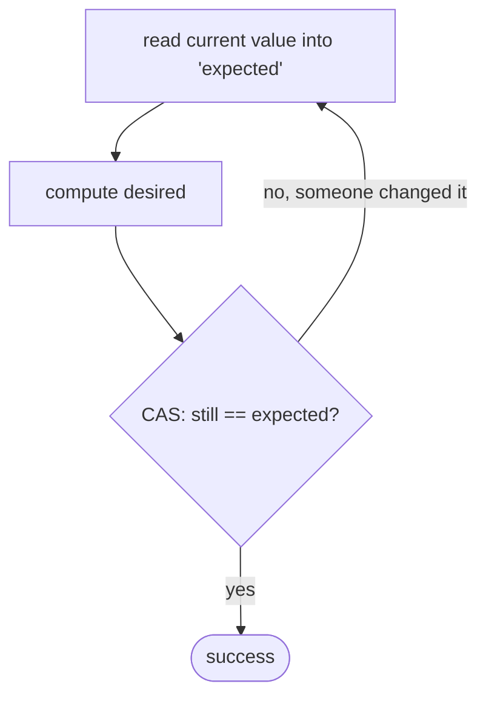

> **Memory order (one-liner):** "Atomics also control instruction reordering. `relaxed` gives atomicity only (fine for counters); `acquire`/`release` create a happens-before edge so a consumer sees the producer's writes; `seq_cst` is the safe default."

---

## 6. Ring Buffer & Mailbox

### 6.1 SPSC Lock-Free Ring Buffer

**The idea.** A fixed-size array used as a FIFO queue with **head** (write) and **tail** (read) indices that wrap around modulo capacity. With exactly **one producer and one consumer**, it needs **no lock**: the producer owns `head`, the consumer owns `tail`, and atomic acquire/release loads/stores make it safe and fast. This is the classic embedded **ISR → main-loop** pattern.

```
   capacity = 8 (power of 2 so wrap = index & 7)
   one slot kept empty to tell full from empty

   index:  0   1   2   3   4   5   6   7
         +---+---+---+---+---+---+---+---+
         | A | B | C |   |   |   |   |   |
         +---+---+---+---+---+---+---+---+
               ^tail(read)   ^head(write)

   EMPTY when head == tail
   FULL  when (head+1) & mask == tail
```

```c
#define RING_CAP 8
#define RING_MASK (RING_CAP - 1)
typedef struct {
    int data[RING_CAP];
    _Atomic unsigned head;   /* producer writes */
    _Atomic unsigned tail;   /* consumer reads */
} SPSCRing;

bool ring_push(SPSCRing *r, int v) {
    unsigned head = atomic_load_explicit(&r->head, memory_order_relaxed);
    unsigned next = (head + 1) & RING_MASK;
    if (next == atomic_load_explicit(&r->tail, memory_order_acquire))
        return false;                                    /* full */
    r->data[head] = v;
    atomic_store_explicit(&r->head, next, memory_order_release);  /* publish */
    return true;
}
bool ring_pop(SPSCRing *r, int *out) {
    unsigned tail = atomic_load_explicit(&r->tail, memory_order_relaxed);
    if (tail == atomic_load_explicit(&r->head, memory_order_acquire))
        return false;                                    /* empty */
    *out = r->data[tail];
    atomic_store_explicit(&r->tail, (tail + 1) & RING_MASK, memory_order_release);
    return true;
}
```

> **Why acquire/release:** they create a happens-before relationship so the consumer never reads a slot before the producer's write to it is visible.

### 6.2 Mailbox (blocking, mutex + condition variable)

Holds up to `CAP` messages. `post` blocks if full; `fetch` blocks if empty. Supports **multiple** producers/consumers and blocks cleanly instead of spinning — the textbook **bounded-buffer** producer/consumer.

```c
void mbox_post(Mailbox *m, int msg) {
    pthread_mutex_lock(&m->mtx);
    while (m->count == CAP)                      /* WHILE guards spurious wake */
        pthread_cond_wait(&m->not_full, &m->mtx);
    enqueue(m, msg);
    pthread_cond_signal(&m->not_empty);          /* wake a fetcher */
    pthread_mutex_unlock(&m->mtx);
}
int mbox_fetch(Mailbox *m) {
    pthread_mutex_lock(&m->mtx);
    while (m->count == 0)
        pthread_cond_wait(&m->not_empty, &m->mtx);
    int msg = dequeue(m);
    pthread_cond_signal(&m->not_full);           /* wake a poster */
    pthread_mutex_unlock(&m->mtx);
    return msg;
}
```

| | SPSC ring | Mailbox |
|---|---|---|
| Producers/consumers | exactly 1 each | many |
| Locking | lock-free (atomics) | mutex + 2 condvars |
| Waiting | caller spins/retries | blocks (sleeps) cleanly |
| Best for | ISR → task, ultra-low latency | general producer/consumer |

---

## 7. Processes

**The idea.** A **process** is a running program with its own isolated address space, file-descriptor table, and PID. A crash in one cannot corrupt another.

### The lifecycle APIs

| Call | Purpose |
|------|---------|
| `fork()` | duplicate the current process (child is a near-exact copy) |
| `exec*()` | **replace** the current process image with a new program |
| `wait()` / `waitpid()` | parent collects a child's exit status (reaps it) |
| `exit()` / `_exit()` | terminate a process |
| `getpid()` / `getppid()` | own PID / parent's PID |

### 7.1 fork()

Returns **twice**: in the parent it returns the child's PID (`>0`); in the child it returns `0`; on failure `-1`. After fork, both processes have **separate copies** of memory (copy-on-write).

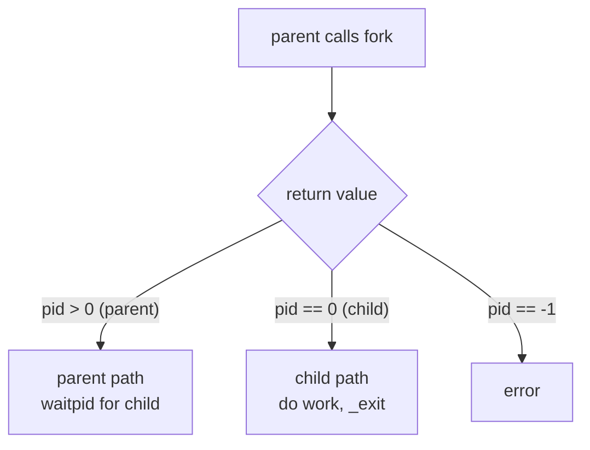

```c
pid_t pid = fork();
if (pid == 0) {                 /* CHILD */
    /* child's own copy of memory */
    _exit(0);                   /* _exit: no atexit/stdio flush in child */
} else {                        /* PARENT */
    waitpid(pid, NULL, 0);      /* reap to avoid a zombie */
}
```

### 7.2 fork + exec — how shells launch programs

`exec*()` **replaces** the current process image; the PID stays the same but code/data/stack are all replaced. If it succeeds it **never returns**.

```
   parent: fork() ----> child: execlp("echo", "echo", "hi", NULL)
              |                    (child becomes /bin/echo)
           waitpid() <---- child runs echo, exits
```

### 7.3 Exit status decoding

```c
int status; waitpid(pid, &status, 0);
if (WIFEXITED(status))   printf("code %d\n", WEXITSTATUS(status));
if (WIFSIGNALED(status)) printf("killed by signal %d\n", WTERMSIG(status));
```

### 7.4 Zombie & Orphan

| Term | Definition | Fix |
|------|------------|-----|
| **Zombie** | child exited but parent never `wait`ed; a "defunct" entry leaks in the process table | always `waitpid` your children |
| **Orphan** | parent died first; child is adopted by init/systemd (PID 1) which reaps it | normal & harmless (how daemons detach) |

> **Fork buffering gotcha (real bug I hit building this):** `printf` is buffered. If you `fork()` with unflushed data in the stdout buffer, the buffer is *duplicated* and both processes print it. Always `fflush(stdout)` before `fork()`, and since `_exit()` skips the flush, `fflush(stdout)` in the child before `_exit()` too.

---

## 8. Interrupts & Signals

**The idea.** A **signal** is an asynchronous notification delivered to a process — the **userspace analogue of a hardware interrupt** (see §0.2). Normal execution is suspended, a handler runs, then execution resumes. In firmware you write an ISR; in Linux you write a signal handler — same concept, different layer.

### Hardware interrupt ↔ POSIX signal

| Hardware interrupt (MCU) | POSIX signal (Linux userspace) |
|--------------------------|--------------------------------|
| IRQ line asserts | kernel delivers a signal |
| CPU vectors to an ISR | process vectors to a handler |
| ISR must be short, no blocking | handler must be async-signal-safe |
| use `volatile` for shared var | use `volatile sig_atomic_t` |
| return from interrupt (RTI) | handler returns, execution resumes |

### Common signals

| Signal | Meaning |
|--------|---------|
| `SIGINT` (2) | interrupt from keyboard (Ctrl-C) |
| `SIGTERM` (15) | polite termination request |
| `SIGKILL` (9) | forced kill — **cannot** be caught or ignored |
| `SIGSEGV` (11) | invalid memory access |
| `SIGALRM` (14) | timer expired |
| `SIGCHLD` | a child changed state (exited) |

### The async-signal-safety rule (critical)

A handler may interrupt the program **anywhere** — even mid-`malloc` or mid-`printf`. So a handler may only call **async-signal-safe** functions (`write` is safe; `printf`/`malloc` are **not**). The standard pattern: the handler just sets a flag; the main loop acts on it.

```c
static volatile sig_atomic_t g_fired = 0;     /* the ONLY safe shared type */
static void handler(int signo) { (void)signo; g_fired = 1; }  /* set flag only */

struct sigaction act = {0};
act.sa_handler = handler;
sigemptyset(&act.sa_mask);
sigaction(SIGUSR1, &act, NULL);               /* install (preferred over signal()) */
```

### Signal masking = the userspace `cli()`/`sti()`

```c
sigset_t set, old;
sigemptyset(&set); sigaddset(&set, SIGUSR1);
sigprocmask(SIG_BLOCK, &set, &old);   /* "disable" -> signal becomes PENDING, not lost */
/* critical section, uninterrupted by SIGUSR1 */
sigprocmask(SIG_SETMASK, &old, NULL); /* "enable" -> pending signal delivered now */
```

---

## 9. Concurrency Hazards

> The #1 interview area. For each: **define it, explain the cause, give an example, describe the fix.**

| Hazard | One-line definition |
|--------|---------------------|
| Race condition | result depends on unpredictable thread timing |
| Deadlock | threads block forever, each waiting on another |
| Livelock | threads keep running but make no progress |
| Priority inversion | low-priority thread blocks a high-priority one |
| Starvation | a thread never gets the resource it needs |

> **Deadlock vs Livelock vs Starvation (say this):** "Deadlock is a permanent block — threads wait on each other in a cycle and nobody runs (0% CPU). Livelock means threads are busy reacting to each other but make no progress (100% CPU, stuck). Starvation is when the system progresses but one unlucky thread is perpetually skipped. Deadlock never resolves on its own; starvation might."

### 9.1 Race condition

Already covered in §3 — unsynchronized shared write. **Fix:** mutex, atomic, or confine the data to one thread. **Detect:** `gcc -fsanitize=thread`.

### 9.2 Deadlock

Two+ threads blocked forever, each holding a resource the other needs.

```
   Thread A          Thread B
   lock(X) ok        lock(Y) ok
   lock(Y) WAIT <--- holds Y
   (waits for B)     lock(X) WAIT
                     (waits for A)
        \______ circular wait ______/
```

**The four Coffman conditions** (all must hold; break any one to prevent):


**Fix — consistent lock ordering** (breaks *circular wait*): every thread acquires locks in the same global order.

```c
/* SAFE: both threads always lock X before Y -> no cycle possible */
pthread_mutex_lock(&X);
pthread_mutex_lock(&Y);
/* ... */
pthread_mutex_unlock(&Y);
pthread_mutex_unlock(&X);
```

Other fixes: `trylock` with backoff (breaks *hold and wait*) · a single coarser lock · lock hierarchy. **Detect:** `gdb` → `thread apply all bt`, or `valgrind --tool=helgrind`.

### 9.3 Livelock

Threads are **not** blocked — they keep running and changing state — but make **no progress** because they keep reacting to each other (two people stepping the same way in a hallway).

**Cause:** naive deadlock-avoidance — "if I can't get the second lock, release the first and retry" — done in lockstep. **Fix:** randomized/exponential backoff, or impose ordering.

### 9.4 Priority inversion

A **high**-priority thread waits on a lock held by a **low**-priority thread; then a **medium**-priority thread preempts the low one, indefinitely delaying the high one.

```
   1. LOW acquires mutex M
   2. HIGH wants M -> blocks (LOW holds it)
   3. MEDIUM preempts LOW (MED > LOW)
   4. HIGH (highest!) now waits on MEDIUM  <-- inverted
```

> **Famous case:** the 1997 **Mars Pathfinder** kept resetting due to exactly this. The fix uploaded to Mars: enable **priority inheritance**.

**Fix — priority inheritance:** when HIGH blocks on a mutex held by LOW, the OS temporarily **boosts** LOW to HIGH's priority so it finishes fast and releases the lock.

```c
pthread_mutexattr_t attr;
pthread_mutexattr_init(&attr);
pthread_mutexattr_setprotocol(&attr, PTHREAD_PRIO_INHERIT);   /* the fix */
pthread_mutex_init(&pi_mutex, &attr);
```

### 9.5 Starvation

A thread is perpetually denied a resource because others keep getting it first (e.g. a steady stream of readers starving a writer on an rwlock). **Fix:** fair/FIFO locks, priority **aging** (gradually raise a waiter's priority), writer-preferring rwlocks.

---

## 10. Memory Bugs & Debugging

> *"Your program segfaults — walk me through how you debug it."* This section defines each bug and gives the exact diagnostic commands.

| Bug | What happens |
|-----|--------------|
| Stack overflow | too much stack (deep recursion / big locals) |
| Buffer overflow | write past the end of an array |
| Segfault (SIGSEGV) | access memory you don't own (bad pointer) |
| Use-after-free | use memory after `free()` |
| Double free | `free()` the same pointer twice |
| Memory leak | `malloc` without matching `free` |

### 10.1 Stack overflow

The call stack is fixed-size (~8 MB on Linux, far less on MCUs/threads). Exceeding it overruns a guard page → SIGSEGV. **Cause:** unbounded recursion (most common), huge local arrays. **Recognize:** a backtrace showing the **same function repeated thousands of times**. **Fix:** base case / depth limit, convert to iteration, move big buffers to heap, raise limit (`ulimit -s`).

### 10.2 Buffer overflow

Writing past an array end corrupts adjacent memory; on the stack it can overwrite the return address (classic exploit). **Cause:** `strcpy`/`strcat`/`sprintf`/`gets`, off-by-one.

| Dangerous | Safe replacement |
|-----------|------------------|
| `strcpy` | `snprintf(dst, sizeof dst, "%s", src)` or `strncpy` + manual `'\0'` |
| `strcat` | `strncat` with remaining space |
| `sprintf` | `snprintf` |
| `gets` | `fgets(buf, sizeof buf, stdin)` |

### 10.3 Segfault — the full debugging workflow

> This is the answer interviewers want to hear.

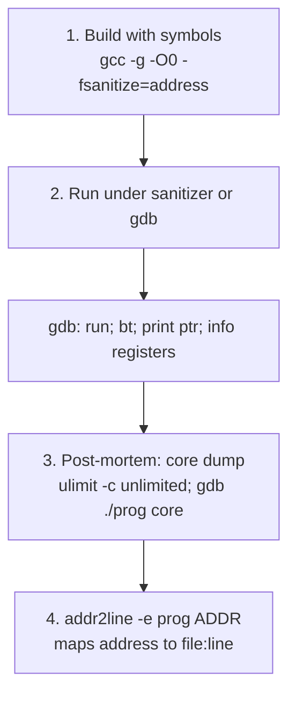

```bash
gcc -g -O0 -fsanitize=address prog.c -o prog   # 1. debug build
./prog                                          #    ASan prints file:line + stack
gdb ./prog                                      # 2. or use gdb
  (gdb) run
  (gdb) bt                 # backtrace: where it crashed
  (gdb) print myptr        # inspect the offending pointer
ulimit -c unlimited; ./prog; gdb ./prog core    # 3. post-mortem core dump
addr2line -e ./prog 0x401234                     # 4. address -> file.c:42
```

### 10.4 Use-after-free / double-free / leak

**Golden rules:** every `malloc` has exactly one matching `free` · after `free(p)` set `p = NULL` (`free(NULL)` is a safe no-op, neutralizing both UAF and double-free) · allocator and deallocator owned by the same component.

```c
int *p = malloc(sizeof(int));
*p = 42;
free(p);
p = NULL;        /* neutralizes use-after-free AND double-free */
free(p);         /* free(NULL) is a safe no-op */
```

**Detect:** `valgrind --leak-check=full ./prog` · `gcc -fsanitize=address` · `ASAN_OPTIONS=detect_leaks=1`.

### 10.5 The ELF binary & inspection tools

On Linux, compiled programs use the **ELF** format. Its sections map to the process memory layout:

| Section | Holds | Permissions |
|---------|-------|-------------|
| `.text` | executable code | read + execute |
| `.rodata` | constants, string literals | read-only ← *writing here segfaults* |
| `.data` | initialized globals | read + write |
| `.bss` | zero-initialized globals | read + write (no file space) |
| `.symtab` | symbol table | stripped in release builds |
| `.debug_*` | DWARF debug info (from `-g`) | what gdb/addr2line use |

| Command | Shows |
|---------|-------|
| `file prog` | ELF? 32/64-bit? stripped? static/dynamic? |
| `readelf -hSl prog` | header, sections, loadable segments |
| `nm prog` | symbols (T=text, D=data, B=bss, U=undefined) |
| `objdump -d prog` | disassemble code |
| `size prog` | text/data/bss sizes |
| `ldd prog` | shared library dependencies |
| `addr2line -e prog ADDR` | map a crash address → file:line |

> **Why it matters:** when a release binary crashes with only an address, you use `addr2line` + the ELF symbols to recover the source location.

---

## 11. Linux Device Drivers & the Device Model

> This section answers the driver/kernel questions that come up in WiFi, MAC, and embedded-systems interviews (Cisco/AMD/Qualcomm style). It assumes the OS fundamentals from §0 (user/kernel mode, interrupts, context switch).

### 11.1 What is a device driver?

**The idea.** A driver is kernel code that knows how to talk to a specific piece of hardware and exposes it to the rest of the system through a uniform interface. Userspace never poke registers directly — it calls `open`/`read`/`write`/`ioctl` on a device node, and the kernel routes those to the driver.

```
   userspace:   open("/dev/wlan0") read() write() ioctl()
                          |  (system call, §0.1)
   ----------------------- kernel boundary -----------------------
   VFS / subsystem  ->  DRIVER (your code)  ->  hardware registers / DMA
```

**Three driver classes (the classic taxonomy):**

| Class | Accessed as | Examples | Granularity |
|-------|-------------|----------|-------------|
| **Character** | a stream of bytes, no seeking required | tty, serial, `/dev/random`, most sensors | byte-by-byte |
| **Block** | fixed-size blocks, random access, buffered | disks, SSD, flash | block (e.g. 512B/4K) |
| **Network** | packets via the socket/netdev API, *not* a `/dev` node | Ethernet, **WiFi** | packet |

### 11.2 What is a character driver?

**The idea.** A character (char) driver presents the device as a sequential stream of bytes through a node in `/dev`. It is the simplest driver model: you implement a `file_operations` table and the kernel calls your functions when userspace does `open/read/write/ioctl/close`.

```c
static struct file_operations fops = {
    .owner   = THIS_MODULE,
    .open    = my_open,
    .read    = my_read,
    .write   = my_write,
    .unlocked_ioctl = my_ioctl,
    .release = my_close,
};
/* register: allocate a major/minor number + create the cdev */
alloc_chrdev_region(&dev, 0, 1, "mychar");
cdev_init(&my_cdev, &fops);
cdev_add(&my_cdev, dev, 1);
```

A char device is identified by a **(major, minor)** number: the **major** selects the driver, the **minor** selects which instance/sub-device that driver manages.

> **Say this** — *"What is a char driver?"*
> "It's a driver that exposes the device as a byte stream through a `/dev` node. You implement a `file_operations` table — open, read, write, ioctl, release — and register a cdev with a major/minor number. The major picks the driver, the minor picks the instance."

### 11.3 Is a WiFi/MAC driver a char driver?

**Short answer: no — a WiFi driver is fundamentally a *network* driver, not a char driver.**

**The idea.** Network interfaces don't fit the byte-stream model. They move discrete **packets**, and userspace reaches them through **sockets** and the network stack, not through `read()` on a `/dev` node. A WiFi driver registers a `net_device` (via `register_netdev`) and implements `net_device_ops` (e.g. `ndo_start_xmit` to transmit a packet), not `file_operations`.

```
   socket()/send()  ->  TCP/IP stack  ->  net_device (netdev)  ->  WiFi driver
                                                                      |
                                              mac80211 (soft-MAC) <---+
                                                      |
                                            cfg80211 + nl80211 (config plane)
```

**The nuance interviewers want:** a WiFi driver *can* additionally expose char-like interfaces for **control/configuration** — historically `ioctl`s, today **netlink** sockets (`nl80211`/`cfg80211`) and debug interfaces under `debugfs`/`sysfs`. So the *data path* is netdev/packets, while the *control path* uses netlink and sysfs. But the device's identity is a network interface (`wlan0`), not a `/dev/wlanX` byte stream.

> **Say this** — *"Is a MAC/WiFi driver a char driver?"*
> "No. The data path is a network driver — it registers a net_device and implements net_device_ops, and packets flow through the socket layer and TCP/IP stack, not through read/write on /dev. WiFi specifically splits into mac80211 for the MAC layer and cfg80211/nl80211 for configuration. Char-style interfaces only show up for control and debugging via netlink, sysfs, or debugfs."

### 11.4 How does the kernel know *which* driver to load for a device?

**The idea — matching by ID.** Every driver advertises a table of device IDs it supports. When a device appears, the bus subsystem reads the device's identity and looks for a driver whose ID table matches. This is the **bus → match → probe** model.

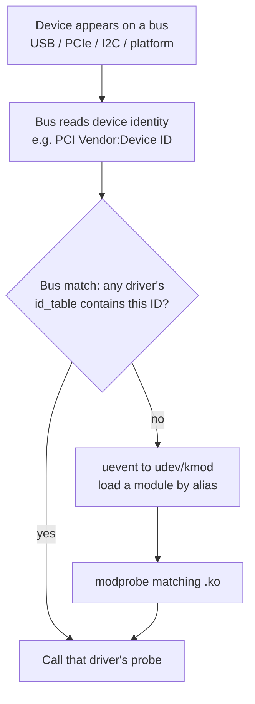

**The identity each bus matches on:**

| Bus | Device identity used to match |
|-----|-------------------------------|
| PCI / PCIe | Vendor ID + Device ID (+ subsystem) |
| USB | idVendor + idProduct (+ class) |
| I2C / SPI | name / compatible string |
| Platform (SoC) | **Device Tree `compatible` string** (see §11.9) |

**The driver declares its IDs**, e.g. for PCI:

```c
static const struct pci_device_id ath_ids[] = {
    { PCI_DEVICE(0x168c, 0x002e) },   /* Atheros vendor 0x168c, device 0x002e */
    { 0 }
};
MODULE_DEVICE_TABLE(pci, ath_ids);    /* exported so udev can auto-load */
```

`MODULE_DEVICE_TABLE` writes those IDs into the module's metadata. Userspace `udev`/`depmod` builds an alias map from it, so when a matching device shows up, the right `.ko` is auto-loaded.

> **Say this** — *"How does the kernel know which driver to load?"*
> "Each driver exports an ID table — PCI vendor/device IDs, USB product IDs, or Device Tree compatible strings — via MODULE_DEVICE_TABLE. When a device appears on a bus, the bus core reads its identity and matches it against registered drivers' tables. If a driver is built-in it's matched directly; if it's a module, the kernel emits a uevent and udev/modprobe loads the matching .ko, then the bus calls the driver's probe."

### 11.5 How does a driver actually get loaded?

**Two paths:**

1. **Built-in (compiled into the kernel):** the driver registers at boot via `*_initcall()`. No loading step — it's already there; the bus matches and probes it as devices appear.
2. **Loadable module (`.ko`):** loaded on demand.

```
   modprobe ath9k          # resolves dependencies via modules.dep, then:
     -> finit_module()      # syscall: kernel reads the .ko
     -> module loaded, its module_init() runs
     -> driver calls pci_register_driver()/usb_register()/...
     -> bus matches a present device -> probe() is called
```

**Module lifecycle hooks:**

```c
static int __init my_init(void) { return pci_register_driver(&my_driver); }
static void __exit my_exit(void) { pci_unregister_driver(&my_driver); }
module_init(my_init);
module_exit(my_exit);
MODULE_LICENSE("GPL");
```

**Who triggers the load:** when a device is hot-plugged or discovered at boot, the kernel sends a **uevent** to userspace; `udev` (or `kmod`) looks up the alias (from the ID table) and runs `modprobe`, which loads the `.ko` and its dependencies. `lsmod` lists loaded modules; `insmod`/`rmmod` load/unload one explicitly; `modprobe` resolves dependencies automatically.

> **Say this** — *"How does a driver get loaded?"*
> "Built-in drivers register at boot through initcalls. Loadable modules are loaded by modprobe — directly by a user, or automatically when the kernel sends a uevent for a new device and udev maps its ID to a module. Loading runs the module's init function, which registers the driver with its bus; the bus then calls probe for any matching device."

### 11.6 What exactly happens during probe()?

**The idea.** `probe()` is the driver's per-device initialization callback. The bus calls it once the device is matched to the driver, handing it the device. Probe's job is to claim the hardware, set it up, and register it with the appropriate subsystem.

**The typical probe sequence (recite this):**

```text
probe(device):
  step1: enable the device on its bus      (pci_enable_device / usb claim)
  step2: request and map its resources      (ioremap MMIO regs, request IRQ,
                                             set DMA mask, map BARs)
  step3: allocate driver private state       (kzalloc your context struct)
  step4: initialize the hardware             (reset, load firmware, read MAC addr)
  step5: register with the subsystem         (register_netdev for WiFi,
                                             cdev_add for char, etc.)
  step6: request_irq() so interrupts can fire
  step7: return 0 on success; on any failure, UNWIND everything done so far
```

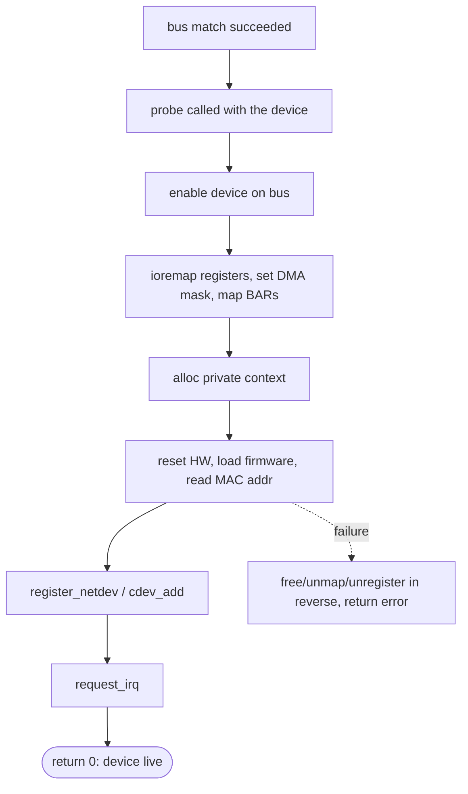

**Key point — error unwinding:** probe must undo partial setup on failure (free IRQ, unmap, free memory, unregister) so a failed probe leaves no leaks. Modern drivers use `devm_*` managed allocations so the kernel auto-frees on probe failure or device removal.

> **Say this** — *"What happens during probe?"*
> "Probe is per-device setup. The bus calls it after matching. It enables the device on its bus, maps the MMIO registers with ioremap, sets the DMA mask, allocates the driver's private context, resets and initializes the hardware — for WiFi that includes loading firmware and reading the MAC address — then registers with the subsystem (register_netdev for a network device) and requests its IRQ. It returns 0 on success, and on any failure it unwinds everything it set up so there's no leak."

### 11.7 Top half vs bottom half (interrupt handling)

**The problem.** An interrupt handler (ISR, §0.2) must be *fast* — it runs with interrupts disabled and blocks everything else. But real work (processing a received packet) takes time. You can't do it all in the ISR.

**The idea — split the work in two:**

| Half | Runs | Constraints | Does |
|------|------|-------------|------|
| **Top half** (hard IRQ) | immediately, in interrupt context | must be tiny, cannot sleep | acknowledge the device, grab the minimal data, schedule the bottom half |
| **Bottom half** (deferred) | soon after, in a softer context | can do more; some types can sleep | the heavy lifting — process the packet, refill buffers |

```
   IRQ fires
     |
   TOP HALF (hard irq, irqs off): ack device, note "work pending",
     |                            schedule bottom half  -> return FAST
     v
   ... interrupts re-enabled, scheduler continues ...
     |
   BOTTOM HALF (softirq/tasklet/workqueue/NAPI poll): do the real work
```

**Linux bottom-half mechanisms:**

| Mechanism | Context | Can sleep? | Use |
|-----------|---------|-----------|-----|
| **softirq** | software interrupt | no | high-frequency, performance-critical (networking core) |
| **tasklet** | built on softirq | no | simpler one-shot deferral (legacy) |
| **workqueue** | kernel thread | **yes** | work that may block (I/O, firmware, sleeping locks) |
| **threaded IRQ** | dedicated kthread | yes | `request_threaded_irq` runs the handler in a thread |

**WiFi/NIC specifics — NAPI:** high-speed network drivers use **NAPI**, where the top half disables further RX interrupts and schedules a **poll** (a softirq bottom half) that drains many packets in one go. This avoids an *interrupt storm* under heavy traffic — instead of one interrupt per packet, the driver polls in batches. This is a favorite WiFi/networking interview point.

> **Say this** — *"Top half vs bottom half?"*
> "The top half is the hard interrupt handler — it runs with interrupts disabled so it must be tiny: acknowledge the device and schedule deferred work. The bottom half does the real processing later in a softer context. Softirqs and tasklets can't sleep; workqueues and threaded IRQs can. For networking, NAPI is the key pattern: the top half masks RX interrupts and schedules a poll that processes packets in batches, avoiding an interrupt storm."

### 11.8 Crash info: where it's stored and how to get a function trace

**Where crash information goes (questions 7 & 8):**

| Crash type | Where the info lands | How to read it |
|------------|---------------------|----------------|
| Kernel **oops/panic** | the **kernel ring buffer** (printk log) | `dmesg`, or the console/serial log |
| Kernel panic (persisted) | **pstore** (`/sys/fs/pstore`) or **kdump** crash kernel → `vmcore` | `crash` tool on `vmcore` + `vmlinux` |
| Userspace crash | a **core dump** (if enabled) | `gdb ./prog core` |

**The kernel oops message itself contains:**
- the faulting instruction pointer (RIP/PC)
- a **call trace** (the stack of functions leading to the crash) — often already symbolized as `function+offset/size`
- register contents and the reason (e.g. NULL pointer dereference)

**Getting function names from a raw address (question 8):**

```bash
# 1. If the trace shows symbols already (function+0x..), read it directly in dmesg.
dmesg | tail -50

# 2. Raw kernel address -> file:line, using the kernel image with symbols:
addr2line -e vmlinux 0xffffffff81234567

# 3. Decode a captured oops with the kernel's own script (symbolizes the trace):
cat oops.txt | scripts/decode_stacktrace.sh vmlinux

# 4. For a module address, find where the module loaded, then offset:
cat /proc/modules            # shows each module's load address
# then objdump/addr2line against the .ko (with debug symbols)

# 5. Userspace: same idea
addr2line -e ./prog 0x401234
gdb ./prog core    # (gdb) bt
```

**Why symbols matter:** a stripped binary/kernel gives only hex addresses. You need the symbol table (`vmlinux`, or a `.ko` built with debug info, or `kallsyms` for the running kernel at `/proc/kallsyms`) to turn an address into `function+offset` and then a source line. `CONFIG_KALLSYMS` lets the kernel symbolize its own oops traces live.

> **Say this** — *"Where is crash info stored and how do you get the function trace?"*
> "A kernel crash produces an oops in the kernel ring buffer — you read it with dmesg, or off the serial console. If the system panics, it can be persisted to pstore or captured as a vmcore via kdump. The oops already includes a call trace; with CONFIG_KALLSYMS the kernel symbolizes it to function+offset. For a raw address I use addr2line against vmlinux, or decode_stacktrace.sh, and for a module I add the module's load offset from /proc/modules. Userspace crashes go to a core dump that I open with gdb and bt."

### 11.9 Device Tree: DTS, DTSI, DTB (questions 11–12)

**The problem.** On SoCs (ARM phones, routers, embedded WiFi), many devices (I2C controllers, UARTs, the WiFi MAC) are *not* discoverable — there's no bus that reports "a UART lives at address 0x...". The kernel needs to be *told* what hardware exists and where. Hardcoding that in C would mean a different kernel per board.

**The idea — Device Tree.** A data structure that *describes the hardware* (what devices exist, their register addresses, IRQs, clocks) separately from the kernel code. The bootloader hands it to the kernel at boot.

| File | What it is |
|------|-----------|
| **`.dts`** | Device Tree Source — a *board-specific* description (human-readable text) |
| **`.dtsi`** | Device Tree Source *Include* — shared/SoC-common fragments, `#include`d by `.dts` (the "i" = include) |
| **`.dtb`** | Device Tree Blob — the *compiled* binary (via `dtc`), what the bootloader actually loads |

```
   board.dts  --(#include)-->  soc-common.dtsi
        |
        |  dtc (device tree compiler)
        v
     board.dtb   --loaded by bootloader (U-Boot)-->  kernel at boot
```

**A device tree node** describes one device:

```dts
/* in an .dtsi: SoC-common definition */
wifi: wifi@a000000 {
    compatible = "qcom,ath10k";      /* <-- the match key */
    reg = <0xa000000 0x10000>;       /* register block: address + size */
    interrupts = <0 52 4>;           /* IRQ number + flags */
    clocks = <&gcc CLK_WIFI>;
    status = "disabled";             /* a board .dts can enable it */
};
```

The **`compatible` string is the match key** for platform drivers — the kernel pairs this node with the driver whose `of_match_table` lists the same string (the Device-Tree equivalent of a PCI vendor/device ID from §11.4):

```c
static const struct of_device_id ath_of_match[] = {
    { .compatible = "qcom,ath10k" },
    { }
};
MODULE_DEVICE_TABLE(of, ath_of_match);
```

> **Say this** — *"What are dts/dtsi/dtb and how are they used?"*
> "Device Tree describes non-discoverable hardware separately from kernel code. The .dts is the board-specific source, .dtsi is shared SoC-common include fragments, and the .dtb is the compiled blob the bootloader passes to the kernel. At boot the kernel parses the DTB, and for each node it matches the node's compatible string against drivers' of_match_table — that's how a platform driver binds to its device and gets its register addresses, IRQs, and clocks, without hardcoding them."

**How DTS is used when you "plug in a device" (question 12):** Device Tree is for *non-discoverable, fixed* hardware on the board (it's read once at boot). A *hot-pluggable* device on an enumerable bus — USB or PCIe — is **not** described in the device tree; it's discovered dynamically by the bus and matched by its hardware IDs (§11.4). So the answer depends on the bus: **soldered/SoC peripherals → Device Tree; pluggable USB/PCIe → runtime enumeration**, not DT. (A subtlety: the *USB/PCIe host controller itself* may be described in the device tree, but the devices you plug into it are enumerated at runtime.)

### 11.10 What happens when you plug in a WiFi device — USB / PCIe / UART (question 13)

The path depends on the bus. All three end at the same place — the driver's `probe()` — but get there differently.

```mermaid
flowchart TD
    subgraph USB
        U1[Plug USB WiFi dongle] --> U2[Host controller detects<br/>electrical connect, resets port]
        U2 --> U3["Enumeration: read device descriptor<br/>idVendor:idProduct"]
        U3 --> U4[uevent to udev -> modprobe driver]
        U4 --> U5[USB core matches id_table -> probe]
    end
    subgraph PCIe
        P1["PCIe WiFi card present at boot/hotplug"] --> P2["Enumerate config space<br/>read Vendor:Device ID, assign BARs"]
        P2 --> P3[Match pci_device_id -> probe]
    end
    subgraph UART
        T1[UART WiFi chip on board] --> T2[Described in Device Tree<br/>compatible string]
        T2 --> T3[Platform/serdev match -> probe]
    end
```

**USB WiFi dongle:**
1. The host controller senses the physical connect and resets the port.
2. **Enumeration**: the device gets an address; the kernel reads its **device descriptor** (`idVendor`/`idProduct`, class).
3. A **uevent** fires; `udev`/`modprobe` loads the matching driver if not present (§11.5).
4. USB core matches the IDs against `usb_device_id` tables and calls the driver's **`probe()`** (§11.6), which sets up endpoints, loads firmware, and `register_netdev()`s `wlan0`.

**PCIe WiFi card:**
1. PCIe devices are discovered by **enumerating config space** (at boot, or on hotplug for hotplug-capable slots).
2. The kernel reads **Vendor ID/Device ID**, allocates **BARs** (Base Address Registers → MMIO regions), and assigns an IRQ (MSI/MSI-X).
3. It matches `pci_device_id` and calls the driver's **`probe()`**, which `ioremap`s the BARs, sets the DMA mask, loads firmware, and registers the netdev.

**UART-attached WiFi chip:**
1. A UART device isn't enumerable — it's declared in the **Device Tree** (§11.9) with a `compatible` string, often as a **serdev** (serial device) slave.
2. The platform/serdev core matches the `compatible` against the driver's `of_match_table` and calls **`probe()`**, which opens the serial port, talks the chip's protocol (e.g. to bring up Bluetooth/WiFi over UART), and registers with the stack.

> **Say this** — *"What happens when you plug in a WiFi USB/PCIe/UART device?"*
> "All three converge on the driver's probe, but discovery differs. USB and PCIe are enumerable buses: the controller detects the device, reads its IDs — USB device descriptor or PCIe config space — assigns resources, and the bus matches the ID table and calls probe; for USB a uevent may trigger modprobe first. A UART chip isn't enumerable, so it's described in the Device Tree by a compatible string and matched as a platform/serdev device. Probe then maps resources, loads firmware, and registers the net_device. For WiFi, after probe the driver brings up mac80211/cfg80211 and the interface appears as wlan0."

### 11.11 VID/PID discovery — *how* the IDs are actually read

> Earlier sections say the bus "reads the device's identity." Interviewers push on the mechanism: **where do the Vendor ID (VID) and Product/Device ID (PID) physically live, and who reads them?** The answer is different for PCIe and USB, and it's worth knowing precisely.

**The key idea.** VID/PID are **burned into the device** by the manufacturer (in the chip's hardware/ROM). The host does not guess them — it reads them out of a standard, well-known location during enumeration, *before any driver is involved*. The VID is assigned to the vendor by the standards body (PCI-SIG for PCIe, USB-IF for USB); the PID is chosen by the vendor per product.

#### PCIe: VID/PID live in **Configuration Space**

Every PCIe function has a 256-byte (4 KB for PCIe extended) **configuration space** — a standardized register block separate from normal memory. Its first registers are fixed by the spec:

```text
PCI Configuration Space header (offsets):
  0x00:  Vendor ID   (16 bits)   <-- VID, e.g. 0x168C (Qualcomm Atheros)
  0x02:  Device ID   (16 bits)   <-- PID/DID, e.g. 0x002E
  0x04:  Command / 0x06: Status
  0x08:  Revision / Class Code
  0x0A:  Class / Subclass        (e.g. 0x0280 = network controller)
  0x10:  BAR0  ─┐
  0x14:  BAR1   │ Base Address Registers: the device advertises how much
  ...           │ MMIO/IO space it needs; the kernel assigns addresses here
  0x2C:  Subsystem Vendor ID / Subsystem ID  <-- often used to match exact board
```

**Who reads it and how (the mechanism):**

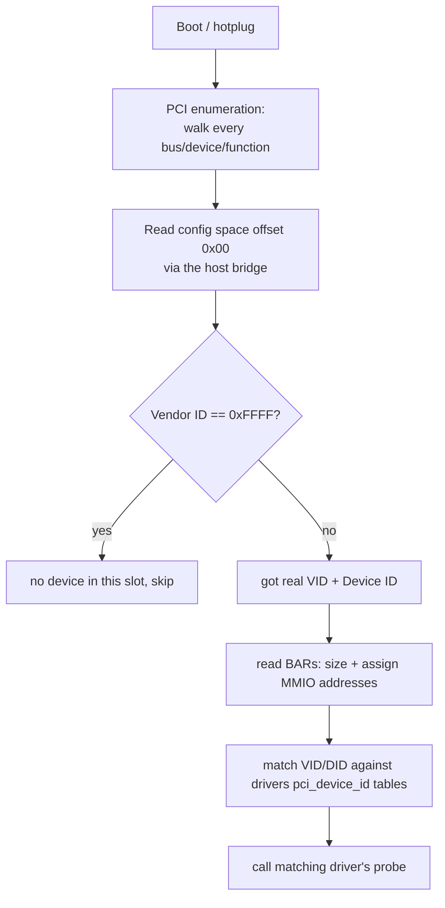

- At boot (or on hotplug), the kernel's PCI core **enumerates**: it walks every possible bus number, device number, and function, and tries to **read configuration space offset 0x00** for each.
- Config space isn't normal memory — it's accessed through the **host bridge / root complex** using either the legacy I/O ports `0xCF8`/`0xCFC` (address/data) or memory-mapped ECAM (Enhanced Configuration Access Mechanism) on modern systems.
- **The "is anything there?" trick:** if the read returns **Vendor ID `0xFFFF`**, the slot is empty (the bus returns all-ones when no device responds). Any other value means a real device is present, and the kernel now has its VID + Device ID.
- The kernel reads the **BARs** to learn how much MMIO space the device needs, assigns physical addresses, then matches the VID/DID against every registered driver's `pci_device_id` table (§11.4) and calls the winner's `probe()`.

You can see exactly this data from userspace:
```bash
lspci -nn            # shows [VID:DID] for every device, e.g. [168c:002e]
lspci -x             # dumps the raw config space header bytes
# also visible at: /sys/bus/pci/devices/<addr>/{vendor,device,subsystem_vendor}
```

#### USB: VID/PID live in the **Device Descriptor**

USB has no config space. Instead, every device stores **descriptors** in its firmware — structured records the host requests during enumeration.

```text
USB Device Descriptor (the relevant fields):
  bLength, bDescriptorType
  bcdUSB                  (USB spec version)
  bDeviceClass/SubClass/Protocol
  idVendor   (16 bits)    <-- VID, assigned by USB-IF
  idProduct  (16 bits)    <-- PID, chosen by the vendor
  bcdDevice               (device release number)
  iManufacturer/iProduct  (string descriptor indices)
  bNumConfigurations
```

**Who reads it and how (the mechanism):**

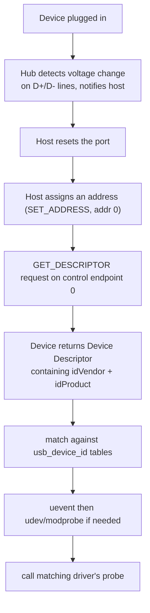

- When you plug in, the **hub** detects the electrical change on the D+/D− data lines and tells the host controller a device arrived.
- The host **resets** the port, then assigns the device an address with a `SET_ADDRESS` control transfer (every device powers up responding to address 0).
- The host issues a **`GET_DESCRIPTOR`** control request on **endpoint 0** (the default control endpoint every USB device has). The device replies with its **Device Descriptor**, which contains `idVendor` and `idProduct`.
- The USB core matches those against registered drivers' `usb_device_id` tables; a **uevent** may trigger `modprobe` to load the right `.ko` (§11.5); then the bus calls `probe()`.

From userspace:
```bash
lsusb                      # lists "ID 0bda:8812" = idVendor:idProduct
lsusb -v                   # full descriptor dump
# also at: /sys/bus/usb/devices/<dev>/{idVendor,idProduct}
```

#### The contrast that ties it together

| | PCIe | USB |
|---|------|-----|
| Where IDs live | **Configuration Space** (offset 0x00/0x02) | **Device Descriptor** (in device firmware) |
| How host reads them | reads config space via host bridge (ECAM / 0xCF8-0xCFC) | `GET_DESCRIPTOR` control transfer on endpoint 0 |
| "Empty slot" signal | Vendor ID reads back as `0xFFFF` | hub reports no device on the port |
| Resource assignment | BARs in config space → MMIO addresses | endpoints/bandwidth negotiated from descriptors |
| Standards body for VID | PCI-SIG | USB-IF |
| Userspace view | `lspci -nn` | `lsusb` |

> **Say this** — *"How are VID and PID discovered?"*
> "They're burned into the device by the manufacturer and read during enumeration, before any driver loads. On PCIe the IDs live at the very start of the device's configuration space — Vendor ID at offset 0, Device ID at offset 2 — and the kernel reads them through the host bridge while walking every bus/device/function; if the Vendor ID reads back as 0xFFFF the slot is empty. On USB there's no config space; the host resets the port, assigns an address, and sends a GET_DESCRIPTOR request on endpoint 0, and the device returns its device descriptor containing idVendor and idProduct. Either way, the kernel then matches those IDs against drivers' ID tables and calls probe. You can see them with lspci -nn or lsusb."

---

## 12. Mutex Internals & RTOS (FreeRTOS)

> Answers the "how does it work *internally*" questions (Cisco asked these directly). Builds on §3 (synchronization) and §0 (context switch, preemption).

### 12.1 How a mutex works internally

**The idea.** A mutex is not magic — it's a small piece of state (is it locked? who holds it? who's waiting?) plus two carefully designed operations (lock/unlock) that rely on an **atomic instruction** to make "check and claim" indivisible.

**The naive version is broken:**
```c
while (locked) { }   /* wait */
locked = 1;          /* claim  <-- RACE: two threads can both pass the while */
```
Between the check and the set, a context switch (§0.4) can let another thread also pass. The fix is a hardware **atomic** that does check-and-set as one indivisible step (§5).

**A real mutex has three layers:**

```text
1. THE ATOMIC FAST PATH (uncontended - the common case):
   - Use an atomic compare-and-swap (CAS) / test-and-set on a state word.
   - "If state == UNLOCKED, set it to LOCKED, atomically."
   - If it succeeds, you hold the lock and NEVER entered the kernel. Fast.

2. THE SLOW PATH (contended - someone already holds it):
   - The atomic CAS failed -> you must wait.
   - Instead of spinning forever, the thread BLOCKS: it's put on the mutex's
     WAIT QUEUE and the scheduler runs someone else (a context switch, §0.3).
   - On Linux/glibc this uses a FUTEX ("fast userspace mutex"): the syscall
     futex(FUTEX_WAIT) parks the thread in the kernel only when contended.

3. UNLOCK:
   - Atomically set state = UNLOCKED.
   - If the wait queue is non-empty, wake one waiter (futex FUTEX_WAKE),
     which the scheduler will eventually run; it retries the CAS and proceeds.
```

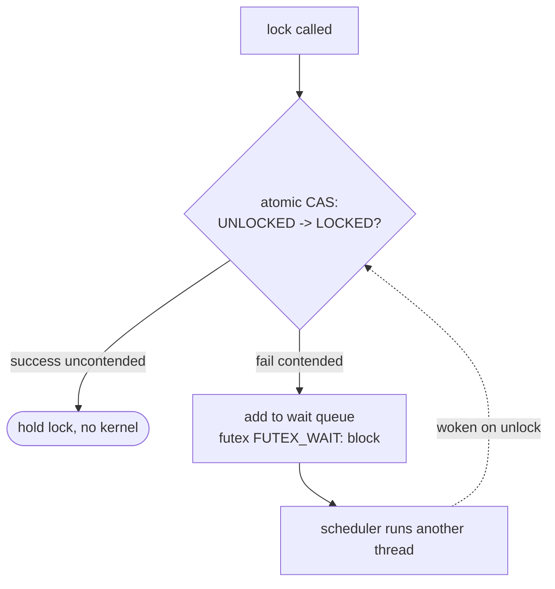

**Why the futex design matters:** the expensive kernel call happens *only* when there's contention. An uncontended lock/unlock is just a couple of atomic instructions in userspace — that's why modern mutexes are cheap in the common case.

**Mutex vs spinlock internally (ties to §5):** a spinlock's slow path *spins* (keeps retrying the atomic, burning CPU); a mutex's slow path *sleeps* (blocks and yields the CPU). That single difference is why spinlocks suit very short critical sections and mutexes suit longer or contended ones.

**Extra internals interviewers probe:**
- **Ownership:** a mutex records the owning thread, so only the owner can unlock, and so it can implement **priority inheritance** (§9.4) to fix priority inversion.
- **Recursion:** a recursive mutex stores the owner + a count, so the same thread can lock it multiple times.

> **Say this** — *"How does a mutex work internally?"*
> "At its core it's a state word updated with an atomic compare-and-swap, because 'check if free and claim it' must be indivisible — otherwise a context switch between the check and the claim causes a race. The uncontended path is just that atomic, entirely in userspace. When contended, the thread blocks on a wait queue instead of spinning — on Linux via a futex, which only enters the kernel under contention. Unlock clears the state and wakes a waiter. The mutex also tracks its owner, which enables owner-only unlock and priority inheritance."

### 12.2 How synchronization works in FreeRTOS

> Note: the question is often phrased "how does *sync* work in FreeRTOS." The core mechanisms are the **scheduler + queues + semaphores/mutexes built on them**.

**The idea.** FreeRTOS is a small real-time kernel for microcontrollers. Tasks (its threads) are scheduled by a **priority-based preemptive scheduler**, and they coordinate through **queues** — and semaphores/mutexes are themselves implemented on top of queues.

**The building blocks:**

| Primitive | What it is | Built on |
|-----------|-----------|----------|
| **Task** | a thread with a priority and its own stack | — |
| **Queue** | thread-safe FIFO for passing data between tasks/ISRs | the core primitive |
| **Binary semaphore** | signaling (event happened) | a queue of length 1 |
| **Counting semaphore** | N permits / resource counting | a queue |
| **Mutex** | mutual exclusion **with priority inheritance** | a queue + owner tracking |
| **Recursive mutex** | re-entrant lock | mutex + count |

**How a FreeRTOS mutex/semaphore works internally:**

```text
- A semaphore/mutex is a QUEUE (often holding no real data, just slots).
- "take" (xSemaphoreTake / pdTRUE): try to receive from the queue.
    - available -> proceed immediately.
    - not available -> the task is moved to the BLOCKED state and put on the
      queue's waiting list, with an optional timeout. The scheduler then runs
      the highest-priority READY task (a context switch).
- "give" (xSemaphoreGive): send to the queue.
    - if a higher-priority task was blocked waiting, it becomes READY and the
      scheduler switches to it (preemption).
- MUTEX adds OWNER tracking + PRIORITY INHERITANCE: if a high-priority task
  blocks on a mutex held by a low-priority task, FreeRTOS temporarily raises
  the holder's priority so it can finish and release quickly (fixes the
  priority-inversion problem from §9.4 - the Mars Pathfinder bug).
```

**The scheduler (the heart of "sync"):**
- **Priority-based preemptive:** the highest-priority READY task always runs; when a higher-priority task unblocks, it **preempts** the current one immediately.
- **Tick interrupt:** a periodic timer ISR (`vTaskSwitchContext`) drives time-slicing among equal-priority tasks and wakes tasks whose block timeouts expired — this is the §0.4 *timer → scheduler → context switch* chain, in an RTOS.

**ISR-safe variants (critical embedded point):** from an interrupt you must use the **`...FromISR`** APIs (`xSemaphoreGiveFromISR`, `xQueueSendFromISR`). They never block, and they report whether a higher-priority task was woken so you can request a context switch on ISR exit (`portYIELD_FROM_ISR`). This is FreeRTOS's top-half/bottom-half story (§11.7): the ISR gives a semaphore; a task blocked on that semaphore wakes to do the deferred work.

> **Say this** — *"How does synchronization work in FreeRTOS?"*
> "FreeRTOS is priority-preemptive: the highest-priority ready task always runs, and a tick interrupt drives time-slicing and timeouts. The core sync primitive is the queue; binary/counting semaphores and mutexes are built on queues. Take tries to receive — if nothing's available the task blocks and the scheduler switches away; give sends and may wake and preempt to a higher-priority waiter. Mutexes add owner tracking and priority inheritance. From ISRs you use the FromISR APIs, which don't block and tell you whether to yield to a woken task on exit."

### 12.3 FreeRTOS system initialization & startup (how the system comes up)

> The "sysinit" question is about **how a FreeRTOS system boots and reaches the point where tasks run**. The exact symbol name varies (`SystemInit`, `sysinit`, board init), but the *sequence* is what matters.

**The idea.** Before any FreeRTOS task can run, the chip has to come up from reset, the C runtime has to be prepared, the hardware has to be initialized, tasks have to be created, and finally the **scheduler is started** — only then does multitasking begin.

**The startup sequence from power-on (recite this):**

```text
1. RESET VECTOR
   - CPU starts at the reset handler (address from the vector table).
   - On ARM Cortex-M: the vector table's first entry is the initial stack
     pointer, the second is the Reset_Handler.

2. SystemInit() / low-level chip init   <-- the "sysinit" step
   - set up clocks/PLL (CPU & peripheral clock speeds)
   - configure flash wait states, enable FPU if present
   - set the vector table location (VTOR)
   - (this runs BEFORE main(), called from the reset handler / startup file)

3. C RUNTIME STARTUP (the startup .s file / crt0)
   - copy initialized data (.data) from flash to RAM
   - zero the .bss section
   - (optionally) run C++ static constructors
   - call main()

4. main(): APPLICATION + BOARD INIT
   - board/peripheral init (GPIO, UART, drivers, BSP)
   - create tasks            -> xTaskCreate(...)
   - create queues/semaphores -> xQueueCreate(...), xSemaphoreCreate...()
   - (nothing is running concurrently yet - scheduler not started)

5. vTaskStartScheduler()    <-- multitasking begins here
   - sets up the periodic tick interrupt (SysTick on Cortex-M)
   - creates the idle task (and timer task if enabled)
   - starts the highest-priority READY task
   - THIS CALL NEVER RETURNS (if it does, you ran out of heap)

6. TASKS NOW RUN under the scheduler; the tick interrupt drives
   preemption and time-slicing (§0.4, §12.2).
```

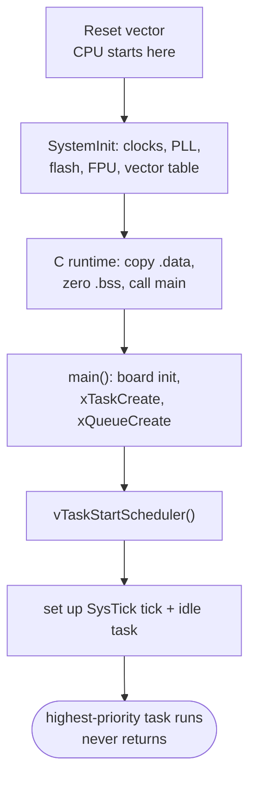

**Key points interviewers want:**
- **`SystemInit()` runs before `main()`** — it's the lowest-level chip bring-up (clocks, memory), called from the startup assembly, not from your application.
- **Tasks are created in `main()` but do not run yet** — creation only registers them as READY; concurrency starts only at `vTaskStartScheduler()`.
- **`vTaskStartScheduler()` does not return.** It launches the scheduler and the idle task; control never comes back to `main()`. If it *does* return, the kernel couldn't allocate the idle/timer task (heap exhausted).
- **The tick interrupt is set up by the scheduler**, not before — it's what enables preemption and timeouts afterward.
- **Idle task:** the scheduler always creates an idle task (lowest priority) so the CPU always has something to run; it's where you hook low-power sleep or memory cleanup.

> **Say this** — *"How does sysinit / startup work in FreeRTOS?"*
> "From reset, the CPU runs the reset handler, which calls SystemInit to bring up the low-level chip — clocks, PLL, flash wait states, FPU, vector table — before main. Then the C runtime copies .data to RAM and zeroes .bss and calls main. In main you do board init and create your tasks and queues, but nothing runs concurrently yet — creation just marks tasks READY. The last thing main does is call vTaskStartScheduler, which sets up the periodic tick interrupt, creates the idle task, and starts the highest-priority task. That call never returns; from then on the tick drives preemption and the scheduler runs tasks by priority."

---

## 13. WiFi System Design — Putting It Together

> A WiFi/MAC system-design role expects you to connect the dots: how a packet travels from the antenna to a socket, where the MAC layer sits, and how the driver, firmware, and stack divide the work. This section synthesizes the rest of the guide for that role.

### 13.1 The Linux WiFi stack, top to bottom

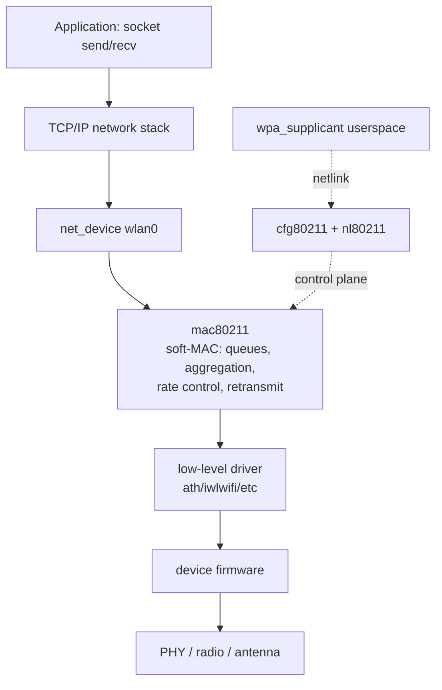

**The split that matters in interviews:**

| Layer | Where it runs | Responsibility |
|-------|---------------|----------------|
| `wpa_supplicant` / `hostapd` | userspace | authentication, key negotiation (WPA2/3), scan/connect policy |
| `cfg80211` / `nl80211` | kernel | configuration API + netlink channel to userspace (control plane) |
| `mac80211` | kernel | **soft-MAC**: MAC-layer state machine, TX/RX queues, A-MPDU aggregation, rate control, sequence numbers, retransmission |
| low-level driver | kernel | DMA rings, register access, firmware download, interrupts (data plane) |
| firmware | on the chip | time-critical MAC/PHY, ACKs, low-level timing |

**Soft-MAC vs full-MAC (a classic WiFi question):**
- **Soft-MAC:** the MAC-layer logic lives in the host kernel (`mac80211`). The chip does PHY + the most timing-critical bits. More host CPU, more flexibility/visibility. Most Linux WiFi.
- **Full-MAC:** the MAC is implemented in firmware on the chip; the host driver just exchanges higher-level commands. Less host CPU, less host control.

### 13.2 How a received WiFi packet travels (RX path) — the whole journey

This ties together interrupts (§0.2), top/bottom half (§11.7), DMA (§6, §11.6), and NAPI:

```text
1. RF energy -> PHY demodulates -> firmware validates the 802.11 frame, ACKs it
2. Chip DMAs the frame into a host RX buffer (a descriptor ring, §6/§11.6)
3. Chip raises an INTERRUPT
4. TOP HALF (hard IRQ, §11.7): driver acknowledges, masks further RX IRQs,
   schedules NAPI poll  -> returns fast
5. BOTTOM HALF (NAPI poll, softirq): driver pulls frames from the ring into
   sk_buffs, hands them up
6. mac80211: reassembles/decrypts, handles aggregation & sequence numbers,
   strips the 802.11 header, converts to an Ethernet-style frame
7. netif_receive_skb -> TCP/IP stack -> socket -> application read()
```

The **TX path** is the mirror image: socket → TCP/IP → netdev `ndo_start_xmit` → mac80211 (queue, aggregate, pick rate, add 802.11 header) → driver (place in TX descriptor ring, kick hardware via DMA) → firmware transmits and waits for the ACK, retransmitting if needed.

### 13.3 Why each earlier concept matters here (the synthesis)

| Concept | Where it shows up in WiFi |
|---------|---------------------------|
| **Interrupts / top-bottom half (§0.2, §11.7)** | every received packet starts as an IRQ; NAPI batches them |
| **DMA descriptor ring (§6, §11.6)** | how the chip and driver exchange packet buffers without the CPU copying, lock-free via owner bits |
| **Synchronization (§3, §5)** | TX/RX queues shared between IRQ context and threads need locks/atomics; per-queue locking for SMP scaling |
| **Concurrency hazards (§9)** | a slow lock on the RX path can drop packets; lock ordering between TX and RX queues avoids deadlock |
| **probe() / device model (§11.4–11.6)** | how the driver binds to the chip, loads firmware, and creates `wlan0` |
| **Device Tree / enumeration (§11.9–11.10)** | how a PCIe/USB/SDIO WiFi chip is discovered and bound |
| **Memory bugs / crash analysis (§10, §11.8)** | debugging a driver oops from a DMA or sk_buff bug |
| **Scheduling / RTOS (§4, §12.2)** | on-chip firmware is often an RTOS doing the time-critical MAC |

> **Say this** — *"Walk me through the WiFi receive path."*
> "RF comes in, the PHY and firmware validate and ACK the 802.11 frame, then the chip DMAs it into a host RX descriptor ring and raises an interrupt. The top half acknowledges, masks RX interrupts, and schedules a NAPI poll. The poll — a softirq — pulls frames into sk_buffs and hands them to mac80211, which decrypts, de-aggregates, fixes sequence numbers, and strips the 802.11 header. Then netif_receive_skb pushes it into the TCP/IP stack up to the socket. NAPI is key: under load the driver polls in batches instead of taking one interrupt per packet, avoiding an interrupt storm."

---

## Quick Revision Checklist

- [ ] Draw the **Process vs Thread** table from memory
- [ ] Explain the **three ways into the kernel** (syscall, interrupt, exception)
- [ ] Recite the **interrupt flow** (7 steps) and why ISRs must be short
- [ ] Explain **context switch** cost (direct + cache/TLB) and thread < process
- [ ] Connect **timer interrupt → scheduler → context switch = preemption**
- [ ] **Mutex vs semaphore** (ownership) and **mutex vs spinlock vs atomic** (table)
- [ ] Why condition variables use **`while` not `if`**
- [ ] The **four Coffman conditions** and the lock-ordering fix
- [ ] **Deadlock vs livelock vs starvation** distinction
- [ ] **Priority inversion** + inheritance (Mars Pathfinder)
- [ ] The **segfault debugging workflow** (gcc -g → gdb bt → core → addr2line)
- [ ] **ELF sections** and which tool inspects what
- [ ] **Char vs network driver** — why a WiFi/MAC driver is a net_device, not a char driver
- [ ] How the kernel **matches a device to a driver** (ID tables, MODULE_DEVICE_TABLE, compatible string)
- [ ] What **probe()** does, step by step, and why it must unwind on failure
- [ ] **Top half vs bottom half**, and **NAPI** for networking
- [ ] **dts / dtsi / dtb** and the `compatible` match; DT vs runtime enumeration (USB/PCIe)
- [ ] What happens when you **plug in a USB / PCIe / UART WiFi device**
- [ ] Where **crash info** lives (dmesg, pstore, kdump/vmcore) and how to **symbolize a trace** (addr2line, decode_stacktrace, /proc/modules)
- [ ] **How a mutex works internally** (atomic fast path + futex slow path + owner/PI)
- [ ] **FreeRTOS sync** (priority-preemptive scheduler, queues, FromISR APIs)
- [ ] **FreeRTOS startup** (SystemInit before main, create tasks, vTaskStartScheduler never returns)
- [ ] The **WiFi RX/TX path** end to end (IRQ → NAPI → mac80211 → socket)

---

*Companion code: `sysprog_all.c` — 11 runnable sections, zero warnings, ASAN/UBSAN clean.*
