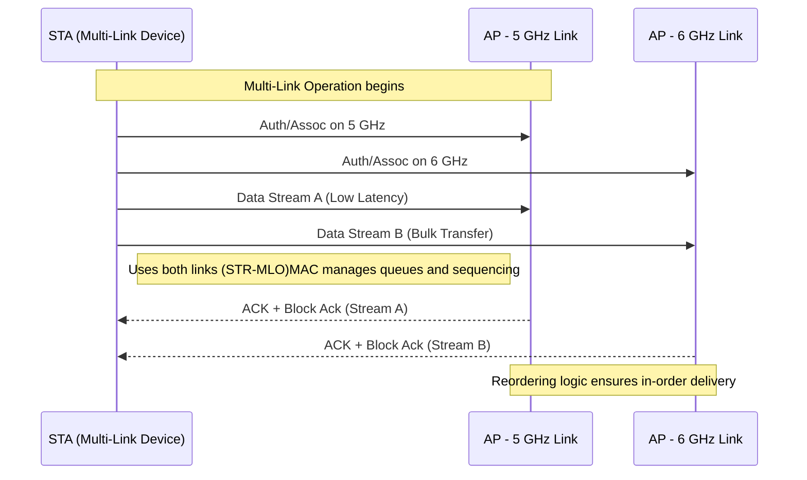

```mermaid
sequenceDiagram
    participant STA as Station (STA)
    participant AP as Access Point (AP)

    Note over STA,AP: 🔐 WPA3-Personal using SAE

    STA->>AP: 🔎 Probe Request\n(SSID, security capabilities)
    AP-->>STA: 📡 Probe Response\n(WPA3 support, capabilities)

    Note over STA,AP: 🤝 SAE Handshake (Authentication Phase)
    
    STA->>AP: SAE Commit Message\n(public value, scalar)
    AP-->>STA: SAE Commit Message\n(public value, scalar)
    
    STA->>AP: SAE Confirm Message
    AP-->>STA: SAE Confirm Message

    Note over STA,AP: 🔐 PMK is derived independently on both sides\nMutual authentication achieved

    STA->>AP: 🔗 Association Request\n(WPA3 support confirmation)
    AP-->>STA: 📶 Association Response\n(AID, status: success)

    Note over STA,AP: 🔐 Four-Way Handshake Begins (using SAE-derived PMK)

    AP->>STA: Message 1\n(ANonce)
    STA->>AP: Message 2\n(SNonce, MIC, RSN info)
    AP->>STA: Message 3\n(GTK, MIC)
    STA->>AP: Message 4\n(MIC, confirmation)

    Note over STA,AP: ✅ Secure connection established\nPTK and GTK are installed
```

# 🌐 Wireless LAN and IEEE 802.11 Overview

## 🔧 What is Wireless LAN?

A **Wireless LAN** is a network where devices communicate using wireless protocols/technologies within a defined area.

---

## 📜 What is IEEE 802.11 ?

the IEEE 802.11 standard defines how Wireless LANs operate. It provides a common framework that governs how data is transmitted, accessed, and secured over the air.

The standard specifically addresses two key layers of the OSI model, each with distinct responsibilities:

- **Physical Layer** :-Transmission/reception and modulation/demodulation of raw bits/signal over the wireless medium
- **Data Link Layer**:-Ensures reliable data delivery/access over the physical medium

---

## 📶 Wireless Services in IEEE 802.11
The IEEE 802.11 standard defines two main types of service structures that organize how wireless networks operate:
### 1. **BSS (Basic Service Set)**

- A group/unit of wireless network devices communicating with the same **Access Point (AP)**.

### 2. **ESS (Extended Service Set)**

- A collection of multiple APs and their associated client stations, all united by a single **Distribution System Medium (DSM)**.
- The **ESSID** (Extended SSID) is the shared network name.
- The terms **SSID** and **ESSID** are often used interchangeably.

---

## 📡 Key Terms

- **BSSID**: The physical /MAC address of the AP (48-bit hex).
- **AP (Access Point)**:these are devices which accept Wireless signals from multiple devices and retransmit them to  the rest of the network.
  - Acts as a bridge between wireless devices and the wired network.
  - Operates at Layer 2 (Data Link Layer).
- **SSID**: A unique string identifying a wireless network.


# 🧩 Data Link Layer Details

The **Data Link Layer** in the OSI model ensures reliable data transfer between two directly connected nodes. It is divided into two sublayers:

## 1. Logical Link Control (LLC)
- Provides an interface between the network layer and MAC sublayer.
- Responsible for:
  - Frame synchronization
  - Flow control
  - Error checking

## 2. Medium Access Control (MAC)
- Controls access to the physical transmission medium.
- Responsible for:
  - Addressing (MAC addresses)
  - Channel access control
  - Frame delimiting and error detection

---
## 🕹️ MAC Layer Functions:-
In Mac we have two more layers
### 1. **DCF (Distributed Coordination Function)**

- it provides contention Based Services i.e it uses **CSMA/CA** (Carrier Sense Multiple Access with Collision Avoidance).
- Operates on **half-duplex**.
- **csma\ca Timers** are used to avoid collisions.

> 📌 *CSMA/CA is for wireless, CSMA/CD is for wired.*

### 2. **PCF (Point Coordination Function)**

- Poll-based / priority-based access mechanism.

# Extra
- CF is the fundamental, best-effort access method where all devices are treated equally.
- PCF is a centralized, polling-based method that provides collision-free access but is rarely used in practice due to its complexity.
- EDCA is an extension of DCF that adds Quality of Service (QoS) by creating prioritized traffic queues. It is the standard for modern Wi-Fi networks (802.11e and later). 

## 🧱 MPDU vs MSDU in Wi-Fi

In Wi-Fi communication, data flows through several layers. Two key units involved in packaging and transmitting this data are:

- **MSDU (MAC Service Data Unit)**
- **MPDU (MAC Protocol Data Unit)**
Understanding the difference between them helps in grasping how Wi-Fi handles data efficiency, error control, and speed.

---
### 📦 What is MSDU?

### ➕ Full Form:**MAC Service Data Unit**
An **MSDU** is a data packet received from the **upper layers** (like IP or TCP) and handed off to the **MAC layer** for transmission.

### 🔄 Example:
Think of it as a **customer's order** that needs to be packed before shipping.

### ✅ Key Points:
- Contains actual **payload** (user data)
- Sits at the **interface between Layer 2 and Layer 3** (Data Link ↔ Network)
- Before transmission, it's usually **converted into MPDU**

---
### 📡 What is MPDU?

### ➕ Full Form:**MAC Protocol Data Unit**

An **MPDU** is the **final packet** that is transmitted over the air by the Wi-Fi interface.

### 🔄 Example:
Think of it as the **shipping box** that actually leaves the warehouse.

### ✅ Key Points:
- Includes **MAC header**, **frame check sequence (FCS)**, and **possibly one or more MSDUs**
- It’s what actually gets **transmitted on the wireless medium**
- Can be aggregated (A-MPDU) for performance

---
### ⚙️ Flow of Data: From MSDU to MPDU
```text
App/Data → TCP/UDP → IP Packet → MSDU → MPDU → Wireless Transmission
```
---
# 📡 CSMA/CA in Wi-Fi: Problems Explained

## 🧠 What is CSMA/CA?

**Carrier Sense Multiple Access with Collision Avoidance (CSMA/CA)** is a network protocol used in **Wi-Fi** to manage how multiple devices share the same wireless channel.

> 💡 It tries to **avoid** collisions *before* they happen, unlike CSMA/CD (used in Ethernet), which handles collisions *after* they occur.

---

## ⚙️ How CSMA/CA Works (Simplified)

1. A device **"listens"** to check if the wireless channel is free.
2. If the channel is **idle**, it waits for a **DIFS(Distributed Interframe Space)** & random back-off time.
3. If still idle Backoff timer decrements, when the channel remains idle & the timer hits **zero**, the device transmits its frame(data).
4. If the channel is **busy**, the device wait for next DIFS, and tries again later.
5. - If an **ACK Handling** is received → success.
   - If not → assume collision → **increase CW**, retry (up to a max retry limit).

---

## ❗ Common Problems with CSMA/CA in Wi-Fi

### 1. 🔇 Hidden Node Problem

#### 📍 What happens:
- Two devices (A and C) are **out of range** of each other but **both in range** of the same Access Point (B).
- A and C **can’t hear** each other.
- Both think the channel is free and **transmit at the same time** → causing a **collision** at B.

#### 📌 Real-World Analogy:
> Imagine two people in separate rooms trying to talk to the same receptionist over a walkie-talkie. They can’t hear each other and both talk at once, confusing the receptionist.

```mermaid
sequenceDiagram
    participant Node A
    participant Node B
    participant Node C

    Node A->>Node B: RTS
    Note right of Node B: B receives RTS from A

    Node B->>Node A: CTS
    Note over Node C: C hears CTS (from B) → defers transmission

    Node A-->>Node B: Data Frame
    Node B-->>Node A: ACK

    Note over Node C: C waits until transmission is done
```


---
# What is "CTS-to-Self"?

▶️ **CTS-to-Self** is a protection mechanism used in wireless networks (Wi-Fi) to reserve the medium without using RTS (Request to Send).  
Instead of sending an RTS and waiting for CTS, the device just sends a **CTS frame to itself** to reserve the channel.

---

## 🧩 Why Use CTS-to-Self?
CTS-to-Self is useful to prevent collisions when:
- Mixed **802.11b/g/n** devices exist.  
- Legacy clients don’t understand newer frame types (like **HT** or **VHT**).  
- A device wants to announce to others:  
  *"I’m going to transmit — please don’t interfere."*

---

## 🔄 How It Works
1. Device sends a **CTS frame to itself**, with a **Duration field** indicating how long the channel will be in use.  
2. All nearby devices update their **NAV (Network Allocation Vector)** and remain silent for that duration.  
3. The device then transmits its data safely.

---

## 🆚 RTS/CTS vs CTS-to-Self

| Feature       | RTS/CTS                  | CTS-to-Self            |
|---------------|--------------------------|------------------------|
| **Frames Used** | RTS → CTS → Data        | CTS (to self) → Data   |
| **Overhead**   | Higher (2 extra frames) | Lower (1 extra frame)  |
| **Usage**      | More robust              | Faster but less reliable |
| **Common Use** | Congested or large networks | 802.11n protection / mixed-mode |

---

## 🔐 Use Case in 802.11n
When operating in **802.11n mixed mode** (b/g/n devices), CTS-to-Self helps prevent collisions with legacy devices that don’t understand the new **802.11n frames**.

---

## ✅ Interview-Friendly Answer
"**CTS-to-Self** is a WLAN protection mechanism where a device sends a *Clear-to-Send (CTS)* frame to itself to reserve the wireless medium. It’s a simpler, faster alternative to the RTS/CTS handshake, and it’s commonly used in 802.11 networks to avoid collisions, especially in mixed environments with legacy devices."

### 2. 📡 Exposed Node Problem

#### 📍 What happens:
- A device refrains from transmitting, thinking the channel is busy, even when its transmission **would not cause interference**.

#### 📌 Example:
- Device A is sending data to B.
- Device C wants to send data to D.
- C hears A's signal and assumes the channel is busy.
- But since C → D and A → B are **non-interfering**, it could have transmitted safely.

#### ❌ Result:
- **Unnecessary waiting** → **inefficient use** of the wireless channel.

```mermaid
sequenceDiagram
    participant Node A
    participant Node B
    participant Node C
    participant Node D

    Node B-->>Node A: RTS
    Node A-->>Node B: CTS
    Note over Node C: C hears RTS from B, but not CTS from A

    Node C->>Node D: RTS
    Node D->>Node C: CTS

    Node C-->>Node D: Data Frame
    Node D-->>Node C: ACK

    Note over Node B: A and B are unaffected by C→D transmission
```

---

### 3. 🐢 High Overhead from Waiting

- Due to **random backoff timers** and **acknowledgments**, there is a delay even when the network is idle.
- Leads to **reduced throughput**, especially with many devices.

---

### 4. 📶 Performance Drops with More Devices

- As more devices share the channel, the chances of collisions and delays increase.
- **Congestion** leads to **packet loss**, **retransmissions**, and **slower speeds**.

---

### 5. 🔁 No Central Control

- Wi-Fi uses a **distributed system**, so each device independently decides when to transmit.
- This can lead to **poor coordination**, especially in crowded networks.

---

## ✅ Summary of CSMA/CA Limitations
| **Issue**            | **Description**                                                            | **Solutions**                                                                 |
|----------------------|-----------------------------------------------------------------------------|-------------------------------------------------------------------------------|
| **Hidden Node**       | Devices unaware of each other cause unintentional collisions               | Use of **RTS/CTS (Request to Send / Clear to Send)** mechanism in 802.11     |
| **Exposed Node**      | Devices unnecessarily delay sending even when it's safe                    | Improved MAC protocols and **carrier sensing** with RTS/CTS                   |
| **Overhead**          | Waiting, backoff, and acknowledgment mechanisms reduce speed               | **Frame aggregation**, **block acknowledgments**, and **802.11n/ac/ax** improvements |
| **Scalability**       | Performance degrades as the number of users increases                      | Introduction of **OFDMA** (Orthogonal Frequency Division Multiple Access) and **MU-MIMO** in 802.11ax |
| **Lack of Coordination** | No central controller leads to inefficiencies in shared environments   | Use of **Access Points** in Infrastructure mode and centralized management via controllers (in enterprise WLANs) |


---

## 🧠 Alternatives & Solutions

- 🧱 **RTS/CTS (Request to Send / Clear to Send)**: Optional handshake that reduces hidden node collisions.
- 🚀 **Wi-Fi 6 (802.11ax)** introduces better coordination through **OFDMA** and **BSS Coloring**.
- 🛰️ **Mesh Networking** helps balance loads and reduce interference.

---

## 🌐 Final Thought

CSMA/CA is **essential** for wireless networking, but it comes with **challenges**, especially in **crowded** or **large** networks. Understanding these problems helps in designing **better Wi-Fi** systems and troubleshooting **connectivity issues**.

## 🎨 BSS Coloring in Wi-Fi 6 (802.11ax)

**BSS Coloring** adds a small identifier (called a *color*) to every Wi-Fi frame, indicating which **BSS (Basic Service Set)** or network the frame belongs to.

This mechanism helps devices differentiate between transmissions from:
- **Their own network (intra-BSS)**
- **Other overlapping networks (OBSS – Overlapping BSS)**

---

### 🧠 How It Works:

When a station receives a frame, it performs the following check:

- **Is this my BSS color?**
  - ✅ **Yes** → It's from my network.  
    → **Defer transmission** to avoid collision.
  
  - ❌ **No** → It's from another network (OBSS).  
    → Check the signal strength:
      - If the signal is **strong** → Still defer to avoid interference.
      - If the signal is **weak (below threshold)** →  
        ➡️ **Ignore it** and **continue transmission**.

---

### ✅ Why It Matters:

- **Reduces unnecessary deferrals** in dense Wi-Fi environments.
- **Improves channel reuse** and **overall efficiency**.
- Especially useful in places with multiple APs (offices, apartments, campuses).

# 📡 Wi-Fi MAC Frame Format (802.11)

| **Field** | **Duration** | **Address 1** | **Address 2** | **Address 3** | **Seq Ctrl** | **Address 4** | **Frame Body** | **FCS** |
|-----------|--------------|---------------|---------------|---------------|---------------|----------------|----------------|----------|
| FC (2 B)  | Duration (2 B) | 6 bytes      | 6 bytes       | 6 bytes       | 2 bytes       | 6 bytes        | 0–2312 bytes   | 4 bytes  |

> **Total Size:** Variable (typically 28–2346 bytes depending on payload)


### 🧩 Frame Control Field Structure (2 bytes = 16 bits)
it consists of various bits Namely
| **Subfield**             | **Size** |
|--------------------------|----------|
| Protocol Version         | 2 bits   |
| Type                     | 2 bits   |
| Subtype                  | 4 bits   |
| To DS                    | 1 bit    |
| From DS                  | 1 bit    |
| More Fragments           | 1 bit    |
| Retry                    | 1 bit    |
| Power Management         | 1 bit    |
| More Data                | 1 bit    |
| WEP (Encryption Enabled) | 1 bit    |
| Order                    | 1 bit    |

> 🧪 This field defines the **type, control, and behavior** of the 802.11 frame.

## 🧾 IEEE 802.11 Frame Types and Subtypes

Each 802.11 frame has a **Frame Type** field (2 bits) and a **Subtype** field (4 bits) inside the **Frame Control (FC)** field.
These determine **what kind of frame it is** and **what it's used for**.
### Frame Types:
Frame type is subdivided into
1. **Management Frames**
2. **Control Frames**
3. **Data Frames**

Sub type helps specify the exact frametype(Probe,RTS etc..)

---

### 📊 Frame Types & Subtypes Table

| **Frame Type**       | **Type Value** | **Common Subtypes**                          | **Usage**                                         |
|----------------------|----------------|-----------------------------------------------|--------------------------------------------------|
| **Management**       | `00`           | - Association Request<br>- Association Response<br>- Probe Request<br>- Probe Response<br>- Beacon<br>- Authentication<br>- Deauthentication | Used to **establish, manage, and terminate** Wi-Fi connections |
| **Control**          | `01`           | - RTS (Request to Send)<br>- CTS (Clear to Send)<br>- ACK (Acknowledgment)<br>- PS-Poll | Assists with **medium access control**, power saving, and reliability |
| **Data**             | `10`           | - Data<br>- QoS Data<br>- Null Function<br>- CF-Ack | Carries **actual payload** (e.g., IP packets, ARP, DNS, etc.) |
| **Reserved**         | `11`           | - N/A                                          | Reserved for future use by IEEE                  |

---

### 🧠 Key Concepts

- The **Frame Type** tells us the category (Mgmt, Control, Data).
- The **Subtype** field (4 bits) tells us **exactly what kind of frame** it is within that category.
- These values are found inside the **Frame Control field** of every 802.11 frame.

> 🔍 Example:  
> A **Beacon Frame** has Frame Type = `00` (Management), Subtype = `1000` (Beacon)

---


### Other Fields:

- **Duration**: The duration bit specify  time interval we want to occupy the channel.
- **Sequence Control (SC)**: Used for Synchronization
- **FCS**: Frame Check Sequence is used for are checking probably (CRC32)
---
To DS( a packet going to distributed system) & from DS  (a packet coming from distributed system) are Wired lan address 1 to address 4
## 🧭 Addressing in Wi-Fi

| Address | Purpose                        |
|---------|--------------------------------|
| Addr1   | Next Destination               |
| Addr2   | Previous Sender                |
| Addr3   | Final Destination              |
| Addr4   | Original Source (if needed)    |

> 🔹 If `To DS = 0` and `From DS = 0` → Direct station-to-station communication.

**More frag** (More fragments): It is 1 bit long field which when set to 1 means frame is followed by other fragments.
**Order**: It is 1 bit long field, if this bit is set to 1 the received frames must be processed in strict order.
**retry**:it is 1-bit long field, if the current frame is a retransmission of an earlier frame.
**power mgmt**:If the field is set to 1, station goes into power-save mode. If the field is set to 0, the station stays active.

---

## ⚙️ Physical Layer and Modulation Schemes

### Based on encoding, speed, and range:

- **802.11a**: 5.75 GHz, OFDM, PSK, 6–54 Mbps
- **802.11b**: 2.44 GHz, DSSS, PSK, 5.5–11 Mbps
- **802.11g**: 2.4 GHz, OFDM, 54 Mbps
- **802.11n**: 2.4/5 GHz,64-QAM,600 Mbps

> 💡 Wi-Fi uses unlicensed **ISM bands**.

---
## 📡 Beacon Frames in Wi-Fi

Beacon frames are **broadcast management frames** sent periodically by Access Points (APs) to announce the presence of a Wi-Fi network.

---

### 🧭 Purpose of Beacon Frames

| **Function**                   | **Description**                                                                 |
|-------------------------------|---------------------------------------------------------------------------------|
| **Announce the network**      | AP advertises its SSID (network name)                                          |
| **Synchronization**           | Helps client devices sync their internal clocks with the AP's timestamp        |
| **Transmit network parameters** | Includes channel, supported data rates, security info, etc.                    |
| **Power saving support**      | Contains **TIM (Traffic Indication Map)** to help sleeping clients know if data is buffered for them |

---
## 🧱 Beacon Frame Structure (Expanded)

| **Field**                              | **Purpose**                                                              |
|---------------------------------------|---------------------------------------------------------------------------|
| **Timestamp**                         | Syncs client clock with AP                                               |
| **Beacon Interval**                   | Interval between beacons (in TUs)                                        |
| **Capability Info**                   | Flags: ESS, Privacy (WEP/WPA), IBSS, etc.                                |
| **SSID**                              | Network name (may be null for hidden networks)                           |
| **Supported Rates**                   | Data rates supported by AP                                               |
| **DS Parameter Set**                  | Includes **current channel** (e.g., 6, 11, etc.)                          |
| **TIM (Traffic Indication Map)**      | Shows if AP has buffered data for sleeping clients                       |
| **WMM Parameter Element** *(optional)*| **QoS settings** for Voice, Video, Best Effort, Background queues        |
| **RSN Information (Security)**        | Info about WPA2/WPA3 authentication and encryption                       |
| **Vendor-Specific IEs**               | Optional extensions like 802.11k/v/r, roaming hints, etc.                |

**DS Parameter Set** = Just the channel number — tells clients what RF channel the AP is using.

**QoS Info** is included only if AP supports WMM, and it appears in the WMM Parameter Element inside the optional IEs section of the beacon frame.
Tag: WMM Parameter Element (WME)
  - QoS Info (U-APSD support, queue settings)
  - Access Categories: Voice, Video, Best Effort, Background


### ⏱️ Beacon Interval

- Defined in **time units (TUs)** — 1 TU = **1024 microseconds**
- Default interval: **100 TUs** → ~102.4 ms (approx. 10 beacons/sec)

---

### 📶 Beacon Frame Properties

| **Property**           | **Value**               |
|------------------------|-------------------------|
| **Frame Type/Subtype** | Management / Subtype 8  |
| **Transmission Mode**  | Broadcast (to all clients) |
| **Reliability**        | Not ACKed (unreliable delivery) |
| **Frequency**          | Sent on primary channel only |
| **Encryption**         | Never encrypted         |

---

### 🔍 Real-World Use Cases

- Wi-Fi scanners (e.g., in phones or `Wireshark`) **rely on beacon frames** to detect nearby SSIDs.
- Beacons are **always sent**, even if the SSID is "hidden" (though in that case, SSID field is null).
- Client devices use the **timestamp and interval** to sync their sleep/wake schedules (important for power saving).

---

### ⚠️ Security Note

- Beacon frames **advertise the presence of a network**, so:
  - Hidden SSIDs don't offer real security — they just omit the SSID name
  - Attackers can still detect networks based on beacon frame traffic

---

## ✅ Summary

| **Why Beacons Matter** |
|------------------------|
| 📡 They announce the Wi-Fi network to nearby devices |
| 🕒 Help clients stay synchronized and manage power |
| 🔑 Carry critical info like supported rates, channel, and security |
| 🧭 Clients scan and connect based on beacon frame contents |

> 💡 Without beacon frames, Wi-Fi devices wouldn’t even know which networks exist — they're like digital lighthouses!


# 📡 Wireless Network Modes

Wlan can operate in several modes, each designed for specific purposes. Below are the common Wi-Fi modes:

## **1. Infrastructure Mode**
- **Most common mode** used in Wi-Fi networks.
- Devices (stations) communicate through a central **Access Point (AP)**.
- AP manages traffic and facilitates communication between devices and external networks (e.g., internet).

## **2. Ad-Hoc Mode (IBSS - Independent Basic Service Set)**
- Peer-to-peer communication **without** an Access Point.
- Devices connect directly in a **decentralized** network.
- Suitable for small or temporary networks.

## **3. Monitor Mode (Promiscuous Mode)**
- NIC listens to all wireless frames in the air, even if not addressed to it.
- Used for:
  - Packet sniffing
  - Wireless troubleshooting
  - Network analysis and security auditing
- Unlike promiscuous mode in Ethernet, monitor mode works at the radio level.

## **4. Master Mode**
- Typically used by **Access Points**.
- The device acts as a central controller allowing other devices (clients) to connect.

## **5. Repeater Mode**
- Extends the range of an existing wireless network.
- Receives signal from an AP and rebroadcasts it.

## **6. Bridge Mode**
- Connects two different network segments, often wired and wireless.
- Used to link two LANs using wireless communication.

## **7. Mesh Mode**
- Devices (nodes) act as both clients and routers.
- Creates a **self-healing, self-configuring** wireless network.
- Common in large area deployments like campuses or smart cities.

## **8. Client Mode**
- Standard mode where a device (e.g., laptop, phone) connects to an AP to access the network.

---

## 🔍 Scanning and Association

### What is Scanning?

The process by which a station discovers available wireless networks(AP) before associating with an AP.

### Scanning Steps:

1. Station sends a **probe request frame**.
2. Nearby APs respond with **probe response frames**.
3. Station sends an **association request** to the chosen AP.
4. AP sends back an **association response**.

### Scanning Types:

- **Active Scanning**: Station sends probe request → AP responds.
- **Passive Scanning**: APs periodically send **beacon frames**( advertising packets illustrating its capability to all stations).

---
## 🔐 Open (No Encryption) Connection Process

1. AP sends **beacon frame** (broadcast).
2. Client sends **probe request** with SSID.
3. AP replies with **probe response**.
4. Client sends **authentication request**.
5. AP sends **authentication response**.
6. Client sends **association request**.
7. AP sends **association response**.
8. Client may later send **disconnect frame**.

## 🔐 WPA2 Encrypted Connection Process

The process of establishing a secure WPA2 connection between a **client station (STA)** and an **Access Point (AP)** involves several key steps:

1. **🔎 Probe Request**
   - The **station** sends a **probe request** to discover nearby APs.
   - It includes supported data rates, security capabilities, and SSID (if known).

2. **📡 Probe Response**
   - The **AP** responds with a **probe response** containing its capabilities and supported configurations.

3. **🛂 Authentication Request**
   - The **station** sends an **authentication request** to the AP (Open System Authentication is used in WPA2).

4. **🛡️ Authentication Response**
   - The **AP** sends back an **authentication response**, typically approving the request.
   - At this stage, the station is **authenticated but not yet associated**.

5. **🔗 Association Request**
   - The **station** sends an **association request** to the AP.
   - This includes supported features and the **encryption type** (e.g., WPA2 with AES).

6. **📶 Association Response**
   - The **AP** sends an **association response** containing a **status code** and an **Association ID (AID)**.

7. **🔐 Four-Way Handshake (if WPA2/WPA/WEP)**
   - If encryption is enabled (WPA2/WPA/WEP), the AP and station perform a **Four-Way Handshake** to:
     - Confirm mutual possession of the **Pairwise Master Key (PMK)**
     - Derive **session keys** for encryption (PTK & GTK)
     - Ensure secure communication is established

---

### ✅ Summary
Once the Four-Way Handshake is complete, the station is **fully connected and encrypted** using WPA2, and can securely send and receive data over the wireless network.


---
## 🔐 Four-Way Handshake (WPA2)

Used for secure key exchange between client and AP.

### Steps:

1. **AP** generates **ANonce** and sends to **station**.(Sent to the client to begin key derivation)
2. **Station** computes **PMK**(Pairwise Master Key)  from SSID + password, generates **SNonce**, and derives **PTK**.(Sent to the AP/GO to complete key derivation)
3. **Station** sends **SNonce** to AP.
4. **AP** derives **PTK**, generates **GTK**, and sends GTK to station.
5. **Station** sends **ACK** to confirm.

---
## 🔐 Wi-Fi Security Standards, Encryption, and Authentication Overview

| **Name**   | **Category**             | **Purpose**                                         | **Encryption**                  | **Authentication**                        | **Status / Notes**                             |
|------------|--------------------------|-----------------------------------------------------|----------------------------------|--------------------------------------------|-------------------------------------------------|
| **WEP**    | Security Protocol         | Original Wi-Fi security (weak)                     | RC4                              | Static pre-shared key                     | ❌ Obsolete / Insecure                          |
| **WPA**    | Security Protocol         | Temporary improvement over WEP                     | TKIP (uses RC4)                  | PSK / 802.1X                              | ⚠️ Deprecated                                   |
| **WPA2**   | Security Protocol         | Strong standard since 2004                         | AES (via CCMP)                   | PSK / 802.1X                              | ✅ Secure / Widely adopted                     |
| **WPA3**   | Security Protocol         | Latest standard (2018), improves WPA2              | AES (with GCMP-256 or CCMP-128)  | SAE (Personal) / 802.1X + EAP (Enterprise) | ✅ Modern / Strongest available                |

---

| **Name**   | **Category**             | **Purpose**                                         | **Encryption**                  | **Used In**                                | **Status / Notes**                             |
|------------|--------------------------|-----------------------------------------------------|----------------------------------|---------------------------------------------|------------------------------------------------|
| **TKIP**   | Encryption Algorithm      | Fix WEP flaws using per-packet keying              | RC4 + MIC + IV mixing            | WPA                                          | ❌ Deprecated / Weak                           |
| **CCMP**   | Encryption Algorithm      | Strong AES-based encryption + data integrity       | AES (CTR + CBC-MAC)              | WPA2, WPA3                                  | ✅ Secure and mandatory in WPA2 and WPA3       |
| **GCMP**   | Encryption Algorithm      | More efficient & secure than CCMP (used in WPA3)   | AES (Galois/Counter Mode)        | WPA3                                        | ✅ Stronger, used in high-security deployments |

---

| **Name**   | **Category**             | **Purpose**                                         | **Encryption Varies?**          | **Used In**                                | **Status / Notes**                             |
|------------|--------------------------|-----------------------------------------------------|----------------------------------|---------------------------------------------|------------------------------------------------|
| **SAE**    | Auth Protocol (WPA3-Personal) | Replaces PSK with secure key exchange             | Yes (AES + GCMP/CCMP)           | WPA3-Personal                               | ✅ Secure / Resists offline dictionary attacks |
| **EAP**    | Auth Framework (WPA2/WPA3-Enterprise) | Flexible authentication in enterprise networks | Depends on EAP type              | WPA2/WPA3-Enterprise                        | ✅ Secure with certificates (e.g. EAP-TLS)     |

---

### 📝 Quick Definitions:
- **Security Protocol**: Overall system that defines how Wi-Fi is secured.
- **Encryption Algorithm**: Technique used to encrypt and ensure data integrity.
- **Authentication Method**: How users/devices prove their identity.

## 🔐 WPA3 Encrypted Connection Process (with SAE)

In **WPA3-Personal**, the connection process enhances security by replacing the traditional **Pre-Shared Key (PSK)** mechanism with **SAE (Simultaneous Authentication of Equals)**. SAE provides forward secrecy and robust protection against offline dictionary attacks.

Below is a step-by-step overview of how a WPA3 connection is established:

---

### 1. 🔎 **Probe Request**
- The **station (STA)** broadcasts a **probe request** to discover nearby access points (APs).
- This request includes the SSID (optionally) and the station's supported security capabilities.

---

### 2. 📡 **Probe Response**
- The **access point (AP)** replies with a **probe response**.
- It advertises its capabilities, including support for WPA3 and SAE.

---

### 3. 🤝 **SAE Handshake (Authentication)**
- The traditional open-system authentication used in WPA2 is replaced by **SAE**, a password-authenticated key exchange (PAKE).
- SAE performs a secure **Diffie-Hellman key exchange** using the shared password:
  - Both the STA and the AP generate cryptographic elements derived from the password.
  - They exchange **commit messages** (containing public values) and **confirm messages** to verify authenticity.
  - Both sides independently derive the same **Pairwise Master Key (PMK)**.
- Key Features:
  - **Mutual authentication** is achieved without revealing the password.
  - Resistant to **offline dictionary attacks** and **passive eavesdropping**.
- Upon successful SAE handshake, the **station is authenticated**.

---

### 4. 🔗 **Association Request**
- The **station** sends an **association request** to the AP, expressing intent to join the network.
- This message includes supported features and confirms WPA3 capabilities.

---

### 5. 📶 **Association Response**
- The **access point** replies with an **association response**.
- If successful, it assigns an **Association ID (AID)** to the station, completing the association phase.

---

### 6. 🔐 **Four-Way Handshake**
- As in WPA2, WPA3 uses the **Four-Way Handshake** to derive session keys and ensure key confirmation.
- The difference: WPA3 uses the **PMK derived from the SAE handshake** instead of a PSK.
- Steps:
  1. The AP sends a **nonce (ANonce)** to the station.(sent to client to begin key derivation)
  2. The station replies with its **nonce (SNonce)**, computes the **Pairwise Transient Key (PTK)**, and includes a MIC (Message Integrity Code).(Sent to the AP/GO to complete key derivation)
  3. The AP derives the PTK, verifies the MIC, and sends the **Group Temporal Key (GTK)** encrypted using the PTK.
  4. The station confirms receipt and key installation.

- Outcome:
  - Both parties confirm possession of matching keys.
  - The connection is now fully encrypted with **unique session keys**.

---

✅ **Conclusion**:
WPA3 with SAE significantly improves Wi-Fi security by eliminating vulnerabilities in WPA2's PSK model. It ensures robust authentication, forward secrecy, and resistance to offline attacks while maintaining interoperability with familiar connection procedures.

---

### ✅ Summary
Once the SAE handshake and Four-Way Handshake are completed:
- The **station is securely authenticated**.
- All data transmission is **encrypted using AES (CCMP or GCMP)**.
- The connection offers **forward secrecy** and stronger protection against brute-force attacks.

## 🏢 WPA2-Enterprise Connection Process (with EAP-TLS / PEAP)

**WPA2-Enterprise** leverages **IEEE 802.1X** and the **Extensible Authentication Protocol (EAP)** to provide **strong, centralized authentication** — ideal for enterprise networks. It differs from WPA2-Personal by using a **RADIUS server** for back-end authentication and may involve **client/server certificates**, depending on the EAP method.

---

## 🔄 WPA2-Enterprise Connection Workflow

### 1. 🔍 Probe Request / Response
- The **station (STA)** sends a **probe request** to discover nearby APs.
- The **AP** responds with a **probe response**, listing supported security capabilities (e.g., WPA2-Enterprise).

### 2. 🛂 Open System Authentication
- A basic Layer 2 **authentication frame exchange** occurs.
- This does **not provide security**, just network initiation.

### 3. 🔗 Association Request / Response
- The **STA** sends an **association request** to join the AP.
- The **AP** responds with an **association response**, assigning an **Association ID (AID)**.

### 4. 🧠 802.1X Authentication Begins
- The **AP acts as a pass-through proxy** for EAP messages between the STA and the **RADIUS server**.
- The EAP method (e.g., **EAP-TLS**, **PEAP**) is negotiated.

---

## 🔐 802.1X EAP-TLS Authentication Process (Phase-by-Phase)

The 802.1X authentication mechanism, often used in enterprise Wi-Fi (including WPA2-Enterprise), relies on the **Extensible Authentication Protocol (EAP)**, a **RADIUS server**, and often the **EAP-TLS method** for certificate-based mutual authentication. Below is a step-by-step explanation.

---

### 🔁 Phase 0: Initialization

- **Message Type**: `EAPOL-Start`
- **Sender**: Supplicant (STA/client)
- **Purpose**:
  - The client sends an `EAPOL-Start` frame to the Authenticator (AP or GO) to indicate it wants to start the 802.1X authentication process.

---

### 🔐 Phase 1: EAP Identity Exchange

- **Message Type**: `EAP-Request/Identity` and `EAP-Response/Identity`
- **Flow**:
  1. The Authenticator (AP) forwards `EAP-Request/Identity` to the client.
  2. The client replies with `EAP-Response/Identity`.
  3. The AP forwards this to the RADIUS server.
- **Purpose**:
  - Establish the client's identity before selecting the EAP method (e.g., EAP-TLS).

---

### 📜 Phase 2: EAP-TLS Handshake

- **Message Type**: EAP encapsulates the full TLS handshake
- **Exchanged Contents**:
  - `ServerHello` + Server Certificate
  - `ClientHello` + Client Certificate
  - `ClientKeyExchange`
  - `TLS Finished` messages
- **Flow**:
  1. The server sends its certificate to the client.
  2. The client validates the server certificate and replies with its own certificate.
  3. Key exchange (e.g., Diffie-Hellman or RSA) takes place.
  4. TLS Finished messages are exchanged to confirm secure session setup.
- **Purpose**:
  - Authenticate both client and server using certificates.
  - Establish a secure TLS tunnel.
  - Derive a **Master Session Key (MSK)**.

---

### ✅ Phase 3: EAP Success

- **Message Type**: `EAP-Success`
- **Flow**:
  1. After the TLS handshake succeeds, the RADIUS server sends an `EAP-Success` message to the AP.
  2. The AP relays it to the client.
- **Purpose**:
  - Officially mark the authentication as successful.
  - Close the EAP session.

---

### 🔑 Phase 4: MSK Delivery

- **Key Type**: `MSK` (Master Session Key)
- **Flow**:
  - The RADIUS server securely delivers the MSK to the AP (via RADIUS protocol).
- **Purpose**:
  - The MSK is used as the root key to derive encryption keys for the Wi-Fi session (e.g., PTK and GTK).

---

### 🔒 Phase 5: Key Derivation and 4-Way Handshake

- **Process**:
  - The AP and client perform the **WPA2 4-Way Handshake** using the MSK as input.
- **Key Outcomes**:
  - **PTK** (Pairwise Transient Key): For unicast encryption
  - **GTK** (Group Temporal Key): For broadcast/multicast
- **Purpose**:
  - Ensure both sides independently derive the same encryption keys.
  - Finalize secure connectivity at the link layer.

---

## 🛡️ Security Properties of EAP-TLS

- ✅ Mutual Authentication via certificates
- ✅ TLS ensures confidentiality and integrity
- 🔐 No passwords are exchanged
- 🚫 Resistant to phishing and MITM attacks
- 🔑 Strongest EAP method (ideal for enterprise Wi-Fi)

---

## 📌 Summary Table

| Phase | Message Type                  | Contents                                              |
|-------|-------------------------------|-------------------------------------------------------|
| 0     | `EAPOL-Start`                 | Supplicant asks to begin 802.1X                      |
| 1     | `EAP-Identity Exchange`       | Identity sent from STA to RADIUS                     |
| 2     | `EAP-TLS Handshake`           | Certificates, key exchange, TLS Finished             |
| 3     | `EAP-Success`                 | Sent from RADIUS → AP → STA after successful TLS     |
| 4     | `MSK (Master Session Key)`    | Delivered from RADIUS to AP securely                 |
| 5     | `PTK + GTK` via WPA Handshake | Encryption keys derived from MSK                     |

---


## 🔐 Phase 2: TLS Tunnel Setup (Outer)

- Only the **server presents a certificate**.
- The **client validates** the server certificate to ensure authenticity.
- A **secure TLS tunnel is formed** between the client and the RADIUS server.
- This tunnel protects the subsequent authentication exchange from eavesdropping or tampering.

---

## 🔑 Phase 3: Inner EAP Authentication (Inside Tunnel)

If using **MSCHAPv2** (most common with PEAP):

1. **STA sends Username**  
   - The client begins authentication by submitting its identity within the tunnel.

2. **RADIUS sends MSCHAPv2 Challenge**  
   - The server issues a challenge (a random number) that the client must encrypt using its password.

3. **STA responds with MSCHAPv2 Response**  
   - The client calculates a hashed response using the password and sends it back.

4. **RADIUS verifies and sends Success**  
   - The server compares the response to an expected value. If correct, authentication succeeds.

✅ **No password is transmitted directly** — instead, authentication uses a challenge/response mechanism for security.


## 🔄 4-Way Handshake

After EAP authentication succeeds:
- A **Pairwise Master Key (PMK)** is derived and shared with the AP.
- The **STA and AP perform the Four-Way Handshake** using **EAPOL-Key frames**:
  - Generate **Pairwise Transient Key (PTK)**
  - Exchange the **Group Temporal Key (GTK)**
  - Confirm key installation
- Enables **encrypted communication** using AES (CCMP)

---

## 🧾 EAP-TLS vs PEAP: Comparison Table

| Feature                   | **EAP-TLS**                          | **PEAP (e.g., MSCHAPv2)**                    |
|---------------------------|--------------------------------------|----------------------------------------------|
| Auth Method               | Mutual certificate-based             | Username/password in TLS tunnel              |
| Client Certificate Needed | ✅ Yes                                | ❌ No                                         |
| Server Certificate Needed | ✅ Yes                                | ✅ Yes                                        |
| Mutual Authentication     | ✅ Yes                                | ⚠️ Only server authentication                 |
| Security Level            | 🔒 Very High                          | 🔐 Moderate to High                           |
| Deployment Complexity     | ⚠️ Higher (certs needed on clients)  | ✅ Easier for large orgs                      |

---

## 📡 What is EAPOL?

**EAPOL (Extensible Authentication Protocol over LAN)** is the Layer 2 protocol used to transport EAP messages between the **STA** and **AP** in 802.1X authentication workflows.

- 📘 Defined in: **IEEE 802.1X**
- 🌐 Used in: Both **wired and wireless networks**
- 🔄 Purpose: Carry **EAP Identity**, **TLS handshake**, and **4-Way Handshake** frames

---

### 📥 Role of EAPOL in WPA2-Enterprise

| Step | Action | Protocol |
|------|--------|----------|
| 1 | STA associates with AP | Standard Wi-Fi frames |
| 2 | AP sends `EAP-Request/Identity` | EAPOL |
| 3 | STA replies with `EAPOL-Response/Identity` | EAPOL |
| 4 | AP relays EAP messages to/from RADIUS | EAP over UDP |
| 5 | On success, 4-Way Handshake begins | EAPOL-Key frames |

---

## 🧠 Summary: EAPOL and WPA2-Enterprise

- **EAPOL** is not an EAP method itself — it is a **transport protocol** used during:
  - **EAP authentication**
  - **4-Way Handshake**
- It ensures the station and AP can negotiate and apply encryption keys securely.
- **After authentication**, the client can exchange **encrypted traffic** on the WLAN.

---

## ✅ Final Outcome

After all steps:
- The client is **authenticated centrally** via RADIUS.
- **Encryption is enabled** using AES (CCMP).
- Network access is **granted based on identity and policy** — ideal for enterprise environments.

```mermaid
sequenceDiagram
    participant STA as STA (Client)
    participant AP as AP (Authenticator)
    participant RADIUS as RADIUS Server

    Note over STA, AP: STA sends Probe Request → AP responds

    STA->>AP: Open System Authentication
    AP-->>STA: Authentication Response

    STA->>AP: Association Request
    AP-->>STA: Association Response

    Note over STA, AP: 802.1X Authentication Starts (EAPOL)

    AP->>STA: EAP-Request/Identity (via EAPOL)
    STA->>AP: EAP-Response/Identity (via EAPOL)

    AP->>RADIUS: EAP-Response/Identity (via RADIUS)
    RADIUS-->>AP: EAP-Request (e.g., TLS Hello or PEAP Start)

    AP->>STA: EAP-Request (TLS or PEAP)
    STA->>AP: EAP-Response (TLS or PEAP)

    loop TLS / PEAP Handshake
        AP->>STA: EAPOL Frame (Handshake Step)
        STA->>AP: EAPOL Frame (Response)
        AP->>RADIUS: RADIUS (EAP Payload)
        RADIUS->>AP: RADIUS (EAP Payload)
    end

    RADIUS-->>AP: Access-Accept (with PMK)
    AP-->>STA: EAP-Success

    Note over STA, AP: 4-Way Handshake Begins (EAPOL-Key)

    AP->>STA: Message 1 (ANonce)
    STA->>AP: Message 2 (SNonce + MIC)
    AP->>STA: Message 3 (GTK + MIC)
    STA->>AP: Message 4 (ACK)

    Note over STA, AP: STA is Authenticated and Encrypted
```



## 🌍 Layer 3 – DHCP Process + Network Info

After a successful Layer 2 (Wi-Fi) connection, your device begins the **DHCP (Dynamic Host Configuration Protocol)** process to obtain Layer 3 network configuration.

---

### 🔁 DHCP Exchange & Network Info

| **DHCP Step**         | **Who Sends It**         | **Message Type**       | **Purpose**                                                                 |
|-----------------------|---------------------------|-------------------------|------------------------------------------------------------------------------|
| **1. DHCP Discover**  | 📱 Your device             | 🔊 Broadcast            | "Is there a DHCP server? I need an IP address!"                            |
| **2. DHCP Offer**     | 📡 Router/AP               | 📢 Unicast/Broadcast    | "Here’s an IP config you can use!"                                         |
|                       |                           |                         | → Offers: IP address, subnet mask, gateway, DNS                            |
| **3. DHCP Request**   | 📱 Your device             | 🔊 Broadcast            | "Yes, I accept this configuration. Please assign it to me."                |
| **4. DHCP ACK**       | 📡 Router/AP               | 📩 Unicast              | "Confirmed! The IP and network settings are now officially assigned to you."|

---

### 📦 Network Info Received in DHCP Offer & ACK

| **Network Info**        | **Example**              | **Received In**         | **Purpose**                                              |
|-------------------------|--------------------------|--------------------------|----------------------------------------------------------|
| **IP Address**          | `192.168.0.101`           | 📩 DHCP Offer & ACK      | Identifies your device on the local network              |
| **Subnet Mask**         | `255.255.255.0`           | 📩 DHCP Offer & ACK      | Defines which IPs are in the same network                |
| **Default Gateway**     | `192.168.0.1`             | 📩 DHCP Offer & ACK      | Where to send traffic destined for the internet          |
| **DNS Server**          | `8.8.8.8` or router IP    | 📩 DHCP Offer & ACK      | Resolves domain names like `google.com` to IP addresses  |

---

### ✅ Final Summary

- DHCP is part of the **Layer 3 setup** after the device joins Wi-Fi at Layer 2.
- It gives your device everything it needs to **communicate beyond the local network**.
- Without DHCP, you'd need to configure all these values **manually** (static IP).

> 🧠 DHCP is the bridge between being connected to Wi-Fi and actually accessing the internet.

# 📡 Wi-Fi Access Point (AP) Process

A **Wi-Fi Access Point (AP)** is a Layer 2 device that acts as a bridge between wireless client devices and the wired network (LAN).

It plays a central role in managing communication, association, and data forwarding in wireless networks.

---

## 🔁 Access Point Roles

- **Beacon Broadcasting**: Periodically advertises its presence and capabilities.
- **Authentication & Association Handling**: Manages connection requests from stations.
- **Frame Forwarding**: Routes data between wireless clients and the wired network.
- **Encryption Management**: Initiates and completes secure key handshakes (e.g., WPA2/WPA3).
- **QoS & Buffering**: Supports traffic prioritization and manages buffers (especially for sleeping clients).

---

## 🔄 Wi-Fi AP Process Workflow

### 1. **Beacon Frame Broadcast**

- AP periodically sends **beacon frames** on its operating channel.
- Beacon includes:
  - **SSID**
  - **Channel info**
  - **Supported data rates**
  - **Security capabilities**
  - **QoS and TIM (Traffic Indication Map)**

> 🔔 This is part of **passive scanning**—clients listen to beacons to discover networks.

---

### 2. **Handling Probe Requests (Active Scanning)**

- Client sends a **probe request** (with or without SSID).
- AP responds with a **probe response** containing:
  - Network info
  - Capabilities
  - Encryption methods

---

### 3. **Authentication Request**

- The client sends an **authentication request** to the AP.
- AP replies with an **authentication response** (accept or reject).

> 📌 This is **open system authentication** in most modern networks (pre-shared key authentication handled later via 4-way handshake).

---

### 4. **Association Request/Response**

- Once authenticated, client sends an **association request**:
  - SSID
  - Supported rates
  - Security capabilities
- AP sends an **association response**:
  - Status (success/failure)
  - Association ID (AID)

> ✅ After this, the client is fully associated and allowed to exchange data frames.

---

## 🔐 Optional: WPA2/WPA3 Four-Way Handshake

If encryption is enabled (WPA2/WPA3):

1. **AP sends ANonce** to client.(sent to client to begin key derivation)
2. **Client generates PMK/PTK**, sends SNonce.(Sent to the AP/GO to complete key derivation)
3. **AP generates PTK**, derives GTK, sends it to client.
4. **Client sends ACK** to complete the handshake.

> 🔑 This step ensures both sides share secure session keys.

---

## 🔁 Frame Forwarding & Data Handling

- Once associated:
  - AP receives **data frames** from clients.
  - Forwards them to:
    - Another wireless client (intra-BSS)
    - Or a wired LAN endpoint (via **DS** – Distribution System)

---

## 💤 Power Save Mode Handling

- AP buffers packets for clients in **sleep mode**.
- AP sets **TIM flag** in beacon to notify pending data.
- Client wakes up and sends **PS-Poll frame** to retrieve data.

---

## 📶 AP Channel Management

- Operates on a fixed or dynamic channel in 2.4GHz/5GHz/6GHz bands.
- May support:
  - **Channel bonding** (40/80/160 MHz)->(combine two or more adjacent frequency channels into a single wider channel, allowing for higher data rates and throughput.By bonding two of them (e.g., Channel 1 + 5), you get 40 MHz → more bandwidth = faster speeds)
  - **DFS** (Dynamic Frequency Selection)
  - **Band Steering** (2.4 → 5GHz steering)

---

## 🧠 Other AP Features

- **QoS Management**: Uses WMM (Wi-Fi Multimedia) to prioritize traffic.
- **Load Balancing**: Distributes clients among neighboring APs (in ESS).
- **Client Isolation**: Prevents client-to-client traffic on the same BSS.
- **Roaming Support**: Coordinates with other APs in ESS for seamless handover.

---

## 🧾 AP Responsibilities Summary

| Task                        | Description                                                                 |
|-----------------------------|-----------------------------------------------------------------------------|
| Beacon Broadcast            | Periodically sends management frames to advertise network presence         |
| Handle Probe Requests       | Replies to active scan requests from client devices                        |
| Manage Authentication       | Handles client authentication using open/shared key                        |
| Manage Association          | Accepts or denies client association requests                              |
| Encryption Setup            | Coordinates 4-way handshake for WPA2/WPA3                                  |
| Frame Forwarding            | Forwards frames to other wireless clients or wired LAN                     |
| Power Save Support          | Buffers data and uses TIM/PS-Poll mechanism for sleeping clients           |
| QoS / WMM Support           | Enables traffic prioritization (voice, video, best-effort, background)     |
| Roaming & Load Balancing    | Part of ESS to support seamless mobility and balanced network usage        |

---

# 🌐 How a Wireless Access Point (AP) Provides Internet/Data Access

When you connect your phone or laptop to Wi-Fi, you're actually communicating with a **Wireless Access Point (AP)**. But how does that AP give you access to the internet? Let's break it down step by step.

---

## 📡 Step 1: Device Connects to the AP

1. Your device (called a **station** or **STA**) turns on Wi-Fi.
2. It scans for available networks (either **passively** by listening to beacon frames or **actively** by sending probe requests).
3. When you select a network (SSID), your device sends:
   - **Authentication Request**
   - **Association Request**
4. AP responds and **establishes the connection**.

✅ Now your device is connected **to the AP**, but it doesn’t yet have internet access.

---

## 🧠 Step 2: AP Acts as a Bridge or Gateway

Once connected, the AP needs to **bridge your device to the internet**. It does this in one of two roles:

### 1. **Bridge Mode**

- The AP is **just a wireless extension** of a wired router.
- It passes traffic back and forth **without assigning IP addresses**.
- The **router** handles DHCP (assigning IPs) and internet routing.

### 2. **Router Mode (Standalone AP)**

- The AP itself has **routing capability**.
- It performs **DHCP, NAT, DNS**, and **routes traffic** to the internet.

> 📝 Most home routers combine both AP + Router + DHCP Server in one device (like TP-Link, Netgear, etc.).

---

## 🗂️ Step 3: Device Gets an IP Address (DHCP)

To talk on any network, your device needs an **IP address**.

### Here's how it works (automatically via DHCP):

1. Your device sends a **DHCP Discover** message (broadcast).
2. The AP (or router) replies with a **DHCP Offer** (suggesting an IP address).
3. Your device responds with **DHCP Request** (accepting the offer).
4. The AP replies with **DHCP ACK** (confirmation).

> 🎯 Now your device has:
> - IP address (e.g., `192.168.0.101`)
> - Subnet mask (e.g., `255.255.255.0`)
> - Default gateway (the AP/router IP, e.g., `192.168.0.1`)
> - DNS server address

---

## 🌍 Step 4: Device Sends a Request to the Internet

Let’s say you open a browser and go to `www.google.com`.

1. Your device sends a **DNS request** to find Google’s IP.
2. DNS server replies: `www.google.com` → `142.250.182.36`
3. Your device sends a **data packet** to that IP address.
4. The AP/router **receives the packet** it replaces your private IP (192.168.1.5) with your public IP (from your ISP)and forwards it to your **internet provider (ISP)** via the modem.

---

## 🔄 Step 5: AP Uses NAT (Network Address Translation)

Your AP shares one **public IP address** (from the ISP) among multiple devices.

- It keeps a **mapping table** of who sent what request.
- This process is called **NAT (Network Address Translation)**.
- So when Google replies, the AP knows which internal device (you) to send it to.

> 📦 NAT allows **many private devices** to use **one public IP**.

---

## 🚥 Step 6: Internet Data Comes Back

- The internet server (like Google) replies to your request.
- The AP receives the data, looks up the correct client, and **forwards it to your device over Wi-Fi**.
- This happens **in milliseconds**.

✅ Congratulations! You now have internet access.

---

## 📶 Wi-Fi Data Flow Summary

Here’s a simplified diagram of the flow:


# 📚 Key Terms for Beginners

| **Term**         | **Meaning**                                                                 |
|------------------|------------------------------------------------------------------------------|
| **SSID**         | Network name (e.g., *"HomeWiFi"*)                                            |
| **DHCP**         | Automatically assigns an IP address to your device                          |
| **NAT**          | Shares one public IP among multiple private devices                         |
| **IP Address**   | A unique number identifying your device on a network                        |
| **DNS**          | Converts website names (like `google.com`) into IP addresses                |
| **Gateway**      | Routes traffic between your local network and the internet                  |
| **Subnet Mask**  | Defines the network range (usually `255.255.255.0` for home networks)        |
| **ISP**          | Internet Service Provider (e.g., **Jio**, **Airtel**, **BSNL**)              |

---

# 🏠 Real-World Analogy

**Think of your Wi-Fi Access Point like a receptionist at an office:**

- 🧑‍💻 You (*the device*) ask the receptionist for internet access.
- 🪪 The receptionist gives you an **ID badge** (*IP address*).
- 📤 When you send a letter (*data*), the receptionist logs your name and sends it out.
- 📥 When mail comes back (*a reply*), the receptionist knows it's for you and hands it over.

---

# ✅ Final Summary

📶 Your **device** connects to the **Access Point (AP)** via **Wi-Fi**.

- The **AP/router** assigns your device an IP address using **DHCP**.
- Your device sends **data to the internet**, and the AP handles the forwarding.
- The AP uses **NAT** to allow multiple devices to **share one internet connection**.
- Incoming data is routed **back to the correct device** using the IP address.

---

# 📡 The AP is your **wireless gateway** to the digital world!


# 📡 Ad-Hoc & Wi-Fi Direct (P2P) Operation - Deep Technical Dive

This guide explores two decentralized wireless networking models:

* **Ad-Hoc Mode** (IBSS - Independent Basic Service Set)
* **Wi-Fi Direct** (P2P - Peer-to-Peer Mode)

---

## 🧩 1. Ad-Hoc Mode (IBSS)

### 🔍 Concept

Ad-Hoc mode allows Wi-Fi-capable devices to communicate directly without an access point (AP). It's useful for simple, short-term or mesh-like wireless networks.

### ⚙️ Technical Characteristics

- **No Access Point**: Fully peer-to-peer.
- **Shared SSID**: All devices use the same SSID and channel.
- **Randomized BSSID**: Typically the MAC address of the initiating node.
- **Beaconing**: All nodes may send beacon frames; one acts as a timing master.
- **Frame Addressing**:
  - `To DS = 0`, `From DS = 0`
  - `Address1 = Destination`, `Address2 = Source`, `Address3 = BSSID`

### 🔄 Formation Process

1. One device creates an IBSS with an SSID and channel.
2. Others scan and join by matching SSID and channel.
3. Synchronization and periodic beaconing occur.

### ⚠️ Limitations

- ❌ No QoS
- ❌ No security enforcement (encryption optional)
- ❌ Poor power management
- ⚠️ Poor scalability; not suitable for complex networks
- ⚠️ Largely deprecated in modern OSes

---

# 🔁 Wi-Fi Direct (P2P) – Deep Technical Dive

---

## 🧠 Concept

Wi-Fi Direct allows two or more Wi-Fi-enabled devices to communicate directly **without needing a traditional Access Point (AP)**. It builds upon the **IEEE 802.11 standard** and adds functionality via the **Wi-Fi Alliance P2P specification**.

Unlike Ad-Hoc (IBSS), Wi-Fi Direct introduces structure and security by **emulating infrastructure mode** — one device becomes a **Group Owner (GO)**, and others become **clients**.

---

## 🏗️ System Architecture

### 👤 Entities and Their Roles

| Entity             | Role                                                                 |
|--------------------|----------------------------------------------------------------------|
| **P2P Device**     | A Wi-Fi-capable device with P2P support (e.g., smartphone, printer)  |
| **Group Owner (GO)**| Becomes a soft AP for the group                                      |
| **P2P Client**     | Joins a group managed by the GO                                      |
| **Persistent Group**| Previously formed group remembered for seamless reconnection         |
| **WPS Registrar**  | Manages key exchange and PIN/PBC security during provisioning        |

---

## 📶 Under-the-Hood Protocol Stack


## 🧭 Group Formation - Deep Protocol Phases

### Phase 1: **Device Discovery**

- Uses **social channels** (1, 6, 11).
- Devices alternate between **search** and **listen** states.
- **Probe Requests** and **Probe Responses** carry **P2P IE (Information Element)**:
  - `P2P Capability`
  - `Device Info` (MAC, device name, etc.)
  - `Group Info`
  - `Channel List`
  - `Intended P2P Interface Address`

🧪 Tools: Capture traffic in **Wireshark** (Monitor Mode), filter on `wlan.fc.type_subtype == 0x04` (probe req) and `0x05` (probe resp)

---

### Phase 2: **GO Negotiation**

A three-way handshake to decide who becomes **Group Owner**:

1. **GO Negotiation Request**
2. **GO Negotiation Response**
3. **GO Negotiation Confirmation**

> 📌 Each device declares a **GO Intent value (0–15)** in the P2P IE.
> The higher number wins. If equal, a **tie-breaker bit** is used.

P2P IE contains:

- `GO Intent`
- `GO Device Address`
- `Config Timeout`
- `Operating Channel`

---

### Phase 3: **Provisioning (Authentication)**

Once the GO is elected:

- The group is provisioned via **Wi-Fi Protected Setup (WPS)** using:
  - **Push Button Configuration (PBC)**
  - **PIN Entry** (display or input)

> 🔐 WPA2-PSK or WPA3-SAE key generation occurs here.

Each device undergoes a **4-way handshake** post-WPS to establish **Pairwise Temporal Keys (PTKs)**.

---

### Phase 4: **Group Formation**

- GO creates a **soft AP interface** (e.g., `p2p-wlan0-0`)
- Starts **beaconing** with:
  - SSID like `DIRECT-XY-[DeviceName]`
  - Beacon frames carry **P2P IE** and **WPS IE**
- Clients scan, authenticate, associate, and obtain an IP via **DHCP** or **APIPA**

---

### Phase 5: **Persistent Groups**

- Devices cache:
  - Group SSID
  - PSK credentials
  - Roles (GO or Client)
- On rediscovery, they reconnect **without repeating GO negotiation**.

---

### Phase 6: **Autonomous Group Formation**

- A device **preemptively** becomes GO:
  - Creates a group locally
  - Beacon frames announce the group
- Other P2P devices may scan and connect directly

---

## 🌐 After Group Formation - Layer Breakdown

| Layer        | Description                                                                 |
|--------------|------------------------------------------------------------------------------|
| **Beaconing**| GO sends beacon frames with P2P IE and SSID                                 |
| **Auth**     | WPA2/WPA3 encryption (like standard AP-based Wi-Fi)                         |
| **IP Address**| GO typically runs a **DHCP server**; Clients get IP dynamically            |
| **Power Save**| P2P clients can enter PS mode; GO uses **Notice of Absence (NoA)**         |
| **Service Discovery** | Clients query GO using **DNS-SD**, **Bonjour**, or **UPnP**        |

---

## 🖥 Implementation Details

### 🧪 Linux Stack

| Layer               | Implementation Tool             |
|---------------------|---------------------------------|
| User API            | `wpa_cli`, `wpa_supplicant.conf`|
| Control Interface   | `D-Bus` or `wpa_cli`            |
| Driver Interface    | `nl80211` (netlink interface)   |
| Kernel Driver       | `mac80211` + vendor-specific    |
| Interface Names     | `p2p-dev-wlan0`, `p2p-wlan0-0`  |

### 🧪 Android APIs

- **WifiP2pManager**
  - `initialize()`
  - `discoverPeers()`
  - `connect()`
  - `createGroup()`
  - `requestConnectionInfo()`

📦 Framework interacts with `wpa_supplicant` via Android's HAL → netd → kernel.

---

## 🔁 Wi-Fi Direct Group Formation: Sequence Diagram


## 🗂️ Comparison Table

| Feature                 | Ad-Hoc (IBSS)     | Wi-Fi Direct (P2P)       |
|------------------------|------------------|--------------------------|
| Central Control         | ❌ None           | ✅ GO as soft AP          |
| Security                | ❌ Optional       | ✅ WPA2/WPA3               |
| Power Management        | ❌ Poor           | ✅ NoA, P2P PS             |
| Discovery               | ❌ Manual         | ✅ Standardized            |
| Persistent Groups       | ❌ Not supported  | ✅ Auto reconnect          |
| Service Discovery       | ❌ No             | ✅ Bonjour, UPnP, mDNS     |
| MAC Header Format       | IBSS style        | Infrastructure style      |
| IP Assignment           | ❌ Manual/Static  | ✅ DHCP/APIPA              |
| OS Support              | ⚠️ Deprecated     | ✅ Widely supported        |
| Internet Sharing        | ❌ Manual NAT     | ✅ GO shares via NAT       |
| Multi-hop Support       | ❌ Not supported  | ⚠️ Limited                 |

---

## 🧪 Use Cases

### Ad-Hoc (IBSS)

- Quick file sharing (legacy devices)
- Sensor networks
- Military/field communications
- Offline, infrastructure-less networking

### Wi-Fi Direct (P2P)

- Android Nearby Share, AirDrop-style transfers
- Wi-Fi printing (printer is GO)
- Wireless displays (Miracast)
- IoT provisioning
- Game console linking

---

# 🔁 Wi-Fi Direct (P2P) Group Formation – Deep Dive

Wi-Fi Direct allows two or more Wi-Fi devices to communicate **without a traditional access point**, using standard 802.11 protocols enhanced by P2P negotiation, provisioning, and discovery mechanisms.

---

## 📚 Overview of Group Formation Types

| Type                 | Description                                                                 |
|----------------------|-----------------------------------------------------------------------------|
| **Standard GO Negotiation** | Two devices negotiate a GO (Group Owner) via intent value exchange        |
| **Persistent Group**        | Devices remember credentials and roles from a previous session            |
| **Autonomous GO**           | One device self-declares as GO and starts broadcasting                   |
| **Invitation Procedure**    | Reconnection to a persistent group using invitation request/response     |

---

## 1️⃣ Standard GO Negotiation (Dynamic Formation)

### ✅ Use Case:
- First-time connection between devices.
- Neither device pre-configured as GO.

### 🧭 Step-by-Step:

1. **Device Discovery**
   - Devices scan social channels (1, 6, 11)
   - Exchange `Probe Request/Response` with P2P IE (Information Element)

2. **GO Negotiation Phase**
   - Device A sends: `GO Negotiation Request (Intent = 7)`
   - Device B replies: `GO Negotiation Response (Intent = 10)`
   - Device A confirms: `GO Negotiation Confirmation`
   - Higher `Intent` wins; if tied, a tiebreaker bit is used.

3. **Provisioning Phase**
   - WPS setup (Push Button / PIN)
   - Device roles are temporarily established
   - Credentials (PSK or SAE) exchanged securely

4. **Group Formation**
   - GO starts beaconing with `DIRECT-XXXX` SSID
   - Client performs `WPA2 4-Way Handshake`
   - DHCP negotiation assigns IP to client

### 📊 Packet Exchange:

| Sender     | Message                                  |
|------------|------------------------------------------|
| A          | Probe Request (P2P IE)                   |
| B          | Probe Response (P2P IE)                  |
| A → B      | GO Negotiation Request                   |
| B → A      | GO Negotiation Response                  |
| A → B      | GO Negotiation Confirmation              |
| B (GO)     | Beacon Frames (SSID, P2P Group Info)     |
| A → GO     | WPS Authentication                       |
| GO ↔ A     | WPA2 4-Way Handshake                     |
| GO → A     | DHCP Offer (if using DHCP)               |

---

## 2️⃣ Persistent Group

### ✅ Use Case:
- Devices have connected before.
- Bypass full GO negotiation next time.

### 🧭 Key Characteristics:

- During provisioning, both devices may agree to **store credentials** (via `Persistent` flag).
- On reconnection, either side can send an **Invitation Request** to rejoin a group.
- The previously elected GO resumes its role.

### 📦 Messages:
- `Invitation Request` → contains Group Info and optional GO role indication
- `Invitation Response` → acknowledges group restoration

---

## 3️⃣ Autonomous GO

### ✅ Use Case:
- A device wants to act as an AP-like server without negotiation.

### 🧭 Behavior:

- Device configures itself as a **Group Owner** in advance.
- Immediately starts beaconing with `DIRECT-XXXX` SSID on a chosen channel.
- Waits for peers to join (like a soft AP).
- No GO negotiation is required.

### 📝 Real-World Examples:
- Smart TVs, printers, or file servers acting as permanent GOs.
- Miracast source devices like laptops.

---

## 4️⃣ Invitation Procedure (Re-Forming Persistent Groups)

### ✅ Use Case:
- Fast reconnection to an existing group.
- Especially useful for app-to-app communications.

### 🧭 Steps:

1. Device A sends `P2P Invitation Request`
   - Includes: Persistent Group ID, Device Address, and optionally GO intent
2. Device B responds with `P2P Invitation Response`
   - Includes status (accepted, rejected, timed out)

---

## 🛠️ Architecture Summary Diagram (Mermaid)


## 📦 P2P Information Elements (IE) in Wi-Fi Frames

P2P-specific data is embedded in standard Wi-Fi frames (e.g. Beacons, Probe Requests, GO Negotiation frames).

### 🧬 P2P IE Structure

Each P2P IE follows this format:

* **Element ID**: `0xDD` (Vendor Specific)
* **Length**: Total length of this IE
* **OUI**: `50 6F 9A` (Wi-Fi Alliance OUI)
* **OUI Type**: `09` (P2P)
* **P2P Attributes**: Sequence of TLV (Type-Length-Value) blocks

### 📄 Example P2P Attributes

| Type | Attribute Name        | Description                    |
| ---- | --------------------- | ------------------------------ |
| 0x00 | P2P Capability        | Group/Device capabilities      |
| 0x01 | P2P Device ID         | MAC address of device          |
| 0x02 | Group Owner Intent    | GO score: higher wins          |
| 0x04 | Configuration Timeout | Timeout during connection      |
| 0x06 | P2P Group ID          | SSID + Device Address          |
| 0x0D | Channel List          | Supported channels/frequencies |
| 0x0E | Notice of Absence     | Power saving scheduling        |
| 0x0F | Device Info           | Manufacturer, device name, etc |

### 📘 Used In Frames:

* Probe Request/Response
* GO Negotiation Request/Response/Confirm
* Association Request
* Beacon (for GO)

### 🧠 Notes:

* Devices parse P2P IE to evaluate capabilities of peers.
* Helps determine channel, WPS method, intent score, etc.
* `Group Owner Intent` plays a major role in deciding who becomes GO.

---

## ⚖️ Ad-Hoc vs P2P (Wi-Fi Direct)

| Feature                  | Ad-Hoc (IBSS)  | Wi-Fi Direct (P2P)                             |
| ------------------------ | -------------- | ---------------------------------------------- |
| AP Required              | ❌ No           | ❌ No (GO acts like AP)                         |
| Connection Setup         | Manual         | Automated with WPS                             |
| Power Saving             | Less Efficient | More Efficient                                 |
| Persistent Group Support | ❌ No           | ✅ Yes                                          |
| Frame Management         | Basic          | Extended (IEs, WPS)                            |
| Real-World Usage         | Rare           | Widely used (Miracast, printing, file sharing) |

---

## 🔍 Key Takeaways

* **Wi-Fi Direct** is more feature-rich and secure than **Ad-Hoc**.
* Uses **standard Wi-Fi infrastructure** (beacons, authentication).
* **Group Owner Negotiation** is core to the protocol.
* IEs are crucial for capability sharing and negotiation.
* Often abstracted by software like **wpa\_supplicant**, but you can observe it via packet capture tools (e.g. Wireshark).

---

# 📡 Wi-Fi Direct, Hotspot 2.0 and Advanced Wi-Fi Operation

---

## 🌐 Hotspot 2.0 / Passpoint Deep Dive

### 📘 What is Hotspot 2.0 / Passpoint?

* **Hotspot 2.0**, also known as **Passpoint**, is a Wi-Fi Alliance certification aimed at making public Wi-Fi access seamless and secure—just like cellular networks.
* Built on **IEEE 802.11u**, with extensions for secure authentication, automatic provisioning, and roaming.

### 🧠 Key Concepts

| Term          | Meaning                                                                                             |
| ------------- | --------------------------------------------------------------------------------------------------- |
| **ANQP**      | Access Network Query Protocol — protocol for client to discover network details before associating  |
| **OSU**       | Online Sign-Up — secure method to provision credentials over HTTPS                                  |
| **EAP**       | Extensible Authentication Protocol — supports secure authentication like EAP-TTLS, EAP-SIM, EAP-AKA |
| **AAA**       | Authentication, Authorization, Accounting — back-end service, often RADIUS                          |
| **NAI Realm** | Network Access Identifier — identifies home service provider                                        |
| **HESSID**    | Homogeneous Extended Service Set ID — like BSSID, used to identify network groups                   |

### 📡 Operational Flow

1. **Discovery Phase**

   * Client sends Probe Request
   * AP responds with **ANQP Response** containing:

     * Supported Roaming Consortium
     * Venue Name
     * Network Type (e.g., free, commercial)
     * NAI Realms
     * IP Capability
     * WAN Metrics

2. **Authentication**

   * If client has credentials for roaming consortium, it connects using EAP (e.g., EAP-SIM/TTLS/AKA)
### 🔧 Backend RADIUS + EAP (TTLS / SIM / AKA)

When the client decides to authenticate, the access point forwards the authentication to a **RADIUS server**, which handles AAA (Authentication, Authorization, Accounting).

#### 🔐 EAP-TTLS Flow (Username + Password)

1. Client sends EAP-Request to AP
2. AP forwards to RADIUS server
3. RADIUS and client set up TLS tunnel
4. Inside the tunnel, user credentials are validated
5. If valid, server sends EAP-Success
6. Session keys are derived → 802.11 association completed

#### 📱 EAP-SIM / EAP-AKA (SIM-Based Auth)

* Used in mobile devices (smartphones, tablets)
* SIM card generates authentication tokens
* RADIUS server forwards to **Mobile Core** or **HSS/HLR** to validate SIM
## 🔐 What Happens After SIM Authentication Request?

Once the RADIUS server forwards the SIM-based request to the HSS/HLR, the authentication proceeds as follows:

### 1. HSS/HLR Generates Authentication Vectors
- **RAND**: Random challenge
- **AUTN**: Authentication token
- **XRES**: Expected response
- **Kc** (EAP-SIM) or **CK/IK** (EAP-AKA)

### 2. Challenge Sent to Client
- RADIUS forwards **RAND** and **AUTN** to the client via the AP.

### 3. SIM Processes Challenge
- Verifies **AUTN** for freshness.
- Computes **RES** (Response) using internal keys and RAND.

### 4. Client Sends EAP-Response
- Sends **RES** back to the RADIUS server.

### 5. RADIUS Validates
- Compares RES with **XRES** from HSS.
- If matched → sends **EAP-Success**.
- If not → sends **EAP-Failure**.

### 6. Secure Key Derivation
- **MSK** derived and sent to the AP.
- AP and client derive session keys (**PTK**) for encryption.

> ✅ At this point, the device is fully authenticated and securely connected.
  
* Enables **seamless roaming** just like LTE/5G

#### 🔐 Certificates (EAP-TLS)

* Uses X.509 certificates on both client and server
* Strongest security, but provisioning is harder

### 🧪 Real Frame Exchange

* **Client sends:** Probe Request (with Hotspot 2.0 capability)
* **AP replies with:** Probe Response + ANQP advertisement
* **Client issues:** ANQP Query (NAI Realm, Roaming Consortium, etc.)
* **AP sends:** ANQP Response
* **Client decides:** Whether to authenticate or use OSU provisioning
* **Authentication:** EAP-based (handled via RADIUS)

3. **Provisioning (if no credentials)**

   * Client connects to **OSU SSID**
   * HTTPS used to securely download a profile
   * Device stores credentials for future use
## 🛠️ Post-OSU Behavior in Hotspot 2.0

After the client completes OSU (Online Sign-Up), the next steps are critical for full connectivity.

### 🔁 What Happens After OSU?

1. **Connects to OSU SSID**
   - A special open SSID, used only for provisioning (not regular internet access)

2. **Secure Profile Download via HTTPS**
   - Profile includes:
     - Credentials (certificate, SIM ID, or user/pass)
     - EAP method to use
     - Provider and roaming info

3. **Profile Installation**
   - Client stores the downloaded Passpoint configuration securely

4. **Disconnect from OSU SSID**
   - OSU SSID is temporary — not used for data communication

5. **Reconnect to Passpoint SSID**
   - Client scans for Passpoint networks
   - Matches a provider from the installed profile
   - Authenticates using 802.1X (EAP method)
   - Secures a full connection

> ✅ Final connection is encrypted and authenticated — suitable for real internet usage.

4. **Roaming**

   * Once provisioned, user can roam between providers using same identity (SIM, certificate, username)

### 📦 Hotspot 2.0 Information Elements

| IE Name                 | Description                                                   |
| ----------------------- | ------------------------------------------------------------- |
| Interworking IE         | Advertises network type, access (emergency, chargeable, etc.) |
| Roaming Consortium IE   | Lists OI (Organization Identifiers) for partner networks      |
| HESSID                  | Identifies the extended network group (like cellular PLMN)    |
| WAN Metrics IE          | Indicates network bandwidth, load, etc.                       |
| Venue Name IE           | Human-readable venue description                              |
| IP Address Availability | Shows whether IPv4/IPv6 is supported                          |
| Connection Capability   | Lists accessible TCP/UDP ports                                |


# Hotspot 2.0 (Passpoint) Connection Flow – Real-World Example: Starbucks in Seoul (KT)

## ☕ You walk into Starbucks in Seoul
You’re carrying an Android phone with **Passpoint (Hotspot 2.0)** support.

**Starbucks Wi-Fi** is managed by **KT (Korea Telecom)**, a Passpoint provider.

---

## 📶 Step 1: Device detects Passpoint SSID

- The SSID might look like: `KT_WiFi_Passpoint` (or it may not be visible at all if it's hidden).
- Android scans and sees this is a **Hotspot 2.0-capable** access point, based on **beacon frames** containing:
  - `Interworking` element
  - `Roaming Consortium`, `NAI Realm`, and `Venue Info` advertised

➡️ This triggers the **ANQP (Access Network Query Protocol)** process.

---

## 🔍 Step 2: ANQP Query sent by device

The device sends a **GAS (Generic Advertisement Service)** request to ask the AP:

- “What **realms** do you support?”
- “What **roaming partners** do you have?”
- “What’s your **venue name**, **WAN status**, **OSU providers**?”

> These are ANQP queries encapsulated in **802.11u** frames.

---

## 📬 Step 3: AP responds with ANQP Response

The AP sends back the **ANQP advertisement**, containing:

| Field | Value |
|-------|-------|
| **NAI Realm** | `kt.com` |
| **Roaming Consortium OIs** | `50-6F-9A` (KT), `00-1B-2F` (Boingo) |
| **WAN Metrics** | Up, 150Mbps DL / 40Mbps UL, unmetered |
| **Venue Name** | `"Starbucks Korea"` |
| **OSU Provider Info** | `"KT Wi-Fi Pass"` with `https://osuserver.kt.com/signup` |

---

## 🧠 Step 4: Phone matches ANQP info to its profiles

### 📱 Case 1: KT SIM user

- Device sees `NAI Realm: kt.com`
- It checks its SIM and finds it belongs to `kt.com`
- Auth method supported: **EAP-SIM**

✅ **Decision**: Proceed with **EAP-SIM authentication** automatically.

---

### 📱 Case 2: Boingo Subscriber

- SIM isn’t from KT
- But device has a **provisioned profile** for **Boingo**
- It compares **Roaming Consortium OI**: `00-1B-2F` matches
- EAP-TTLS or EAP-TLS may be supported

✅ **Decision**: Proceed with authentication using **Boingo credentials**

---

### 🚫 Case 3: No match

- No SIM from KT
- No roaming OI match
- Device sees there's an **OSU (Online Sign-Up) Provider**

✅ **Decision**: Show user a **signup screen** using OSU server:  
`https://osuserver.kt.com/signup`

---

## 🔐 Step 5: Authentication (EAP)

If a profile matches:

| EAP Method | Use Case |
|------------|----------|
| **EAP-SIM / EAP-AKA** | Mobile operator SIM authentication |
| **EAP-TTLS** | Username/password or tunneled auth |
| **EAP-TLS** | Certificate-based authentication (OpenRoaming, Eduroam) |

- The AP acts as an **EAP Authenticator**
- It forwards credentials to a **RADIUS server** (typically run by KT or a federation partner)

✅ If accepted → **Client joins the secure network**

---

## 🧾 Step 6: Online Sign-Up (OSU) – If No Auth Info

If user has **no profile or roaming credentials**, but sees the **OSU provider**:

1. Android shows: _“Sign up with KT Wi-Fi Pass”_
2. User taps to launch **OSU provisioning**
3. This opens a **web browser or app** using **SOAP-based OMA-DM** (behind the scenes)

The client:

- Retrieves provisioning info (EAP method, root CA, credential)
- Installs a **Passpoint profile**
- Reconnects and authenticates **automatically**

✅ **Seamless onboarding!**

---

### 🆚 Regular AP vs Passpoint AP

| Feature              | Regular Wi-Fi   | Passpoint (HS2.0)    |
| -------------------- | --------------- | -------------------- |
| Auto Sign-In         | ❌ Manual        | ✅ Seamless           |
| SIM Auth             | ❌ No            | ✅ Yes (EAP-SIM/AKA)  |
| Roaming              | ❌ Rare          | ✅ Standardized       |
| Security             | WPA2-PSK        | WPA2/WPA3 Enterprise |
| Venue Info           | ❌ No            | ✅ Venue IE           |
| Profile Provisioning | ❌ Not supported | ✅ OSU                |

---

# 📡 Wi-Fi Aware (NAN) and Advanced Wi-Fi Operation

---

## 📘 What is Wi-Fi Aware (NAN - Neighbor Awareness Networking)?

* **Wi-Fi Aware** is a peer-to-peer discovery and communication protocol based on **IEEE 802.11mc**.
* Enables continuous background discovery without requiring an internet connection or access point.
* Built for **proximity-based services**: file sharing, multiplayer gaming, location-aware apps, etc.
* Unlike Wi-Fi Direct, Wi-Fi Aware focuses more on discovery and low-latency communication using a shared aware infrastructure.

---

## 🧠 Key Concepts

| Term                            | Meaning                                                               |
| ------------------------------- | --------------------------------------------------------------------- |
| **NAN Master Indication (NMI)** | Indicates which peer acts as the synchronization anchor               |
| **Service Hash**                | Unique hash that represents a service being advertised                |
| **Discovery Window**            | Time interval when nodes wake up to listen or transmit                |
| **Publish / Subscribe**         | Core paradigm — advertise (publish) or listen (subscribe) to services |
| **SDF / FSD / USF**             | Types of Service Discovery Frames: Solicited/Unsolicited              |
| **NAN Cluster**                 | Group of devices synchronized via a Master Election protocol          |
| **Synchronization Beacon**      | Broadcast by master to maintain time sync across cluster              |

---

## 🔄 Operational Workflow

## 📡 Cluster Formation in Wi-Fi Aware (NAN)

When devices participate in a Wi-Fi Aware (NAN) network, they go through the **Discovery and Synchronization Phase** to form or join a cluster.

---

### 🔍 1. Passive Scanning for NAN Beacons
- Each device **listens on social channels** (usually 2.4 GHz: ch 6 and/or 5 GHz).
- They **scan for existing NAN Sync Beacons** to check if a cluster is already active.

---

### 🧠 2. Cluster Detection Logic
- If a device **detects existing beacons**, it may:
  - Join the cluster as a **synchronized node (Slave)**.
  - Align its **Timing Synchronization Function (TSF)** with the Master.

- If **no beacons are found** within a given scan period:
  - The device **elects itself as Master**.

---

### 🕒 3. Sync Beacon Transmission
- The **Master node** begins sending periodic **NAN Sync Beacons**.
- These beacons include:
  - **NAN Timing Window (NTW) schedule**
  - **Cluster ID**
  - **Master Preference**
  - **Availability windows (for data exchange)**

---

### 🤝 4. Cluster Joining by Other Devices
- Other NAN-capable devices receive the Sync Beacons.
- They evaluate:
  - Master preference
  - Clock stability
  - Signal strength
- Then they **synchronize to the Master** and join as **Slaves**.

---

### 🔁 5. Master Reelection (if needed)
- Devices may monitor **Master quality** (e.g., missed beacons, low preference).
- If the Master fails or a better Master appears:
  - A new Master may be **elected dynamically**.

---

### 📦 Protocol Elements in NAN Sync Beacon
- **Service Discovery Frame (SDF)**
- **NAN Sync Parameters**
- **Timing Sync Info**
- **Cluster Information**

---

### 📘 Summary:
| Role          | Function                                 |
|---------------|------------------------------------------|
| Master        | Sends Sync Beacons; defines NTW schedule |
| Slave         | Syncs with Master; joins cluster         |
| Beacon        | Broadcasts timing, cluster ID, roles     |
| Reelection    | Triggered by failure or higher preference|

---

> ✅ This cluster formation ensures devices share a common time reference and can discover services or communicate with low power.


### 2. **Service Discovery (Publish / Subscribe)**

* **Publish**:

  * Device announces a service (e.g., multiplayer game available).
  * Can be **solicited** (expects a response) or **unsolicited**.

* **Subscribe**:

  * Another device listens for service hash that matches.
  * If match is found, a response is sent.

* Discovery uses **NAN SDF frames** with TLVs (Type-Length-Value):

  * Service Hash
  * Service Info
  * Match Filter

### 3. **Secure Data Path Setup (NAN Data Path - NDP)**

* After discovery:

  * Devices exchange **NDP Setup Request / Response**
  * Negotiate channel, security (e.g., PMKID, MAC addresses)
  * Establish a **direct peer-to-peer data path** using Wi-Fi

* Uses **NDI (NAN Data Interface)** to send traffic outside of traditional IP stack

---

## 🧬 Wi-Fi Aware Frame Types

| Frame Type                        | Description                                                  |
| --------------------------------- | ------------------------------------------------------------ |
| **Sync Beacon**                   | Sent by master — includes timing, cluster ID                 |
| **Sync + Discovery**              | Combined frame for synchronization and service advertisement |
| **SDF (Service Discovery Frame)** | Carries service name, match filter, etc.                     |
| **NDP Setup Req/Resp**            | Used to initiate and confirm data path setup                 |
| **NDPE**                          | Encapsulation for sending user data over NDP                 |

---

## 🔒 Security

* NAN itself is discovery focused, but for NDP:

  * Encryption is possible with **PMK (Pairwise Master Key)** or **PMKID**
  * Some implementations rely on Wi-Fi Protected Management Frames
  * Identity protection is minimal by default — security is app-layer driven

---

## 🧪 Real-World Use Cases

| Use Case             | Description                                         |
| -------------------- | --------------------------------------------------- |
| Multiplayer Gaming   | Discover nearby players and establish data channel  |
| Contactless Payments | Authenticate and transact via NDP                   |
| Smart Home           | Devices automatically find and sync with each other |
| Location-Based Ads   | Proximity triggers messages or actions              |
| Device Pairing       | No need for QR scan or passwords                    |

---

# 📡 NAN (Wi-Fi Aware) Walkthrough: Discovery & Connection without Wi-Fi or Internet

## 🧠 What is NAN?

**NAN (Neighbor Awareness Networking)** — also branded as **Wi-Fi Aware** — enables Android (and other devices) to:

- **Discover nearby devices and services** _without internet or Wi-Fi connection_
- **Establish peer-to-peer data links** directly using Wi-Fi (NDP)

---

## 🎯 Use Case Scenario: Peer Discovery in a Park

Imagine you're at a park, and two Android users (Alice and Bob) open a multiplayer game app that supports **Wi-Fi Aware**:

- No mobile data or Wi-Fi
- Devices should discover each other automatically
- Then communicate directly (e.g., to start a game or share a file)

---

## 📶 Step 1: NAN Synchronization (Sync Beacons)

When NAN is enabled:

- Each device periodically sends **NAN Sync Beacons**
- These beacons contain timing and capability info
- Devices synchronize their internal clocks using these beacons

🛰 **Why?**  
To ensure that nearby devices "wake up" and listen at the same time, saving battery and enabling coordinated discovery.

> 💡 Devices can take on roles:
> - **Anchor Master**: Sends Sync Beacons regularly
> - **Master**: Follows Anchor Master timing
> - **Slave**: Follows timing from nearby Masters

---

## 🛰 Step 2: Service Discovery (NAN SDF Frames)

Once synchronized, devices can discover services:

- Apps on Alice and Bob’s phones **publish** or **subscribe** to services
- Example:  
  - Alice publishes: `{"game": "BattleChess", "version": "1.0"}`
  - Bob subscribes: `"game == BattleChess"`

📡 Devices send/receive **NAN Service Discovery Frames (SDFs)** during discovery windows.

| Type | Description |
|------|-------------|
| **Publish** | Advertise a service to nearby devices |
| **Subscribe** | Listen for services of interest |
| **Match** | When a publish matches a subscribe, both devices are notified |

✅ **Result**:  
Alice and Bob’s apps are notified: “A peer has been discovered!”

---

## 🤝 Step 3: Data Path Setup (NDP Negotiation)

Once services are matched, apps can initiate **NDP (NAN Data Path)** setup:

1. **Initiator (Bob)** sends **NDP Request Frame** to Alice
   - Includes: security info, interface, QoS

2. **Responder (Alice)** replies with **NDP Confirm Frame**
   - May accept or reject the connection

3. If accepted:
   - Devices establish a **Wi-Fi peer-to-peer link** (not Wi-Fi Direct!)
   - Operates at Layer 2 (MAC), fast and direct

| Frame | Purpose |
|-------|--------|
| **NDP Request** | Start data session with peer |
| **NDP Response** | Accept/Reject the request |
| **NDP Confirm** | Finalize the data path |

✅ Result: Alice and Bob now have a direct data path (like a virtual LAN)

---

## 🔐 Security Considerations

- **MAC Randomization**: Devices use randomized MACs for privacy
- **Encrypted Payloads**: NDP supports encrypted communication
- **App permissions**: Apps must declare and request Wi-Fi Aware APIs

---

## 🔄 Session Lifecycle

| Phase | Activity |
|-------|----------|
| **Sync** | NAN Sync Beacons exchanged |
| **Discovery** | Service Publish/Subscribe + SDF |
| **Match** | Match event delivered to both devices |
| **NDP** | Request → Response → Confirm |
| **Data** | Secure Wi-Fi communication begins |
| **Teardown** | Either device can end session, resources released |

---

## 🧪 Developer APIs (Android)

To use NAN on Android:

- Use `WifiAwareManager` API
- Declare `android.hardware.wifi.aware` in manifest
- Request `ACCESS_FINE_LOCATION` permission

Example logic:
```java
WifiAwareManager manager = (WifiAwareManager) getSystemService(Context.WIFI_AWARE_SERVICE);
...
manager.attach(...);
session.publish(...);
```
---

## ⚙️ Internal MAC/PHY Layer Flow

1. **MAC Layer: NAN State Machine**

   * Handles cluster formation, master election, DW scheduling
   * Manages publish/subscribe SDF and beacon timing

2. **PHY Layer: Timing + Power Efficiency**

   * Leverages **target wake time (TWT)** and **low duty cycle sync**
   * Ensures high power efficiency for mobile nodes

3. **Data Plane Path (NDP)**

   * Operates outside TCP/IP stack
   * Traffic over **NDI interfaces**, bypassing IP routing
   * Ideal for low-latency, short-lived data transfers

---

## 📉 Comparison: Wi-Fi Direct vs Wi-Fi Aware

| **Feature**          | Wi-Fi Direct    | Wi-Fi Aware (NAN)          |
| ---------------- | --------------- | -------------------------- |
| Discovery        | One-time        | Continuous Background      |
| Sync Model       | Leader-Follower | Distributed Clustered Sync |
| Data Path        | IP-based        | Optional Direct NDP        |
| Power Efficiency | Moderate        | High (TWT, DW)             |
| Group Ownership  | Yes             | No (clustered peers)       |
| Internet Routing | Possible        | No (local only)            |

---

## 🚶‍♂️ Fast & Smart Roaming in Wi-Fi: 802.11k / v / r

When you're moving around (like walking with your phone), Wi-Fi clients need to **switch between APs** — this is called **roaming**. Without optimizations, roaming can be slow or result in dropped packets.

### 📦 Purpose of 802.11k/v/r
| **Standard** | **Focus**         | **Goal**                                |
|--------------|------------------|-----------------------------------------|
| **802.11k**  | Knowledge         | Help clients discover better APs faster |
| **802.11v**  | Direction         | Let APs steer clients toward better APs |
| **802.11r**  | Speed             | Make roaming itself faster (Fast BSS Transition) |

---

## 🔍 802.11k – "Know Before You Roam"

**k = knowledge**

- AP provides a **neighbor report** (a list of nearby APs + their signal strengths, channels, BSSIDs).
- Client uses this to **pre-scan** and decide **where to roam next**.
- Reduces delay because the client **doesn't have to scan every channel** blindly.

### ✨ Example:
- Your phone asks the AP: “Who else is nearby?”
- The AP replies: “Here are 3 APs with good coverage.”

---

## 🧭 802.11v – "You Should Go Now"

**v = direction / suggestion**

- AP can suggest a better AP for the client to connect to.
- Known as **BSS Transition Management**.
- Used in **load balancing**, weak signal detection, or power-saving modes.

### ✨ Example:
- AP says: “Hey client, your signal is weak. Please roam to AP-2 at -55 dBm.”
- The client may **accept or ignore** the suggestion.

---

## ⚡ 802.11r – "Roam Fast (FT)"

**r = rapid roaming**

- Reduces the **authentication delay** when switching APs.
- Implements **Fast BSS Transition (FT)**.
- Pre-shares cryptographic keys (PMK-R0/R1) between APs.
- So when the client switches, it **doesn’t need full WPA2 handshake** again.

### ✨ Example:
- Without 802.11r: Roaming takes 300+ ms → noticeable lag (VoIP, gaming)
- With 802.11r: Roaming in ~50 ms → smooth handoff

---

## 📶 Summary Table

| **Feature** | **802.11k**              | **802.11v**                  | **802.11r**                          |
|-------------|---------------------------|-------------------------------|--------------------------------------|
| **Goal**    | AP Discovery               | Roaming Decision Assistance   | Fast Authentication Handoff         |
| **Main Idea**| Get neighbor list         | AP recommends better BSS      | Pre-authenticate before roaming      |
| **Client Control?** | Yes               | Yes                           | Yes                                  |
| **Improves** | Scan time, battery life   | Load balancing, performance   | Handoff speed for real-time traffic  |
| **Best Use Case** | Large campus Wi-Fi   | Mesh / enterprise networks    | VoIP, video calls, low-latency apps  |

---

## ✅ Real World Analogy

> Imagine you're moving between conference rooms in a building with many Wi-Fi hotspots:

- 🧠 **802.11k** gives you a **map** of other nearby access points.
- 🧭 **802.11v** acts like a **guide**, telling you which door to take next.
- ⚡ **802.11r** gives you a **VIP pass**, letting you skip the security line when you arrive.

---

## 🛠️ How to Use These?

- Supported only if **both AP and client device** support these standards.
- Most modern enterprise APs (e.g., Cisco, Aruba, UniFi) support them.
- Most modern phones/laptops support **k/v**, and many also support **r**.
- Configuration is typically done in the **Wi-Fi controller / AP settings**.


# 🔗 Fragmentation & Aggregation in Wi-Fi

In Wi-Fi, **performance** and **reliability** are affected by how data is packaged and transmitted. Two techniques that help optimize wireless communication are:

- **Fragmentation** – Breaking data into smaller pieces.
- **Aggregation** – Combining multiple data packets into one.

---

## ✂️ Fragmentation in Wi-Fi

### 📍 What is it?

**Fragmentation** divides a large data frame into smaller parts (fragments) before transmission.

### 💡 Why it’s used:

- To **reduce retransmission time** if a packet is lost or corrupted.
- Smaller fragments have a **higher chance of successful delivery**, especially in noisy environments.

### 🧠 How it works:

1. A large data frame is split into smaller fragments.
2. Each fragment is sent with its own **header** and **checksum**.
3. Only the **lost or corrupted fragment** needs to be retransmitted.

### ✅ Benefits:

- **Improved reliability** in environments with high interference.
- **Faster recovery** from transmission errors.

### ❌ Drawbacks:

- **More overhead** due to extra headers.
- Can **reduce throughput** if not managed properly.

---

## 📦 Aggregation in Wi-Fi

### 📍 What is it?

**Aggregation** combines multiple data packets into a **single larger frame** before transmission.

> Introduced in **802.11n (Wi-Fi 4)** and enhanced in **Wi-Fi 5/6**, aggregation improves **efficiency**.

### 🧠 Types of Aggregation:

| **Type**    | **Full Name**                        | **Description**                                              |
|-------------|---------------------------------------|--------------------------------------------------------------|
| **A-MSDU**  | Aggregated MAC Service Data Unit     | Combines multiple data units at the **higher MAC layer**     |
| **A-MPDU**  | Aggregated MAC Protocol Data Unit    | Combines multiple MPDUs at the **lower MAC layer**           |

### ✅ Benefits:

- **Less overhead** (fewer headers per packet)
- **Higher throughput** and **better efficiency**
- Especially useful in **high-speed** or **low-error** environments

### ❌ Drawbacks:

- If one part of an aggregated frame is corrupted, **entire frame may need retransmission**
- **Delay-sensitive** applications may suffer due to buffering before aggregation

---

## ⚖️ Fragmentation vs Aggregation

|                | **Fragmentation**                          | **Aggregation**                             |
|----------------|---------------------------------------------|----------------------------------------------|
| **Purpose**     | Increase reliability                        | Improve efficiency and speed                 |
| **Use Case**    | Noisy environments, weak signals            | Clean environments, high-speed transmissions |
| **Overhead**    | High (more headers, more frames)            | Low (shared headers across packets)          |
| **Throughput**  | Can reduce throughput                       | Increases throughput                         |
| **Introduced In**| Legacy Wi-Fi (before 802.11n)              | 802.11n and later (Wi-Fi 4, 5, 6)            |

---

## 🏠 Real-World Analogy

### Fragmentation:
> Like sending multiple **smaller envelopes** instead of one big package when mailing fragile items — fewer chances of complete loss.

### Aggregation:
> Like putting several letters into a **single large envelope** to save on postage and time — more efficient, unless the envelope gets damaged.

---

## 🧠 Final Summary

- **Fragmentation** helps improve **reliability** by reducing the size of each transmission.
- **Aggregation** improves **efficiency** and **speed** by sending more data in fewer transmissions.
- **Modern Wi-Fi** standards use both smartly, depending on signal quality, traffic type, and device capability.

> 🚀 Efficient data handling = Faster Wi-Fi + Fewer errors!


# 🔋 Power Management in Wi-Fi

Wi-Fi devices (like phones, laptops, and IoT devices) often run on batteries. To **extend battery life**, Wi-Fi includes smart **power-saving mechanisms**.

---

## 🧠 Why Power Management Matters

- 🪫 Devices are **often idle** between data transmissions.
- ⚡ Wireless radios consume **significant power** when active.
- 💡 Power management allows devices to **sleep intelligently** without losing connectivity.

---

## ⚙️ How Power Management Works in Wi-Fi

Wi-Fi power-saving is based on a **client–AP (Access Point)** relationship.

### 🧱 Key Concepts:

| **Term**             | **Meaning**                                                                 |
|----------------------|------------------------------------------------------------------------------|
| **Sleep Mode**       | Client turns off its radio to save power                                     |
| **Listen Interval**  | Tells the AP how often the client wakes up to check for data                 |
| **Traffic Indication Map (TIM)** | Bitmap in beacon frames that indicates if AP has data for sleeping clients  |
| **Beacon Frame**     | Periodic signal from AP that includes the TIM and other control info         |
| **PS-Poll**          | Power Save Poll — client uses this to request queued data from AP            |

---

## 📶 Power Save Mechanism – Step by Step

1. **Client enters Power Save mode** and informs the AP.
2. AP **buffers data** for that client.
3. Client **wakes up periodically** based on the *Listen Interval*.
4. AP sends a **Beacon** with a TIM indicating buffered data.
5. Client sends a **PS-Poll** or triggers download to receive data.
6. After receiving, the client may **go back to sleep**.


## 🔋 Power Saving Mode (Legacy PS Mode only)

- Client sends a **null data frame** with the **Power Management bit set** to indicate it's entering sleep mode.
- The **Access Point (AP)** buffers any incoming data for the client while it’s asleep.
- AP includes a **TIM (Traffic Indication Map)** in its periodic **beacon frames**, signaling which clients have buffered data.
- When the client wakes up and sees its ID in the TIM, it sends a **PS-Poll** frame to request the buffered data from the AP.

---

## 💡 Types of Wi-Fi Power Saving Techniques

### 1. 💤 Legacy Power Save Mode

- Defined in early Wi-Fi standards.
- Based on **PS-Poll** mechanism and **beacon-based** listening.
- Still widely supported, but **not optimal** for modern use.

---

### 2. 🚀 WMM Power Save (U-APSD)

> **WMM = Wi-Fi Multimedia**  
> **U-APSD = Unscheduled Automatic Power Save Delivery**

**WMM Power Save**, also known as **Unscheduled Automatic Power Save Delivery (U-APSD)**, is an enhanced power-saving mechanism introduced with **Wi-Fi Multimedia (WMM)**.

- Introduced to support **VoIP** and **real-time multimedia**.
- More **efficient** than legacy methods.
- Client tells AP when it’s ready, and AP **pushes** buffered packets.

### ⚙️ How It Works

- The client (STA) enters power-save mode.
- Instead of sending **PS-Poll** frames, the client sends a **trigger frame** (like a QoS data or null frame).
- The AP, upon receiving the trigger, delivers **all buffered packets** for that Access Category (AC).
- After delivery, the client may go back to sleep.

---

### 3. 📡 Target Wake Time (TWT) – Wi-Fi 6 (802.11ax) and Beyond

- AP and client **negotiate scheduled communication windows** to avoid unnecessary radio activity. 
- Great for **IoT devices** and **smart homes**.
- Dramatically reduces **power consumption** by avoiding unnecessary wakeups.

---
### ⚙️ How It Works

1. Client and AP agree on a **TWT schedule** — e.g., wake every 100ms.
2. Outside of the agreed window, the client **sleeps**.
3. At the TWT time, both AP and client **wake up and exchange data**.
4. The client goes back to sleep until the next window.

### 📋 Key Features

| Feature                   | Description                                                  |
|---------------------------|--------------------------------------------------------------|
| **Trigger-based**         | Client initiates delivery by sending a frame                 |
| **Low latency**           | Better for voice/video since delivery is immediate           |
| **Efficient**             | Reduces need for constant polling or waking                  |
| **AC-specific**           | Buffers and delivers data per Access Category (voice, video) |

### 🧠 Real-World Analogy

> Like telling the receptionist: “I’m ready now, give me **all my messages** at once.” 
> You don’t have to keep asking — just one signal, and you get everything.
---

## ⚖️ Power Save Modes – Summary Comparison

| Feature               | Legacy Power Save         | WMM Power Save (U-APSD)            | TWT (Wi-Fi 6+)                        |
|------------------------|---------------------------|-------------------------------------|---------------------------------------|
| **Wake Trigger**       | TIM + PS-Poll              | Trigger Frame (QoS Null/Data)       | Pre-scheduled wake times              |
| **Best For**           | General traffic            | Voice, Video                        | IoT, battery-powered smart devices    |
| **Latency**            | Medium                     | Low                                 | Very Low (scheduled)                  |
| **Power Efficiency**   | Moderate                   | High                                | Very High                             |
| **Standard**           | 802.11a/b/g/n              | 802.11e (WMM)                       | 802.11ax (Wi-Fi 6 and later)          |
| **Mechanism**       | Beacon + PS-Poll            | Client-triggered AP delivery  | Scheduled wake/sleep windows      |

---
## 🧠 Real-World Analogy

> Imagine a student (device) who doesn’t stay in the classroom (network) all the time:

- 💤 **Legacy Mode**: They peek into the room every 10 minutes to see if there’s homework.
- 🚪 **WMM PS**: They notify the teacher when they’re ready, and the teacher gives all the homework at once.
- 🕐 **TWT**: They and the teacher agree on *exact times* to meet. No wasted trips!

---

## ✅ Final Summary

- Wi-Fi uses **smart power-saving** to help mobile and IoT devices conserve energy.
- **Legacy**, **WMM Power Save**, and **TWT** are different techniques depending on device needs and Wi-Fi generation.
- Modern devices leverage **TWT** for scheduled, ultra-efficient communication.

> 🔋 Smart Wi-Fi = Fast Internet + Longer Battery Life

# 💡 CAM (Constantly Awake Mode) in Wi-Fi

## 🔍 What is CAM?

**CAM** stands for **Constantly Awake Mode**. It is the **default power mode** in Wi-Fi where the device's radio is **always on** and actively listening for data or signals from the Access Point (AP).

---

## ⚙️ How CAM Works

In CAM:

- The Wi-Fi radio **never sleeps**.
- The device **immediately processes** all incoming and outgoing data.
- There is **no buffering** of data at the AP — the client is always ready.

---

## ✅ Advantages of CAM

| **Benefit**                  | **Explanation**                                           |
|------------------------------|-----------------------------------------------------------|
| ⚡ Low Latency                | Instant response times; good for real-time applications  |
| 🔁 Immediate Connectivity     | Always ready to send/receive data                        |
| 📶 Reliable Signal Handling   | Better performance in voice, video, or gaming apps       |

---

## ❌ Disadvantages of CAM

| **Drawback**                 | **Explanation**                                           |
|------------------------------|-----------------------------------------------------------|
| 🔋 High Power Consumption     | Constantly running the radio drains the battery faster   |
| 🔥 Not Energy Efficient       | Unsuitable for IoT or battery-powered devices            |

---

## 🧠 Real-World Analogy

> Imagine a **security guard** (your device) who never sleeps, watching the front door **24/7**.  
> They can react instantly — but they'll be **exhausted** and **consume a lot of energy**!

---

## 🔁 CAM vs Power Save Mode – Quick Comparison

| **Feature**           | **CAM (Constantly Awake Mode)** | **Power Save Mode**               |
|------------------------|----------------------------------|-----------------------------------|
| **Radio State**        | Always ON                        | Sleeps when idle                  |
| **Power Usage**        | High                             | Low to Medium                     |
| **Latency**            | Very Low                         | Slight delay (due to wake-ups)    |
| **Best For**           | Video, VoIP, gaming, real-time   | Background apps, IoT, sensors     |

---

## 🔧 When is CAM Used?

- **Laptops and desktops** plugged into power
- **Real-time communication apps** like Zoom or Teams
- **Streaming** or **gaming**
- When **power saving is turned off** in network settings

---

## ✅ Final Summary

- **CAM (Constantly Awake Mode)** keeps the device ready for communication at all times.
- Great for **performance**, not great for **battery life**.
- Choose CAM when **speed and responsiveness** matter more than power savings.

> ⚡ Always awake = always fast, but at a power cost!

---
## 🔀 Band Switching: From 2.4 GHz to 5 GHz in Wi-Fi

Modern dual-band Wi-Fi networks operate on both:

- **2.4 GHz** (longer range, lower speed)
- **5 GHz** (shorter range, higher speed, less interference)

---

### 🧠 Why Switch from 2.4 GHz to 5 GHz?

| **Reason**                  | **Explanation**                                                                 |
|----------------------------|----------------------------------------------------------------------------------|
| 🚀 **Faster Speeds**        | 5 GHz supports higher throughput (e.g., 802.11ac/ax), ideal for streaming, gaming |
| 🤫 **Less Congestion**      | 2.4 GHz is crowded (Bluetooth, microwaves, neighbors), 5 GHz has more channels   |
| 🎯 **Better QoS**           | APs may steer capable clients to 5 GHz for better load balancing                |

---

## 🔄 How Band Switching Happens (Client-Side)

When your device connects to Wi-Fi, here's what can happen:

### 1. **Initial Connection**
- Device scans both 2.4 and 5 GHz.
- If signal strength on 5 GHz is **too weak**, it may connect to **2.4 GHz** first.

### 2. **Monitoring Signal Quality**
- Device continuously monitors **RSSI**, **SNR**, **packet loss**, etc.
- If 5 GHz becomes viable (e.g., you walk closer to AP), it considers switching.

### 3. **Switch Triggered**
- The device **disconnects from 2.4 GHz** and **reassociates with 5 GHz** on same SSID.
- The AP may **assist** using **802.11k/v** to suggest a better band.

---

## 📡 AP-Assisted Band Steering

Enterprise-grade or mesh APs use **band steering**:

| **Technique**              | **What AP Does**                                                              |
|----------------------------|--------------------------------------------------------------------------------|
| 🔕 **Ignore 2.4 GHz requests** | If client supports 5 GHz, AP may delay or reject 2.4 GHz probes             |
| 🧭 **802.11v BSS Transition** | AP suggests a 5 GHz BSSID via **BSS Transition Request**                   |
| 📊 **Load Balancing**         | AP monitors client count and may steer clients for better performance       |

> 🧠 Band steering is more like **“client suggestion”** — clients make the final roaming decision.

---

## 📶 Technical Example: iPhone Switches from 2.4 → 5 GHz

1. Initially connects to 2.4 GHz due to strong signal at range
2. As user moves closer, iPhone receives 5 GHz **beacon frames** with good RSSI
3. AP may send **802.11v BSS Transition Request** to 5 GHz BSSID
4. iPhone disconnects from 2.4 GHz and reassociates to 5 GHz using:
   - **Same SSID**
   - New **BSSID** on a 5 GHz channel
5. **DHCP is not redone** (same L3 settings usually retained)

---

## 🛠️ Troubleshooting Tip

| **Symptom**                       | **Possible Cause**                        | **Fix**                          |
|----------------------------------|-------------------------------------------|----------------------------------|
| Stuck on 2.4 GHz                 | Weak 5 GHz signal or client preference    | Adjust AP power/band steering   |
| Flaky switching                  | Poor AP placement, no roaming support     | Enable 802.11k/v/r on AP        |
| No switch even near AP          | Device roaming aggressiveness is low      | Tweak client-side roaming settings (if possible) |

---

## ✅ Summary: Band Switch Flow


# 🔍 DFS Scan in Wi-Fi

DFS Scan is a special type of **passive channel scan** that access points (APs) must perform **before** using any **DFS channel** (radar-sensitive) in the 5 GHz band.

---

## ⚙️ What is a DFS Scan?

- Also known as **Channel Availability Check (CAC)**.
- It is a **mandatory listening period** where the AP checks for radar signals **before transmitting** on a DFS channel.
- The AP must stay **completely silent** during this scan.

---

## ⏱️ How Long Does It Take?

| **Region** | **Scan Duration (CAC Time)** |
|------------|------------------------------|
| 🇺🇸 US (FCC) | **60 seconds**               |
| 🇪🇺 EU (ETSI) | **60 – 600 seconds** depending on channel |
| 🌏 Others     | **Usually 60 seconds**       |

> 🛑 During this time, the AP **won’t broadcast SSID** or allow connections on that channel.

---

## 📶 When Does DFS Scan Happen?

### 💡 Scenario 1: Initial Boot or Channel Change
- AP boots up and selects a DFS channel → **must perform DFS scan first**.
- No Wi-Fi service until the scan completes.

### 💡 Scenario 2: DFS Radar Detected
- AP already operating on a DFS channel.
- Radar appears → AP **immediately switches** to a new channel (DFS or non-DFS).
- If new channel is also DFS → another **DFS scan is triggered**.

---

## 🧠 What Happens During DFS Scan?


# 🔐 Advanced Wi-Fi Technologies: DPP, FTM/RTT, and Wi-Fi Sensing

---

## 📶 Device Provisioning Protocol (DPP - Easy Connect)

DPP is a modern, secure, and flexible method to provision Wi-Fi devices without needing default passwords or QR codes.

---

### 🔑 Why DPP?

* Replaces legacy WPA2-PSK (pre-shared key)
* Eliminates default credentials and manual password entry
* Enables secure out-of-band (OOB) device onboarding via QR code, NFC, or BLE
* Designed for smart homes, IoT, and enterprise onboarding

---

### 🧠 DPP Core Concepts

| Term                       | Meaning                                               |
| -------------------------- | ----------------------------------------------------- |
| **Configurator**           | Device that initiates provisioning (e.g., smartphone) |
| **Enrollee**               | Device being provisioned (e.g., IoT device, AP)       |
| **Bootstrapping**          | Establish initial secure contact (QR/NFC/BLE/PKEX)    |
| **Authentication**         | Mutual public key cryptography (Curve25519/ED25519)   |
| **Configurator Connector** | Contains encrypted Wi-Fi credentials and policy       |

---

# 🔐 Wi-Fi Easy Connect (DPP) Walkthrough

Wi-Fi Easy Connect, also known as **Device Provisioning Protocol (DPP)**, replaces insecure WPS with a **secure, public-key-based** method to onboard devices (Enrollees) onto a Wi-Fi network.

---

## 🧰 Roles

| Role         | Description                                           |
|--------------|-------------------------------------------------------|
| **Enrollee** | The device that needs Wi-Fi credentials (e.g. IoT)   |
| **Configurator** | The device that knows the Wi-Fi credentials (e.g. smartphone) |

---

## 📦 Phase 1: Bootstrapping

The goal here is to **safely share bootstrapping information** using an out-of-band (OOB) channel.

### 🔁 Process:

1. **Enrollee** creates a **bootstrapping object**:
   - Contains its **public key**
   - Encoded as a **QR code**, **NFC tag**, or shared over **Bluetooth LE** or **PKEX**

2. **Configurator** reads this data via scanning, tap, or BLE.

3. Configurator stores:
   - The **Enrollee's public key**
   - The bootstrapping method used

> 📌 This phase sets up a secure foundation for the rest of the protocol.

---

## 🔐 Phase 2: Authentication

This is a **mutual authentication** step using **authenticated Diffie-Hellman key exchange** (ECDH with Curve25519).

### ✅ Goals:

- **Verify each other’s identities**
- **Prevent impersonation and MITM attacks**

### 🔁 Process:

1. Configurator and Enrollee both use:
   - Their previously exchanged **public keys**
   - To derive a shared secret securely

2. Authentication occurs using:
   - **Crypto binding**
   - **Proof-of-possession** of private keys

> 🔒 This ensures only trusted devices continue to the next phase.

---

## 📡 Phase 3: Configuration

This is where the **Configurator sends Wi-Fi credentials** (SSID, password, security type) to the Enrollee.

### 🔁 Process:

1. The Configurator generates a secure object called the **Connector**:
   - Contains:
     - SSID
     - Password
     - AKMs (e.g., WPA3-SAE)
     - Other network info
   - Encrypted using the shared key from the Authentication Phase

2. Enrollee receives and **decrypts** the Connector.

3. It then applies the configuration and **connects to the Wi-Fi network**.

> 🔐 This data is never sent in plaintext — it's securely encrypted end-to-end.

---

## ✅ Phase 4: Acknowledgment

1. After successfully connecting to the Wi-Fi network:
   - The Enrollee sends a **DPP Acknowledgment** message to the Configurator

2. The Configurator receives confirmation that provisioning succeeded.

> 🟢 Devices may also store the credentials for future connections.

---

## 🔄 Summary Flow

```text
[User Action]
     |
     v
[Scan QR / Tap NFC / BLE]
     |
     v
[Bootstrapping] ---> Exchange Public Keys
     |
     v
[Authentication] ---> ECDH (Curve25519), verify identities
     |
     v
[Configuration] ---> Encrypted credentials sent to Enrollee
     |
     v
[Acknowledgment] ---> Enrollee confirms Wi-Fi connection success
```

---

### 🛡️ Security Highlights

* Public key cryptography
* Authenticated Diffie-Hellman exchange
* Anti-cloning & anti-spoofing
* No need for shared secrets or default keys

---

## 🛰️ Fine Time Measurement (FTM) / Wi-Fi RTT (802.11mc)

FTM allows accurate distance measurement using Wi-Fi by calculating the round-trip time of frames between devices.

---

### 🔧 How RTT Works

### 🔁 Process:

1. **Initiator** sends an **FTM Request** to an AP (Responder)
2. **Responder** sends back an **FTM Response** containing:
   - **Timestamps** of frame send/receive events:
     - **T1**: Time when Initiator sends FTM Request
     - **T2**: Time when Responder receives the FTM Request
     - **T3**: Time when Responder sends FTM Response
     - **T4**: Time when Initiator receives the FTM Response

---

2. **Timing Exchange**

   * Round-trip time = (T4 - T1) - (T3 - T2)
   * Distance ≈ (RTT × speed of light) / 2

---

### ⚙️ Requirements

* 802.11mc support on both devices (AP and client)
* Location permission (on Android)
* Accurate timestamping capability in hardware/firmware

---

### 📐 Applications

* Indoor navigation (malls, airports)
* Device localization and AR
* Home automation triggering based on proximity

---

### 🔍 Packet Types Involved

* **Action frames** (FTM Request / Response)
* **Timestamp IEs**
* Timestamps at PHY-level resolution (sub-microsecond)

---

## 🌐 Wi-Fi Sensing / Location Awareness

Wi-Fi Sensing uses variations in RF signals (amplitude, phase, Doppler shifts) to infer motion, presence, or gestures.

---

### 🎯 Key Concepts

| Feature                             | Description                                |
| ----------------------------------- | ------------------------------------------ |
| **Channel State Information (CSI)** | Fine-grained per-subcarrier signal info    |
| **RSSI/Phase/ToF**                  | Traditional signal parameters              |
| **Doppler Shift**                   | Used to detect motion and velocity         |
| **Multipath Analysis**              | Detect presence via changes in reflections |

---

### ⚙️ Sensing Techniques

1. **Passive Sensing**: Analyze changes in signal from ambient traffic (e.g., AP to client)
2. **Active Sensing**: Generate specific probe packets and analyze returns

---

### 🤖 Use Cases

* Intrusion detection (human presence)
* Sleep monitoring
* Gesture recognition
* Fall detection for elderly
* Smart lighting and HVAC control

---

### 📡 Technical Stack

* Wi-Fi 802.11bf (Sensing standardization effort)
* Use of OFDM and MIMO reflections
* CSI extraction from firmware/driver (Intel, Atheros, Mediatek chips)

---

### 🔬 Real-World Integration

* Qualcomm, Intel, Cisco developing Wi-Fi sensing APIs
* Wi-Fi sensing chipsets with CSI export becoming more common

---
# 🚀 Advanced Wi-Fi Topics: Wi-Fi 5, Wi-Fi 6, Wi-Fi 7, and QoS (WMM/TSPEC)

---

## 📶 IEEE 802.11ac (Wi-Fi 5)

### 🧠 Key Features

* Introduced in 2013 (Wave 1) and extended in 2016 (Wave 2)
* Operates in **5 GHz** band only
* **MU-MIMO (Downlink)** for simultaneous stream transmission
* **Channel bandwidths**: 20, 40, 80, 160 MHz (Wave 2)
* Max theoretical PHY rate: \~6.9 Gbps (8 spatial streams, 160 MHz)

### 📐 Technology Stack

* **Modulation**: Up to 256-QAM
* **FEC**: LDPC (optional)
* **Beamforming**: Explicit Beamforming for targeted spatial streams
* **Frame Aggregation**: A-MPDU, A-MSDU
* **Block Ack**: Improves efficiency by grouping ACKs

### 🧪 Practical Impact

| Feature        | Benefit                                  |
| -------------- | ---------------------------------------- |
| Wider Channels | Higher throughput                        |
| MU-MIMO        | Better performance with multiple clients |
| 256-QAM        | Higher spectral efficiency               |

---

## ⚡ IEEE 802.11ax (Wi-Fi 6)

### 🧠 Key Innovations

* Operates in both **2.4 GHz + 5 GHz** bands
* Introduced **OFDMA (Orthogonal Frequency Division Multiple Access)**
* **Uplink + Downlink MU-MIMO**
* **Target Wake Time (TWT)** for power efficiency
* **1024-QAM** modulation for denser packing

### 📐 OFDMA Breakdown

* Each channel is split into **Resource Units (RUs)**
* Multiple clients can transmit simultaneously in a single channel
* Reduces latency and improves spectrum use

### 📉 Airtime Fairness

* Legacy Wi-Fi gives time fairness, not throughput fairness
* Wi-Fi 6 allocates **equal airtime** using scheduling and OFDMA

### 🔐 BSS Coloring

* Tags frames from different APs to reduce co-channel interference
* Enables spatial reuse in dense environments

### 🧪 Wi-Fi 6 Performance Features

| Feature           | Role                                |
| ----------------- | ----------------------------------- |
| TWT               | Reduces power drain                 |
| OFDMA             | Multi-user channel access           |
| MU-MIMO (UL + DL) | Better simultaneous client handling |
| 1024-QAM          | Denser data modulation              |
| Spatial Reuse     | Better range & concurrency          |

### 🚦 OFDMA (Orthogonal Frequency Division Multiple Access)

- **What it is**: An enhancement of OFDM (used in previous Wi-Fi standards) that allows multiple users to transmit data **simultaneously** by dividing a channel into smaller sub-channels called **Resource Units (RUs)**.
  
- **How it works**:
  - The available bandwidth (e.g., 20/40/80 MHz) is divided into smaller frequency tones (subcarriers).
  - Each user is assigned a group of these subcarriers (RUs), allowing multiple users to share the channel **at the same time** instead of waiting their turn.
### 👥 MU-MIMO (Multi-User Multiple Input, Multiple Output)

- **What it is**: A method that allows a wireless access point to transmit **different data streams to multiple devices simultaneously**, using multiple antennas.

- **How it works**:
  - The AP has multiple antennas that can focus signals (beamforming) and serve several clients **at once** instead of one at a time.
  - Previously, MU-MIMO worked only for **downlink**; 802.11ax introduces **uplink MU-MIMO** as well.
### 🔄 Downlink vs Uplink MU-MIMO

**MU-MIMO (Multi-User Multiple Input, Multiple Output)** allows multiple devices to communicate with an access point (AP) at the same time, using multiple antennas. This can happen in two directions:

---

#### 📤 Uplink MU-MIMO

- **What it is**: Multiple client devices **simultaneously send data** to the access point.
- **Introduced in**: **802.11ax** (Wi-Fi 6)
- **Example**: Several smartphones uploading photos to the cloud at the same time.
- **Benefit**: Reduces congestion and wait time when many devices are transmitting data to the AP.

---

#### 📥 Downlink MU-MIMO

- **What it is**: The access point **simultaneously sends different data streams** to multiple devices.
- **Introduced in**: **802.11ac Wave 2** (downlink only), enhanced in **802.11ax**
- **Example**: Streaming different videos to a tablet, a laptop, and a smart TV — all at once.
- **Benefit**: Increases download efficiency and overall throughput.

---

### 🧠 Summary Table

| Direction     | Introduced In | Who Sends Data | Who Receives Data | Real-Life Example                            |
|---------------|----------------|----------------|--------------------|----------------------------------------------|
| **Downlink**  | 802.11ac (Wave 2) | Access Point   | Multiple Devices   | Watching YouTube on multiple devices         |
| **Uplink**    | 802.11ax          | Multiple Devices | Access Point       | Uploading files to Google Drive from phones  |

---
---

## 🚀 IEEE 802.11be (Wi-Fi 7)

### 🧠 Evolutionary Goals

* Operates in **2.4, 5, and 6 GHz** (multi-band convergence)
* Up to **320 MHz channel bandwidth**
* **4096-QAM** (12 bits/symbol)
* **Multi-Link Operation (MLO)**: combine multiple bands/interfaces
* **Preamble Puncturing**: dynamically use portions of spectrum
* **Extremely Low Latency (ELL)**: <1ms target for AR/VR

### 🔗 Multi-Link Operation (MLO)

* One MAC coordinates multiple PHYs
* Parallel use of 5 GHz + 6 GHz + 2.4 GHz
* Improves reliability and latency by switching or aggregating links

### 🧠 Technical Enhancements

| Feature           | Function                   |
| ----------------- | -------------------------- |
| 320 MHz BW        | Doubles max throughput     |
| MLO               | Seamless multi-band use    |
| 4096-QAM          | Very high data density     |
| Flexible OFDMA    | Smarter dynamic scheduling |
| Coordinated OFDMA | Low-latency group access   |

### 📈 Expected Throughput

* Max theoretical rate: **>46 Gbps**
* Depends on channel conditions, MLO, QAM, and stream count

## preamble puncturing flow

- Preamble puncturing is a Wi-Fi technology that allows an access point (AP) to "carve out" or disable specific subchannels within a wider frequency band that are affected by interference. 
- The "flow" refers to the process by which an AP and client negotiate and use this technology to maintain a wider, more stable connection despite the interference.

This prevents the AP from having to fall back to a much narrower, slower channel, as was the case in previous Wi-Fi standards. 

### How preamble puncturing works

- Interference detection: An AP capable of Wi-Fi 6 or 7 detects interference on one or more of its non-primary 20 MHz subchannels. This interference could come from other networks, radar signals, or other radio sources.
- Puncturing announcement: The AP informs all Wi-Fi 7-compatible client devices within its network about the interference by using a "Disabled Subchannel Bitmap".
        - This bitmap is included in standard management frames, such as beacons, which are regularly sent by the AP.
        - Each bit in the bitmap corresponds to a 20 MHz subchannel, and a set bit indicates that the subchannel is punctured (disabled).

- Frame modification: For subsequent transmissions, the AP and client modify the Physical Layer Convergence Protocol (PLCP) Preamble and data frame. The preamble, which is used for synchronization, is transmitted on all unpunctured subchannels, and the data is then sent across the remaining, usable bandwidth. The primary 20 MHz channel cannot be punctured for downlink transmissions.

- Client adaptation: When receiving the frames, the Wi-Fi 7 client reads the bitmap and knows not to expect the preamble or data on the punctured subchannel. It can then process the remaining signal efficiently.

- Bandwidth utilization: This flow allows the AP and client to continue transmitting over a wider, though slightly reduced, channel. For example, if one 20 MHz subchannel is punctured in an 80 MHz channel, they can still communicate over the remaining 60 MHz. In older standards, the AP would have been forced to drop down to a narrow 20 MHz channel.

- Legacy client handling: Older Wi-Fi clients (Wi-Fi 6 and earlier) do not support preamble puncturing. When a Wi-Fi 7 AP uses puncturing, it can inform legacy clients via a Channel Switch Announcement that they must operate on a lower bandwidth to avoid the interference. 

---

## 🎯 QoS in Wi-Fi: WMM and TSPEC

## 🎯 Quality of Service (QoS) in Wi-Fi

**Quality of Service (QoS)** in Wi-Fi ensures that time-sensitive applications like **video streaming**, **VoIP**, and **online gaming** get prioritized access to the wireless medium, improving performance and user experience.

Without QoS, all traffic competes equally for transmission — which can lead to delays or poor quality for real-time applications.

---

## ⚙️ WMM (Wi-Fi Multimedia)

**WMM** is a simplified QoS framework defined by the **Wi-Fi Alliance**, based on IEEE 802.11e.

It classifies traffic into four **Access Categories (ACs)**, each with different priority levels:

| Access Category | Priority | Typical Use             |
|------------------|----------|--------------------------|
| AC_VO            | Highest  | Voice (VoIP)             |
| AC_VI            | High     | Video streaming          |
| AC_BE            | Medium   | Best effort (web, apps)  |
| AC_BK            | Lowest   | Background (downloads)   |

Each category uses different **EDCA (Enhanced Distributed Channel Access)** parameters like:
- Contention window size (CWmin, CWmax)
- Arbitration Inter-Frame Space (AIFS)
- Transmission Opportunity (TXOP) limits

Each AC has its own **Contention Window (CW)** and **Arbitration Inter-Frame Space (AIFS)**:

* Voice gets smallest CW and AIFS → prioritized
* Background gets largest → deprioritized

✅ **Higher priority traffic** gets shorter wait times and better chance to transmit first.
### ⚙️ WMM Parameters Table

| AC | CWmin | CWmax | AIFS | TXOP Limit |
| -- | ----- | ----- | ---- | ---------- |
| VO | 3     | 7     | 2    | 1.504 ms   |
| VI | 7     | 15    | 2    | 3.008 ms   |
| BE | 15    | 1023  | 3    | N/A        |
| BK | 15    | 1023  | 7    | N/A        |

---
### 🎯 TSPEC (Traffic Specification)

**TSPEC** is used in **QoS-capable Wi-Fi networks** (based on IEEE 802.11e) to request **reserved bandwidth** for specific traffic streams such as voice or video.

#### 📡 How It Works:
- A **client station** sends a TSPEC request to the Access Point (AP) using an **ADDTS (Add Traffic Stream)** request frame.
- The TSPEC defines the **QoS requirements** for the stream, including:
  - **Traffic type** (e.g., voice, video)
  - **Mean data rate**
  - **Maximum burst size**
  - **Delay bound**
  - **Service interval**

- The **Access Point (AP)** evaluates whether it can support the request (based on available resources).
  - If accepted, it **reserves bandwidth** and maintains QoS for the stream.
  - If denied, the station may fall back to best-effort.

#### 🧩 Purpose:
- Ensures time-sensitive applications get **guaranteed QoS**.
- Enables **Traffic Admission Control (TAC)** for bandwidth management.

🟡 TSPEC is more advanced than WMM and supports **traffic admission control (TAC)**.
## 🎯 TSPEC Negotiation (WMM Admission Control)
### ⚖️ Admission Control Decision

- The Access Point (AP) uses the **ACM (Admission Control Mandatory)** flag to determine whether certain traffic categories (e.g., voice, video) require **explicit admission** before transmission.
- Upon receiving a TSPEC request, the AP evaluates:
  - **Available bandwidth**
  - Current **QoS policy**
  - Active traffic streams
- If the AP cannot meet the QoS requirements, it **rejects** the request to avoid overloading the network.

---

### 🧪 Use Case: Voice over Wi-Fi (VoWiFi)

- A voice client (STA) uses the **AC_VO** (Voice Access Category).
- Sends an **ADDTS request** with a TSPEC for approximately **64 Kbps** (typical voice codec).
- Includes a **low delay bound**, often **< 50 ms**, to ensure minimal latency and jitter.

---

### 🔍 TSPEC Frame View (Wireshark)

- **Frame Type**: Action Frame
- **Category**: QoS
- **Element ID**: 221 (TSPEC)
- Additional Fields:
  - **Traffic Type**, **Data Rate**, **Delay Bound**, **Service Interval**
  - Direction (uplink/downlink), Nominal MSDU Size, Surplus Bandwidth

```mermaid
sequenceDiagram
    participant STA as Client Station (STA)
    participant AP as Access Point (AP)

    Note over STA,AP: 🎯 TSPEC-Based Traffic Stream Setup (Voice/Video)

    STA->>AP: 🔄 ADDTS Request\n(includes TSPEC: rate, delay, burst, etc.)
    AP->>AP: ⚖️ Admission Control Decision\nCheck ACM flag, bandwidth, QoS policy

    alt Resources Available
        AP-->>STA: ✅ ADDTS Response: Accepted
        Note over AP,STA: 🟢 Traffic stream established with QoS guarantees
        STA->>AP: 📡 Begin QoS traffic (e.g., voice packets)
    else Insufficient Resources
        AP-->>STA: ❌ ADDTS Response: Rejected
        Note over STA: 🔁 STA may fall back to best-effort AC (e.g., AC_BE)
    end

```


---

## 🧩 Summary

| Feature     | WMM                          | TSPEC                                 |
|-------------|------------------------------|----------------------------------------|
| Purpose     | Prioritize traffic types     | Reserve bandwidth for specific streams |
| Based on    | Access Categories (ACs)      | Per-flow traffic specification         |
| Use Case    | General consumer traffic     | Enterprise VoIP, video conferencing    |
| Admission Control | Optional (WMM-AC)     | Supported                              |

---

### 🧪 Use Cases

| Application | AC     | Why?                         |
| ----------- | ------ | ---------------------------- |
| Voice Call  | AC\_VO | Lowest latency needed        |
| Video Call  | AC\_VI | High throughput & low jitter |
| Web Surfing | AC\_BE | No strict requirements       |
| Sync Backup | AC\_BK | Least priority               |

## ✅ Benefits of QoS in Wi-Fi

- Reduces jitter and latency for voice/video.
- Improves performance in congested networks.
- Enhances user experience for real-time apps.
---

# 📡 Advanced Wi-Fi MAC/PHY Topics: OFDMA, TSPEC, MLO (802.11be)

---
## 🔬 OFDMA Scheduling Internals (802.11ax / Wi-Fi 6)

### 🧠 Concept

**OFDMA (Orthogonal Frequency Division Multiple Access)** is a key enhancement in Wi-Fi 6 (802.11ax), enabling **multiple clients to share the same channel simultaneously**.

Unlike older Wi-Fi versions (which use OFDM for one device at a time), OFDMA improves efficiency by dividing the channel into smaller units.

---
### 📐 Resource Units (RUs)

- The available channel bandwidth is split into **Resource Units (RUs)**.
- Each RU can be assigned to a different client for simultaneous transmission.

| RU Size | Description            |
|---------|------------------------|
| 26-tone(sub carrier) | Smallest RU (for low data, e.g., IoT) |
| 996-tone(sub carrier) | Largest RU (entire 80 MHz channel)   |

📌 The AP decides how to allocate RUs based on traffic and client capability.

---
### 🗂️ Scheduler Logic at the AP (MAC Layer)

The Access Point (AP) runs an internal scheduler that dynamically:

- Monitors **Buffer Status Reports (BSRs)** from clients (how much data they need to send).
- Considers **QoS priorities** (e.g., voice over video).
- Analyzes **Channel State Information (CSI)** to assess link quality.
- Sends **Trigger Frames** to initiate **uplink OFDMA transmissions**.

📡 The goal is to optimize performance and minimize airtime waste.

---

### 🧱 OFDMA Downlink Frame Structure

Wi-Fi 6 downlink frames in OFDMA mode include:

- **Preamble**:-initial part of a Wi-Fi frame
  - Contains a **common field** (for all users)
  - Followed by **user-specific fields**(Contains info just for each client/RU)
- **Data section**:
  - Contains **interleaved RUs**, each assigned to a specific client

This structure allows multiple devices to receive their data simultaneously within a single transmission.

---
### 📶 Trigger-Based Uplink (Multi-User Uplink)

1. The **AP sends a Trigger Frame** indicating RU assignments.
2. **Stations (STAs)** respond using their assigned RUs.
3. All clients transmit **at the same time**, but on different frequency segments.

This enables **synchronized, low-latency** uplink communication and better airtime fairness.

---
### 🛠️ Key Benefits of OFDMA

- ✅ **Improved spectral efficiency**
- ✅ **Lower latency** for real-time and interactive apps
- ✅ **Better support for dense client environments**
- ✅ **Scalability for IoT devices** (many clients, small data bursts)

---
## 🚀 Multi-Link Operation (MLO) in Wi-Fi 7 (802.11be)
### 🌐 Motivation

MLO allows devices to use **multiple frequency bands or links simultaneously**, enabling:

- 📈 **Higher throughput**
- 🔄 **Improved reliability and link redundancy**
- ⚡ **Lower latency and better responsiveness**
---
### 🔗 Types of MLO

1. **STR-MLO (Simultaneous Transmit & Receive)**  
   - All links are active at the same time for full-duplex performance.

2. **Non-STR-MLO (Non-Simultaneous Tx/Rx)**  
   - Links are alternated to avoid RF conflicts (useful in legacy coexistence).

3. **Link Aggregation**  
   - Data is split across multiple links for maximum throughput.

4. **Link Redundancy**  
   - Duplicate data is sent over multiple links to ensure delivery in lossy environments.

---
### 🧠 MAC Coordination & Architecture

- The device is managed as a **Single MLD (Multi-Link Device)**.
- Each link (e.g., 2.4 GHz, 5 GHz, 6 GHz) has its own **Link Context**.
- Shared elements across links:
  - Transmission queues
  - Session state (authentication, QoS, etc.)
  - Power management coordination
---
### MLO Across 5 GHz & 6 GHz Links

### MLO over Dual Bands

```mermaid
flowchart TB
    subgraph STA["🔵 STA (Client Device)"]
        STA_MAC["🧠 MLD MAC Layer"]
        Q1["📥 Shared Queues"]
        Link5_STA["🔷 Link Context - 5 GHz"]
        Link6_STA["🔷 Link Context - 6 GHz"]
    end

    subgraph AP["🟢 Access Point"]
        AP_MAC["🧠 MLD MAC Layer"]
        Q2["📤 Shared Queues"]
        Link5_AP["🟩 Link Context - 5 GHz"]
        Link6_AP["🟩 Link Context - 6 GHz"]
    end

    STA_MAC --> Q1
    Q1 --> Link5_STA
    Q1 --> Link6_STA

    AP_MAC --> Q2
    Q2 --> Link5_AP
    Q2 --> Link6_AP

    Link5_STA <---> Link5_AP
    Link6_STA <---> Link6_AP

    classDef box fill:#f9f9f9,stroke:#ccc;
    class STA_MAC,AP_MAC,Q1,Q2,Link5_STA,Link6_STA,Link5_AP,Link6_AP box;
```

---

### ⚙️ Frame Structure Enhancements

- MAC headers include **MLO-specific fields**:
  - MLD identifiers
  - Per-link metadata
- **Extended sequence numbers** are maintained per link to support parallel streams.
- **Block Ack (BA)** sessions can span multiple links, reducing overhead.

---
### 📚 Reordering & Reliability

- Each link has an independent **reorder buffer**.
- Ensures **in-order delivery** at the receiver, even if frames arrive out-of-sync.
- Lost/misaligned frames on one link don't block others.

---
### 🚦 Intelligent Traffic Steering

MLO enables the AP or STA to steer traffic dynamically based on:

- 📶 **Link Quality** (e.g., SNR, RSSI)
- 🚦 **Congestion levels** on each band
- 🔋 **Power considerations** for mobile/battery-sensitive clients
- 🧠 **Policy-based decisions** (e.g., latency-sensitive apps prefer one link)

---
### ✅ Benefits Summary

| Feature             | Benefit                             |
|---------------------|--------------------------------------|
| Multi-Link Use       | High throughput, load balancing     |
| Redundancy           | Increased reliability and robustness |
| MAC Coordination     | Seamless session across links       |
| Adaptive Steering    | Better performance and efficiency   |


## 🧱 Summary Table

| Feature | Wi-Fi 6 (ax)   | Wi-Fi 7 (be)  |
| ------- | -------------- | ------------- |
| OFDMA   | ✅ UL+DL        | ✅ Enhanced    |
| MU-MIMO | ✅              | ✅ 16x16 DL+UL |
| MLO     | ❌              | ✅             |
| TSPEC   | ✅              | ✅             |
| QoS AC  | VO, VI, BE, BK | Same          |

---


# 🧠 Wi-Fi Advanced Deep Dive: MLO, TSPEC, Drivers, and Future Standards

---

## 🔍 Real MLO + TSPEC Frame Captures (Wireshark)

### 🧪 Multi-Link Operation (MLO) in Action

* **Multi-Link frames** are embedded with:

  * **Link ID subfields** in the MAC header
  * **Link-specific Block Ack (BA) frames**
* **A-MPDU** is split and mapped across links
* Use **"Radiotap" headers** in Wireshark to inspect:

  * Band/frequency
  * MCS/NSS per link
  * Frame Reordering

### 📜 TSPEC Frame Capture Breakdown

* **ADDTS Request** Frame:

  * Frame Type: Action
  * Category: Spectrum Management
  * Action Code: ADDTS Request (0x00)
  * Includes TSPEC IE with QoS details
* **ADDTS Response**:

  * Admission Accepted/Denied
  * Reason Code (if rejected)

### 🧰 Wireshark Filters

* `wlan.fc.type_subtype == 0x00` → Management frames
* `wlan.qos.tspec.*` → Specific TSPEC IE fields
* `radiotap.mcs` → MCS index
* `wlan_mlo.*` → Fields (in recent Wireshark builds)

---

## 🧬 Linux Wi-Fi Driver Internals: mac80211, cfg80211, and Firmware Flow

### 📚 mac80211 (SoftMAC)

* Handles most of the MAC logic in software

* **TX Flow**:

  1. `cfg80211_ops::start_ap()` or `join_ibss()` calls from user space (via `nl80211`)
  2. Calls `ieee80211_ops::start()`
  3. Queues frames → `ieee80211_tx()` → Hardware queues
  4. Handles encryption, A-MPDU, Block ACKs

* **RX Flow**:

  1. Firmware posts frames to kernel via `ieee80211_rx()`
  2. Reordering, defragmentation, decryption (if needed)
  3. Sent up via `cfg80211_rx_mgmt()` or `netif_rx()`

### 🧠 cfg80211

* Acts as bridge between `nl80211` and mac80211
* Exposes kernel control to user space (e.g. wpa\_supplicant, hostapd)

### 🔌 Firmware (iwlwifi / ath10k / esp32)

* Handles:

  * DMA of frames
  * Low-level PHY timing
  * Wake/sleep (TWT)
  * MLO link management (in Wi-Fi 7 chips)
* Communicates with kernel via shared memory or RPC

---

## 📦 ESP32-C3 (TX/RX Concepts from PFIP)

### 🧠 PFIP (Programmable Frame Injection Path)

* Used to send custom Wi-Fi frames or emulate advanced MAC features

### 📡 TX Concepts

* **Raw Frame Injection** via ESP32 Wi-Fi driver
* Examples:

  * 802.11 Beacon or Probe Response
  * Deauthentication, custom Action frames
* Often done via `esp_wifi_80211_tx()`

### 📥 RX Concepts

* **Sniffer Mode (Promiscuous)**:

  * `esp_wifi_set_promiscuous(true)`
  * Capture ALL 802.11 frames
* Useful for monitoring TSPEC requests, control frames, MLO frames (if supported)

### 🛠 PFIP Use Cases

* Emulating OFDMA/BSS Coloring behavior
* Custom QoS scheduling
* Passive capture of roaming/association handshakes

---

## 🛰 Wi-Fi 8 Preview (802.11bn)

### 🚀 What We Know (Draft Stage as of 2025)

* Focus: **Ultra-low latency**, **AI/ML integration**, **massive multi-user support**
* Expected PHY advances:

  * Advanced MIMO topologies (16x16)
  * AI-guided Beamforming
  * Adaptive waveform shaping
* MAC layer goals:

  * **QoS Orchestration** using ML (dynamic priority elevation)
  * **Latency Budgeting** per STA/application
  * Enhanced **TWT++** (more dynamic wake scheduling)

### 📐 Timeline & Compatibility

* Likely finalization by **2028**
* Will operate in **6 GHz+ spectrum**, possibly introducing 7 GHz usage

### 🔮 Vision

* Wi-Fi 8 aims to merge:

  * Real-time edge inference
  * Deterministic latency for robotics/AR/medical
  * Ubiquitous ambient sensing + high-precision localization

---
# 🚀 Final Deep Dive: Target Wake Time (TWT) & IEEE 802.11p

---

## ⏰ Target Wake Time (TWT) — Wi-Fi 6 / 6E / 7 Power Optimization

### 📘 What is TWT?

TWT (Target Wake Time) is a power-saving mechanism introduced in **IEEE 802.11ax (Wi-Fi 6)**. It allows devices (STAs) to **negotiate specific times** with the Access Point (AP) to wake up for transmissions.

This reduces the time the radio stays awake — critical for **IoT, wearables, mobile clients**, and **dense network** scenarios.

---

### ⚙️ How TWT Works

#### 🧩 Types of TWT Agreements

* **Individual TWT**: Specific to a client (STA and AP negotiate directly)
* **Broadcast TWT**: AP schedules a group of STAs to wake at the same time

#### 🗂️ Key Parameters in a TWT Agreement

* **TWT Wake Interval**: How often to wake (in TU — Time Units)
* **TWT Duration**: How long to stay awake after waking
* **TWT Target Time**: Exact wake-up moment (relative to Beacon time)
* **TWT Flow Identifier**: Identifies TWT sessions

---

### 🔄 TWT Negotiation Process

1. **TWT Request Frame** (from STA)
2. **TWT Response Frame** (from AP): Accept/Decline + parameters
3. STA configures its sleep/wake schedule

#### 💡 Implementation Insights

* TWT IE (Information Element) is embedded in **Action Frames**
* Uses **Management Action Frame Category: QoS Management**
* Bit fields indicate negotiation type (Request, Accept, Teardown, etc.)

---

### 📉 Benefits of TWT

* 💤 **Power Efficiency**: Clients sleep for longer intervals
* 📶 **Reduced Contention**: Predictable wake-ups lower airtime contention
* 🔋 **Battery Gains**: Especially for Wi-Fi 6 IoT devices

---

## 🚘 IEEE 802.11p — Wireless Access in Vehicular Environments (WAVE)

### 📘 Overview

802.11p is designed for **Vehicle-to-Vehicle (V2V)** and **Vehicle-to-Infrastructure (V2I)** communication — enabling **DSRC (Dedicated Short-Range Communication)**.

Primarily operates in **5.9 GHz band** with 10 MHz channel widths for reduced delay.

---
# 🚘 Deep Dive: IEEE 802.11p/bd, 
# 🚗 IEEE 802.11p — Wireless Access in Vehicular Environments (WAVE)

802.11p is a Wi-Fi amendment designed for **Vehicle-to-Vehicle (V2V)** and **Vehicle-to-Infrastructure (V2I)** communication, used in **Intelligent Transportation Systems (ITS)**.

---

## 🧠 Key Characteristics

- Operates in the **5.9 GHz band** (Dedicated Short Range Communications / DSRC).
- Enables **low-latency**, **high-speed** communication between fast-moving vehicles.
- Part of the broader **WAVE (Wireless Access in Vehicular Environments)** stack.

---

## 📶 Data Exchange Without Association

- **No authentication or association handshake** required.
- Devices communicate using a **wildcard BSSID (`FF:FF:FF:FF:FF:FF`)**.
- Allows **instant data transmission** — ideal for fast vehicular environments.

---

## 📣 Beaconing and Advertisements

Even though association is skipped, **beacons are still used**, primarily for:

- **Service announcements**
- **Timing synchronization**

### 🔊 WAVE Service Advertisements (WSA)

- A specialized frame used to announce **application-level services**.
- Contains:
  - Provider Service Identifier (PSID)
  - Service Info (IP, port, channel, priority, etc.)
  - Transmission frequency
- Enables vehicles to **selectively listen** and react to nearby services.

---

## 🔁 Channel Operation

- Uses **Control Channel (CCH)** for safety messages (e.g., emergency braking).
- **Service Channels (SCHs)** used for infotainment and non-critical data.
- Alternates between CCH and SCHs based on a **synchronized interval schedule** (typically 50 ms CCH / 50 ms SCH).

---

## 🚗 Example Use Cases

- Forward Collision Warnings
- Emergency Vehicle Alerts
- Intersection Movement Assist
- Toll Collection
- Traffic Signal Priority
- Over-the-air firmware updates

---

## 📘 Summary

| Feature                  | Description                                               |
|--------------------------|-----------------------------------------------------------|
| BSSID                    | Wildcard — allows communication without association       |
| Beaconing                | Still used for sync and WSA broadcast                     |
| Authentication           | None (open communication)                                 |
| Communication Type       | V2V, V2I                                                  |
| Frame Type               | WSA (WAVE Service Advertisement)                          |
| Channels                 | CCH (control), SCH (service)                              |
| Applications             | Safety, ITS, infotainment                                 |

> ✅ 802.11p is optimized for high-speed, real-time vehicle communication — making it a core technology for connected cars and smart roads.

---

## 🔁 1. WAVE Message Exchange – Sequence Diagram


### 🚗 Use Cases

* Collision avoidance
* Traffic signal alerts
* Emergency vehicle priority
* Platooning & Cooperative Adaptive Cruise Control (CACC)

---

### ⚙️ PHY/MAC Differences (from 802.11a)

* **OFDM-based** like 802.11a
* **10 MHz channel bandwidth** (vs 20 MHz in 802.11a)
* **No association process** — "connectionless mode"
* **Wildcard BSSID** used (since no AP association)
* **No encryption/authentication** in base spec (safety prioritized over security)

---

### 🔄 Frame Exchange in 802.11p

* Data exchange starts directly using wildcard BSSID
* Beaconing still used for service announcements
* Uses **WAVE Service Advertisements (WSA)** to indicate app-level services

---

### 🧪 Performance Aspects

* Lower PHY rate than 11a (due to 10 MHz)
* Highly tolerant to delay, Doppler shifts
* Designed for **high-mobility scenarios** (>100 km/h)

---

### 🔐 Security Extensions

802.11p alone doesn't define security — usually coupled with:

* **IEEE 1609.2** (security for vehicular messages)
* **PKI-based certificates** for trusted messages

---

### 🛠️ Simulation/Testing Tools

* **NS-3** with `wave` module
* **OMNeT++** + Veins + SUMO for mobility
* Wireshark with DSRC support (some experimental patches)

---

Let me know if you'd like packet traces, NS-3 simulation samples, or want to connect this with future tech like **C-V2X** or **802.11bd** (next-gen vehicular Wi-Fi extension of 802.11p and 802.11ac, designed for backward compatibility and high data rate V2X applications like HD sensor sharing, cooperative driving, and real-time updates) Wi-Fi).


Perfect! Here's the detailed explanation for **IEEE 802.11bd**, extending your `.md` with advanced insights into the evolution from 802.11p. I'll append it in the same clean format right below your 802.11p section:

---

## 🚘 IEEE 802.11bd — Next-Gen V2X (Vehicular Wi-Fi Evolution)

### 📘 What is 802.11bd?

IEEE 802.11bd is the successor to 802.11p, designed to bring **higher data rates, reliability, and backward compatibility** for advanced **V2X (Vehicle-to-Everything)** applications. It enhances the PHY/MAC layers using features from **802.11ac/ax** while maintaining interop with 11p devices.

---

### 🌐 Use Cases (Beyond 802.11p)

* High-definition sensor data sharing (LiDAR, camera)
* Real-time map updates
* Collaborative perception & driving (ADAS, automated driving)
* Intersection coordination, see-through vehicles

---

### 🔁 Key Features & Enhancements

#### 🧬 1. **Backward Compatibility**

* Can operate in **dual-mode**: fall back to 802.11p for older vehicles
* Uses **preamble reuse** to ensure legacy receivers can decode packets

#### 🚀 2. **High Data Rates**

* Utilizes **802.11ac PHY**: wider bandwidths (20/40/80 MHz)
* MIMO support and **higher modulation (up to 256-QAM)**

#### 🧠 3. **Low-Latency & Reliable Scheduling**

* Leverages **QoS features** from Wi-Fi 6 (e.g., TWT, BSS coloring)
* Optional **NR (New Radio)-like** scheduling patterns with short guard intervals

#### 📡 4. **Robustness for Mobility**

* Doppler-tolerant designs
* Adaptive modulation and coding schemes based on speed and signal quality

---

### ⚙️ MAC-Level Improvements

* **Immediate feedback** mechanisms (e.g., fast ACK)
* **HARQ-like retransmissions** (Hybrid Automatic Repeat Request)
* **Sidelink MAC scheduling** for direct vehicle-to-vehicle communication (no AP required)

---

### 🔐 Security Enhancements

* Integrates **IEEE 1609.2.1** for PKI-based message signing and encryption
* Forward-secrecy and anti-replay mechanisms

---

### 🔬 Frame Format Comparison (11p vs 11bd)

| Field        | 802.11p        | 802.11bd                            |
| ------------ | -------------- | ----------------------------------- |
| Bandwidth    | 10 MHz         | 10/20/40/80 MHz                     |
| Modulation   | BPSK/QPSK only | BPSK to 256-QAM                     |
| Coding Rate  | ≤ 1/2          | Up to 5/6 (like 11ac)               |
| MIMO         | Not supported  | Up to 2x2 MIMO                      |
| Feedback     | None           | ACK + Optional HARQ                 |
| PHY Preamble | Unique to 11p  | 11p-compatible preamble (dual-mode) |

---

### 🛠️ Tools and Simulation

* **NS-3 (wave + 11bd extensions)** — available in development branches
* **OMNeT++/Veins** with patches to simulate 802.11bd-style QoS
* **DSRC & 11bd coexistence testing** via SDR platforms (e.g., NI/Ettus USRP)

---

### 🔄 802.11bd vs C-V2X

| Feature          | 802.11bd                         | C-V2X (Rel. 14–16)               |
| ---------------- | -------------------------------- | -------------------------------- |
| Standard Body    | IEEE                             | 3GPP                             |
| MAC Type         | Decentralized                    | Scheduled (via sidelink control) |
| Latency          | <10 ms (typical)                 | <5 ms (ideal)                    |
| Range            | \~1 km                           | \~1.5 km                         |
| Spectrum         | 5.9 GHz                          | 5.9 GHz                          |
| Interoperability | Backward compatible w/ 802.11p   | Not backward compatible          |
| Deployment Model | Open (no SIM/network dependency) | Operator-based (often SIM-bound) |

---

Let me know if you'd like to:

* Visualize the **MIMO+MAC timing** for 802.11bd
* Add **driver/firmware notes** for Linux V2X stacks
* Or build a testbed using **SDR + NS-3 + SUMO**

We’ve now covered the **full modern Wi-Fi & vehicular comms stack** — from energy-saving and QoS to automotive and futuristic V2X tech 🚘📡🚀

6. Protocol Stack Comparison (PHY → App)
📶 IEEE 802.11bd Stack (Simplified)
```text
diff
Copy
Edit
+---------------------------+
| V2X Application (CAM/DENM)|
+---------------------------+
| WSMP / IPv6              |
+---------------------------+
| IEEE 1609.3 LLC           |
+---------------------------+
| 802.11bd MAC              |
+---------------------------+
| 802.11bd PHY (OFDMA, MIMO, LDPC, HARQ) |
+---------------------------+
| RF @ 5.9 GHz              |
📶 5G-V2X (PC5 Sidelink)
diff
Copy
Edit
+---------------------------+
| V2X App (ASN.1 ITS msg)   |
+---------------------------+
| BTP/GeoNetworking Layer   |
+---------------------------+
| SCI / PSSCH / PSCCH       |
+---------------------------+
| MAC Layer (SPS-based)     |
+---------------------------+
| PHY Layer (SC-FDMA, Turbo, HARQ) |
+---------------------------+
| RF @ 5.9 GHz (licensed)   |

```
