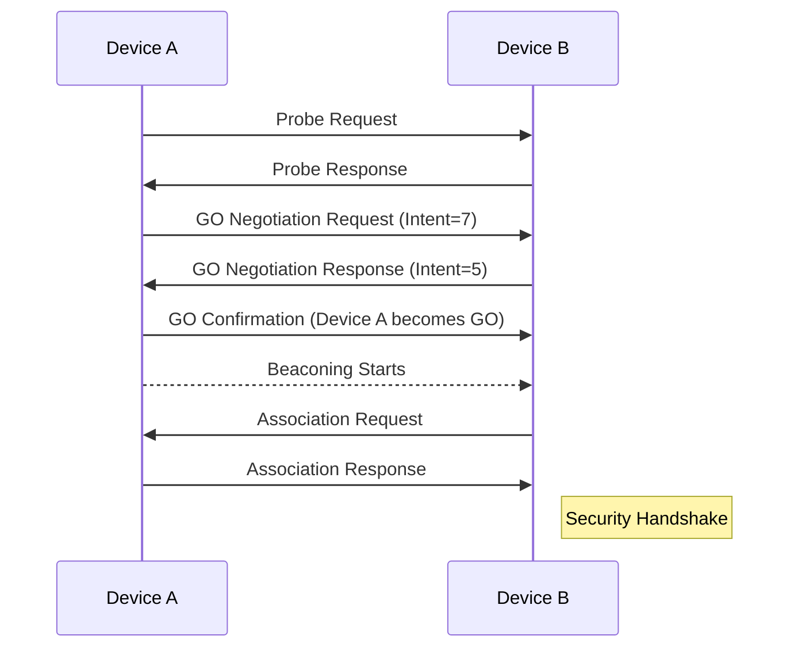

# Wi-Fi Direct: Deep Dive & Internal Architecture

## Introduction

**Wi-Fi Direct** is a peer-to-peer (P2P) wireless communication technology that allows devices to connect directly to each other without requiring a traditional Wi-Fi access point (AP). 

Built on the IEEE 802.11 family of standards, Wi-Fi Direct reuses several underlying MAC/PHY mechanisms such as **probe requests/responses**, **beacons**, and **association procedures**. However, it introduces **dynamic role negotiation**, **enhanced power-saving mechanisms**, and **secure direct communication**, enabling flexible and efficient wireless connectivity.

---

## Internal Components of Wi-Fi Direct

At its core, Wi-Fi Direct operates with two primary roles:

### 1. P2P Group Owner (GO)
- Functions similarly to a traditional AP.
- Manages **beaconing**, **client associations**, **network parameter coordination**, **encryption**, and **security protocols**.
  
### 2. P2P Client
- Connects to the P2P Group managed by the GO.
- Participates in **power-saving protocols**, **security handshakes**, and **data exchanges** under GO instructions.

---

## Internal Working of Wi-Fi Direct

### 1. MAC/PHY Layer Interactions
Wi-Fi Direct reuses standard IEEE 802.11 frame formats (e.g., **probe request**, **probe response**, **authentication**, **association**).

- **Discovery Phase:** Devices alternate between `search` and `listen` states.
- These states occur over pre-defined **social channels**: **Channel 1**, **Channel 6**, and **Channel 11** in the 2.4 GHz band.

### 2. Dynamic Role Negotiation
- Devices calculate a **GO Intent value** during discovery to indicate their willingness to act as Group Owner.
- The device with the **higher intent value becomes the GO**.
- A **tie-breaker bit** is used if intent values are equal.
- This logic is managed internally by a **state machine** within the Wi-Fi Direct protocol stack.

### 3. Concurrent Mode Support
- Some devices can operate as:
  - A P2P GO and,
  - A traditional client simultaneously.
- Requires **internal scheduling**, **resource allocation**, and **interface sharing** logic.

---

## Group Formation Scenarios

Wi-Fi Direct supports three group formation mechanisms. Each mechanism follows a slightly different procedure.

---

### 1. Standard Group Formation

**Step-by-step Process:**
1. Devices enter **discovery mode**.
2. Exchange **probe request/response** on social channels.
3. Negotiate roles using **GO Intent** values.
4. The selected GO begins beaconing.
5. Clients detect beacons and **associate** with the GO.
6. Security handshake (e.g., WPS or WPA2) is performed.
7. Data transmission starts.

**Mermaid Diagram:**

