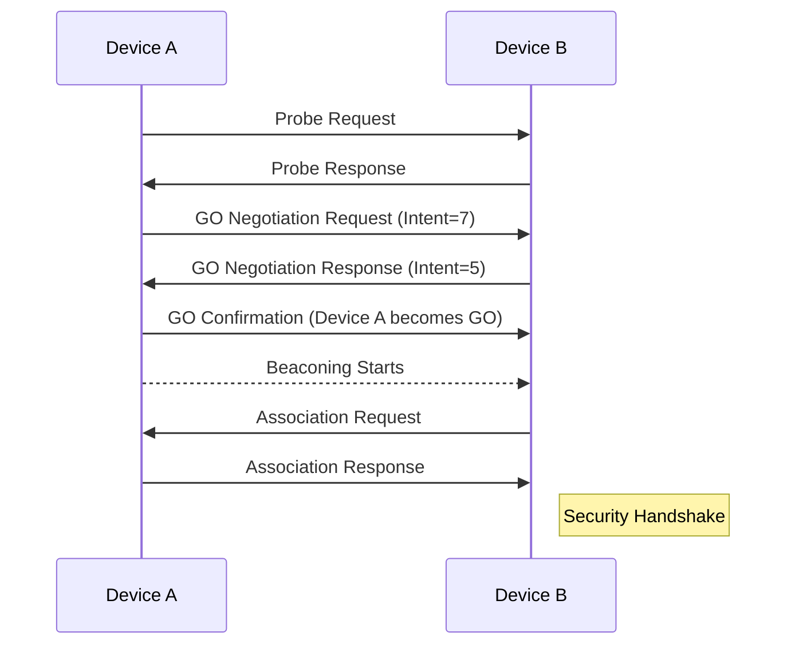
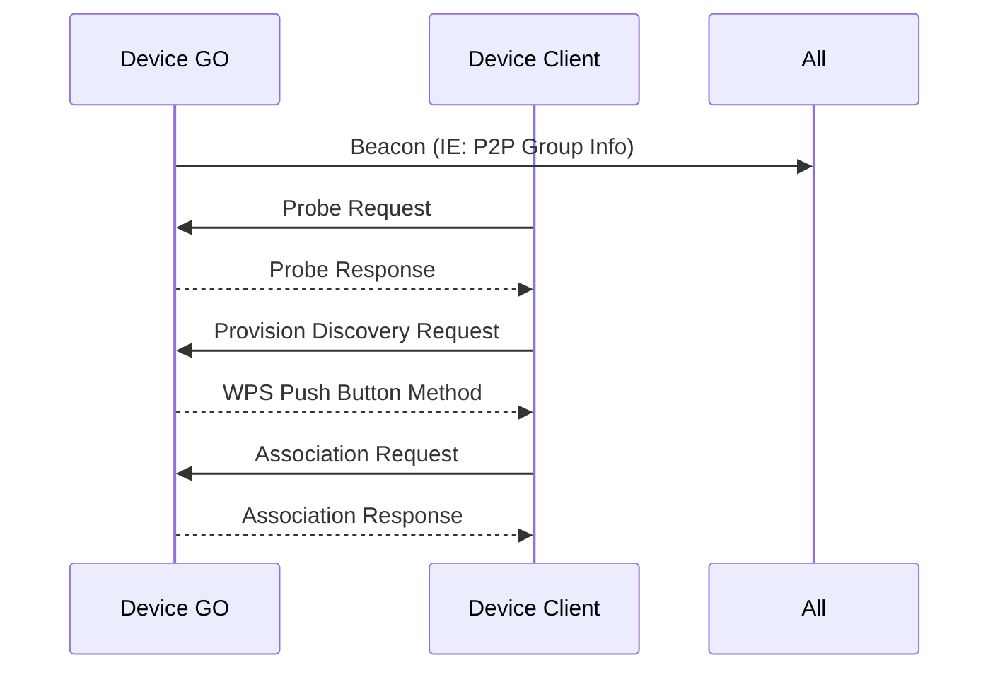
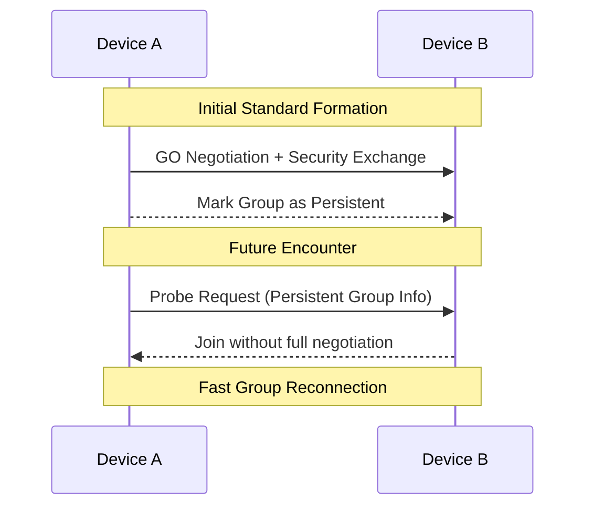

# Wi-Fi Direct: Deep Dive & Internal Architecture

## Introduction

**Wi-Fi Direct** is a peer-to-peer (P2P) wireless communication technology that allows devices to connect directly to each other without requiring a traditional Wi-Fi access point (AP). 

Built on the IEEE 802.11 family of standards, Wi-Fi Direct reuses several underlying MAC/PHY mechanisms such as **probe requests/responses**, **beacons**, and **association procedures**. However, it introduces **dynamic role negotiation**, **enhanced power-saving mechanisms**, and **secure direct communication**, enabling flexible and efficient wireless connectivity.

---

## Internal Components of Wi-Fi Direct

At its core, Wi-Fi Direct operates with two primary roles:

### 1. P2P Group Owner (GO)
- Functions similarly to a traditional AP.
- Manages **beaconing**, **client associations**, **network parameter coordination**, **encryption**, and **security protocols**.
  
### 2. P2P Client
- Connects to the P2P Group managed by the GO.
- Participates in **power-saving protocols**, **security handshakes**, and **data exchanges** under GO instructions.

---

## Internal Working of Wi-Fi Direct

### 1. MAC/PHY Layer Interactions
Wi-Fi Direct reuses standard IEEE 802.11 frame formats (e.g., **probe request**, **probe response**, **authentication**, **association**).

- **Discovery Phase:** Devices alternate between `search` and `listen` states.
- These states occur over pre-defined **social channels**: **Channel 1**, **Channel 6**, and **Channel 11** in the 2.4 GHz band.

### 2. Dynamic Role Negotiation
- Devices calculate a **GO Intent value** during discovery to indicate their willingness to act as Group Owner.
- The device with the **higher intent value becomes the GO**.
- A **tie-breaker bit** is used if intent values are equal.
- This logic is managed internally by a **state machine** within the Wi-Fi Direct protocol stack.

### 3. Concurrent Mode Support
- Some devices can operate as:
  - A P2P GO and,
  - A traditional client simultaneously.
- Requires **internal scheduling**, **resource allocation**, and **interface sharing** logic.

---

## Group Formation Scenarios

Wi-Fi Direct supports three group formation mechanisms. Each mechanism follows a slightly different procedure.

---

### 1. Standard Group Formation

**Step-by-step Process:**
1. Devices enter **discovery mode**.
2. Exchange **probe request/response** on social channels.
3. Negotiate roles using **GO Intent** values.
4. The selected GO begins beaconing.
5. Clients detect beacons and **associate** with the GO.
6. Security handshake (e.g., WPS or WPA2) is performed.
7. Data transmission starts.

**Mermaid Diagram:**

## 2. Autonomous Group Formation

In this mode, a device **self-initiates** and starts functioning as a Group Owner (GO) **without role negotiation**.

### Step-by-Step Process

1. Device declares itself as GO  
2. Starts broadcasting **Beacons**  
3. Other devices discover and join as clients

### Use Case

Used in **IoT devices**, **printers**, or **digital displays**, where one device is always the GO and expects clients to join without negotiation.

### Mermaid Diagram

## 3. Persistent Group Formation

**Persistent groups** are pre-negotiated and saved on devices for **seamless future reconnection**.

### Step-by-Step Process

1. First connection is a standard group formation with the **"Persistent" bit set**  
2. Devices **store credentials** and assigned **GO/Client roles**  
3. On future encounters, devices **skip role negotiation and security exchange**, reconnecting automatically

---

### Use Case

Persistent groups are ideal for recurring connections, such as:

- Wireless speakers  
- Smart TVs  
- Previously paired mobile phones

---

### Mermaid Diagram

## Additional Functional Aspects

---

### Data Transfer

- Communication is based on standard **IEEE 802.11 data frames**
- Wi-Fi Direct supports all **IP-based protocols**, including:
  - **UDP**
  - **TCP/IP**
  - **HTTP**, **FTP**, **RTSP**, and others
- Throughput and performance vary depending on:
  - **Channel quality**
  - **Signal interference**
  - **Device role** (Group Owner (GO) has higher processing and scheduling overhead)
- Performance is often comparable to infrastructure mode Wi-Fi in short-range scenarios

---

### QoS (Quality of Service)

- Uses **Wi-Fi Multimedia (WMM)** to provide traffic prioritization
- Traffic is classified into **four Access Categories (ACs)**:
  - **Voice** – Highest priority (low latency)
  - **Video** – Medium-high priority
  - **Best Effort** – Default priority
  - **Background** – Lowest priority (e.g., file downloads)
- Enables smooth streaming and VoIP over Wi-Fi Direct links

---

### Power Saving

- Clients follow the **Notice of Absence (NoA)** schedule defined by the GO
- Implements **P2P Power Save Protocol (PPSP)** to reduce power consumption
- Key techniques include:
  - **GO buffering data** for clients while asleep
  - **Traffic Indication Maps (TIMs)** to notify clients when data is buffered
- Critical for mobile and battery-powered devices

---

### Security Mechanisms

- Supports industry-standard **Wi-Fi Protected Access**:
  - **WPA2-PSK (Pre-Shared Key)**
  - **WPA3-SAE (Simultaneous Authentication of Equals)** for stronger protection
- Uses **Wi-Fi Protected Setup (WPS)** for group formation:
  - **PIN Method** – Displays a code for manual entry
  - **Push Button Configuration (PBC)** – User-friendly pairing
  - **NFC (Near-Field Communication)** – Tap-to-pair support
- All management frames are optionally protected using **Protected Management Frames (PMF)** to prevent spoofing and eavesdropping

---

### Connection Management

- The **Group Owner (GO)** maintains a dynamic list of connected clients
- Provides mechanisms for:
  - **Client eviction** – Manual or automated disconnection
  - **Disassociation** – Graceful connection teardown
  - **Group termination** – Ends group and clears all clients
- Clients can:
  - **Re-negotiate roles** dynamically during reconnection
  - **Initiate or join** new groups as needed
- Wi-Fi Direct also supports **concurrent operation** with infrastructure networks (via virtual interfaces), enabling devices to act as both:
  - **GO or Client**
  - **Standard Wi-Fi STA** (Station) simultaneously

---
